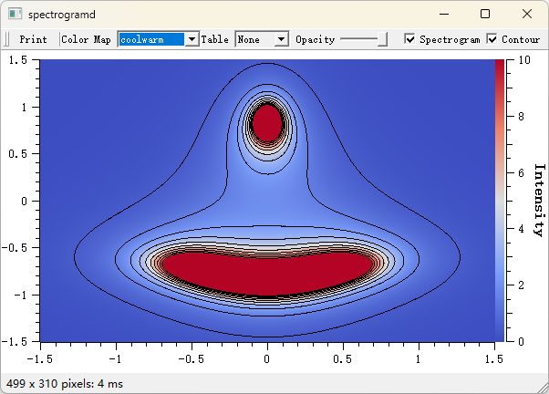
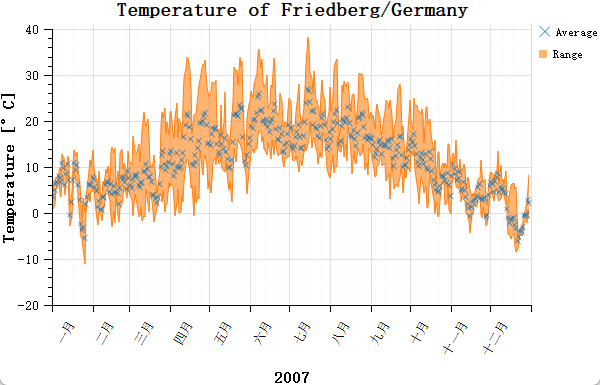
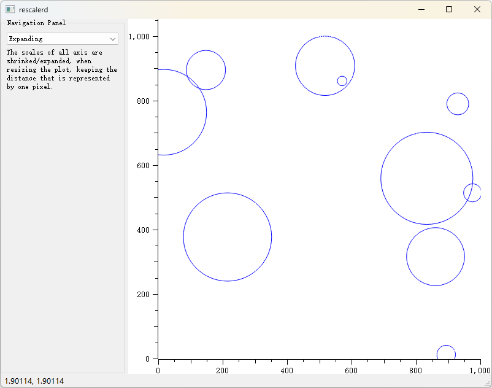
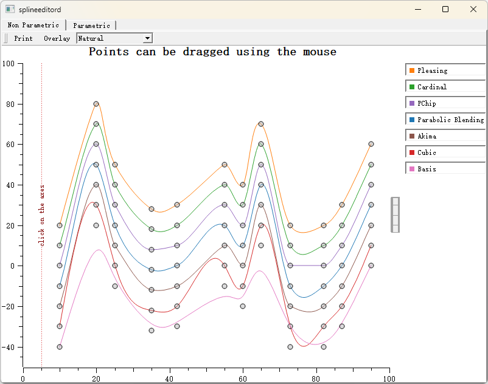
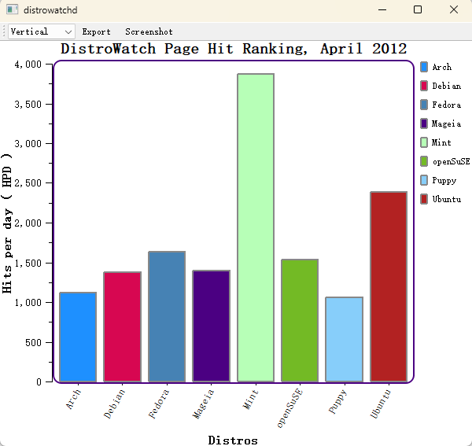
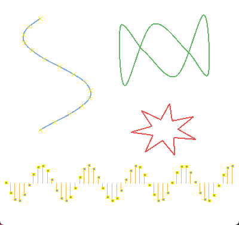
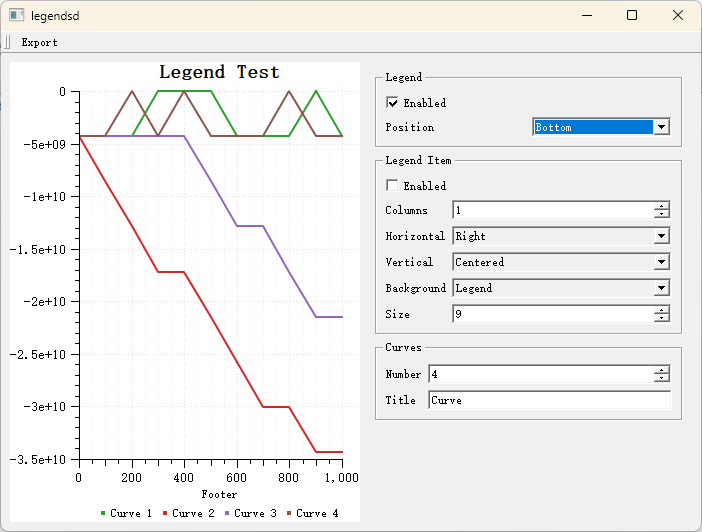
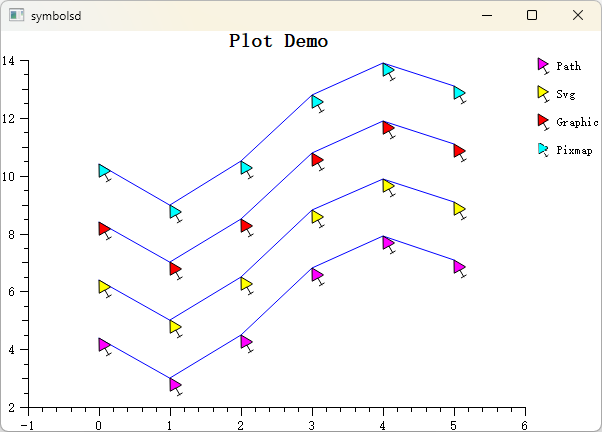
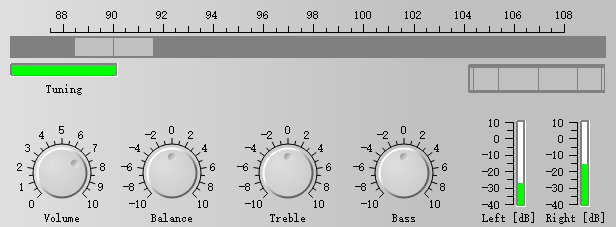

# 概述

Qt 生态里能画图的库不多，主流的为`QCustomPlot`、`Qwt`、`Qt Charts`和`KDChart`，Qt6.8之后把原来的 `Qt Charts`（2D） 与 Qt DataVisualization（3D） 合并为统一的Qt Graphs模块（注意不是Qt Graphics），底层全部基于 Qt Quick Scene Graph（QSG）+ Qt Quick 3D，彻底放弃了老旧的 Graphics-View/QPainter 管线，不过Qt Graphs 须通过 QQuickWidget 或 QQuickWindow 嵌入，必须带 QML runtime，C++支持不足，[论坛吐槽不少](https://forum.qt.io/topic/159224/qt-graphs-building-2d-plot-using-c-only),虽然Qt Graphs 是 Qt 官方“大一统”的未来，但这个未来可能3年内不会到来，且不支持win7等老系统，对嵌入式也不友好，因此，`QCustomPlot`、`Qwt`、`Qt Charts`和`KDChart`还会是最近几年绘图控件的选项。

这几个控件`QCustomPlot`最简单、美观，推广度最高，只要引入`qcustomplot.h`头文件，`qcustomplot.cpp`源文件，就可以直接使用（[官方文档](https://www.qcustomplot.com/index.php/documentation)），也支持Qt6，然而`QCustomPlot`最大的问题是其开源协议为`GPL`，有传染性，如果你使用了`QCustomPlot`，意味着你的软件也要成为`GPL`，这对商业非常不友好。

`Qwt`是老牌的绘图控件（[官方文档](https://qwt.sourceforge.io/index.html)），有着不错的性能，但部署难，让很多人望而怯步。它的协议为`LGPL`，商业相对友好。

`Qt Charts`是Qt官方的绘图控件（[官方文档](https://doc.qt.io/qt-5/qtcharts-index.html)），效率不高(可以说很低)，不适合做科学计算，同时，Qt Charts 没有 LGPL 选项，开源版是GPLv3，只要你在项目中使用了Qt Charts，就必须 把整个项目以 GPLv3 协议开源。

`KDChart`是KDAB的绘图控件（[官方文档](https://www.kdab.com/software-technologies/developer-tools/kd-chart/)），`KDChart3.0`起是MIT协议，对商业非常友好，但渲染效果一般，一股excel2003的风格，但`KDChart`有甘特图，这是上面3款都没有的。

因此，如果你的项目需要商业用途，那么你只有`Qwt`和`KDChart3.0`两种选择，但`Qwt`作者停止更新，我个人更喜欢`Qwt`，因为`Qwt`的架构更符合软件工程原则，其大规模渲染性能更优，像`QCustomPlot`的优势是交互功能开箱即用，例如鼠标缩放，坐标轴缩放，而`Qwt`需要较多的代码来实现，但`Qwt`有着更精细的控制能力，因此在我的项目需要绘图的时候，我会选择`Qwt`，并根据我的需求添加一些自己需要的功能，改进、优化它，因此，就有了此项目。

项目文档：[https://czyt1988.github.io/QWT/zh/](https://czyt1988.github.io/QWT/zh/)

## Qwt 7.0

我在`Qwt`最后版本上进行了维护，后续我将我需要的功能添加进去，同时逐步修改、优化一些已有的功能，例如它默认的老旧样式

项目地址为：

[Github：https://github.com/czyt1988/QWT](https://github.com/czyt1988/QWT)

[Gitee：https://gitee.com/czyt1988/QWT](https://gitee.com/czyt1988/QWT)

下面是我的目标以及目前我已经完成的一些工作：

- [x] CMake支持
- [x] 支持Qt6
- [x] 合并为单一文件QwtPlot.h/cpp，简化引入
- [x] 美化控件，坐标轴和画布默认紧贴不再有间隔
- [x] 提供Figure实现绘图的布局
- [x] 增加寄生轴的支持，实现n个坐标轴
- [x] C++11优化
- [x] 提供一些集成的交互方法，让使用更简单
  - [x] 提供一个通用的数据拾取功能
  - [x] 调整QwtPanner的实现，使其拖动时能实时渲染，并使其能支持多坐标轴
  - [x] 调整zoomer的实现，使其支持多坐标轴
- [x] 集成3D绘图

总之，我将继续维护`Qwt`，让其成为一个协议友好，性能优越，方便使用的Qt绘图库

## Qwt7的新特性

### Cmake支持

Qwt7.0已经支持`CMake`，并且未来将考虑抛弃`QMake`

安装Qwt后，你的项目只需如下即可引入Qwt，免去以往繁琐的配置和预定义宏：

```cmake
find_package(qwt)
# 引入2d绘图
target_link_libraries(${YOUR_APP_TARGET} PUBLIC qwt::plot)
# 引入3d绘图
target_link_libraries(${YOUR_APP_TARGET} PUBLIC qwt::plot3d)
```

### 单一头文件和源文件

参考`QCustomPlot`，我把原`Qwt`整个工程合并为`QwtPlot.h`和`QwtPlot.cpp`，只要把这两个文件引入项目即可使用2D和3D绘图

具体参阅:[QWT库的引入](https://czyt1988.github.io/QWT/zh/use-guide/import-qwt)

### 美化了风格

原有的Qwt样式使用的是很老旧的浮雕风，和现代审美不符，为此我针对性的优化，主要去除了默认的凹陷风格，坐标轴紧贴绘图不进行分离，总体视觉更符合现代风格

具体可见屏幕快照

### 增加了Figure绘图容器

类似Python的matplotlib，Qwt提供了Figure绘图容器，可以很方便的进行多个绘图布局

通过新增的`QwtFigure`类，可以很方便的进行多个绘图布局,支持网格布局（类似matplotlib的subplot）

同步配置了`QwtFigureWidgetOverlay`类，集成了`QwtFigure`的一些操作，例如改变绘图的尺寸，移动绘图


`QwtFigure`提供了子图坐标轴对齐功能，可以让多个绘图的坐标轴对齐


具体可参见教程：[Figure绘图容器](https://czyt1988.github.io/QWT/zh/use-guide/figure-widget/)

### 支持多坐标轴

增加了类似matplotlib的寄生轴功能，支持任意多个坐标轴显示

具体可参见教程：[多坐标轴的创建](https://czyt1988.github.io/QWT/zh/use-guide/parasite-axes/)

### 增加了坐标轴交互

增加坐标轴交互功能，支持在坐标轴上使用鼠标拖动、滚轮缩放等功能

拖动：


缩放：


具体可参见教程：[坐标轴交互动作](https://czyt1988.github.io/QWT/zh/use-guide/scale-builtin-action/)

### 增加了数据拾取功能

增加`QwtPlotSeriesDataPicker`类，支持数据的拾取


具体可参见教程：[绘图数据拾取](https://czyt1988.github.io/QWT/zh/use-guide/pick-value/)

### 修改了画布拖动

重构`QwtPlotPicker`，实现实时拖动画布，原来的`QwtPlotPicker`改名为`QwtPlotCachePanner`。同步支持多坐标轴的画布拖动

效果如下：


具体可参见教程：[拖动工具](https://czyt1988.github.io/QWT/zh/use-guide/panner/)

### 新增了画布放大器

原 `QwtPlotZoomer`需要指定两个坐标轴来进行缩放操作。如果您的绘图需要四个坐标轴都生效，您需要为绘图绑定两个缩放器，使用麻烦，且对于多坐标轴的支持不友好

新增了`QwtPlotCanvasZoomer`无需指定坐标轴，会对整个画布进行整体缩放，且能支持任意多坐标轴

具体可参见教程：[缩放工具](https://czyt1988.github.io/QWT/zh/use-guide/zoomer/)

### 新增箱线图(Box Chart)支持

新增`QwtPlotBoxChart`类，支持绘制箱线图（Box-and-Whisker Plot），用于展示数据的统计分布特征

- 支持预计算数据和原始数据两种输入方式
- 自动计算统计量（中位数、四分位数、异常值）
- 多种箱体样式：矩形、菱形、缺口形
- 支持垂直和水平两种显示方向
- 异常值自动检测和自定义符号


具体可参见教程：[箱线图使用指南](https://czyt1988.github.io/QWT/zh/use-guide/boxchart/)

### 其它修改

- 修复了`NAN`值和`INF`值对绘图的影响

## changelog

详细的日志请参阅[CHANGES.MD](./CHANGES.md)

## Copyright

---------

    Qwt Widget Library 
    Copyright (C) 1997   Josef Wilgen
    Copyright (C) 2002   Uwe Rathmann

    Qwt is published under the Qwt License, Version 1.0.
    You should have received a copy of this licence in the file
    COPYING.

    This library is distributed in the hope that it will be useful,
    but WITHOUT ANY WARRANTY; without even the implied warranty of
    MERCHANTABILITY or FITNESS FOR A PARTICULAR PURPOSE.  

----------------------

## 绘图展示

项目文档：[https://czyt1988.github.io/QWT/zh/](https://czyt1988.github.io/QWT/zh/)

### 基本图表

|  |  |  |
|:---:|:---:|:---:|
||||
|`examples/figure`|`examples/simpleplot`|`examples/simpleplot`|

|  |  |  |
|:---:|:---:|:---:|
| |  |  |
|`examples/barchart`  |`examples/scatterplot`  |`examples/curvedemo` |

### 实时可视化

|  |  |  |
|:---:|:---:|:---:|
|||  |
|`examples/cpuplot`|`examples/realtime`|`examples/oscilloscope` |

### 高级图表

|  |  |  |
|:---:|:---:|:---:|
||| |
|`examples/polardemo`|`examples/spectrogram`|`examples/spectrogram`|

|  |  |  |
|:---:|:---:|:---:|
||||
|`playground/vectorfield`|`examples/stockchart`|`examples/bode`|

|  |  |  |
|:---:|:---:|:---:|
||||
|`examples/friedberg`|`playground/plotmatrix`|`playground/scaleengine`|

|  |  |  |
|:---:|:---:|:---:|
||||
|`playground/rescaler`|`playground/graphicscale`|`examples/splineeditor`|

|  |  |  |
|:---:|:---:|:---:|
||||
|`examples/ticks_inside`|`examples/boxchart`|`examples/parasitePlot`|

|  |  |  |
|:---:|:---:|:---:|
||||
|`examples/sysinfo`|`examples/distrowatch`|`examples/rasterview`|
  
|  |  |  |
|:---:|:---:|:---:|
||||
|`examples/rasterview`|`playground/svgmap`|`examples/itemeditor`|

### 动态演示

|  |  |  |
|:---:|:---:|:---:|
||||
|`examples/animated`|`playground/curvetracker`|`examples/refreshtest`|

### 样式与符号

|  |  |  |
|:---:|:---:|:---:|
||||
|`examples/legends`|`playground/symbols`|`playground/shapes`|

### 控件窗口

|  |  |  |
|:---:|:---:|:---:|
||||
|`examples/controls`|`examples/controls`|`examples/controls`|

|  |  |  |
|:---:|:---:|:---:|
||||
|`examples/controls`|`examples/radio`|`playground/timescale`|

### 仪表盘

|  |  |  |
|:---:|:---:|:---:|
||||
|`examples/dials`|`examples/dials`||
