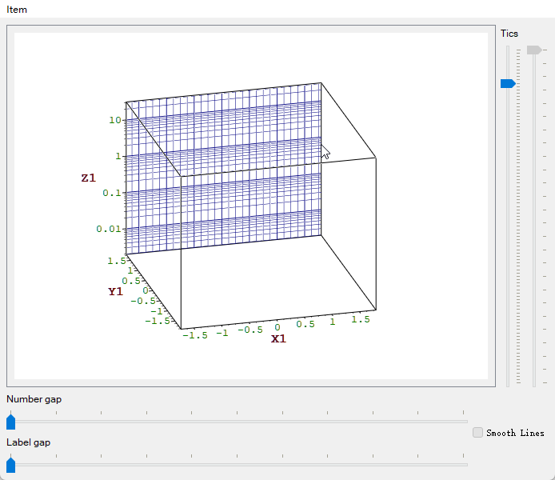
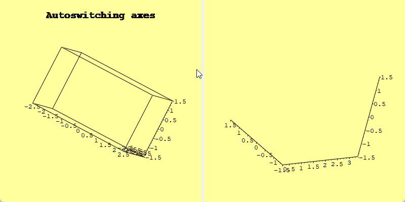

# Overview

There are only a handful of plotting libraries in the Qt ecosystem, the mainstream ones being `QCustomPlot`, `Qwt`, `Qt Charts`, and `KDChart`.  
After Qt 6.8 the former `Qt Charts` (2-D) and Qt DataVisualization (3-D) were merged into a unified Qt Graphs module (note: **not** Qt Graphics). The new back-end is built entirely on Qt Quick Scene Graph (QSG) + Qt Quick 3D, completely abandoning the aging Graphics-View / QPainter pipeline.  
However, Qt Graphs must be embedded through `QQuickWidget` or `QQuickWindow`, which means the QML runtime is mandatory and C++ support is poor—[complaints on the forum](https://forum.qt.io/topic/159224/qt-graphs-building-2d-plot-using-c-only) are numerous.  
Although Qt Graphs is Qt’s official “unified” future, that future probably will not arrive within the next three years, and it drops support for older systems such as Windows 7 and is unfriendly to embedded devices.  
Therefore, `QCustomPlot`, `Qwt`, `Qt Charts`, and `KDChart` will remain the practical choices for the next few years.

- `QCustomPlot` is the simplest and most attractive, and enjoys the widest adoption.  
  Just include `qcustomplot.h` and `qcustomplot.cpp` and you are ready to go ([official docs](https://www.qcustomplot.com/index.php/documentation)).  
  It also supports Qt 6.  
  Its biggest drawback, however, is the **GPL** license, which is highly “viral”: any program that uses `QCustomPlot` must itself be GPL—a deal-breaker for commercial use.

- `Qwt` is a veteran plotting library ([official docs](https://qwt.sourceforge.io/index.html)) with solid performance, yet its deployment difficulty deters many users.  
  It is licensed under **LGPL**, which is relatively commercial-friendly.

- `Qt Charts` is Qt’s own plotting package ([official docs](https://doc.qt.io/qt-5/qtcharts-index.html)) but its performance is poor—arguably very low—and unsuitable for scientific computing.  
  Worse, Qt Charts has **no LGPL option**; the open-source version is **GPL v3**, so using it in a project forces the entire project to be open-sourced under GPL v3.

- `KDChart` is KDAB’s plotting library ([official docs](https://www.kdab.com/software-technologies/developer-tools/kd-chart/)).  
  Starting with **KDChart 3.0** it is **MIT-licensed**, making it extremely commercial-friendly.  
  Its rendering style, however, is mediocre—reminiscent of Excel 2003.  
  A unique feature is **Gantt charts**, unavailable in the other three.

Hence, for commercial projects you are effectively limited to `Qwt` and `KDChart 3.0`.  
Because the `Qwt` author has ceased maintenance, I personally prefer `Qwt`: its architecture conforms better to software-engineering principles and its large-scale rendering performance is superior.  
`QCustomPlot` delivers out-of-the-box interactive features such as mouse zooming and axis scaling, whereas `Qwt` requires more code to achieve the same, yet it offers finer-grained control.  
When my own projects need plotting I therefore choose `Qwt`, enhancing and optimizing it with the features I need—hence this project.

**Documentation**：[https://czyt1988.github.io/QWT/](https://czyt1988.github.io/QWT/)

## Qwt7.0

I have taken over maintenance of the final official `Qwt` release, adding the features I need while gradually refining existing ones, e.g., its outdated default styling.

Project repositories:

- [GitHub: https://github.com/czyt1988/QWT](https://github.com/czyt1988/QWT)  
- [Gitee: https://gitee.com/czyt1988/QWT](https://gitee.com/czyt1988/QWT)

Goals and current progress:

- [x] CMake support  
- [x] Qt 6 support  
- [x] C++11 modernization  
- [x] Merged into single header/source for easier inclusion  
- [x] Provide integrated interaction helpers for simpler usage  
- [x] Modernized visual style  
- [x] Figure class for layout management  
- [x] Add parasite-axis support for unlimited axes
- [x] Axis interaction (drag and scroll-wheel zoom on axes)
- [x] Data picking with `QwtPlotSeriesDataPicker`
- [x] Real-time canvas panner with multi-axis support (`QwtPlotPanner`)
- [x] Canvas zoomer without axis binding (`QwtPlotCanvasZoomer`)
- [x] Box chart (`QwtPlotBoxChart`)
- [x] Curve downsampling with 4 algorithms + SIMD acceleration
- [x] Color cycle system (`QwtColorCycle`)
- [x] Arrow marker (`QwtPlotArrowMarker`)
- [x] Flat-style controls (sliders, knobs, dials, etc.)
- [x] Modular architecture: core (foundational utilities) + plot (2D plotting) + plot3d (3D plotting)
- [x] Matplotlib-style plotting API (`QwtPyPlot`)
- [x] 3D theme system with 10 presets + 5 lighting presets
- [x] 22 scientific colormap presets (viridis, plasma, jet, turbo, ...)
- [x] Standalone `qwt::core` foundational library (28 modules, no plotting dependency)

In short, I will keep maintaining `Qwt` so it becomes a license-friendly, high-performance, and easy-to-use Qt plotting library.

## New Features in Qwt7.0

### CMake Support

Qwt7.0 now supports **CMake**; `qmake` may be dropped in the future.  
After installing Qwt you can simply link it in your project:

```cmake
find_package(qwt)
# 2D plotting (automatically links qwt::core)
target_link_libraries(${YOUR_APP_TARGET} PUBLIC qwt::plot)
# 3D plotting (automatically links qwt::core)
target_link_libraries(${YOUR_APP_TARGET} PUBLIC qwt::plot3d)
# Foundational utilities only (math, data types, geometry, transforms, etc.)
target_link_libraries(${YOUR_APP_TARGET} PUBLIC qwt::core)
```

### Single Header & Source File

Following the example of `QCustomPlot`, I have merged the entire `Qwt` library into `QwtPlot.h` and `QwtPlot.cpp`.  
Drop these two files into your project and you are ready to go.

Example `CMakeLists.txt`:

```cmake
# QwtPlot requires Core Gui Widgets Svg Concurrent OpenGL PrintSupport
find_package(QT NAMES Qt6 Qt5 COMPONENTS Core REQUIRED)
find_package(Qt${QT_VERSION_MAJOR} 5.12 COMPONENTS Core Gui Widgets Svg Concurrent OpenGL PrintSupport REQUIRED)

add_executable(YOUR_APP_TARGET
    main.cpp
    QwtPlot.h
    QwtPlot.cpp
)

target_link_libraries(YOUR_APP_TARGET
    PUBLIC
    Qt${QT_VERSION_MAJOR}::Core
    Qt${QT_VERSION_MAJOR}::Gui
    Qt${QT_VERSION_MAJOR}::Widgets
    Qt${QT_VERSION_MAJOR}::Svg
    Qt${QT_VERSION_MAJOR}::Concurrent
    Qt${QT_VERSION_MAJOR}::OpenGL
    Qt${QT_VERSION_MAJOR}::PrintSupport
)
```

### Modernized Visual Style

The original Qwt style used an outdated beveled look inconsistent with modern aesthetics.  
I therefore redesigned it.  
Qwt 6.3:


Qwt 7.0:


Key changes: removed the default sunken style, placed axes flush against the plot area, overall appearance now aligns with contemporary design.

### Added Figure Container

Similar to Python's matplotlib, Qwt provides a Figure plotting container that enables convenient layout of multiple plots.

With the newly added `QwtFigure` class, arranging multiple plots becomes effortless, supporting grid layouts (analogous to matplotlib's subplot).

The `QwtFigureWidgetOverlay` class has been configured synchronously, integrating several operations of `QwtFigure`—such as adjusting plot sizes and moving plots.

For details, refer to the tutorial: [Figure Plotting Container](https://czyt1988.github.io/QWT/zh/use-guide/figure-widget/)

### Added Parasite Axes

Qwt7 now supports **parasite axes**, allowing multiple plots to share the same axes.

For details, refer to the tutorial:[Creating Multiple Coordinate Axes](https://czyt1988.github.io/QWT/zh/use-guide/parasite-axes/)

### Added Axis Interactions

Axis interaction functionality has been added, supporting **drag-and-drop** and **mouse wheel zoom** directly on the axes.

**Panning:**


**Zooming:**


For details, refer to the tutorial:[Coordinate Axis Interactive Actions](https://czyt1988.github.io/QWT/zh/use-guide/scale-builtin-action/)

### Added Data Picking Functionality

Added the QwtPlotSeriesDataPicker class to support data picking.


For details, refer to the tutorial:[Series Data Picker](https://czyt1988.github.io/QWT/zh/use-guide/pick-value/)

### Enhanced Canvas Panning

Refactored `QwtPlotPicker` to enable real-time canvas panning; the original implementation has been renamed `QwtPlotCachePanner`.  
The new panner simultaneously supports dragging on any number of axes.

Preview:


For details, refer to the tutorial: [Panning](https://czyt1988.github.io/QWT/zh/use-guide/panner/)

### New Canvas Zoomer

The legacy `QwtPlotZoomer` requires you to specify two axes for every zoom operation.  
If your plot uses four axes you must attach two zoomers—cumbersome and multi-axis-unfriendly.

The new `QwtPlotCanvasZoomer` needs no axis specification; it zooms the entire canvas as a whole and works seamlessly with any number of axes.

For details, refer to the tutorial: [Zoomer](https://czyt1988.github.io/QWT/zh/use-guide/zoomer/)

### Box Chart (Boxplot) Support

Added `QwtPlotBoxChart` class for creating box-and-whisker plots to visualize statistical distributions:

- Support for both pre-computed statistics and raw data input
- Automatic calculation of statistics (median, quartiles, outliers)
- Multiple box styles: Rectangle, Diamond, Notch
- Vertical and horizontal orientations
- Outlier detection with customizable symbols

See documentation: [Box Chart Guide](https://czyt1988.github.io/QWT/zh/use-guide/boxchart/)

### Matplotlib-style Plotting API (`QwtPyPlot`)

New in 7.3, `QwtPyPlot` is a high-level, stateful API inspired by Python's `matplotlib.pyplot`. It wraps a `QwtFigure` (or a single `QwtPlot`) and delegates to the existing Qwt infrastructure, so you get matplotlib-style brevity without giving up Qwt's power and fine-grained control.

Familiar one-liners just work — `plot()`, `scatter()`, `bar()`, `hist()`, `imshow()`, `contour()`, `quiver()`, `fillBetween()`, `errorbar()`, `candlestick()` — together with `subplot()`, `twinx()`/`twiny()`, `savefig()`, and matplotlib format strings such as `"r-o"` (red line + circle markers):

```cpp
#include <QwtFigure>
#include <QwtPyPlot>

QwtFigure* fig = new QwtFigure;
QwtPyPlot plt(fig);

plt.subplot(2, 1, 1);
plt.plot(x, y, "r-o", "Temperature");
plt.setTitle("Sensor Data");
plt.grid(true);
plt.legend();

plt.subplot(2, 1, 2);
plt.bar({10, 20, 30, 40}, "b", "Sales");

plt.savefig("output.png", 300);
fig->show();
```

For details, refer to the tutorial: [QwtPyPlot — Matplotlib-style API](https://czyt1988.github.io/QWT/zh/use-guide/pyplot-api/)

### 3D Plotting with Theme System

The integrated 3D module (`qwt::plot3d`) provides surface plots, mesh plots, and function plots with OpenGL rendering and full mouse interaction (rotate / zoom / pan).

New in 7.3, the `Qwt3D::Qwt3DTheme` system packages every visual property — background, mesh, colormap, axes, title, lighting, shading, and material — into a single descriptor, so a complete look can be applied in one call:

```cpp
using namespace Qwt3D;

// One-call preset
plot->applyTheme(Qwt3DTheme::Dark);

// Or start from a preset and customize
Qwt3DTheme theme(Qwt3DTheme::Scientific);
theme.setDataColorPreset("plasma");
theme.setLightingPreset(Qwt3DTheme::Studio);
theme.setShininess(20.0);
theme.apply(plot);
```

- 10 built-in themes: `Default`, `Dark`, `Scientific`, `Warm`, `Cool`, `Matplotlib`, `EarthTones`, `Ocean`, `HighContrast`, `Presentation`
- 5 lighting presets: `NoLighting`, `FlatLight`, `Studio`, `Outdoor`, `Soft`
- A `ColorMapColor` adapter bridges the core colormaps to 3D surfaces, so all 22 scientific presets work in 3D as well

For details, refer to the tutorial: [3D Plotting](https://czyt1988.github.io/QWT/zh/use-guide/3d-plot/)

### Scientific Colormap Presets

`qwt::core` ships `QwtColorMapPreset` — 22 well-known scientific colormaps (the same names used by matplotlib / MATLAB), shared by 2D spectrograms and 3D surfaces:

`viridis`, `plasma`, `inferno`, `magma`, `cividis`, `jet`, `hot`, `cool`, `spring`, `summer`, `autumn`, `winter`, `gray`, `bone`, `copper`, `rainbow`, `hsv`, `turbo`, `coolwarm`, `rdylbu`, `rdylgn`, `spectral`

```cpp
auto cmap = QwtColorMapPreset::create("viridis");
// cmap->rgb(vMin, vMax, value) returns the color for a given data value
```

The perceptually uniform maps (`viridis`, `plasma`, `inferno`, `magma`, `cividis`) are colorblind-friendly and print-safe — ideal for scientific publication.

### SIMD-Accelerated Curve Downsampling

Rendering millions of points smoothly is now first-class. `QwtPlotCurve` offers four downsampling filters, and the MinMax-bucket path is accelerated with SIMD (SSE2 / AVX2 / NEON, auto-detected at runtime):

- `FilterPoints` — the original weeding algorithm
- `FilterPointsAggressive` — fast weeding for huge monotonic datasets 
- `FilterPointsPixel` — per-pixel-column reduction for maximum speed
- `FilterPointsLTTB` — shape-preserving LTTB (MinMax bucket)(new default)

The result: million-point curves render at interactive frame rates. Benchmark it yourself with the `renderbench` example.

For details, refer to the tutorial: [Curve Downsampling](https://czyt1988.github.io/QWT/zh/use-guide/curve-downsampling/)

### Standalone Core Foundational Library

`qwt::core` (`qwtcore.dll` / `libqwtcore.so`) is a complete foundational toolkit of 28 modules — usable on its own, with no plotting code pulled in:

- Math & SIMD: `qwt_math`, `qwt_simd_argminmax`
- Data types: `QwtInterval`, `QwtPoint3D`, `QwtPointPolar`, `QwtSamples`, `QwtBoxStatistics`
- Geometry: `QwtBezier`, `QwtClipper`
- Coordinate transforms: `QwtTransform`, `QwtScaleMap`, `QwtScaleDiv`, `QwtScaleEngine`
- Date / time: `QwtDate`, `QwtSystemClock`
- Colormaps & color cycle: `QwtColorMap`, `QwtColorMapPreset`, `QwtColorCycle`
- Data series & raster: `QwtSeriesData`, `QwtPointData`, `QwtSeriesStore`, `QwtRasterData`, `QwtMatrixRasterData`, `QwtGridRasterData`

Link only what you need:

```cmake
# Just the foundational utilities — no plotting code pulled in
target_link_libraries(${YOUR_APP_TARGET} PUBLIC qwt::core)
```

### Other Modifications

- Fixed the impact of `NAN` and `INF` values on plotting
- `QwtPlotSeriesDataPicker` now picks from every series item type — trading curves, interval curves, histograms, vector fields, bar / box charts, and spectro curves
- Modern C++ throughout the codebase: `override` / `final`, `nullptr`, move semantics, `constexpr`, `noexcept`, range-based for, and a unified PIMPL macro pattern (180+ files)
- `renderbench` example for measuring curve-rendering performance and generating reports

## Changelog

See [CHANGES.MD](./CHANGES.md) for detailed logs.

## Gallery

### Basic Charts

|  |  |  |
|:---:|:---:|:---:|
||||
|`examples/figure`|`examples/simpleplot`|`examples/simpleplot`|

|  |  |  |
|:---:|:---:|:---:|
| |  |  |
|`examples/barchart`  |`examples/scatterplot`  |`examples/curvedemo` |

### Real-Time Visualization

|  |  |  |
|:---:|:---:|:---:|
|||  |
|`examples/cpuplot`|`examples/realtime`|`examples/oscilloscope` |

### Advanced Charts

|  |  |  |
|:---:|:---:|:---:|
||| |
|`examples/polardemo`|`examples/spectrogram`|`examples/spectrogram`|

|  |  |  |
|:---:|:---:|:---:|
|||| 
|`playground/vectorfield`|`examples/stockchart`|`examples/bode`|

|  |  |  |
|:---:|:---:|:---:|
||||
|`examples/friedberg`|`playground/plotmatrix`|`playground/scaleengine`|

|  |  |  |
|:---:|:---:|:---:|
||||
|`playground/rescaler`|`playground/graphicscale`|`examples/splineeditor`|

|  |  |  |
|:---:|:---:|:---:|
||||
|`examples/ticks_inside`|`examples/boxchart`|`examples/parasitePlot`|

|  |  |  |
|:---:|:---:|:---:|
||||
|`examples/sysinfo`|`examples/distrowatch`|`examples/rasterview`|
  
|  |  |  |
|:---:|:---:|:---:|
||||
|`examples/rasterview`|`playground/svgmap`|`examples/itemeditor`|

### 3D Visualization

|  |  |  |
|:---:|:---:|:---:|
||||
|`examples/3D/simpleplot3D`|`examples/3D/axes`|`examples/3D/enrichments`|

|  |  |  |
|:---:|:---:|:---:|
|||
|`examples/3D/autoswitch`||

### Animated Demos

|  |  |  |
|:---:|:---:|:---:|
||||
|`examples/animated`|`playground/curvetracker`|`examples/refreshtest`|

### Styles & Symbols

|  |  |  |
|:---:|:---:|:---:|
||||
|`examples/legends`|`playground/symbols`|`playground/shapes`|

### Control Widgets


|  |  |  |
|:---:|:---:|:---:|
||||
|`examples/controls`|`examples/controls`|`examples/controls`|
 
|  |  |  |
|:---:|:---:|:---:|
||||
|`examples/controls`|`examples/radio`|`playground/timescale`|

### Instrument Panels

|  |  |  |
|:---:|:---:|:---:|
||||
|`examples/dials`|`examples/dials`||

## Copyright

    Qwt Widget Library
    Copyright (C) 1997   Josef Wilgen
    Copyright (C) 2002   Uwe Rathmann

    Qwt is published under the Qwt License, Version 1.0.
    You should have received a copy of this licence in the file
    COPYING.

    This library is distributed in the hope that it will be useful,
    but WITHOUT ANY WARRANTY; without even the implied warranty of
    MERCHANTABILITY or FITNESS FOR A PARTICULAR PURPOSE.