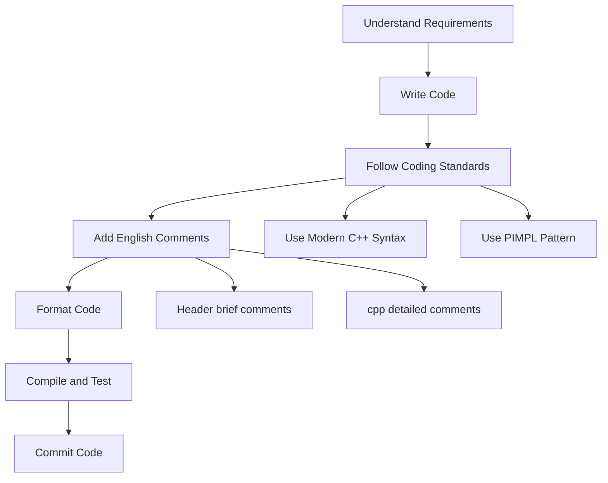

# Developer Guide

This section provides detailed development standards and design pattern guidelines for Qwt project developers, ensuring code quality and consistent style.

## Documentation Overview

| Document | Description |
|------|------|
| [Coding Standards](coding-standards.md) | Code formatting, C++11 compatibility macros, naming conventions, etc. |
| [Comment Standards](comment-standards.md) | Doxygen English comment format, comment placement rules, etc. |
| [PIMPL Pattern](pimpl-pattern.md) | Usage and macro definitions for the PIMPL design pattern |

## Development Workflow Overview

## Quick Start

### 1. Environment Setup

Ensure your development environment meets the following requirements:

- **Qt version**: Qt 5.12+ or Qt 6
- **C++ standard**: C++11 (Qt5) or C++17 (Qt6)
- **Build system**: CMake 3.16+
- **Compiler**: A compiler supporting C++11/17

### 2. Key Coding Standards

Before starting development, please read the [Coding Standards](coding-standards.md). Core points:

- Use `override` instead of `QWT_OVERRIDE`
- Use `nullptr` instead of `NULL`
- Use `static_cast` instead of C-style casts
- Use `qwt_as_const` for Qt container iteration

### 3. Key Comment Standards

All new code must follow the [Comment Standards](comment-standards.md):

- Write comments in Doxygen English-only format
- Place detailed comments in `.cpp` files
- Place brief comments in `.h` files

### 4. PIMPL Pattern

New classes are recommended to use the PIMPL pattern. See the [PIMPL Pattern Guide](pimpl-pattern.md) for details:

- Use the `QWT_DECLARE_PRIVATE` macro to declare the private pointer
- Use the `QWT_PIMPL_CONSTRUCT` macro for initialization
- Use the `QWT_D`/`QWT_DC` macros to access private data

## Development Standards Checklist

Before committing code, please verify the following items:

- [ ] Code has been formatted with clang-format
- [ ] Modern C++ syntax is used (override, nullptr, using)
- [ ] New classes use the PIMPL pattern
- [ ] Functions have English Doxygen comments
- [ ] Header files remain concise, with detailed comments in cpp files
- [ ] Code compiles without warnings
- [ ] Example programs run correctly

## Related Resources

- **Documentation Writing Standards**: [Documentation Writing Standards](../doc-writing-guide.md)
- **Build Instructions**: [Build Guide](../build-guide/build-instructions.md)
- **Project Overview**: [AGENTS.md](../AGENTS.md)

!!! tip "AI Agent Developers"
    If you are an AI Agent, please read the `AGENTS.md` file first, which contains quick-start guides and key project information.
