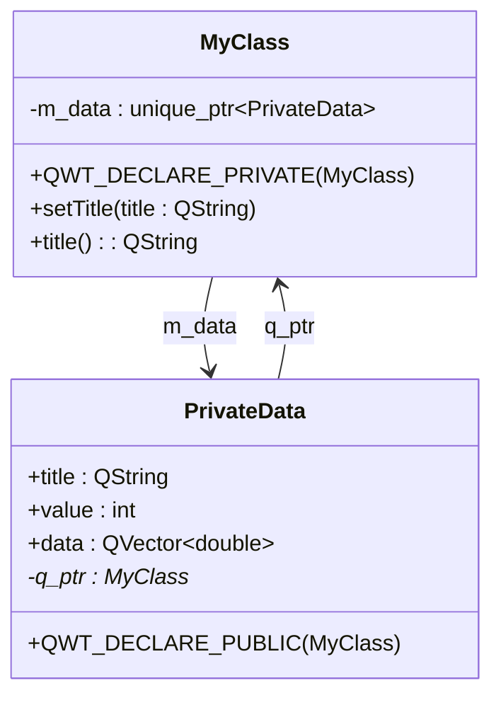

# PIMPL Pattern Guide

This document introduces the PIMPL (Pointer to Implementation) pattern used in the Qwt project, helping developers correctly use the project-provided macro definitions.

## Key Features

**Features**

- ✅ **Hide Implementation Details**: Keep private members and data hidden in the implementation class
- ✅ **Reduce Header Dependencies**: Lower compilation dependencies and speed up build times
- ✅ **Binary Compatibility**: Changes to implementation do not affect binary compatibility
- ✅ **Unified Macros**: The project provides standard macros to simplify implementation

## What is the PIMPL Pattern

PIMPL (Pointer to Implementation) is a C++ design pattern, also known as the "Compilation Firewall" pattern.

### Drawbacks of the Traditional Approach

```cpp
// Traditional approach - all private members exposed in header
class MyClass : public QObject
{
    Q_OBJECT
private:
    QString m_title;          // Exposed in header
    int m_value;              // Any change requires recompiling all dependencies
    QVector<double> m_data;   // Header depends on QVector
};
```

### Advantages of the PIMPL Pattern

```cpp
// PIMPL approach - only pointer exposed in header
class MyClass : public QObject
{
    Q_OBJECT
    QWT_DECLARE_PRIVATE(MyClass)  // Auto-generates private data pointer
public:
    MyClass();
private:
    // All private members hidden in MyClass::PrivateData
};
```

!!! tip "PIMPL Pattern Advantages"
    - **Build Speed**: Modifying private members only requires recompiling a single cpp file
    - **Binary Compatibility**: Changes to private members do not affect ABI compatibility
    - **Clean Headers**: Header files only contain public interface declarations

## Qwt PIMPL Macros

The project defines the following macros in `src/qwt_global.h`:

| Macro | Purpose | Usage Location |
|--------|------|----------|
| `QWT_DECLARE_PRIVATE(Class)` | Declare private data pointer | In class declaration |
| `QWT_DECLARE_PUBLIC(Class)` | Declare public host pointer | In PrivateData class |
| `QWT_PIMPL_CONSTRUCT` | Initialize private data pointer | Constructor initializer list |
| `QWT_D(name)` | Get private data pointer (non-const) | In member functions |
| `QWT_DC(name)` | Get private data pointer (const) | In const member functions |

## Implementation Steps

### Step 1: Declare Private Pointer in Header File

Use the `QWT_DECLARE_PRIVATE` macro in the class declaration:

```cpp
// MyClass.h
#include <qwt_global.h>

class QWT_EXPORT MyClass : public QObject
{
    Q_OBJECT
    QWT_DECLARE_PRIVATE(MyClass)  // Add this macro

public:
    // Constructor
    explicit MyClass(QObject* parent = nullptr);

    // Destructor
    ~MyClass();

    // Set the title
    void setTitle(const QString& title);

    // Get the title
    QString title() const;

private:
    // Private members no longer declared here
};
```

### Step 2: Define the PrivateData Class in the cpp File

Define the private data class in the cpp file, using the `QWT_DECLARE_PUBLIC` macro:

```cpp
// MyClass.cpp
#include "MyClass.h"

// Define private data class
class MyClass::PrivateData
{
    QWT_DECLARE_PUBLIC(MyClass)  // Auto-generates q_ptr pointer

public:
    PrivateData(MyClass* p);

    QString title;        // Private member variable
    int value;
    QVector<double> data;
};

MyClass::PrivateData::PrivateData(MyClass* p)
    : q_ptr(p)            // Initialize host pointer
    , title(QString())
    , value(0)
{
}
```

### Step 3: Constructor Initialization

Use the `QWT_PIMPL_CONSTRUCT` macro to initialize the private pointer:

```cpp
/**
 * @brief Constructor for MyClass
 * @param parent Parent object pointer
 */
MyClass::MyClass(QObject* parent)
    : QObject(parent)
    , QWT_PIMPL_CONSTRUCT  // Initializes m_data pointer
{
}
```

!!! info "Macro Expansion"
    `QWT_PIMPL_CONSTRUCT` expands to: `m_data(qwt_make_unique<PrivateData>(this))`

### Step 4: Destructor Handling

The destructor automatically deletes private data:

```cpp
MyClass::~MyClass()
{
    // m_data is automatically destroyed, no manual delete required
}
```

### Step 5: Accessing Private Data in Member Functions

Use the `QWT_D` and `QWT_DC` macros to access private data:

```cpp
/**
 * @brief Set the title text
 * @param title The new title text
 */
void MyClass::setTitle(const QString& title)
{
    QWT_D(d);           // Get private data pointer, parameter name can be customized
    d->title = title;   // Access private member

    // Alternatively, use m_data directly:
    // m_data->title = title;
}

/**
 * @brief Get the current title
 * @return The current title text
 */
QString MyClass::title() const
{
    QWT_DC(d);          // Use QWT_DC for const member functions
    return d->title;
}
```

## Complete Example



### Header File MyClass.h

```cpp
#ifndef MYCLASS_H
#define MYCLASS_H

#include <QObject>
#include <qwt_global.h>

class QWT_EXPORT MyClass : public QObject
{
    Q_OBJECT
    QWT_DECLARE_PRIVATE(MyClass)

public:
    explicit MyClass(QObject* parent = nullptr);
    ~MyClass();

    void setTitle(const QString& title);
    QString title() const;

    void setValue(int value);
    int value() const;

private:
    // Private implementation hidden
};

#endif // MYCLASS_H
```

### Source File MyClass.cpp

```cpp
#include "MyClass.h"

// Private data class definition
class MyClass::PrivateData
{
    QWT_DECLARE_PUBLIC(MyClass)

public:
    PrivateData(MyClass* p)
        : q_ptr(p)
        , title(QString())
        , value(0)
    {
    }

    QString title;
    int value;
    QVector<double> data;
};

// Constructor
MyClass::MyClass(QObject* parent)
    : QObject(parent)
    , QWT_PIMPL_CONSTRUCT
{
}

// Destructor
MyClass::~MyClass()
{
}

// Setter
void MyClass::setTitle(const QString& title)
{
    QWT_D(d);
    d->title = title;
}

// Getter
QString MyClass::title() const
{
    QWT_DC(d);
    return d->title;
}

void MyClass::setValue(int value)
{
    QWT_D(d);
    d->value = value;
}

int MyClass::value() const
{
    QWT_DC(d);
    return d->value;
}
```

## Best Practices

### When to Use the PIMPL Pattern

!!! tip "Recommended Scenarios"
    - The class has many private members or private methods
    - The class header has many dependencies and you want to reduce compilation dependencies
    - Binary compatibility needs to be maintained (e.g., public API of a library)
    - Private members may change frequently

### When PIMPL is Not Necessary

!!! info "Optional Scenarios"
    - Simple, small classes with few private members
    - Internal helper classes that do not need to hide their implementation
    - Performance-sensitive scenarios (PIMPL has a slight overhead from indirect access)

### Important Notes

!!! warning "Important Reminders"
    1. **Constructor Must Initialize**: Use `QWT_PIMPL_CONSTRUCT` or manually initialize `m_data`
    2. **Use QWT_DC for Const Functions**: Ensure const correctness
    3. **PrivateData Constructor Parameter**: Must accept the host pointer to initialize `q_ptr`
    4. **Do Not Expose PrivateData in the Header**: The PrivateData class definition should only exist in the cpp file

## Macro Expansion Details

Below are the macro expansion results to help understand how they work:

| Macro | Expansion |
|-----|----------|
| `QWT_DECLARE_PRIVATE(Class)` | `std::unique_ptr<PrivateData> m_data;` + `d_func()` method |
| `QWT_DECLARE_PUBLIC(Class)` | `Class* q_ptr;` + `q_func()` method |
| `QWT_PIMPL_CONSTRUCT` | `m_data(qwt_make_unique<PrivateData>(this))` |
| `QWT_D(name)` | `Class::PrivateData* name = d_func();` |
| `QWT_DC(name)` | `const Class::PrivateData* name = d_func();` |

## Related Documentation

- [Coding Standards](coding-standards.md)
- [Comment Standards](comment-standards.md)
