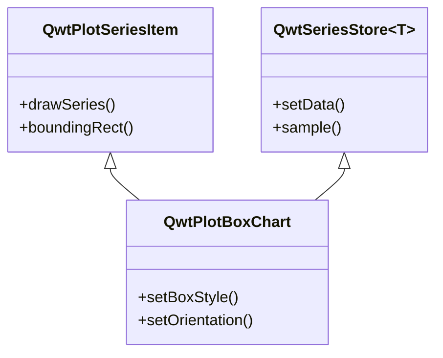
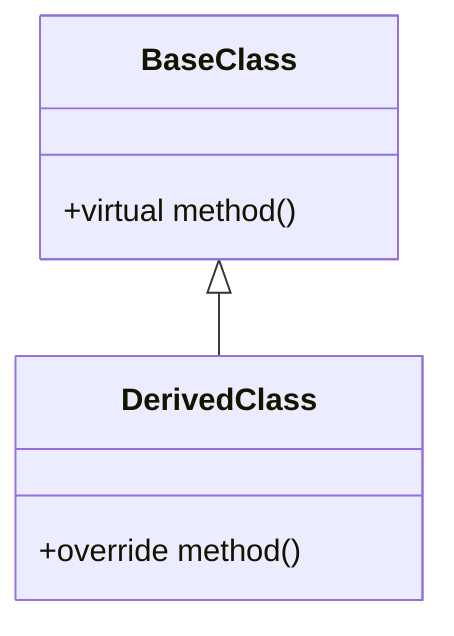
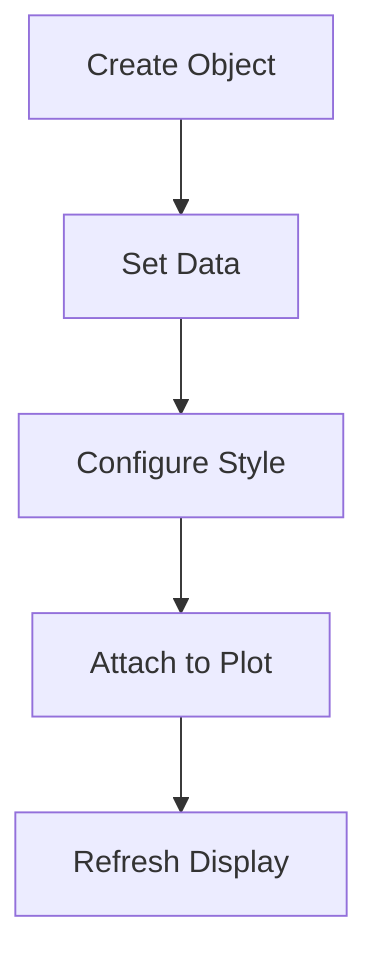

# Qwt Documentation Writing Standards

This guide provides standards for writing Qwt documentation, ensuring consistent style, complete content, and easy readability.

The project documentation is organized with MkDocs, using the [mkdocs-material](https://squidfunk.github.io/mkdocs-material/getting-started/) theme. During the writing process, Material-related syntax extensions can be used.

Project documentation diagrams should primarily use `mermaid`.

## Document Structure

### 1. Heading Hierarchy

```markdown
# Class Name / Feature Name
## Key Features
## Usage
### Sub-Feature Module
#### Specific Feature Point
## Notes
## References
```

### 2. Required Sections

Each feature document must include the following sections:

| Section | Required | Description |
|------|----------|------|
| Feature Overview | Required | A one-sentence description of the class's purpose and features at the beginning |
| Key Features | Required | List core features, marked with ✅ |
| Usage | Required | Detailed usage steps and code examples |
| Notes | Recommended | Use !!! format to highlight important information |
| References | Optional | Related documentation and example path links |

## Content Writing Principles

### 1. Text Description Requirements

- **Every code block must be preceded and followed by text**: Explain the code's purpose, key steps, and output
- **Avoid pure code dumps**: Code should not dominate the document; text descriptions should account for at least 60%
- **Progressive guidance**: Organize content in a logical order of "what → why → how"

### 2. Feature Introduction Format

Use feature list format, with each feature prefixed by a ✅ mark:

```markdown
**Features**

- ✅ **Feature Name**: Brief description
- ✅ **Another Feature**: Brief description
```

### 3. Code Example Standards

Code examples must include:

1. **Comment descriptions**: Key lines must have comments
2. **Complete and runnable**: Example code should run directly (with necessary header includes)
3. **Effect description**: Describe the running effect after the code, accompanied by screenshots or diagrams

```cpp
// Create a box chart object
QwtPlotBoxChart* boxChart = new QwtPlotBoxChart("Title");
boxChart->attach(plot);  // Must be attached to a plot to display

// Set data
QVector<QwtBoxSample> samples;
samples << QwtBoxSample(1.0, 10, 20, 35, 50, 60);
boxChart->setSamples(samples);  // Automatically refreshes after data is set

// Effect: Displays a box chart with box, whiskers, and median line
```

### 4. Concept Explanation Requirements

For complex concepts, use the following methods to aid explanation:

- **Mermaid UML diagrams**: Show class relationships and inheritance hierarchies
- **Mermaid flowcharts**: Show workflows
- **ASCII art diagrams**: Show structural diagrams
- **Screenshots**: Actual effect screenshots

Example (class relationship diagram):



### 5. Notes Format

Use Markdown extension syntax to highlight important information:

```markdown
!!! warning "Important Warning"
    Information that could lead to serious issues

!!! info "Note"
    Supplementary information

!!! tip "Tip"
    Usage tips and recommendations

!!! example "Example"
    Example code path: `examples/xxx`

!!! bug "Known Issue"
    Known defects and workarounds
```

### 6. Property/Method Description Format

Use table format to display core properties and methods:

```markdown
### Core Methods

| Method | Parameters | Description |
|------|------|------|
| `setBoxStyle(Style)` | BoxStyle enum | Set the box display style |
| `setOrientation(Orient)` | Qt::Orientation | Set the display orientation |
```

## Diagram Usage Standards

### 1. Mermaid Class Diagrams

Used to show class inheritance and composition relationships:



### 2. Mermaid Flowcharts

Used to show usage workflows and processes:



### 3. Structural Diagrams

Use text or ASCII art to draw structural diagrams:

```text
    │         ┌──┬──┐
    │         │  │  │ ← Q3
    │         │  ┼  │ ← Median
    │         │  │  │ ← Q1
    │    ─────┴──┴──┴─────
```

### 4. Effect Screenshots

Actual runtime screenshots should be placed in the `docs/assets/` directory:

```markdown

```

For effect screenshots, precede them with a text description referencing the relevant example, for instance:

```markdown
The box chart example is located in: `examples/2D/boxchart`. Screenshot below:


```

## Document Style Consistency

### 1. Language Style

- Use **English as the primary language**; technical terms can remain in their original form
- Avoid colloquial expressions; use formal written language
- Reduce passive voice; use active voice: "You can set..." rather than "It can be set..."

### 2. Terminology Standards

| English Term | Description |
|----------|------|
| Box-and-Whisker Plot | Statistical chart |
| Quartile | Q1, Q2, Q3 |
| Outlier | Data points outside the normal range |
| Whisker | Extension lines of a box chart |

### 3. Code Style

- Use full class paths: `QwtPlotBoxChart`
- Use code format for method names: `setBoxStyle()`
- Use code format for property names: `boxStyle`
- Use full paths for enum values: `QwtPlotBoxChart::Rect`

## Writing Workflow Suggestions

1. **Gather information**: Read class header files, example code, and related documentation
2. **Determine structure**: Plan the document framework according to the required sections
3. **Write content**:
   - Start with the feature overview and feature list
   - Then write the usage section, with text descriptions accompanying each code block
   - Add notes and references
4. **Add diagrams**: Draw class diagrams, flowcharts, and structural diagrams
5. **Review and revise**: Check code runnability, text fluency, and format consistency

## Document Template

```markdown
# Feature Name Guide

A one-sentence description of the class's purpose and features.

## Key Features

**Features**

- ✅ **Feature 1**: Description
- ✅ **Feature 2**: Description

## Basic Concepts

### Core Concept Explanation

[Text description]

```mermaid
classDiagram
    [Class relationship diagram]
```

## Usage

[If there is a corresponding example, include this content] The xxx example is located in: `examples/xxx`. Screenshot below:

```markdown

```

### 1. Basic Usage

[Text description of purpose and scenarios]

```cpp
[Code example]
```

[Effect description]

### 2. Advanced Configuration

[Text description of configuration options]

| Method | Description |
|------|------|
| Method 1 | Description |
| Method 2 | Description |

```cpp
[Configuration code]
```

!!! warning "Note"
    Important reminder


---

This standard applies to writing all Qwt English usage guide documentation.
