# QWT — Qt Plotting Library

QWT (Qt Widgets for Technical Applications) is a high-performance 2D/3D plotting library based on Qt, designed for data visualization in scientific computing and engineering applications.

## Why Choose QWT?

There are only a handful of plotting libraries in the Qt ecosystem. The mainstream options are `QCustomPlot`, `Qwt`, `Qt Charts`, and `KDChart`. After Qt 6.8, the former `Qt Charts` (2D) and `Qt DataVisualization` (3D) were merged into a unified Qt Graphs module built entirely on Qt Quick Scene Graph + Qt Quick 3D, abandoning the legacy Graphics-View / QPainter pipeline. However, Qt Graphs must be embedded via `QQuickWidget` or `QQuickWindow`, requires the QML runtime, has limited C++ support, and drops support for older systems like Windows 7.

| Library | License | Strengths | Weaknesses |
|---------|---------|-----------|------------|
| **QCustomPlot** | GPL | Simple, easy to use, widely adopted | GPL is "viral" — not commercial-friendly |
| **Qwt** | LGPL | High performance, solid architecture | Original author stopped maintaining; deployment was difficult |
| **Qt Charts** | GPL | Qt official | Poor performance; GPL license |
| **KDChart** | MIT (3.0+) | Commercial-friendly | Mediocre rendering quality |

**This project** is based on Qwt 6.2.0, adding modern features and fixes to make it a license-friendly, high-performance, and easy-to-use Qt plotting library.

## Qwt 7.0 New Features

- [x] **CMake support** — `find_package(qwt)` for one-line integration
- [x] **Qt 6 support** — compatible with Qt 5.12+ and Qt 6.x
- [x] **Single-file inclusion** — just `QwtPlot.h` + `QwtPlot.cpp`, like QCustomPlot
- [x] **Modernized visual style** — removed legacy embossed look, flat modern UI
- [x] **Figure container** — matplotlib-inspired multi-plot layout
- [x] **Multi-axis support** — parasite axis architecture, unlimited axes
- [x] **Axis interaction** — mouse drag and scroll-wheel zoom on axes
- [x] **Integrated 2D/3D** — built-in 3D plotting module
- [ ] C++11 optimization (in progress)
- [ ] Large-scale data rendering optimization (in progress)

## Quick Integration

=== "CMake (Recommended)"

    ```cmake
    find_package(qwt REQUIRED)
    target_link_libraries(${PROJECT_NAME} PRIVATE qwt::plot)
    # 3D plotting
    target_link_libraries(${PROJECT_NAME} PRIVATE qwt::plot3d)
    ```

=== "Single File"

    ```cpp
    // Add src-amalgamate/QwtPlot.h and QwtPlot.cpp to your project
    #include "QwtPlot.h"

    auto* plot = new QwtPlot("My Plot");
    auto* curve = new QwtPlotCurve("Data");
    ```

## Project Links

- **GitHub**: [https://github.com/czyt1988/QWT](https://github.com/czyt1988/QWT)
- **Gitee**: [https://gitee.com/czyt1988/QWT](https://gitee.com/czyt1988/QWT)
- **Documentation**: [https://czyt1988.github.io/QWT/](https://czyt1988.github.io/QWT/)

## Showcase

### Basic Charts

<div class="grid cards" markdown>

- 
  `examples/figure`

- 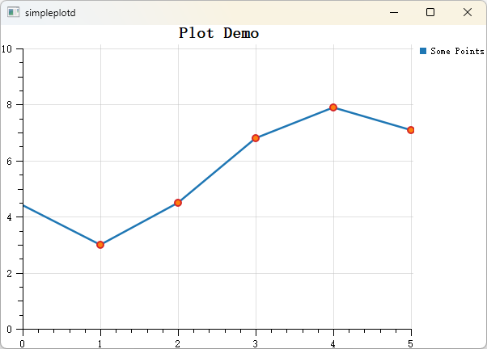
  `examples/simpleplot`

- 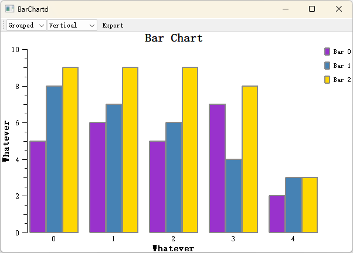
  `examples/barchart`

- 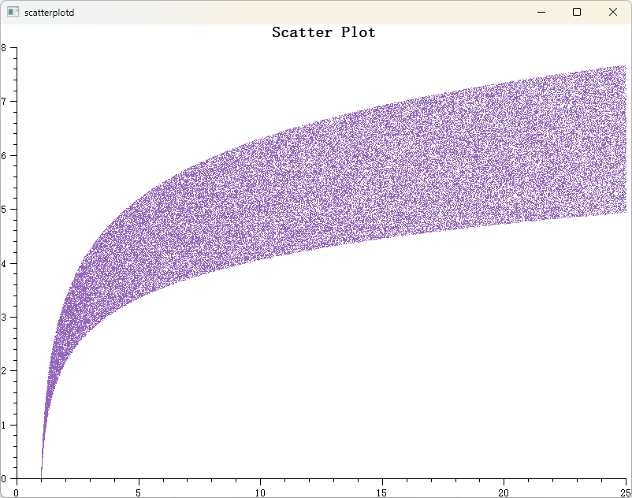
  `examples/scatterplot`

- 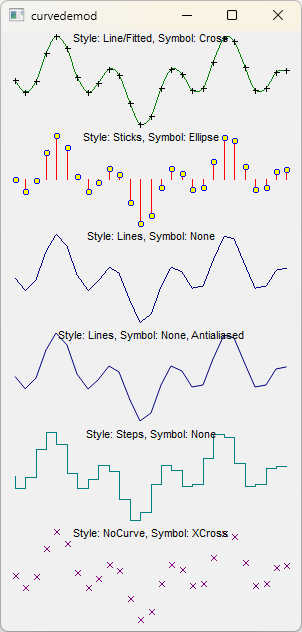
  `examples/curvedemo`

- 
  `examples/boxchart`

</div>

### Real-Time Visualization

<div class="grid cards" markdown>

- 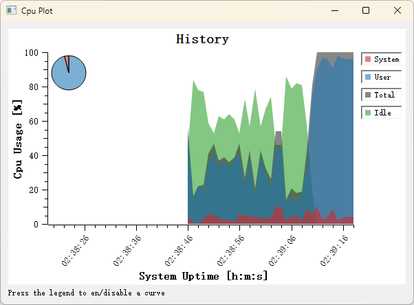
  `examples/cpuplot`

- 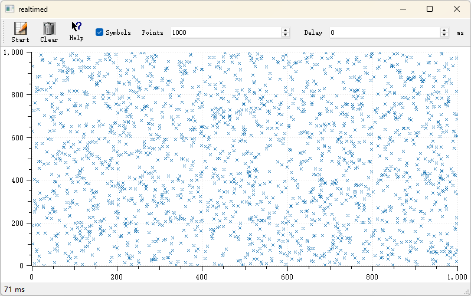
  `examples/realtime`

- 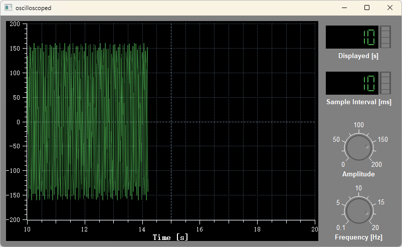
  `examples/oscilloscope`

</div>

### Advanced Charts

<div class="grid cards" markdown>

- 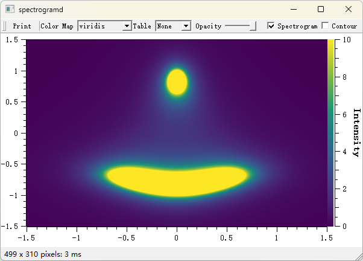
  `examples/spectrogram`

- 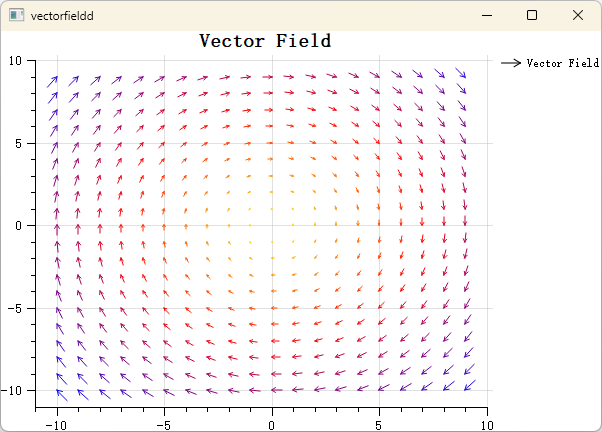
  `playground/vectorfield`

- 
  `examples/stockchart`

- 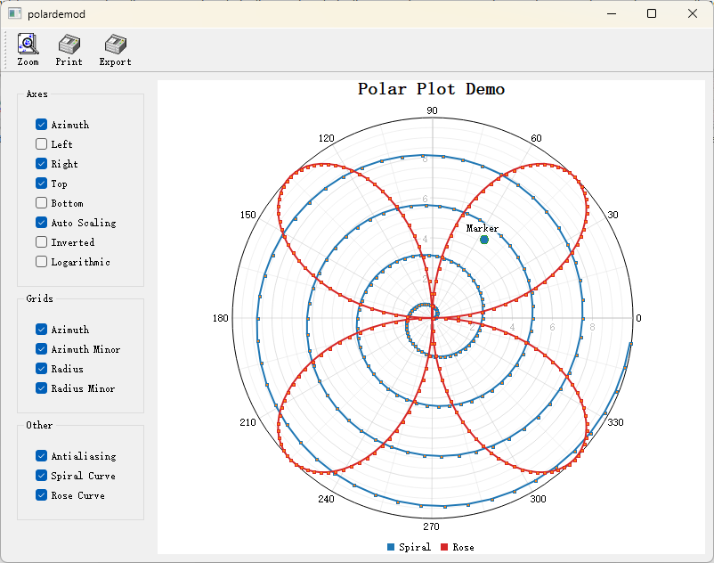
  `examples/polardemo`

- 
  `examples/parasitePlot`

- 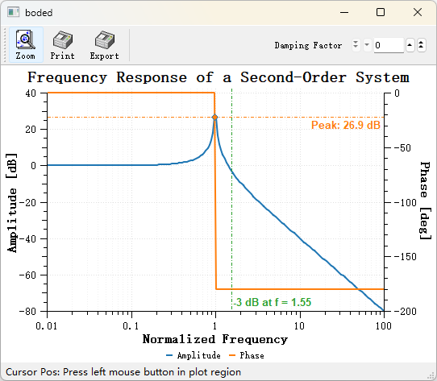
  `examples/bode`

</div>

### Interactive Demos

<div class="grid cards" markdown>

- 
  Axis Dragging

- 
  Axis Zooming

- 
  Figure Overlay

- 
  Data Picker

</div>

## License

```
Qwt Widget Library
Copyright (C) 1997   Josef Wilgen
Copyright (C) 2002   Uwe Rathmann

Qwt is published under the Qwt License, Version 1.0.
```
