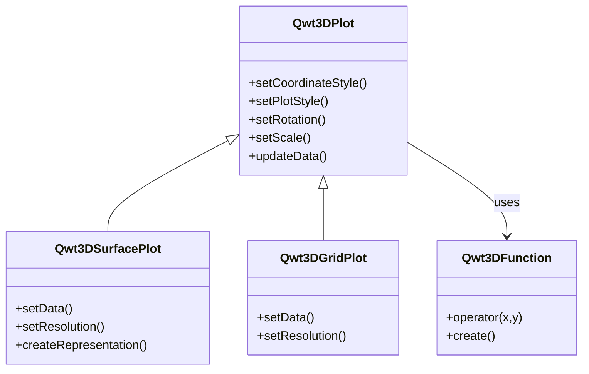

# 3D Plot Introduction

Qwt 7.1 integrates the original `QwtPlot3D` library, providing 3D data visualization capabilities. The 3D plot module supports surface plots, grid plots, function plots, and other types, suitable for 3D data display in scientific computing and engineering analysis.

## Main Features

**Features**

- ✅ **Multiple plot types**: Surface plots, grid plots, parametric surfaces, etc.
- ✅ **OpenGL rendering**: High-performance 3D rendering using OpenGL
- ✅ **Interactive operations**: Supports mouse rotation, zooming, and panning
- ✅ **Lighting and materials**: Supports lighting effects and material configuration

## 3D Plot Module Structure



## Core Classes

| Class Name | Description |
|------|------|
| `Qwt3DPlot` | 3D plot base class, provides basic framework and interaction |
| `Qwt3DSurfacePlot` | 3D surface plot, displays continuous surfaces |
| `Qwt3DGridPlot` | 3D grid plot, displays discrete grid data |
| `Qwt3DFunction` | 3D function plot, generates surfaces from mathematical functions |
| `Qwt3DAxis` | 3D axis configuration |
| `Qwt3DColorLegend` | 3D color bar |

## Usage

The 3D plot example is located at: `examples/3D/simpleplot3D`. Screenshot:


### Basic Usage Example

```cpp
#include <Qwt3DPlot>
#include <Qwt3DSurfacePlot>
#include <Qwt3DFunction>

// Create surface plot
Qwt3DSurfacePlot* plot = new Qwt3DSurfacePlot();

// Define function
class MyFunction : public Qwt3DFunction
{
public:
    virtual double operator()(double x, double y) override
    {
        return std::sin(x) * std::cos(y);  // Mathematical function
    }
};

// Create function object
MyFunction* func = new MyFunction();

// Set data range and resolution
func->setDomain(-5, 5, -5, 5);  // x and y range
func->setResolution(50);         // 50x50 grid

// Create surface
func->create(plot);

// Set rotation angles
plot->setRotation(30, 0, 45);  // X, Y, Z axis rotation angles

// Display
plot->show();
```

### Data Loading

```cpp
// Load from data array
Qwt3DSurfacePlot* plot = new Qwt3DSurfacePlot();

// Set data range
plot->setDomain(0, 100, 0, 100);  // X, Y range

// Set resolution
plot->setResolution(100);  // 100x100 grid

// Load Z value data (100x100 array)
double zData[100][100];
// ... fill data ...
plot->loadFromData(zData, 100, 100);
```

### Interactive Operations

```cpp
// Enable mouse interaction
plot->setMouseInteraction(true);

// Mouse operations:
// - Left button drag: Rotate view
// - Middle button drag: Pan
// - Scroll wheel: Zoom

// Set scale ratio
plot->setScale(1.0, 1.0, 1.0);  // X, Y, Z scale ratio

// Set rotation angles
plot->setRotation(45, 30, 60);  // X, Y, Z axis rotation angles (degrees)
```

### Color Mapping

```cpp
#include <Qwt3DColorLegend>

// Enable color bar
Qwt3DColorLegend* legend = new Qwt3DColorLegend();
legend->setLimits(0, 10);  // Z value range
legend->show(plot);

// Set color mapping
plot->setColorFromData();  // Automatically map colors based on Z values
```

## Build Configuration

To use 3D features, enable the `QWT_CONFIG_QWTPLOT_3D` CMake option:

```cmake
find_package(qwt REQUIRED)

# Link 2D plot library
target_link_libraries(${PROJECT_NAME} PRIVATE qwt::plot)

# Link 3D plot library
target_link_libraries(${PROJECT_NAME} PRIVATE qwt::plot3d)
```

!!! warning "OpenGL Dependency"
    The 3D plot module depends on OpenGL and GLU libraries. Ensure that OpenGL drivers and GLU library are installed on your system.

## Core Method Summary

| Method | Description |
|------|------|
| `setDomain()` | Set X/Y data range |
| `setResolution()` | Set grid resolution |
| `setRotation()` | Set rotation angles |
| `setScale()` | Set scale ratio |
| `createRepresentation()` | Create surface representation |
| `updateData()` | Update data |

!!! tip "3D Plot Recommendations"
    - Data size should not be too large (recommended under 100x100 grid)
    - For complex surfaces, reduce resolution to improve performance
    - Use lighting effects to enhance visual appearance

!!! example "Related Examples"
    - Basic 3D plot: `examples/3D/simpleplot3D`
    - 3D axis configuration: `examples/3D/axes`
    - 3D enrichments: `examples/3D/enrichments`
