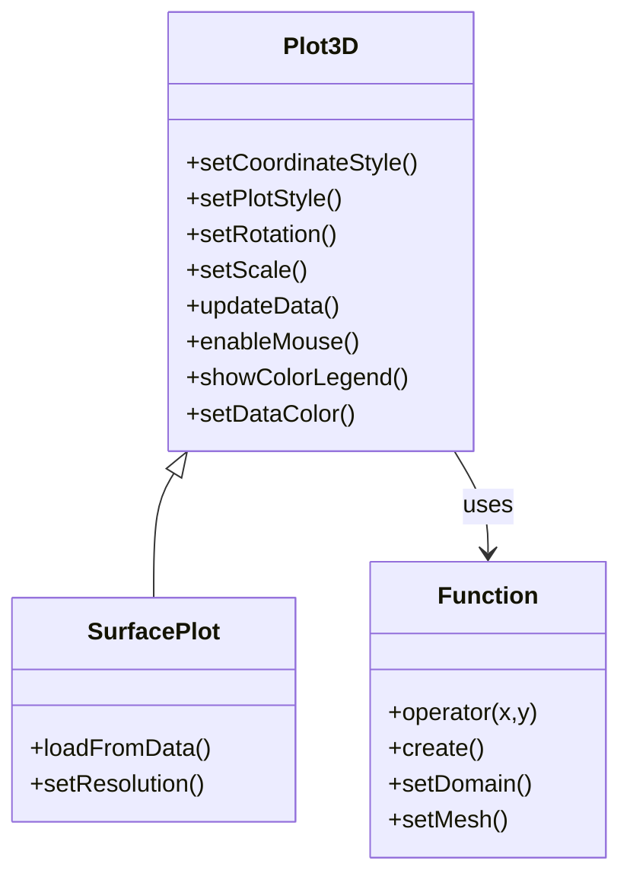

# 3D Plot Introduction

Qwt 7.1 integrates the original `QwtPlot3D` library, providing 3D data visualization capabilities. The 3D plot module supports surface plots, grid plots, function plots, and other types, suitable for 3D data display in scientific computing and engineering analysis.

## Main Features

**Features**

- ✅ **Multiple plot types**: Surface plots, grid plots, parametric surfaces, etc.
- ✅ **OpenGL rendering**: High-performance 3D rendering using OpenGL
- ✅ **Interactive operations**: Supports mouse rotation, zooming, and panning
- ✅ **Lighting and materials**: Supports lighting effects and material configuration
- ✅ **Theme system**: One-click visual style switching with 10 preset themes and 22 scientific colormaps

## 3D Plot Module Structure



!!! note "Namespace"
    All 3D classes live in the `Qwt3D` namespace. Below they are shown without the
    `Qwt3D::` prefix for brevity — qualify them (or add `using namespace Qwt3D;`) in your code.

## Core Classes

| Class Name | Description |
|------|------|
| `Qwt3D::Plot3D` | 3D plot base class, provides basic framework and interaction |
| `Qwt3D::SurfacePlot` | 3D surface plot, displays continuous surfaces (handles both grid and cell data) |
| `Qwt3D::Function` | 3D function plot, generates surfaces from mathematical functions |
| `Qwt3D::GraphPlot` | Intermediate base class for graph-based 3D plots |
| `Qwt3D::Axis` | 3D axis configuration |
| `Qwt3D::ColorLegend` | 3D color bar |
| `Qwt3D::Qwt3DTheme` | 3D theme system, encapsulates background, mesh, colormap, axes, lighting, and all visual attributes |

## Usage

The 3D plot example is located at: `examples/3D/simpleplot3D`. Screenshot:


### Basic Usage Example

```cpp
#include <qwt3d_surfaceplot.h>
#include <qwt3d_function.h>

using namespace Qwt3D;

// Create surface plot
SurfacePlot* plot = new SurfacePlot();

// Define function
class MyFunction : public Function
{
public:
    double operator()(double x, double y) override
    {
        return std::sin(x) * std::cos(y);  // Mathematical function
    }
};

// Create function object and assign it to the plot
MyFunction* func = new MyFunction(*plot);

// Set data range and mesh resolution
func->setDomain(-5, 5, -5, 5);  // x and y range
func->setMesh(50, 50);           // 50x50 grid

// Create surface
func->create();

// Set rotation angles
plot->setRotation(30, 0, 45);  // X, Y, Z axis rotation angles

// Display
plot->show();
```

### Data Loading

```cpp
#include <qwt3d_surfaceplot.h>

using namespace Qwt3D;

// Load from data array
SurfacePlot* plot = new SurfacePlot();

// Allocate a 100x100 Z value array
double* zData[100];
for (int i = 0; i < 100; ++i)
    zData[i] = new double[100];
// ... fill data ...

// Load Z value data with explicit X/Y range
plot->loadFromData(zData, 100, 100, 0.0, 100.0, 0.0, 100.0);

// Set resolution (1 = use all data; higher values downsample)
plot->setResolution(1);
```

### Interactive Operations

```cpp
// Enable mouse interaction
plot->enableMouse(true);

// Mouse operations:
// - Left button drag: Rotate view
// - Middle button drag: Pan
// - Scroll wheel: Zoom

// Set scale ratio
plot->setScale(1.0, 1.0, 1.0);  // X, Y, Z scale ratio

// Set rotation angles
plot->setRotation(45, 30, 60);  // X, Y, Z axis rotation angles (degrees)
```

### Color Mapping

```cpp
#include <qwt3d_colormap_color.h>

using namespace Qwt3D;

// Enable color legend
plot->showColorLegend(true);

// Set color mapping based on Z values using a core colormap preset
plot->setDataColor(new ColorMapColor(plot, "viridis"));
```

### Theme System (v7.3.1+)

The `Qwt3D::Qwt3DTheme` class provides one-click switching of 3D plot visual styles, encapsulating all visual attributes including background color, mesh color, data colormap, axis colors, title styling, lighting presets, and shading modes.

#### Built-in Preset Themes

| Preset Name | Description |
|-------------|-------------|
| `Default` | White background + jet colormap + no lighting |
| `Dark` | Dark gray background + viridis + soft lighting |
| `Scientific` | White background + jet + studio lighting |
| `Warm` | Warm-toned background + hot colormap |
| `Cool` | Cool-toned background + cool colormap |
| `Matplotlib` | matplotlib style (viridis + soft lighting) |
| `EarthTones` | Earth tones + autumn colormap |
| `Ocean` | Ocean tones + winter colormap |
| `HighContrast` | Black background with white lines for high contrast |
| `Presentation` | Large fonts + thick lines, suitable for presentations |

#### Usage Examples

```cpp
#include <qwt3d_theme.h>

// Method 1: Use preset theme (recommended)
plot->applyTheme(Qwt3D::Qwt3DTheme::Dark);

// Method 2: Apply theme by name
plot->applyTheme("Scientific");

// Method 3: Custom theme
Qwt3D::Qwt3DTheme theme(Qwt3D::Qwt3DTheme::Scientific);
theme.setDataColorPreset("plasma");  // Use one of 22 scientific colormap presets
theme.setShininess(20.0);
theme.setLightingPreset(Qwt3D::Qwt3DTheme::Studio);
theme.apply(plot);
```

#### Colormap Presets

`Qwt3D::Qwt3DTheme` provides 22 scientific visualization colormaps via the `core` module's `QwtColorMapPreset`:

- Perceptually uniform: `viridis`, `plasma`, `inferno`, `magma`, `cividis`
- Classic: `jet`, `hot`, `cool`, `spring`, `summer`, `autumn`, `winter`
- Grayscale: `gray`, `bone`, `copper`
- Rainbow: `rainbow`, `hsv`, `turbo`
- Diverging: `coolwarm`, `rdylbu`, `rdylgn`, `spectral`

```cpp
// Switch colormap
theme.setDataColorPreset("viridis");

// View all available presets
QStringList presets = QwtColorMapPreset::availablePresets();
```

#### Lighting Presets

| Preset | Description |
|--------|-------------|
| `NoLighting` | No lighting, solid color rendering |
| `FlatLight` | Uniform ambient light |
| `Studio` | Classic three-point lighting |
| `Outdoor` | Strong directional light + ambient |
| `Soft` | Soft diffuse lighting |

## Build Configuration

To use 3D features, enable the `QWT_CONFIG_QWTPLOT_3D` CMake option:

```cmake
find_package(qwt REQUIRED)

# Link 2D plot library
target_link_libraries(${PROJECT_NAME} PRIVATE qwt::plot)

# Link 3D plot library
target_link_libraries(${PROJECT_NAME} PRIVATE qwt::plot3d)
```

!!! warning "OpenGL Dependency"
    The 3D plot module depends on OpenGL and GLU libraries. Ensure that OpenGL drivers and GLU library are installed on your system.

## Core Method Summary

| Method | Class | Description |
|------|------|------|
| `setDomain()` | `Qwt3D::Function` / `Qwt3D::GridMapping` | Set X/Y data range |
| `setMesh()` | `Qwt3D::Function` / `Qwt3D::GridMapping` | Set grid resolution (columns, rows) |
| `setResolution()` | `Qwt3D::SurfacePlot` | Set data resolution (1 = all data) |
| `loadFromData()` | `Qwt3D::SurfacePlot` | Load data array into the plot |
| `create()` | `Qwt3D::Function` | Generate and attach surface data |
| `setRotation()` | `Qwt3D::Plot3D` | Set rotation angles |
| `setScale()` | `Qwt3D::Plot3D` | Set scale ratio |
| `enableMouse()` | `Qwt3D::Plot3D` | Enable/disable mouse interaction |
| `showColorLegend()` | `Qwt3D::Plot3D` | Show/hide color legend |
| `setDataColor()` | `Qwt3D::Plot3D` | Set data color functor |
| `updateData()` | `Qwt3D::Plot3D` | Recalculate and update data |

!!! tip "3D Plot Recommendations"
    - Data size should not be too large (recommended under 100x100 grid)
    - For complex surfaces, reduce resolution to improve performance
    - Use lighting effects to enhance visual appearance

!!! example "Related Examples"
    - Basic 3D plot: `examples/3D/simpleplot3D`
    - 3D axis configuration: `examples/3D/axes`
    - 3D enrichments: `examples/3D/enrichments`
