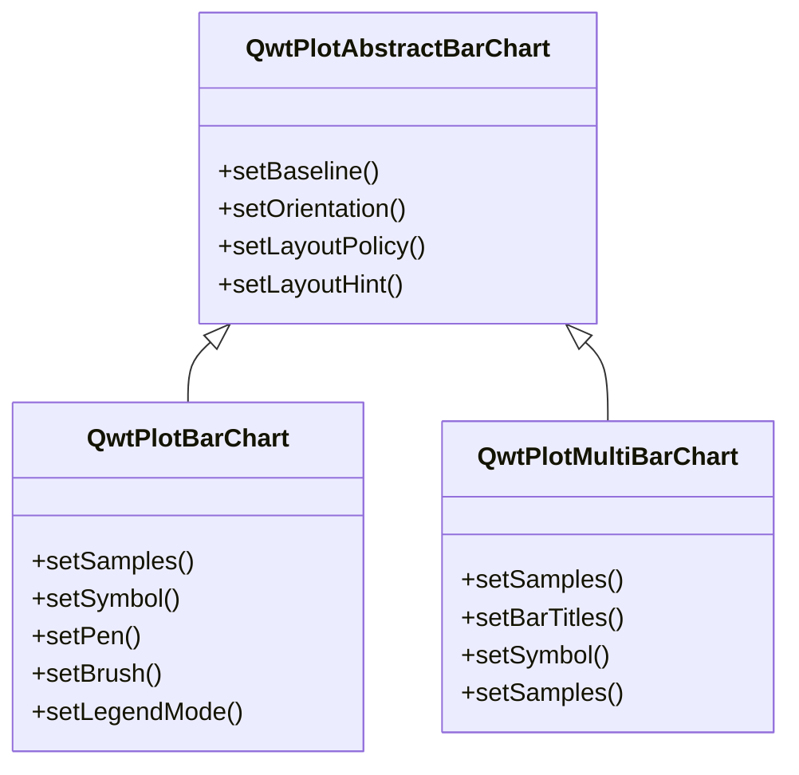
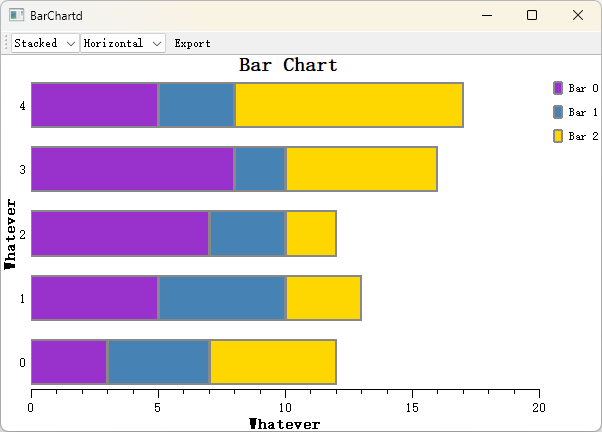

# Bar Chart - QwtPlotBarChart

`QwtPlotBarChart` is a plot item class for drawing bar charts. It supports grouped and stacked bar charts, can be displayed horizontally or vertically, and is suitable for comparative analysis of categorical data.

## Key Features

**Features**

- Grouped/stacked modes: Supports grouped comparison and stacked cumulative display of multiple data sets
- Direction switching: Supports both vertical and horizontal display orientations
- Style customization: Configurable bar fill, border, width, and other properties
- Baseline configuration: Supports custom bar starting baseline position
- Legend modes: Choose to display chart title or individual bar titles

## Basic Concepts

### Bar Chart Types

Qwt provides two bar chart classes:

| Class | Description |
|-------|-------------|
| `QwtPlotBarChart` | Single-group bar chart, one bar per group |
| `QwtPlotMultiBarChart` | Multi-group bar chart, supports grouped and stacked modes |

### Bar Chart Modes

| Mode | Description |
|------|-------------|
| `Grouped` | Grouped mode: Multiple data sets displayed side by side for comparison |
| `Stacked` | Stacked mode: Multiple data sets stacked to show totals |

### Class Inheritance Structure



## Usage

The bar chart example is located at: `examples/2D/barchart`. Screenshot below:




### 1. Basic Bar Chart

Create the simplest single-group bar chart:

```cpp
#include <QwtPlot>
#include <QwtPlotBarChart>

QwtPlot* plot = new QwtPlot();
plot->setTitle("Bar Chart Example");
plot->setCanvasBackground(Qt::white);

// Create bar chart
QwtPlotBarChart* barChart = new QwtPlotBarChart("Sales Data");

// Set data (Y value list, X auto-indexed)
QVector<double> values;
values << 10 << 25 << 15 << 30 << 20;
barChart->setSamples(values);

// Set bar style
barChart->setPen(QPen(Qt::darkBlue, 2));       // Border
barChart->setBrush(QBrush(QColor(100, 150, 200)));  // Fill

// Set baseline (bar starting position)
barChart->setBaseline(0.0);  // Start from 0

barChart->attach(plot);
plot->replot();
```

### 2. Setting Data

QwtPlotBarChart provides multiple ways to set data:

```cpp
// Method 1: Y values only (X auto-indexed as 0,1,2...)
QVector<double> yValues;
yValues << 10 << 20 << 30 << 40;
barChart->setSamples(yValues);

// Method 2: Specify X and Y coordinates
QVector<QPointF> points;
points << QPointF(1, 10) << QPointF(2, 25) << QPointF(3, 15);
barChart->setSamples(points);

// Method 3: Using QwtSeriesData
barChart->setSamples(seriesData);
```

### 3. Bar Style Configuration

```cpp
#include <QwtColumnSymbol>

// Create column symbol
QwtColumnSymbol* symbol = new QwtColumnSymbol(QwtColumnSymbol::Box);
symbol->setFrameStyle(QwtColumnSymbol::Raised);  // Raised border style

// Set border pen
symbol->setPen(QPen(Qt::darkBlue, 1));

// Set fill brush
symbol->setBrush(QBrush(QColor(100, 150, 200, 180)));

// Apply to bar chart
barChart->setSymbol(symbol);

// Or directly set pen and brush (using default style)
barChart->setPen(QPen(Qt::darkGray, 1));
barChart->setBrush(QBrush(Qt::blue));
```

### 4. Display Orientation

```cpp
// Vertical bar chart (default) - X-axis for categories, Y-axis for values
barChart->setOrientation(Qt::Vertical);

// Horizontal bar chart - Y-axis for categories, X-axis for values
barChart->setOrientation(Qt::Horizontal);
```

### 5. Bar Width Configuration

```cpp
// Set layout policy
barChart->setLayoutPolicy(QwtPlotAbstractBarChart::AutoAdjustSamples);  // Auto-adjust
// Other options:
// - FixedBarWidth: Fixed width
// - FixedSampleWidth: Fixed sample width (including spacing)
// - AdjustSampleWidth: Adjust based on available space

// Set layout hint value
barChart->setLayoutHint(0.8);  // Bar width ratio (relative to sample space)
```

### 6. Baseline Settings

The baseline defines the starting position of bars:

```cpp
// Default baseline is 0
barChart->setBaseline(0.0);

// Set positive baseline (bars start drawing from 10)
barChart->setBaseline(10.0);

// Set negative baseline (can be used to highlight positive values)
barChart->setBaseline(-5.0);
```

### 7. Multi-Group Bar Chart (QwtPlotMultiBarChart)

```cpp
#include <QwtPlotMultiBarChart>

// Create multi-group bar chart
QwtPlotMultiBarChart* multiBar = new QwtPlotMultiBarChart();
multiBar->setTitle("Multi-Group Data Comparison");

// Set titles for each group (used in legend)
QList<QwtText> titles;
titles << QwtText("Group A") << QwtText("Group B") << QwtText("Group C");
multiBar->setBarTitles(titles);

// Set data (each sample contains multiple group values)
QVector<QwtSetSample> samples;
samples << QwtSetSample(0, QVector<double>() << 10 << 20 << 15);  // 1st category
samples << QwtSetSample(1, QVector<double>() << 25 << 15 << 30);  // 2nd category
samples << QwtSetSample(2, QVector<double>() << 20 << 25 << 10);  // 3rd category
multiBar->setSamples(samples);

// Set display mode
multiBar->setChartMode(QwtPlotMultiBarChart::Grouped);   // Grouped mode
// Or multiBar->setChartMode(QwtPlotMultiBarChart::Stacked); // Stacked mode

multiBar->attach(plot);
plot->replot();
```

### 8. Custom Per-Group Bar Styles

```cpp
// Create different symbols for each group
QList<QwtColumnSymbol*> symbols;
for (int i = 0; i < 3; i++) {
    QwtColumnSymbol* symbol = new QwtColumnSymbol(QwtColumnSymbol::Box);
    symbol->setBrush(QBrush(colors[i]));  // Different colors
    symbol->setPen(QPen(Qt::black, 1));
    symbols.append(symbol);
}
multiBar->setSymbols(symbols);
```

## Core Methods Summary

### QwtPlotBarChart

| Method | Description |
|--------|-------------|
| `setSamples()` | Set data |
| `setSymbol()` | Set bar symbol |
| `setPen()` | Set border pen |
| `setBrush()` | Set fill brush |
| `setBaseline()` | Set baseline position |
| `setOrientation()` | Set display orientation |
| `setLayoutPolicy()` | Set layout policy |
| `setLayoutHint()` | Set layout parameters |
| `setLegendMode()` | Set legend mode |

### QwtPlotMultiBarChart

| Method | Description |
|--------|-------------|
| `setBarTitles()` | Set titles for each group |
| `setSamples()` | Set multi-group data |
| `setSymbols()` | Set symbols for each group |
| `setChartMode()` | Set grouped/stacked mode |

## Legend Modes

```cpp
// Single legend entry (display chart title)
barChart->setLegendMode(QwtPlotBarChart::LegendChartTitle);

// Separate legend entry for each bar
barChart->setLegendMode(QwtPlotBarChart::LegendBarTitles);
```

!!! example "Related Examples"
    - Bar chart demo: `examples/2D/barchart`
