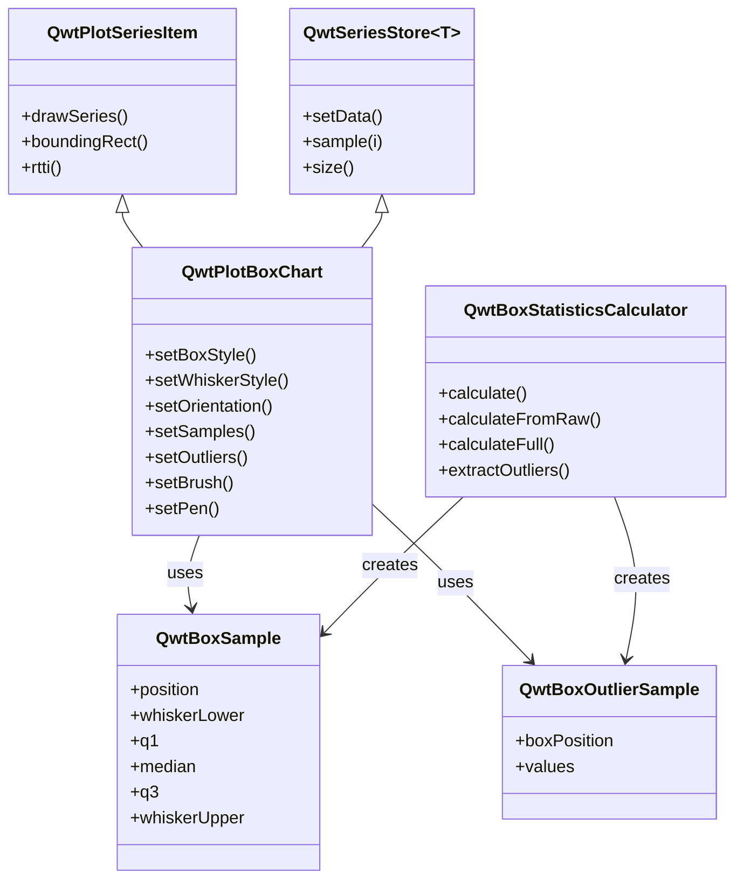
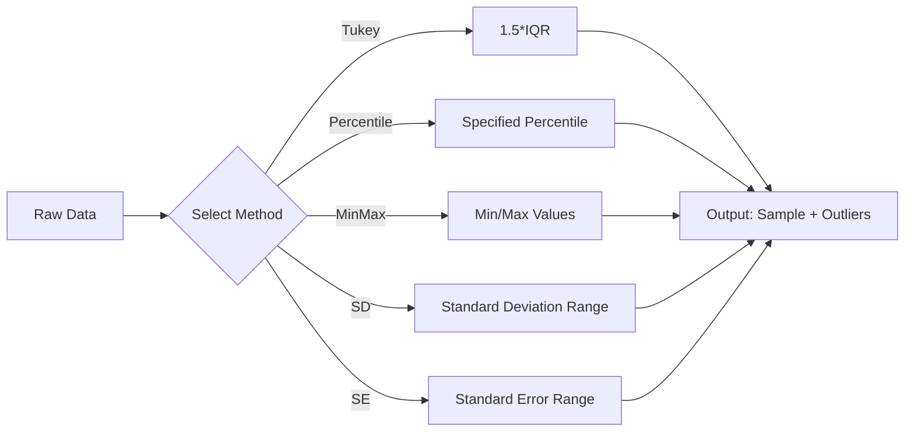

# Box Chart (Box-and-Whisker Plot) User Guide

`QwtPlotBoxChart` is Qwt's box-and-whisker plot drawing class, used to visually display statistical distribution characteristics of data. Box plots can clearly present key statistical information such as median, quartiles, and outliers, making them an indispensable tool for data analysis and scientific visualization.

## Key Features

**Features**

- Flexible data input: Supports both pre-computed statistics and automatic calculation from raw data
- Automatic statistical computation: Built-in statistics calculator supporting Tukey, percentile, standard deviation, and other calculation methods
- Diverse box styles: Rectangle, diamond, and notch display styles for different analysis scenarios
- Flexible orientation: Vertical and horizontal display orientations to meet different layout requirements
- Intelligent outlier handling: Automatic outlier detection with customizable symbols and jitter display
- Rich style customization: Box fill, border, median line, and whisker styles are all customizable

## Basic Concepts

### What is a Box Plot

A box-and-whisker plot is a statistical chart used to display data distribution characteristics. It describes data distribution through five key values (five-number summary):

- **Minimum**: The smallest value in the dataset or the lower whisker position
- **Q1 (First Quartile)**: 25% of the data falls below this value
- **Median**: The middle value of the data, 50th percentile
- **Q3 (Third Quartile)**: 75% of the data falls below this value
- **Maximum**: The largest value in the dataset or the upper whisker position

### Box Plot Structure Diagram

The figure below shows the components of a standard box plot:


### Class Relationship Structure

The inheritance and composition relationships of box plot related classes are as follows:



### Data Structures in Detail

#### QwtBoxSample

`QwtBoxSample` is the core data structure of the box plot, representing all statistical values for a single box:

```cpp
struct QwtBoxSample {
    double position;       // Box position on the position axis (x-axis or y-axis position)
    double whiskerLower;   // Lower whisker position
    double q1;             // First quartile (25th percentile)
    double median;         // Median (50th percentile)
    double q3;             // Third quartile (75th percentile)
    double whiskerUpper;   // Upper whisker position
    int outlierCount;      // Number of outliers (count only, actual values stored separately)
};
```

!!! info "Parameter Order Note"
    Constructor parameter order: `position, whiskerLower, q1, median, q3, whiskerUpper`
    Ensure parameters are passed in the correct order, otherwise the box plot will display incorrectly

#### QwtBoxOutlierSample

Outlier data is stored separately from box data:

```cpp
struct QwtBoxOutlierSample {
    double boxPosition;       // Position of the corresponding box
    QVector<double> values;   // List of all outlier values
};
```

Advantages of separating outlier data from box data:

- **Independent rendering control**: Outliers can use different symbols, colors, and sizes
- **Flexible data management**: Outliers can be added or removed independently without affecting box data
- **Avoid data redundancy**: Box data and outlier data are maintained independently

## Usage

The box chart example is located at: `examples/2D/boxchart`. Screenshot below:


### 1. Creating a Basic Box Plot

The simplest approach is to directly provide pre-computed statistical data. This is suitable for scenarios where statistical analysis has already been completed.

**Applicable scenarios**:
- Data already processed by other statistical software
- Precise control over each statistical value is needed
- Batch display of multiple pre-computed statistical datasets

```cpp
#include <QwtPlotBoxChart>
#include <QwtLegend>

// Create plot window
QwtPlot* plot = new QwtPlot();
plot->setTitle("Box Plot Example");
plot->insertLegend(new QwtLegend());

// Create box plot object
QwtPlotBoxChart* boxChart = new QwtPlotBoxChart("Data Group A");
boxChart->attach(plot);  // Must be attached to plot for display

// Prepare box plot data
// Parameter order: position, lower whisker, Q1, median, Q3, upper whisker
QVector<QwtBoxSample> samples;
samples << QwtBoxSample(1.0, 10.0, 20.0, 35.0, 50.0, 60.0);  // First data group
samples << QwtBoxSample(2.0, 15.0, 25.0, 40.0, 55.0, 70.0);   // Second data group
samples << QwtBoxSample(3.0, 8.0, 18.0, 32.0, 48.0, 58.0);    // Third data group

// Set data to box plot
boxChart->setSamples(samples);

// Set style
boxChart->setBrush(QColor(100, 150, 200, 150));  // Semi-transparent blue fill for box
boxChart->setPen(QPen(Qt::darkBlue, 2.0));       // Dark blue border
boxChart->setBoxExtent(0.35);                    // Box width (relative to coordinate range)
```

### 2. Automatic Calculation from Raw Data

When only raw data is available, use `QwtBoxStatisticsCalculator` to automatically compute statistics and outliers.

**Applicable scenarios**:
- Real-time data analysis display
- Direct visualization of raw data
- Dynamic data update scenarios

```cpp
#include <qwt_box_statistics.h>
#include <QwtSymbol>

// Prepare raw data
QVector<double> rawData;
for (int i = 0; i < 100; i++) {
    rawData << 50.0 + (rand() % 50) - 25.0;  // Generate random data
}
// Add some extreme values as outliers
rawData << 5.0;    // Low outlier
rawData << 100.0;  // High outlier

// Compute box plot statistics
QwtBoxSample sample;             // Output: box statistics
QwtBoxOutlierSample outlier;     // Output: outlier list

// calculateFull computes all data at once
QwtBoxStatisticsCalculator::calculateFull(
    1.5,              // Box position
    rawData,          // Raw data array
    sample,           // Output: statistical result
    outlier,          // Output: outlier result
    QwtBoxStatisticsCalculator::Tukey,  // Calculation method (Tukey = 1.5*IQR)
    1.5               // IQR coefficient
);

// Create box plot and set computed data
QwtPlotBoxChart* boxChart = new QwtPlotBoxChart("Auto-Calculated");
boxChart->attach(plot);

// Set box data
QVector<QwtBoxSample> samples;
samples << sample;
boxChart->setSamples(samples);

// Set outlier data (optional)
QVector<QwtBoxOutlierSample> outliers;
outliers << outlier;
boxChart->setOutliers(outliers);

// Configure outlier display style
QwtSymbol* outlierSymbol = new QwtSymbol(QwtSymbol::Diamond);
outlierSymbol->setSize(8, 8);
outlierSymbol->setBrush(Qt::red);            // Red fill
outlierSymbol->setPen(QPen(Qt::darkRed, 1)); // Dark red border
boxChart->setOutlierSymbol(outlierSymbol);

// Enable jitter to avoid overlap
boxChart->setOutlierJitter(0.1);
```

### 3. Statistical Calculation Methods in Detail

`QwtBoxStatisticsCalculator` provides multiple whisker calculation methods for different data analysis needs:



| Calculation Method | Applicable Scenario | Description |
|-------------------|---------------------|-------------|
| `Tukey` | Standard box plot | Uses 1.5*IQR to determine whisker range, the most classic outlier detection method |
| `Percentile` | Custom range | Uses specified percentiles (e.g., 5th and 95th) as whisker endpoints |
| `MinMax` | Full data range | Whiskers extend to the minimum and maximum values of the data, no outliers displayed |
| `StandardDeviation` | Normally distributed data | Uses mean +/- n*standard deviation to determine range |
| `StandardError` | Statistical inference | Uses mean +/- n*standard error, suitable for sample statistical inference |

!!! tip "Method Selection Recommendations"
    - **General data analysis**: Use Tukey method (default)
    - **Custom outlier criteria**: Use Percentile or adjust the Tukey coefficient
    - **Display full data distribution**: Use MinMax
    - **Normal distribution testing**: Use StandardDeviation

### 4. Box Style Configuration

`QwtPlotBoxChart` provides three box display styles, each with different visual effects and analytical purposes:

```cpp
// Rectangle box (default) - the most commonly used standard style
boxChart->setBoxStyle(QwtPlotBoxChart::Rect);

// Diamond box - emphasizes symmetry of data distribution
boxChart->setBoxStyle(QwtPlotBoxChart::Diamond);

// Notch box - displays confidence interval of the median
boxChart->setBoxStyle(QwtPlotBoxChart::Notch);
```

!!! info "Style Selection Guide"
    - `Rect`: Standard box plot style, suitable for most scenarios
    - `Diamond`: Suitable for comparing distribution symmetry across multiple groups
    - `Notch`: Notch represents the median confidence interval; if notches of two groups do not overlap, their medians are significantly different

### 5. Display Orientation Switching

Box plots support both vertical and horizontal display orientations, adjustable based on plot layout:

```cpp
// Vertical orientation (default) - x-axis is position axis, y-axis is value axis
boxChart->setOrientation(Qt::Vertical);

// Horizontal orientation - y-axis is position axis, x-axis is value axis
boxChart->setOrientation(Qt::Horizontal);
```

When switching orientation, note the following:

!!! warning "Refresh After Orientation Switch"
    After switching orientation, call `plot->replot()` or `plot->setAxisAutoScale()` to refresh the axes,
    otherwise the axis ranges may not adapt to the new data orientation

```cpp
// Complete orientation switching example
void switchOrientation(QwtPlot* plot, QwtPlotBoxChart* boxChart, bool horizontal)
{
    if (horizontal) {
        boxChart->setOrientation(Qt::Horizontal);
        plot->setAxisTitle(QwtAxis::YLeft, "Sample Position");
        plot->setAxisTitle(QwtAxis::XBottom, "Value");
    } else {
        boxChart->setOrientation(Qt::Vertical);
        plot->setAxisTitle(QwtAxis::XBottom, "Sample Position");
        plot->setAxisTitle(QwtAxis::YLeft, "Value");
    }

    // Important: refresh axis ranges
    plot->setAxisAutoScale(QwtAxis::XBottom);
    plot->setAxisAutoScale(QwtAxis::YLeft);
    plot->replot();
}
```

### 6. Outlier Style Customization

Outliers are an important component of box plots, and their display style can be independently customized:

```cpp
// Create outlier symbol
QwtSymbol* symbol = new QwtSymbol(QwtSymbol::Ellipse);
symbol->setSize(10, 10);              // Set symbol size
symbol->setBrush(QBrush(Qt::red));    // Set fill color
symbol->setPen(QPen(Qt::black, 1));   // Set border

// Apply to box plot
boxChart->setOutlierSymbol(symbol);

// Set jitter range to avoid overlap
// Parameter is jitter width relative to coordinate range, recommended 0.05~0.2
boxChart->setOutlierJitter(0.15);
```

**Jitter Feature Description**:

When multiple outlier values are identical or similar, they will overlap at the same position when displayed
