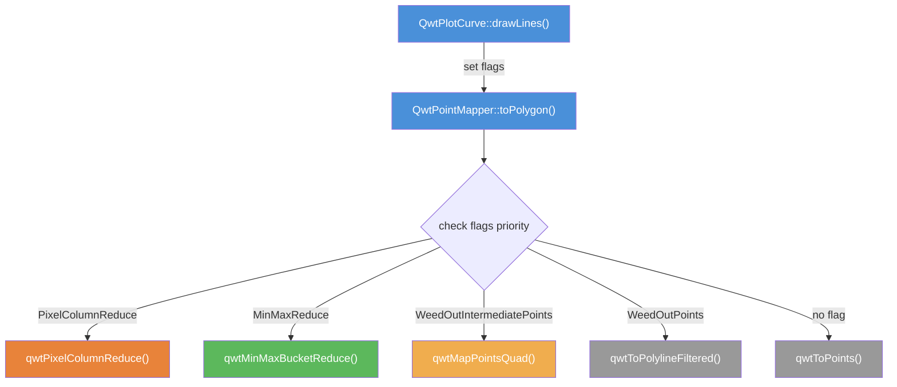
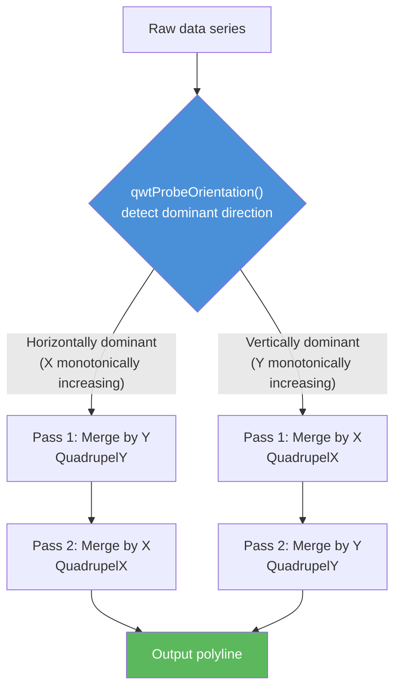
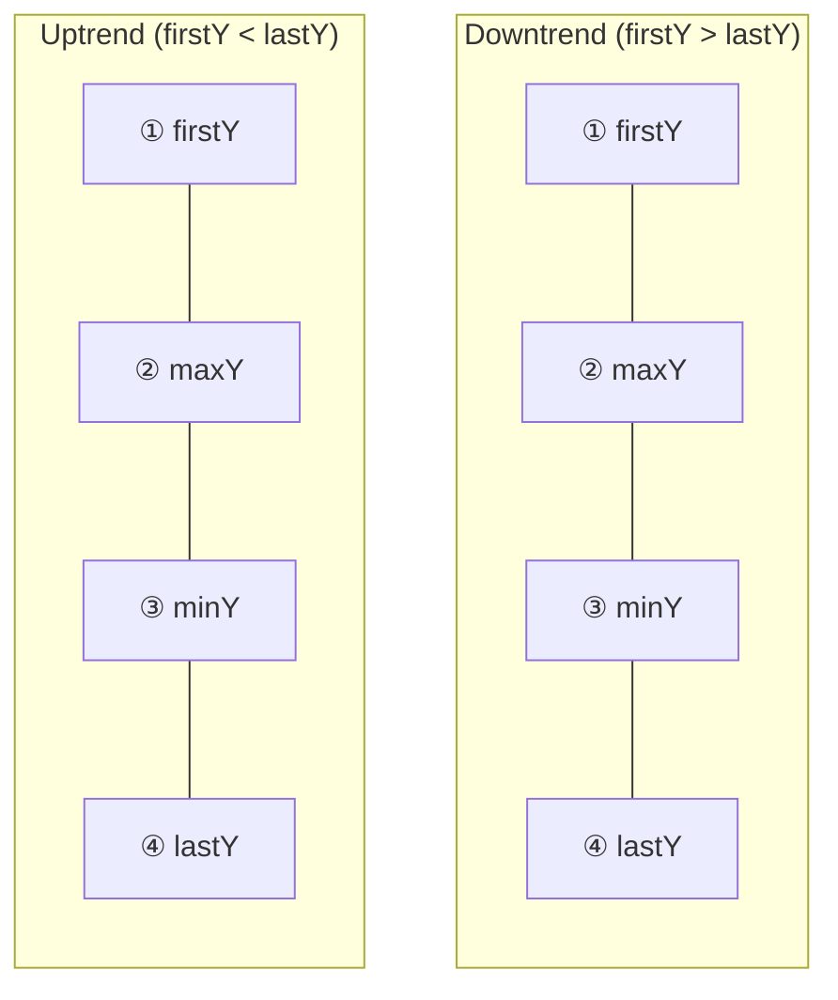
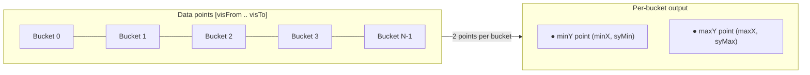
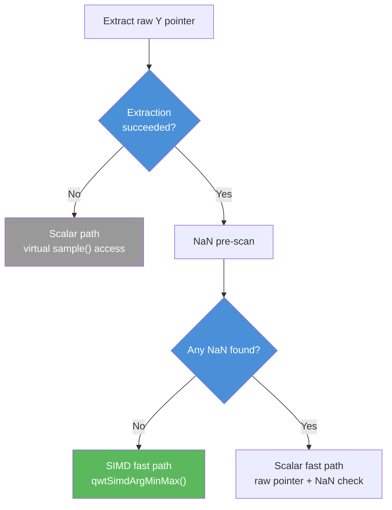
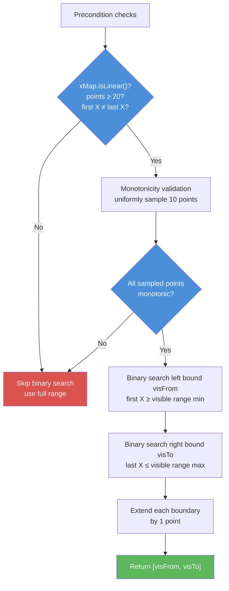
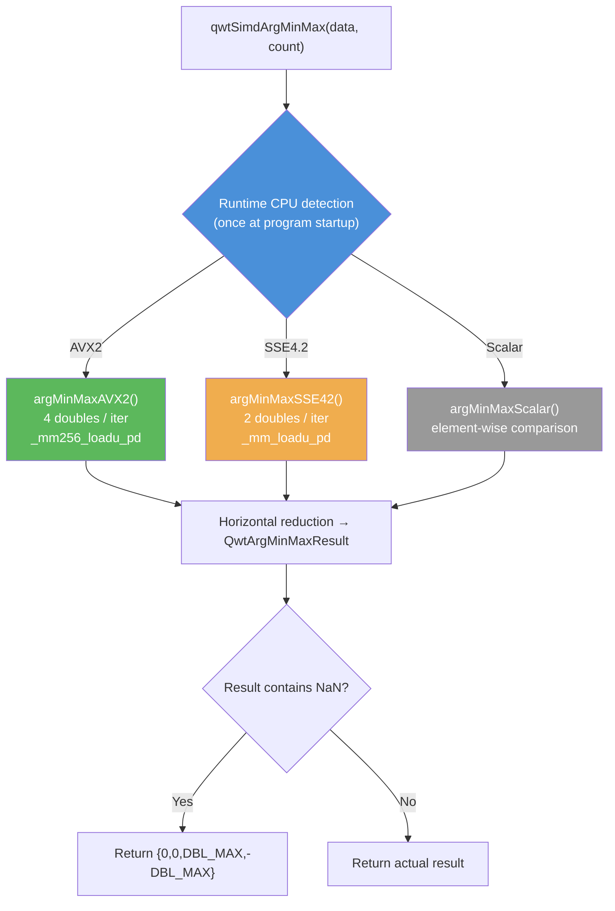

# Curve Downsampling Algorithms

When the number of data points in a curve far exceeds the canvas pixel count, mapping and rendering every single point is wasteful — many points map to the same pixel coordinate, producing redundant drawing operations. Qwt implements a layered downsampling pipeline in `QwtPointMapper` that compresses redundant data points into a visually equivalent, simplified polygon during the coordinate transformation stage, dramatically reducing the workload on `QPainter`.

This document describes the four downsampling algorithms available in Qwt, their principles, implementation details, and performance characteristics.

## Architecture Overview

Downsampling occurs during the coordinate mapping phase of curve rendering. The call chain is:



!!! info "Priority"
    When multiple flags are set, algorithms are selected in order: `PixelColumnReduce > MinMaxReduce > WeedOutIntermediatePoints > WeedOutPoints`.

**Key source files:**

| File | Content |
|------|---------|
| `src/plot/qwt_point_mapper.h` | `QwtPointMapper` class declaration, `TransformationFlag` enum |
| `src/plot/qwt_point_mapper.cpp` | All downsampling algorithm implementations (`qwtMapPointsQuad`, `qwtPixelColumnReduce`, `qwtMinMaxBucketReduce`, etc.) |
| `src/plot/qwt_simd_argminmax.h/.cpp` | SIMD-accelerated argmin/argmax (AVX2/SSE4.2/Scalar, runtime CPU detection) |
| `src/plot/qwt_plot_curve.h` | `QwtPlotCurve::PaintAttribute` enum — the user-facing rendering attribute interface |
| `src/plot/qwt_plot_curve.cpp` | `drawLines()` — maps `PaintAttribute` to `TransformationFlag` |

**Attribute mapping:**

| User-level `PaintAttribute` | Internal `TransformationFlag` | Algorithm |
|-----------------------------|-------------------------------|-----------|
| `FilterPoints` | `WeedOutPoints` | Consecutive duplicate filtering |
| `FilterPointsAggressive` | `WeedOutIntermediatePoints` | Quad Reduce |
| `FilterPointsPixel` | `PixelColumnReduce` | Pixel-Column Reduce |
| `FilterPointsLTTB` | `MinMaxReduce` | MinMax Bucket Reduce |

**Priority**: When multiple flags are set simultaneously, `QwtPointMapper::toPolygon()` selects the algorithm using the following priority (as shown in the flowchart above):

> `PixelColumnReduce` > `MinMaxReduce` > `WeedOutIntermediatePoints` > `WeedOutPoints`

## Algorithm 1: Consecutive Duplicate Filtering (FilterPoints / WeedOutPoints)

### Principle

The most basic downsampling strategy: iterate over all data points, transform each to screen coordinates, and skip the point if its screen position is identical to the previously output point.

### Algorithm

```
Input:  series[from..to], xMap, yMap
Output: polyline (deduplicated line)

1. Find the first non-NaN point, transform and append to polyline
2. For each subsequent point i:
   a. Transform sample(i) to screen coordinate p
   b. If p ≠ last point in polyline:
      Append p to polyline
```

### Characteristics

- **Output size**: At most equal to input size, minimum 1
- **Time complexity**: O(n)
- **Space complexity**: O(n) (pre-allocates buffer of n points)
- **Advantages**: Simple implementation, no information loss (only removes exact duplicates)
- **Drawbacks**: Limited effectiveness at high data density (e.g., millions of points) — many non-duplicate but densely packed pixels still produce very long polylines

### Source Location

`qwtToPolylineFiltered()` function template in `src/plot/qwt_point_mapper.cpp`.

## Algorithm 2: Quad Reduce (FilterPointsAggressive / WeedOutIntermediatePoints)

### Principle

Quad Reduce is a two-pass scan algorithm based on pixel-coordinate merging. The core observation is: when many data points map to the same pixel row (or column), only four key points need to be retained — **first, minimum, maximum, last** — to visually represent the envelope of that segment.

The algorithm runs in two stages:

1. **First pass**: Scan along the primary axis (X or Y, depending on the dominant data orientation), merging consecutive points that map to the same pixel coordinate into 4 key points
2. **Second pass**: Apply the same merging along the secondary axis on the output of the first pass

### Quadrupel Unit

The core data structures are `QwtPolygonQuadrupelX` (merging by X coordinate) and `QwtPolygonQuadrupelY` (merging by Y coordinate). Taking the X direction as example, for consecutive points mapping to the same pixel column `x₀`, four key points are retained — first, maximum, minimum, last:

```text
Original points (same pixel column):     Simplified output:

    y₄                                       y₁ (first)
   ╱  ╲   y₆                               y₄ (max)
  ╱    ╲  ╱╲                               y₅ (min)
y₁     y₅╱  y₈ ──→                        y₈ (last)

4 points → keep all                  8 points → 4 key points
```

!!! note "Output ordering"
    The output order of maximum and minimum depends on the relationship between `firstY` and `lastY`, ensuring the polyline direction matches the actual trend.

### Two-Pass Scanning Strategy

The algorithm first calls `qwtProbeOrientation()` to sample and detect the dominant data direction (horizontally or vertically increasing), then determines the scan order:



### Linear Scale Fast Path

When both X and Y axes use linear scaling (`xMap.isLinear() && yMap.isLinear()`), the algorithm uses direct linear transformation formulas instead of virtual function calls:

```cpp
// Avoid per-point transform() virtual function call
const double xCnv = xMap.cnv(), xOff = xMap.p1() - xMap.ts1() * xCnv;
const int x = qRound(sample.x() * xCnv + xOff);
```

### Characteristics

- **Output size**: Approximately `4 × max(canvas_width, canvas_height)`
- **Time complexity**: O(n)
- **Space complexity**: O(n) (pre-allocates buffer of ~`4 × pixel_dimension`)
- **Advantages**: General-purpose, does not require monotonic data, good waveform fidelity
- **Drawbacks**: Two-pass scanning adds constant overhead; all output coordinates are pixel-aligned integers

### Source Location

`qwtMapPointsQuad()` function templates (three overloads) and the anonymous-namespace `QwtPolygonQuadrupelX` / `QwtPolygonQuadrupelY` classes in `src/plot/qwt_point_mapper.cpp`.

## Algorithm 3: Pixel-Column Reduce (FilterPointsPixel / PixelColumnReduce)

### Principle

Pixel-Column Reduce uses a spatial binning strategy: using canvas pixel columns as indices, it allocates a Bin structure for each column, iterates over all data points assigning each to its corresponding column bucket based on screen X coordinate, and maintains first/min/max/last Y values within each bucket. Finally, it iterates over all column buckets, outputting key points from non-empty buckets.

The core advantage: output size depends only on canvas width, completely independent of data size.

### Algorithm

```
Input:  series[visFrom..visTo], xMap, yMap
Output: polyline (downsampled line)

1. Compute canvas pixel column count W = |round(xMap.p2) - round(xMap.p1)| + 1
2. Allocate Bin[W], initialize all count = 0
3. Iterate each data point in visible range:
   a. Transform to screen coordinates (sx, sy)
   b. Compute column col = sx - xMin
   c. If col ∈ [0, W):
      - If bin[col].count == 0:
        bin[col] = { firstY=sy, minY=sy, maxY=sy, lastY=sy, count=1 }
      - Else:
        Update minY, maxY, lastY
        count++
4. Iterate all columns col = 0..W-1:
   a. If bin[col].count == 0: skip
   b. Output firstY
   c. Based on count and trend direction, output max/min/last (deduplicated)
```

### Output Ordering Strategy

Each column outputs at most 4 points. The output order considers polyline continuity:



The order of extrema is determined by comparing `firstY` and `lastY`: if `lastY > firstY` (uptrend), `maxY` is output before `minY`, keeping the polyline direction consistent with the actual trend. In both cases the output sequence is the same (first → max → min → last), but the actual Y coordinates of the extrema differ due to swapping.

### Visible Range Binary Search

For monotonically increasing X data with linear scaling, the algorithm calls `qwtFindVisibleRange()` before iteration to narrow `[from, to]` to only the visible data range `[visFrom, visTo]`.

```mermaid
gantt
    title Data Range vs Visible Range
    dateFormat X
    axisFormat %s

    section Data Index
    Full data [from..to]            :done, 0, 100
    Visible data [visFrom..visTo]   :active, 20, 80
    Binary search left bound        :milestone, 20, 0
    Binary search right bound       :milestone, 80, 0
```



Monotonicity is quickly validated by uniformly sampling 10 checkpoints. If data is non-monotonic or scaling is non-linear, binary search is skipped and the full range is used.

### Characteristics

- **Output size**: At most `4 × W`, where W is canvas width in pixels
- **Time complexity**: O(n), where n is the number of points in the visible range
- **Space complexity**: O(W), requires allocating W Bin structures
- **Advantages**: Output size completely independent of data count; simple implementation with small constant factor
- **Drawbacks**: All output X coordinates are forced to pixel column integers, losing sub-pixel X precision; high-frequency details may be smoothed
- **Limitation**: Only applicable to `QwtPlotCurve::Lines` style

### Source Location

`qwtPixelColumnReduce()` function template in `src/plot/qwt_point_mapper.cpp`. Visible range lookup uses the `qwtFindVisibleRange()` function.

## Algorithm 4: MinMax Bucket Reduce (FilterPointsLTTB / MinMaxReduce)

### Principle

MinMax Bucket Reduce is inspired by the LTTB (Largest Triangle Three Buckets) algorithm and uses an equal-count bucketing strategy: it divides the visible data into N equal-count buckets by index, retaining the Y-minimum and Y-maximum points (with their original X coordinates) from each bucket to produce the downsampled polyline.

The key difference from Pixel-Column Reduce: bucketing is based on **data index** rather than screen pixel columns, so output points retain original X coordinate precision.

### Algorithm

```
Input:  series[visFrom..visTo], xMap, yMap
Output: polyline (downsampled line)

1. If visible point count ≤ 2 × numBuckets:
   Fall back to Quad Reduce

2. Compute bucket parameters:
   W = canvas width (pixels)
   numBuckets = max(2, 2 × W)
   bucketSize = visible_count / numBuckets

3. For each bucket b = 0..numBuckets-1:
   a. Determine bucket range: [visFrom + b×bucketSize, visFrom + (b+1)×bucketSize - 1]
   b. Iterate all points in bucket:
      Compare Y values in original data domain (not pixel domain)
      Record minY point's (screenX, originalY) and maxY point's (screenX, originalY)
   c. Output minY point: (minX, round(minY × yCnv + yOff))
   d. If maxY point differs from minY point:
      Output maxY point: (maxX, round(maxY × yCnv + yOff))
```

### Bucket Division Illustration



Equal division, each bucket has `bucketSize` points. If `minY == maxY`, only one point is output.

### Automatic Fallback

When the visible data count is too small to benefit from bucketing (`numPoints ≤ numBuckets × 2`), the algorithm automatically falls back to Quad Reduce, avoiding unreasonable downsampling in low data density scenarios.

### SIMD Accelerated Fast Path

In linear scaling mode, the algorithm attempts to extract raw Y-value pointers from the data source (contiguous storage types such as `QwtPointArrayData`, `QwtCPointerData`, etc.). When extraction succeeds, the following optimizations are applied:

1. **NaN pre-scan**: A single quick pass over the visible Y range to detect whether any NaN values exist
2. **No NaN**: Uses the SIMD-accelerated `qwtSimdArgMinMax()` to simultaneously find argmin/argmax within each bucket, with the implementation automatically selected at runtime (AVX2 / SSE4.2 / Scalar)
3. **Has NaN**: Falls back to a scalar path that checks NaN per-element before comparison



The SIMD module (`qwt_simd_argminmax.h/.cpp`) uses runtime CPU feature detection and dispatches via function pointers to eliminate branch overhead. NaN values are naturally ignored through IEEE 754 comparison semantics (`NaN < x` and `NaN > x` both evaluate to false).

#### Raw Pointer Extraction

The `qwtTryGetRawPointData()` helper inspects the `QwtSeriesData` subclass via `dynamic_cast` to obtain direct memory access:

| Data Type | X Pointer | Y Pointer |
|-----------|-----------|-----------|
| `QwtPointArrayData<double>` | `xData().constData()` | `yData().constData()` |
| `QwtCPointerData<double>` | `xData()` | `yData()` |
| `QwtValuePointData<double>` | `nullptr` (index-based) | `yData().constData()` |
| `QwtCPointerValueData<double>` | `nullptr` (index-based) | `yData()` |
| Other `QwtSeriesData` subclasses | — | Extraction fails, virtual path used |

When X pointer is `nullptr` (value-based data where X = index), screen X coordinates are computed directly from the data index: `sx = qRound(index × xCnv + xOff)`.

#### SIMD Implementation Details

The argmin/argmax search operates on contiguous `double` arrays using the following strategy:

| CPU Feature | Vector Width | Elements per Iteration | Instruction Examples |
|-------------|-------------|----------------------|---------------------|
| AVX2 | 256-bit | 4 doubles | `_mm256_loadu_pd`, `_mm256_cmp_pd`, `_mm256_blendv_pd` |
| SSE4.2 | 128-bit | 2 doubles | `_mm_loadu_pd`, `_mm_cmp_pd`, `_mm_blendv_pd` |
| Scalar | — | 1 double | Standard C++ comparison |

Each SIMD iteration maintains running min/max value vectors and corresponding index vectors (stored as `double` for `_mm256_blendv_pd` compatibility). After the vectorized loop, a horizontal reduction across vector lanes yields the final result. Any remaining tail elements (when `count` is not a multiple of vector width) are processed by a scalar tail loop.

Runtime CPU detection is performed once at program startup using `__cpuid`/`__cpuidex` (MSVC) or `__builtin_cpu_supports` (GCC/Clang). The selected implementation is cached in a function pointer to avoid repeated detection overhead.

### Characteristics

- **Output size**: Approximately `2 × numBuckets = 4 × W` (at most 2 points per bucket)
- **Time complexity**: O(n), single pass
- **Space complexity**: O(N), output buffer pre-allocated at `2 × N + 4`
- **Advantages**:
  - Preserves original X coordinates (not pixel-aligned), producing more accurate waveform contours
  - Y-value comparison uses original floating-point data rather than pixelated integers, avoiding precision loss
  - Benchmarked as the fastest algorithm for million-level data (see results below)
- **Drawbacks**: Bucket boundaries may cut through natural data structures (e.g., a complete cycle split across two buckets)
- **Limitation**: Only applicable to `QwtPlotCurve::Lines` style

### Source Location

`qwtMinMaxBucketReduce()` function template in `src/plot/qwt_point_mapper.cpp`. Visible range lookup also uses the `qwtFindVisibleRange()` function.

## Visible Range Optimization: Binary Search

`qwtFindVisibleRange()` is a shared preprocessing optimization used by both Pixel-Column Reduce and MinMax Bucket Reduce. For monotonically increasing X data with linear scaling, it uses two binary searches to quickly locate the visible data range, avoiding iteration over off-canvas data points.

### Workflow



### Source Location

`qwtFindVisibleRange()` static function in `src/plot/qwt_point_mapper.cpp`.

## SIMD Module Reference: qwtSimdArgMinMax

`qwt_simd_argminmax.h/.cpp` provides a general-purpose SIMD-accelerated argmin/argmax search, currently used internally by the MinMax Bucket Reduce algorithm.

### Public API

```cpp
#include "qwt_simd_argminmax.h"

struct QwtArgMinMaxResult
{
    int minIdx;     // Local index of the minimum (relative to input pointer)
    int maxIdx;     // Local index of the maximum (relative to input pointer)
    double minVal;  // Minimum value
    double maxVal;  // Maximum value
};

QwtArgMinMaxResult qwtSimdArgMinMax(const double* data, int count);
```

**Preconditions**: `data != nullptr` and `count >= 1`.

**NaN behavior**: NaN values are naturally ignored through IEEE 754 comparison semantics (`NaN < x` and `NaN > x` both evaluate to false). For an all-NaN array, returns `{0, 0, DBL_MAX, -DBL_MAX}`.

### Three-Path Architecture



**Dispatch mechanism**: Function-pointer based dispatch with zero branch overhead. `detectSimdLevel()` executes once at program startup, and the result is cached in a `static const` variable:

```cpp
QwtArgMinMaxResult qwtSimdArgMinMax(const double* data, int count)
{
    using Fn = QwtArgMinMaxResult (*)(const double*, int);
    static const Fn kFn = []() -> Fn {
        switch (kSimdLevel) {
        case AVX2:  return argMinMaxAVX2;
        case SSE42: return argMinMaxSSE42;
        default:    return argMinMaxScalar;
        }
    }();
    return kFn(data, count);
}
```

### CPU Detection

| Compiler | Detection Method |
|----------|-----------------|
| MSVC | `__cpuid` / `__cpuidex` built-in intrinsics |
| GCC / Clang | `__builtin_cpu_supports("avx2" / "sse4.2")` |

Detection logic: first checks for AVX2 support (CPUID leaf 7, EBX bit 5), then SSE4.2 (CPUID leaf 1, ECX bit 20), falling back to scalar.

### Performance Characteristics

| Path | Vector Width | Elements per Iteration | Theoretical Speedup |
|------|-------------|----------------------|---------------------|
| AVX2 | 256-bit | 4 doubles | 3-4× vs scalar |
| SSE4.2 | 128-bit | 2 doubles | 1.5-2× vs scalar |
| Scalar | — | 1 double | 1× (baseline) |

Actual speedup depends on data size, CPU model, and compiler optimization. When per-bucket data is small (e.g., fewer than 16 elements per bucket), the fixed overhead of SIMD (vector load, horizontal reduction) may offset the parallelism benefit, making the scalar path equally efficient.

### Extensibility

The `qwtSimdArgMinMax` module is designed as a standalone SIMD utility. It can be reused in other scenarios requiring argmin/argmax operations (e.g., bucket searches within `qwtPixelColumnReduce`). To extend to `float` type, only `__m256`/`__m128` variants need to be added.

## Performance Comparison

Benchmark data measured on Qwt 7.2.1 + Qt 5.15.16 (canvas 680×490 px, 100 frames, 1,000,000 Wave data points):

| Method | Total Time (ms) | Avg Frame Time (ms) | FPS |
|--------|-----------------|---------------------|-----|
| None (no optimization) | 26,212 | 262.12 | 3.8 |
| FilterPoints | 44,472 | 444.72 | 2.2 |
| FilterPointsAggressive | 17,539 | 175.39 | 5.7 |
| FilterPointsPixel | 23,216 | 232.16 | 4.3 |
| **FilterPointsLTTB** | **13,349** | **133.49** | **7.5** |

### Analysis

**Why is FilterPoints the slowest?** This algorithm only filters exactly duplicate consecutive points, but with millions of data points many screen coordinates are close yet not identical, so filtering produces almost no reduction. The overhead of filtering checks combined with a nearly unreduced output polygon makes it slower than no optimization.

**Why is FilterPointsLTTB the fastest?** The equal-count bucketing strategy ensures uniform per-bucket workload, and extremum comparisons are performed in the original floating-point domain (only comparing `sample.y()` rather than transformed pixel values), reducing computation. Additionally, it produces the fewest output points (only 2 per bucket), resulting in the shortest final polygon.

**Why is FilterPointsPixel slower than LTTB?** Although both are O(n), Pixel-Column must allocate `W` Bin structures and maintain 4 state variables during iteration, plus additional ordering logic during output. LTTB's bucket traversal is more sequential and cache-friendly.

!!! note "Run Your Own Tests"
    You can run the `examples/bench/renderbench` example to verify these results on your hardware. The tool supports configurable data size, frame count, waveform type, and batch comparison mode.

## Usage Recommendations

### Quick Selection

```cpp
// Most scenarios: use default settings
// QwtPlotCurve enables ClipPolygons | FilterPointsAggressive by default

// Million-level data for best performance:
curve->setPaintAttribute(QwtPlotCurve::FilterPointsLTTB, true);

// Signal analysis requiring sub-pixel X precision:
curve->setPaintAttribute(QwtPlotCurve::FilterPointsLTTB, true);

// Simple trend observation (pixel alignment acceptable):
curve->setPaintAttribute(QwtPlotCurve::FilterPointsPixel, true);
```

### Attribute Mutual Exclusion

`FilterPointsPixel` and `FilterPointsLTTB` override the effect of `FilterPointsAggressive`. These three should not be enabled simultaneously — the last one set takes effect (determined by `QwtPointMapper`'s internal priority).

## API Reference

- [Curve rendering method selection](curve.md#6-high-performance-rendering)
- Benchmark example: `examples/bench/renderbench`
