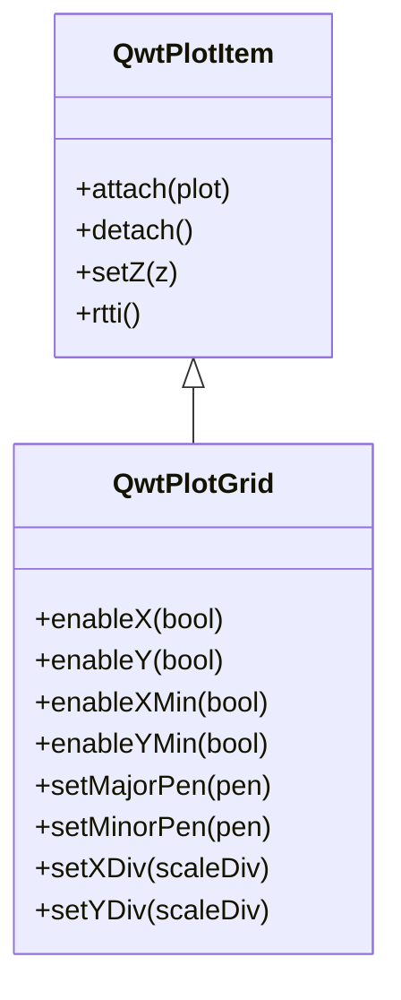

# Grid Lines - QwtPlotGrid

`QwtPlotGrid` is a plot item for drawing coordinate grids on the plot canvas. Grid lines help users read data point coordinates more accurately and are a common auxiliary element in scientific charts.

## Key Features

**Features**

- Major/minor grid lines: Supports both major and minor tick grid lines
- Independent X/Y axis control: Enables or disables horizontal and vertical grids separately
- Style customization: Major and minor grids can have different colors, line widths, and line styles
- Auto-follow ticks: Grid line positions automatically follow axis tick divisions

## Basic Concepts

### Grid Line Types

QwtPlotGrid supports four types of grid lines:

| Type | Description |
|------|-------------|
| X-axis major grid | Vertical lines at X-axis major tick positions |
| X-axis minor grid | Vertical lines at X-axis minor tick positions |
| Y-axis major grid | Horizontal lines at Y-axis major tick positions |
| Y-axis minor grid | Horizontal lines at Y-axis minor tick positions |

### Grid Structure Diagram

```text
    │    │    │    │    │    │  ← Y-axis major grid (solid lines)
    │ ·  │ ·  │ ·  │ ·  │ ·  │  ← Y-axis minor grid (dashed lines)
────┼────┼────┼────┼────┼────┼── ← X-axis major grid (solid lines)
    │ ·  │ ·  │ ·  │ ·  │ ·  │  ← X-axis minor grid (dashed lines)
    │    │    │    │    │    │
   0   2   4   6   8   10  12   ← X-axis ticks
```

### Class Relationships



## Usage

### 1. Basic Usage

Create and add a grid to the plot:

```cpp
#include <QwtPlot>
#include <QwtPlotGrid>

QwtPlot* plot = new QwtPlot();
plot->setCanvasBackground(Qt::white);

// Create grid
QwtPlotGrid* grid = new QwtPlotGrid();

// Enable all grid lines (enabled by default)
grid->enableX(true);      // X-axis major grid
grid->enableY(true);      // Y-axis major grid
grid->enableXMin(false);  // X-axis minor grid (disabled by default)
grid->enableYMin(false);  // Y-axis minor grid (disabled by default)

// Attach to plot
grid->attach(plot);

// Grid automatically follows axis ticks
plot->replot();
```

!!! tip "Grid Layer Order"
    Grids should typically be drawn below other plot items. By default, QwtPlotGrid has a low Z value and is drawn first. Use `grid->setZ(-10)` or similar methods to adjust if needed.

### 2. Grid Line Style Configuration

#### Setting Major Grid Style

```cpp
// Quick setup using color and width
grid->setMajorPen(Qt::gray, 0.0, Qt::DotLine);

// Detailed setup using QPen
QPen majorPen(Qt::darkGray, 1.0, Qt::SolidLine);
grid->setMajorPen(majorPen);

// Get the current major grid pen
const QPen& pen = grid->majorPen();
```

#### Setting Minor Grid Style

Minor grid lines are typically thinner or dashed compared to major grid lines:

```cpp
// Set minor grid style
grid->setMinorPen(Qt::lightGray, 0.5, Qt::DotLine);

// Or using QPen
QPen minorPen(QColor(200, 200, 200), 0.5, Qt::DashLine);
grid->setMinorPen(minorPen);
```

#### Setting All Grid Lines Uniformly

```cpp
// Set both major and minor grid styles at once
grid->setPen(Qt::gray, 0.5, Qt::DotLine);
```

### 3. Enabling/Disabling Specific Grid Lines

```cpp
// Enable horizontal grid lines only
grid->enableX(false);   // Disable vertical grid
grid->enableY(true);    // Enable horizontal grid

// Enable minor tick grid lines
grid->enableXMin(true);
grid->enableYMin(true);

// Check grid line enabled state
bool xEnabled = grid->xEnabled();      // X-axis major grid
bool yEnabled = grid->yEnabled();      // Y-axis major grid
bool xMinEnabled = grid->xMinEnabled(); // X-axis minor grid
bool yMinEnabled = grid->yMinEnabled(); // Y-axis minor grid
```

### 4. Custom Tick Divisions

Grid lines follow axis tick divisions by default. You can also manually specify ticks:

```cpp
#include <QwtScaleDiv>

// Create custom tick division
QwtScaleDiv scaleDiv;
scaleDiv.setInterval(0.0, 100.0);  // Set range

// Set major tick positions
QList<double> majorTicks;
majorTicks << 0 << 25 << 50 << 75 << 100;
scaleDiv.setTicks(QwtScaleDiv::MajorTick, majorTicks);

// Set minor tick positions
QList<double> minorTicks;
for (double v = 0; v <= 100; v += 5) {
    if (!majorTicks.contains(v))
        minorTicks << v;
}
scaleDiv.setTicks(QwtScaleDiv::MinorTick, minorTicks);

// Apply to grid
grid->setXDiv(scaleDiv);  // X-axis uses custom ticks
grid->setYDiv(scaleDiv);  // Y-axis uses custom ticks

// Get current tick divisions
const QwtScaleDiv& xDiv = grid->xScaleDiv();
const QwtScaleDiv& yDiv = grid->yScaleDiv();
```

!!! info "Tick Division Types"
    QwtScaleDiv supports three tick levels:
    - `MajorTick` - Major ticks (numeric labels displayed)
    - `MinorTick` - Minor ticks (small tick marks)
    - `MediumTick` - Medium ticks (between major and minor)

## Complete Example

The following example demonstrates complete grid configuration:

```cpp
#include <QwtPlot>
#include <QwtPlotGrid>
#include <QwtPlotCurve>
#include <QwtLegend>

// Create plot
QwtPlot* plot = new QwtPlot();
plot->setTitle("Grid Configuration Example");
plot->setCanvasBackground(Qt::white);
plot->insertLegend(new QwtLegend());

// Create and configure grid
QwtPlotGrid* grid = new QwtPlotGrid();
grid->enableX(true);       // Enable X-axis major grid
grid->enableY(true);       // Enable Y-axis major grid
grid->enableXMin(true);    // Enable X-axis minor grid
grid->enableYMin(true);    // Enable Y-axis minor grid

// Major grid uses gray solid lines
grid->setMajorPen(QPen(QColor(150, 150, 150), 1.0, Qt::SolidLine));

// Minor grid uses light gray dashed lines
grid->setMinorPen(QPen(QColor(200, 200, 200), 0.5, Qt::DotLine));

grid->attach(plot);

// Add a curve to observe the grid effect
QwtPlotCurve* curve = new QwtPlotCurve("Data");
QPolygonF points;
for (int i = 0; i <= 100; i++) {
    double x = i;
    double y = 50 + 30 * std::sin(i * 0.1);
    points << QPointF(x, y);
}
curve->setSamples(points);
curve->setPen(QPen(Qt::blue, 2.0));
curve->attach(plot);

plot->setAxisScale(QwtAxis::XBottom, 0, 100);
plot->setAxisScale(QwtAxis::YLeft, 0, 100);
plot->replot();
```

## Core Methods Summary

| Method | Description |
|--------|-------------|
| `enableX(bool)` | Enable/disable X-axis major grid |
| `enableY(bool)` | Enable/disable Y-axis major grid |
| `enableXMin(bool)` | Enable/disable X-axis minor grid |
| `enableYMin(bool)` | Enable/disable Y-axis minor grid |
| `xEnabled()` | Check X-axis major grid state |
| `yEnabled()` | Check Y-axis major grid state |
| `xMinEnabled()` | Check X-axis minor grid state |
| `yMinEnabled()` | Check Y-axis minor grid state |
| `setMajorPen()` | Set major grid pen |
| `setMinorPen()` | Set minor grid pen |
| `majorPen()` | Get major grid pen |
| `minorPen()` | Get minor grid pen |
| `setPen()` | Set all grid pens uniformly |
| `setXDiv()` | Set X-axis tick division |
| `setYDiv()` | Set Y-axis tick division |
| `xScaleDiv()` | Get X-axis tick division |
| `yScaleDiv()` | Get Y-axis tick division |

!!! tip "Special Meaning of Zero Line Width"
    In Qt, a line width of 0 means using a "cosmetic line width" (a fast 1-pixel-wide rendering line). For grid lines, using `0.0` as the line width produces the thinnest possible lines.

!!! example "Related Examples"
    - All plotting examples include grids: `examples/2D/` directory
