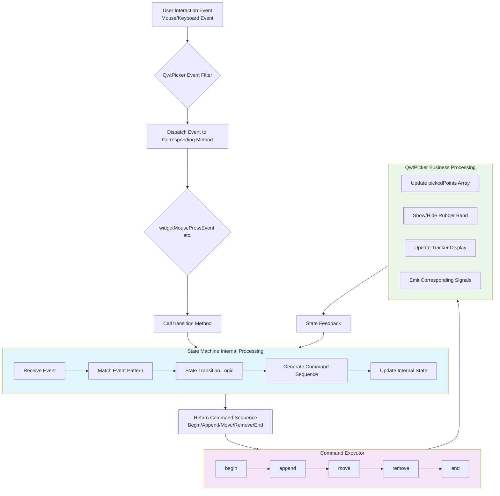
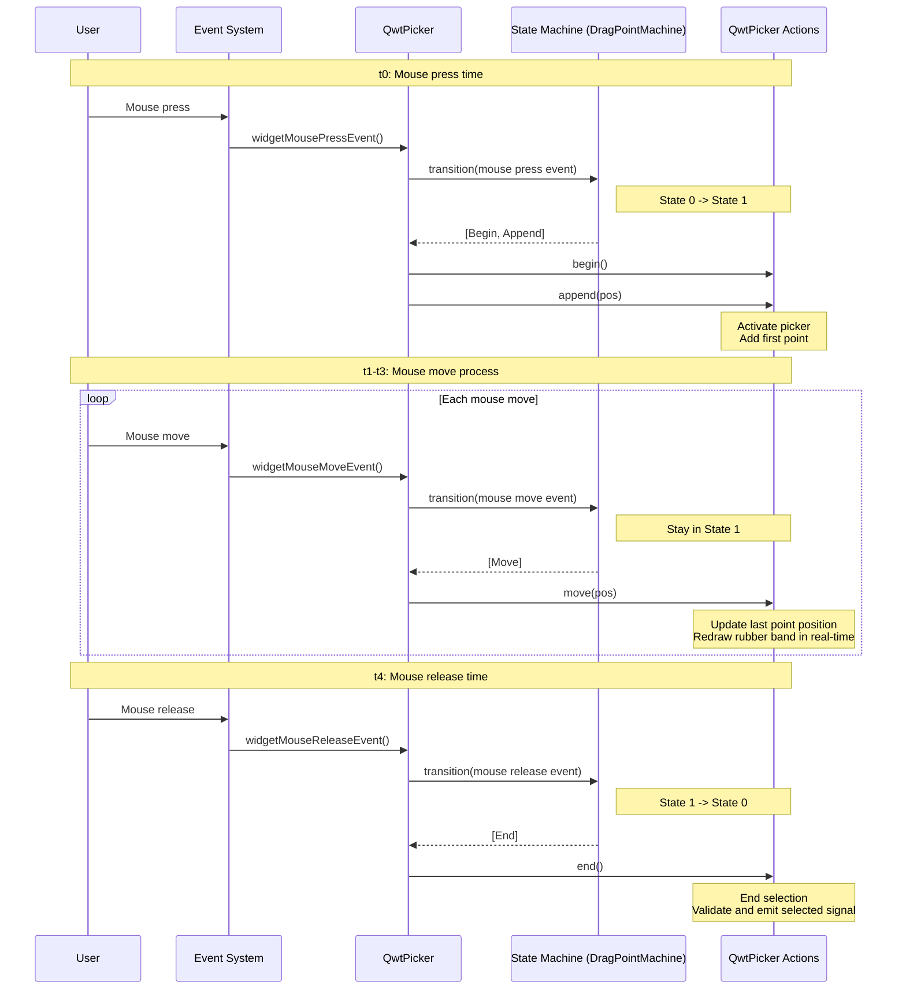
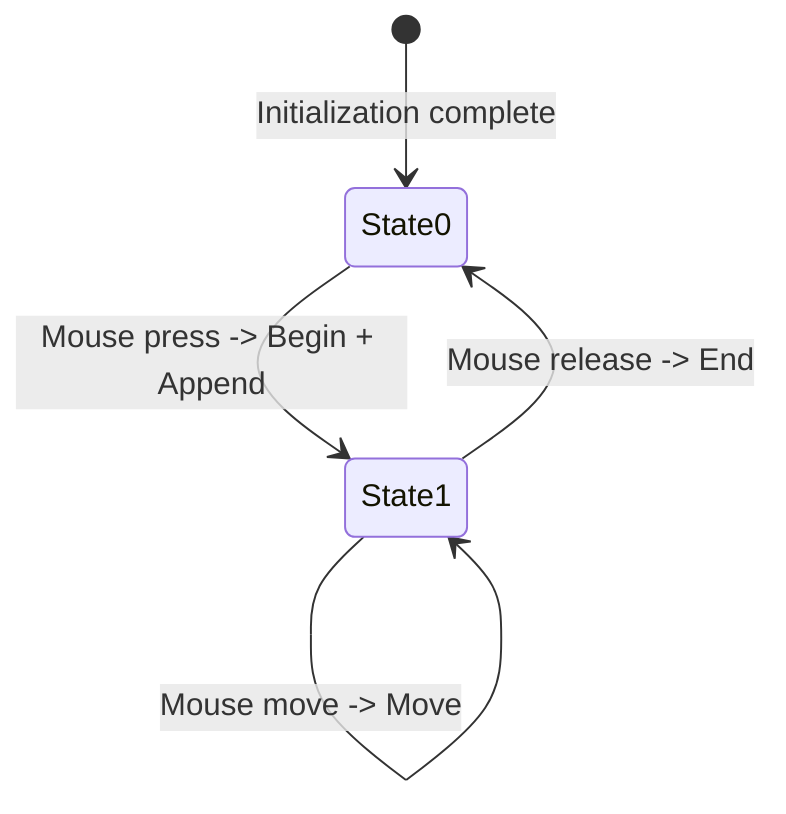
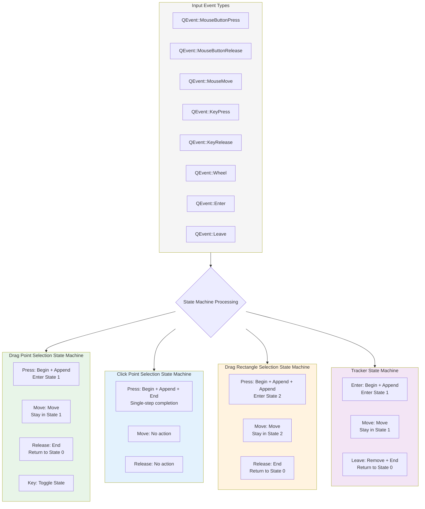
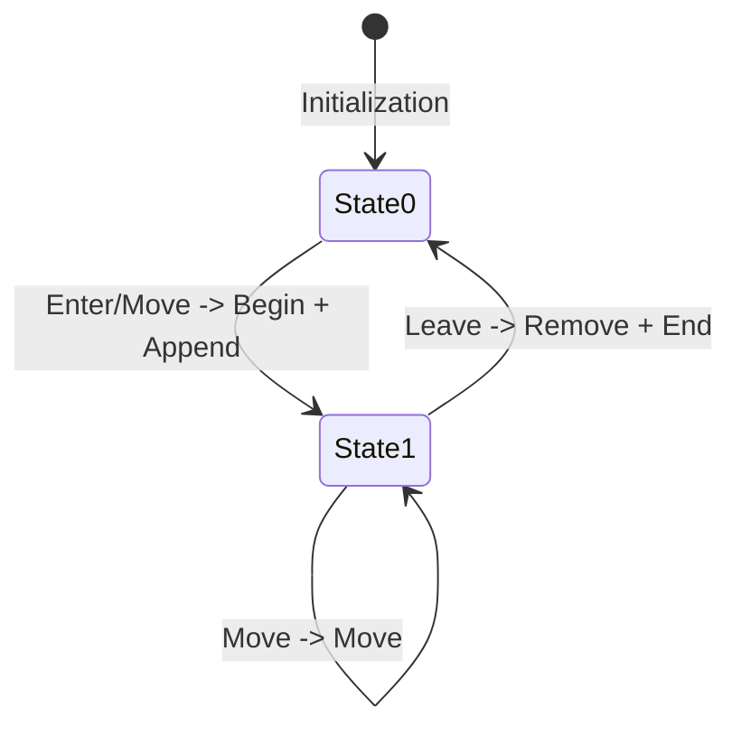
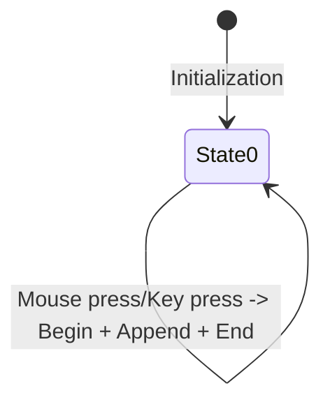
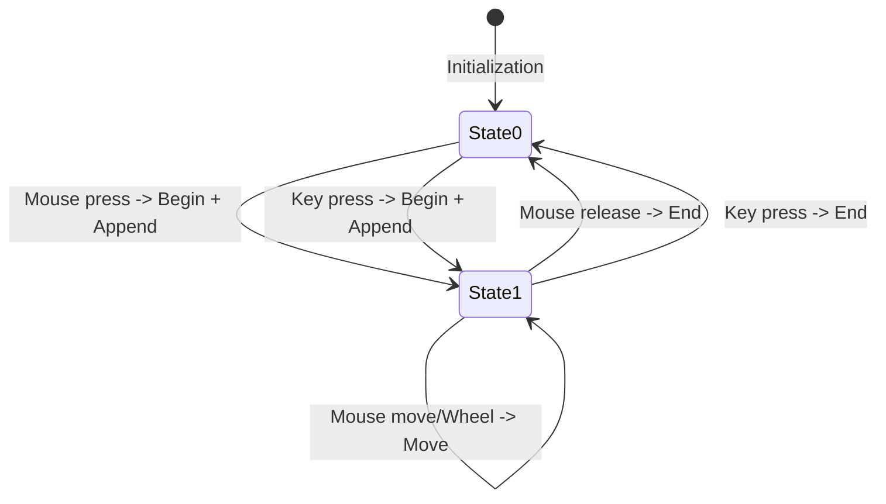
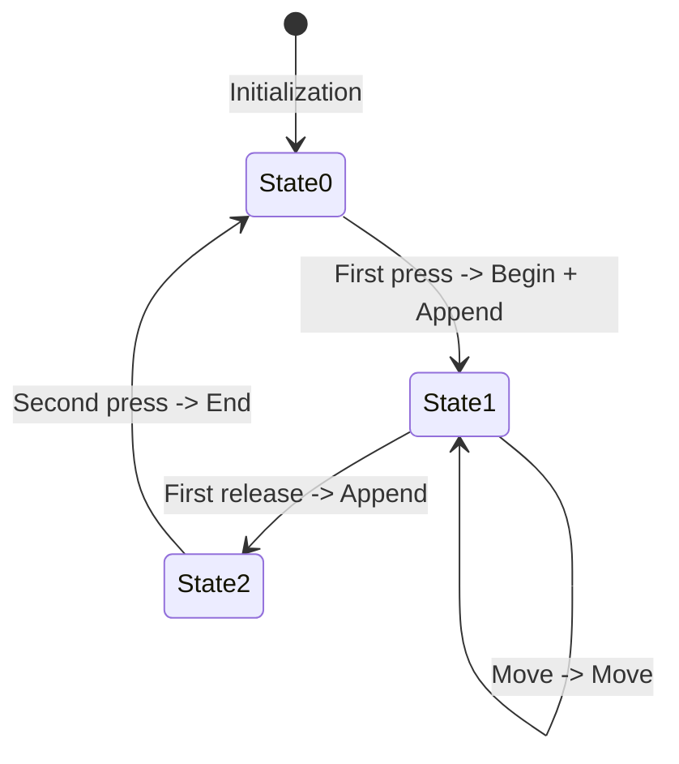
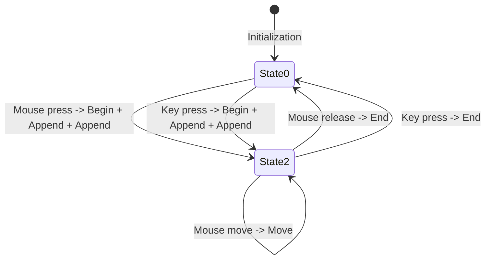
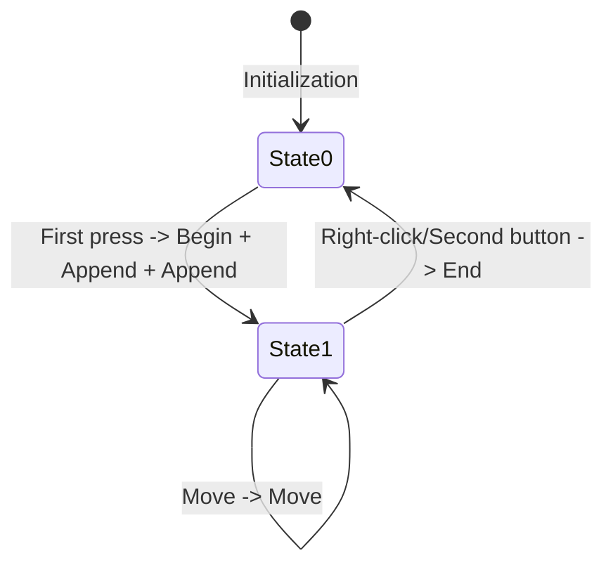

# QwtPicker State Machine

In a graphical interaction system, user actions are often not single instantaneous events but rather **ordered sequences of events**. For example:

- **Drag operation**: Press mouse -> Move mouse -> Release mouse
- **Rectangle selection**: Click first point -> Move mouse -> Click second point
- **Polygon drawing**: Click multiple points -> Right-click to finish

Without a state machine to manage interactions, we would need to maintain numerous `if-else` branches and state variables in event handlers, making the code **complex and difficult to maintain**.

Qwt's `QwtPicker` uses a state machine to manage the interaction process. The corresponding implementation is located in the `qwt_picker_machine.h/cpp` files.

## Advantages of the QwtPicker State Machine

The state machine separates **event sequence processing** from **specific business operations**:

- The state machine is responsible for recognizing complete event sequences
- `QwtPicker` is responsible for executing specific drawing, selection, and other operations

All `QwtPicker` state machines inherit from `QwtPickerMachine` and provide a unified `transition()` interface. `QwtPicker` does not need to know which specific interaction mode is in use.

Adding a new interaction mode only requires inheriting from `QwtPickerMachine` and implementing the state transition logic — no modification of `QwtPicker` core code is needed.

State transitions during the interaction process are managed automatically, avoiding errors caused by manually maintaining state variables.

## How the QwtPicker State Machine Works

The `QwtPicker` state machine mechanism uses a classic **Observer Pattern + State Pattern** combination:

```txt
Event flow: QEvent -> QwtPicker -> QwtPickerMachine -> Commands -> QwtPicker methods
```

`QwtPicker` acts as an event filter installed on the parent widget. It receives events from the parent window, dispatches them to the corresponding `widgetXXXEvent` methods, and invokes the state machine for transitions.

Specific drawing actions are abstracted by `QwtPicker` into the following states:

| State | Description |
| ----- | ----------- |
| begin() | Start selection |
| append() | Add point |
| move() | Move point |
| remove() | Remove point |
| end() | End selection |

The specific operations that compose moving, removing, and adding points are managed by the state machine. For example: clicking a point, moving the mouse, releasing the mouse, and ending the selection. This way, `QwtPicker` does not need to handle both mouse/keyboard events and state transitions simultaneously — this is the advantage of the state machine.

The core of the state machine processing is the `transition` method. The `widgetXXXEvent` methods in `QwtPicker` all call the `transition` method.

```cpp
void QwtPicker::transition(const QEvent* event)
{
    if (!m_data->stateMachine)
        return;

    // State machine analyzes the event and returns a command sequence
    const QList<QwtPickerMachine::Command> commandList =
        m_data->stateMachine->transition(*this, event);

    // Get current mouse position
    QPoint pos;
    switch (event->type()) {
        case QEvent::MouseButtonPress:
        case QEvent::MouseMove:
            pos = static_cast<const QMouseEvent*>(event)->pos();
            break;
        default:
            pos = parentWidget()->mapFromGlobal(QCursor::pos());
    }

    // Execute commands returned by the state machine
    for (int i = 0; i < commandList.count(); i++) {
        switch (commandList[i]) {
            case QwtPickerMachine::Begin:
                begin();        // Start selection
                break;
            case QwtPickerMachine::Append:
                append(pos);    // Add point
                break;
            case QwtPickerMachine::Move:
                move(pos);      // Move point
                break;
            case QwtPickerMachine::Remove:
                remove();       // Remove point
                break;
            case QwtPickerMachine::End:
                end();          // End selection
                break;
        }
    }
}
```

The `transition()` method above is the core of state machine processing. It receives an event and returns a command sequence `commandList`. Each state machine instance inherits from `QwtPickerMachine` and implements the `transition()` method to return the command sequence.

This can be illustrated by the following flowchart:



Taking `QwtPickerDragPointMachine` as an example:

```cpp
QList<QwtPickerMachine::Command> QwtPickerDragPointMachine::transition(
    const QwtEventPattern& eventPattern, const QEvent* event)
{
    QList<QwtPickerMachine::Command> cmdList;

    switch (event->type()) {
        case QEvent::MouseButtonPress:
            if (eventPattern.mouseMatch(QwtEventPattern::MouseSelect1,
                static_cast<const QMouseEvent*>(event))) {
                if (state() == 0) {  // Initial state
                    cmdList += Begin;   // Start selection
                    cmdList += Append;  // Add first point
                    setState(1);       // Enter drag state
                }
            }
            break;

        case QEvent::MouseMove:
        case QEvent::Wheel:
            if (state() != 0)          // If in drag state
                cmdList += Move;       // Continue moving
            break;

        case QEvent::MouseButtonRelease:
            if (state() != 0) {
                cmdList += End;        // End selection
                setState(0);           // Return to initial state
            }
            break;
    }
    return cmdList;
}
```

This is the state machine that handles mouse drag operations. Its sequence diagram can be expressed as follows:



In `QwtPickerMachine`, the parameter of the `setState()` function represents the internal state of the state machine. These state values are defined and maintained by each state machine individually and have no unified meaning. Different state machines use different state values to represent their specific interaction phases.

For example, `QwtPickerDragPointMachine` has state values `0` and `1`, representing the initial state and drag state respectively.

State transitions can be described using a state transition diagram. The state transition diagram for `QwtPickerDragPointMachine` is as follows:



Through the state machine, event types are translated into various states for chart operations, enabling event dispatching.

Complex interaction logic is decomposed into:
- Event recognition (state machine)
- Command execution (QwtPicker)
- Drawing (rubber band, tracker)



## Built-in QwtPicker State Machines

### 1. QwtPickerTrackerMachine (Tracker State Machine)

#### Purpose
Real-time tracking of mouse position with information display, without performing any selection operations.

#### State Transition Process
```cpp
Initial state: 0 (not tracking)
- QEvent::Enter / QEvent::MouseMove -> [Begin, Append] -> State 1
- QEvent::MouseMove (State 1) -> [Move] -> State 1
- QEvent::Leave -> [Remove, End] -> State 0
```

#### State Transition Diagram


#### Use Cases
- Coordinate display
- Mouse hover tooltips
- Real-time value display
- Position feedback for measurement tools

### 2. QwtPickerClickPointMachine (Click Point Selection State Machine)

#### Purpose
Select a point through a single click.

#### State Transition Process
```cpp
Initial state: 0 (waiting for click)
- QEvent::MouseButtonPress (matches MouseSelect1) -> [Begin, Append, End] -> State 0
- QEvent::KeyPress (matches KeySelect1) -> [Begin, Append, End] -> State 0
```

#### State Transition Diagram


#### Use Cases
- Selecting data points
- Marking specific positions
- Simple coordinate selection
- Quick positioning operations

### 3. QwtPickerDragPointMachine (Drag Point Selection State Machine)

#### Purpose
Precisely select a point position through drag operations.

#### State Transition Process
```cpp
Initial state: 0 (waiting to start)
- QEvent::MouseButtonPress (matches MouseSelect1) -> [Begin, Append] -> State 1
- QEvent::MouseMove (State 1) -> [Move] -> State 1
- QEvent::Wheel (State 1) -> [Move] -> State 1
- QEvent::MouseButtonRelease (State 1) -> [End] -> State 0
- QEvent::KeyPress (matches KeySelect1) -> Toggle State 0/1
```

#### State Transition Diagram


#### Use Cases
- **Precise position selection** (e.g., real-time Panner)
- Point selection requiring fine adjustment
- Drag positioning tools
- High-precision measurement

### 4. QwtPickerClickRectMachine (Click Rectangle Selection State Machine)

#### Purpose
Define a rectangular area through two clicks.

#### State Transition Process
```cpp
Initial state: 0 (waiting for first click)
- QEvent::MouseButtonPress (matches MouseSelect1) -> [Begin, Append] -> State 1
- QEvent::MouseMove (State 1) -> [Move] -> State 1
- QEvent::MouseButtonRelease (State 1) -> [Append] -> State 2
- QEvent::MouseButtonPress (State 2) -> [End] -> State 0
- Keyboard events have corresponding multi-step transitions
```

#### State Transition Diagram


#### Use Cases
- Precise rectangular area selection
- Zoom area requiring precise positioning
- Coordinate-aligned rectangle drawing
- Architectural drawing measurement

### 5. QwtPickerDragRectMachine (Drag Rectangle Selection State Machine)

#### Purpose
Quickly select a rectangular area through drag operations.

#### State Transition Process
```cpp
Initial state: 0 (waiting to start)
- QEvent::MouseButtonPress (matches MouseSelect1) -> [Begin, Append, Append] -> State 2
- QEvent::MouseMove (State 2) -> [Move] -> State 2
- QEvent::MouseButtonRelease (State 2) -> [End] -> State 0
- QEvent::KeyPress (matches KeySelect1) -> Toggle State 0/2
```

#### State Transition Diagram


#### Use Cases
- Quick rectangular area selection
- Interactive zoom
- Area screenshot tools
- Batch selection operations

### 6. QwtPickerDragLineMachine (Drag Line Selection State Machine)

#### Purpose
Select a line segment through drag operations.

#### State Transition Process
```cpp
Initial state: 0 (waiting to start)
- QEvent::MouseButtonPress (matches MouseSelect1) -> [Begin, Append, Append] -> State 1
- QEvent::MouseMove (State 1) -> [Move] -> State 1
- QEvent::MouseButtonRelease (State 1) -> [End] -> State 0
- QEvent::KeyPress (matches KeySelect1) -> Toggle State 0/1
```

#### State Transition Diagram


#### Use Cases
- Distance measurement tools
- Line segment drawing
- Direction indicators
- Angle measurement

### 7. QwtPickerPolygonMachine (Polygon Selection State Machine)

### Purpose
Create a polygon area through multiple clicks.

#### State Transition Process
```cpp
Initial state: 0 (not started)
- QEvent::MouseButtonPress (matches MouseSelect1) -> [Begin, Append, Append] -> State 1
- QEvent::MouseButtonPress (State 1, matches MouseSelect1) -> [Append] -> State 1
- QEvent::MouseMove (State 1) -> [Move] -> State 1
- QEvent::MouseButtonPress (matches MouseSelect2) -> [End] -> State 0
- Keyboard events have corresponding polygon drawing logic
```

#### State Transition Diagram


#### Use Cases
- Complex area selection
- Polygon drawing tools
- Custom shape annotations
- Geographic information system area selection

## Summary

The `QwtPicker` state machine mechanism provides an **elegant and powerful** way to handle complex user interaction sequences. By choosing an appropriate predefined state machine, we can easily implement various interaction modes without writing complex event handling logic.

Understanding how the state machine works not only helps in correctly using QwtPicker, but also enables rapid implementation of custom state machines when custom interactions are needed.
