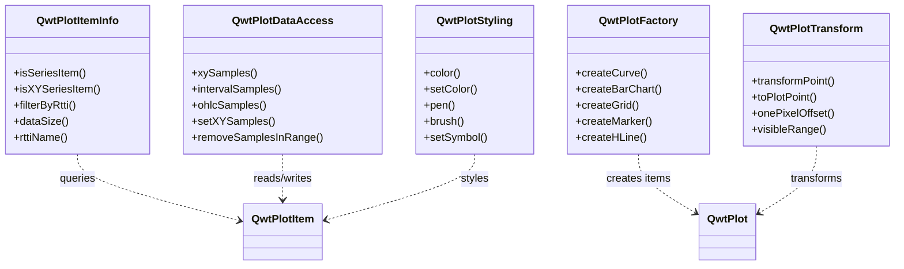

# Utility Classes - QwtPlot Convenience API

Qwt 7 provides a set of utility classes in the `Qwt` namespace that simplify common plotting operations. These classes are organized by single-responsibility, so users can include only what they need.

## Utility Class Overview



| Class | Responsibility | Header |
|-------|---------------|--------|
| `QwtPlotItemInfo` | Type queries and filtering | `<QwtPlotItemInfo>` |
| `QwtPlotDataAccess` | Sample data extraction and setting | `<QwtPlotDataAccess>` |
| `QwtPlotFactory` | Factory methods for creating plot items | `<QwtPlotFactory>` |
| `QwtPlotTransform` | Coordinate transformations | `<QwtPlotTransform>` |
| `QwtPlotStyling` | Visual style read/write | `<QwtPlotStyling>` |

## QwtPlotFactory — Factory Methods

`QwtPlotFactory` provides one-line methods to create and attach plot items to a `QwtPlot`, covering all common item types.

### Creating Curves

```cpp
#include <QwtPlotFactory>
#include <QwtPlot>

QwtPlot* plot = new QwtPlot();

// Create a curve from QPointF data
QVector<QPointF> data = {{0, 1}, {1, 3}, {2, 2}, {3, 5}};
QwtPlotCurve* curve = QwtPlotFactory::createCurve(plot, "Temperature", data);

// Create a curve from separate x and y vectors
QVector<double> x = {0, 1, 2, 3};
QVector<double> y = {1, 3, 2, 5};
QwtPlotCurve* curve2 = QwtPlotFactory::createCurve(plot, "Pressure", x, y);

// Y-only data (x is auto-generated as 0, 1, 2, ...)
QVector<double> yOnly = {10, 20, 15, 25, 30};
QwtPlotCurve* curve3 = QwtPlotFactory::createCurve(plot, "Index Curve", yOnly);
```

The factory methods handle the entire workflow: create → set data → bind axes → attach. The returned pointer can be further customized.

### Creating Bar Charts and Histograms

```cpp
// Bar chart
QVector<double> values = {10, 25, 30, 15, 40};
QwtPlotBarChart* bar = QwtPlotFactory::createBarChart(plot, "Sales", values);

// Histogram
QVector<QwtIntervalSample> histData;
histData << QwtIntervalSample(5, 0, 10)
         << QwtIntervalSample(15, 10, 20)
         << QwtIntervalSample(25, 20, 30);
QwtPlotHistogram* hist = QwtPlotFactory::createHistogram(plot, "Distribution", histData);
```

### Creating Trading Curves (Candlestick/OHLC)

```cpp
QVector<QwtOHLCSample> ohlc;
ohlc << QwtOHLCSample(1, 100, 110, 95, 105);  // time, open, high, low, close
ohlc << QwtOHLCSample(2, 105, 115, 100, 108);
ohlc << QwtOHLCSample(3, 108, 120, 102, 118);

QwtPlotTradingCurve* kline = QwtPlotFactory::createTradingCurve(plot, "Stock", ohlc);
```

### Creating Box Charts and Vector Fields

```cpp
// Box chart
QVector<QwtBoxSample> boxData;
boxData << QwtBoxSample(1, 10, 25, 50, 75, 90);  // pos, min, q1, median, q3, max
QwtPlotBoxChart* box = QwtPlotFactory::createBoxChart(plot, "Statistics", boxData);

// Vector field
QVector<QwtVectorFieldSample> vf;
vf << QwtVectorFieldSample(0, 0, 1, 0)
   << QwtVectorFieldSample(1, 0, 0, 1);
QwtPlotVectorField* field = QwtPlotFactory::createVectorField(plot, "Flow", vf);
```

### Creating Decorator Items

```cpp
// Add grid
QwtPlotGrid* grid = QwtPlotFactory::createGrid(plot, true);  // true = enable minor grid

// Add horizontal reference line
QwtPlotMarker* hline = QwtPlotFactory::createHLine(plot, 50.0);

// Add vertical reference line
QwtPlotMarker* vline = QwtPlotFactory::createVLine(plot, 2.5);

// Add point marker
QwtPlotMarker* marker = QwtPlotFactory::createMarker(plot, QPointF(1, 3), "Peak");

// Add highlighted zone
QwtPlotZoneItem* zone = QwtPlotFactory::createZone(
    plot, QwtInterval(2, 4), Qt::Vertical, QBrush(QColor(255, 0, 0, 30)));

// Add in-canvas legend
QwtPlotLegendItem* legend = QwtPlotFactory::createLegend(plot);

// Add arrow marker
QwtPlotArrowMarker* arrow = QwtPlotFactory::createArrowMarker(
    plot, QPointF(0, 0), QPointF(3, 5));
```

!!! tip "Complete Factory Method List"
    `QwtPlotFactory` covers all **9 data plot items** and **7 decorator items**. See the API documentation for the full list.

## QwtPlotItemInfo — Type Queries

`QwtPlotItemInfo` is used to query item types and filter items. It **never modifies** any plot or item state.

### Type Checks

```cpp
#include <QwtPlotItemInfo>

QwtPlotItem* item = ...;

// Is it a series item?
bool isSeries = QwtPlotItemInfo::isSeriesItem(item);

// Is it an XY data item (curve, bar chart)?
bool isXY = QwtPlotItemInfo::isXYSeriesItem(item);

// Is it an interval data item (interval curve, histogram)?
bool isInterval = QwtPlotItemInfo::isIntervalSeriesItem(item);

// Is it a decorator item (grid, marker, etc.)?
bool isDeco = QwtPlotItemInfo::isDecoratorItem(item);
```

### Filtering by Type

```cpp
// Get all curves from a plot
QwtPlotItemList curves = QwtPlotItemInfo::filterByRtti(
    plot, QwtPlotItem::Rtti_PlotCurve);

// Filter by multiple types
QSet<int> types = {
    QwtPlotItem::Rtti_PlotCurve,
    QwtPlotItem::Rtti_PlotBarChart
};
QwtPlotItemList dataItems = QwtPlotItemInfo::filterByRtti(plot, types);

// Get all series items
QwtPlotItemList allSeries = QwtPlotItemInfo::seriesItems(plot);

// Get all visible items
QwtPlotItemList visible = QwtPlotItemInfo::visibleItems(plot);
```

### Getting Basic Information

```cpp
// Get number of data points
int count = QwtPlotItemInfo::dataSize(item);  // -1 if not a data item

// Get data bounding rectangle
QRectF rect = QwtPlotItemInfo::dataRect(item);

// Get human-readable rtti name
QString name = QwtPlotItemInfo::rttiName(item->rtti());  // "PlotCurve"
```

## QwtPlotDataAccess — Data Read/Write

`QwtPlotDataAccess` dispatches through rtti to extract or set sample data from any `QwtPlotItem`, covering all 7 data types.

### Extracting XY Data

```cpp
#include <QwtPlotDataAccess>

QwtPlotItem* item = ...;  // Could be QwtPlotCurve or QwtPlotBarChart

// Extract as QPointF vector
QVector<QPointF> pts = QwtPlotDataAccess::xySamples(item);

// Extract into separate x and y vectors
QVector<double> x, y;
QwtPlotDataAccess::xySamples(item, x, y);

if (!pts.isEmpty()) {
    qDebug() << "First point:" << pts.first();
    qDebug() << "Total samples:" << pts.size();
}
```

### Extracting Other Data Types

```cpp
// Interval data (QwtPlotIntervalCurve, QwtPlotHistogram)
QVector<QwtIntervalSample> intervals = QwtPlotDataAccess::intervalSamples(item);

// OHLC data (QwtPlotTradingCurve)
QVector<QwtOHLCSample> ohlc = QwtPlotDataAccess::ohlcSamples(item);

// 3D data (QwtPlotSpectroCurve)
QVector<QwtPoint3D> xyz = QwtPlotDataAccess::xyzSamples(item);

// Multi-bar data (QwtPlotMultiBarChart)
QVector<QwtSetSample> sets = QwtPlotDataAccess::setSamples(item);

// Vector field data (QwtPlotVectorField)
QVector<QwtVectorFieldSample> vf = QwtPlotDataAccess::vectorFieldSamples(item);

// Box chart data (QwtPlotBoxChart)
QVector<QwtBoxSample> boxes = QwtPlotDataAccess::boxSamples(item);
```

### Setting Data

```cpp
// Set XY data
QVector<QPointF> newData = {{0, 5}, {1, 8}, {2, 3}};
bool ok = QwtPlotDataAccess::setXYSamples(item, newData);

// Set separate x, y data
QVector<double> x = {0, 1, 2};
QVector<double> y = {5, 8, 3};
bool ok2 = QwtPlotDataAccess::setXYSamples(item, x, y);

// Set OHLC data
QVector<QwtOHLCSample> ohlcData;
ohlcData << QwtOHLCSample(1, 100, 110, 95, 105);
QwtPlotDataAccess::setOhlcSamples(item, ohlcData);
```

### Template Extraction

When the concrete type is known, use the template methods directly:

```cpp
#include <QwtSeriesStore>

const auto* store = static_cast<const QwtSeriesStore<QPointF>*>(curve);

// Extract all data
QVector<QPointF> all = QwtPlotDataAccess::samples(store);

// Extract a sub-range
QVector<QPointF> subset = QwtPlotDataAccess::samples(store, 10, 50);
```

### Range-Based Extraction and Removal

```cpp
// Extract samples within a rectangular range
QRectF range(1.0, 0.0, 3.0, 5.0);
QVector<QPointF> inRange = QwtPlotDataAccess::xySamplesInRange(item, range);

// Extract samples within a path range
QPainterPath path;
path.addEllipse(QPointF(2, 3), 1, 1);
QVector<QPointF> inPath = QwtPlotDataAccess::xySamplesInRange(item, path);

// Remove samples within a rectangular range
int removed = QwtPlotDataAccess::removeSamplesInRange(item, range);
qDebug() << "Removed" << removed << "samples";
```

## QwtPlotTransform — Coordinate Transformations

`QwtPlotTransform` provides conversions between coordinate systems. All methods are read-only and **never modify** plot state.

### Cross-Axis Transformation

When a plot uses parasite axes (multiple axes), the same screen position has different data coordinates in different axis systems:

```cpp
#include <QwtPlotTransform>

QwtPlot* plot = ...;
QPointF point(100, 50);  // Data coordinates in XBottom/YLeft axis system

// Transform to XTop/YRight axis system (same screen position)
QPointF converted = QwtPlotTransform::transformPoint(
    plot, point,
    QwtAxis::XBottom, QwtAxis::YLeft,   // Source axes
    QwtAxis::XTop, QwtAxis::YRight      // Target axes
);
```

### Screen/Data Coordinate Conversion

```cpp
// Convert mouse click to data coordinates (common in pick operations)
QPointF mousePos(150, 200);
QPointF dataPoint = QwtPlotTransform::toPlotPoint(plot, mousePos);

// Convert data coordinates to screen position
QPointF screenPos = QwtPlotTransform::toScreenPoint(plot, dataPoint);
```

### Pixel Offset

```cpp
// Compute the data-coordinate offset for 1 pixel
QPointF offset = QwtPlotTransform::onePixelOffset(plot);
qDebug() << "1px =" << offset.x() << "(x)," << offset.y() << "(y)";
```

This is useful for implementing drag, nudge, or other pixel-precision interactions.

### Visible Range

```cpp
// Get the currently visible data range
QRectF visible = QwtPlotTransform::visibleRange(plot);
qDebug() << "Visible X:" << visible.left() << "~" << visible.right();
qDebug() << "Visible Y:" << visible.top() << "~" << visible.bottom();

// Get the union of all data item bounding rectangles
QRectF totalRange = QwtPlotTransform::totalDataRange(plot);

// Only include visible items
QRectF visibleRange = QwtPlotTransform::totalDataRange(plot, true);
```

## QwtPlotStyling — Style Operations

`QwtPlotStyling` dispatches through rtti to uniformly read/write colors, pens, brushes, and symbols on any plot item.

### Unified Color Read/Write

```cpp
#include <QwtPlotStyling>

QwtPlotItem* item = ...;

// Get color (auto-detects type)
QColor c = QwtPlotStyling::color(item);
if (c.isValid()) {
    qDebug() << "Current color:" << c.name();
}

// Set color (auto-dispatches to pen or brush)
QwtPlotStyling::setColor(item, Qt::red);
```

Color sources by item type:

| Item Type | Color Source |
|-----------|-------------|
| QwtPlotCurve | `pen().color()` |
| QwtPlotBarChart | `brush().color()` |
| QwtPlotHistogram | `brush().color()` |
| QwtPlotGrid | `majorPen().color()` |
| QwtPlotMarker | `linePen().color()` |
| QwtPlotTradingCurve | `symbolPen().color()` |

### Pen and Brush

```cpp
// Get pen and brush
QPen p = QwtPlotStyling::pen(item);
QBrush b = QwtPlotStyling::brush(item);

// Set pen
QwtPlotStyling::setPen(item, QPen(Qt::blue, 2, Qt::DashLine));

// Set brush
QwtPlotStyling::setBrush(item, QBrush(QColor(255, 0, 0, 50)));
```

### Curve Symbols

```cpp
QwtPlotCurve* curve = ...;

// Set symbol (color follows curve color)
QwtPlotStyling::setSymbol(curve, QwtSymbol::Ellipse, QSize(8, 8));

// Set symbol (specify color)
QwtPlotStyling::setSymbol(curve, QwtSymbol::Diamond, Qt::green, QSize(10, 10));

// Set line style
QwtPlotStyling::setLineStyle(curve, Qt::DashLine, 1.5);
```

### Recommendations and Force Replot

```cpp
// Recommend pen width based on data density
qreal width = QwtPlotStyling::recommendPenWidth(curve->dataSize());

// Force an immediate replot (works even when autoReplot is disabled)
QwtPlotStyling::forceReplot(plot);
```

## Complete Example

The following example demonstrates combining multiple utility classes for a common plotting workflow:

```cpp
#include <QwtPlot>
#include <QwtPlotFactory>
#include <QwtPlotDataAccess>
#include <QwtPlotStyling>
#include <QwtPlotTransform>

void setupPlot(QwtPlot* plot)
{
    // 1. Create plot items using factory methods
    QVector<double> x = {1, 2, 3, 4, 5};
    QVector<double> y = {10, 25, 15, 30, 20};
    auto* curve = QwtPlotFactory::createCurve(plot, "Temperature", x, y);

    QwtPlotFactory::createBarChart(plot, "Production", {100, 200, 150, 300, 250});
    QwtPlotFactory::createGrid(plot);
    QwtPlotFactory::createHLine(plot, 20.0, QPen(Qt::red, 1, Qt::DashLine));

    // 2. Apply styles using QwtPlotStyling
    QwtPlotStyling::setColor(curve, Qt::blue);
    QwtPlotStyling::setSymbol(curve, QwtSymbol::Ellipse, Qt::cyan, QSize(6, 6));

    // 3. Extract data for analysis using QwtPlotDataAccess
    QVector<QPointF> data = QwtPlotDataAccess::xySamples(curve);
    double maxVal = 0;
    for (const auto& p : data)
        maxVal = qMax(maxVal, p.y());

    // 4. Add marker at the maximum value
    auto maxIt = std::max_element(data.begin(), data.end(),
        [](const QPointF& a, const QPointF& b) { return a.y() < b.y(); });
    if (maxIt != data.end()) {
        QwtPlotFactory::createMarker(plot, *maxIt,
            QString("Max: %1").arg(maxIt->y()));
    }

    // 5. Get visible range using QwtPlotTransform
    QRectF visible = QwtPlotTransform::visibleRange(plot);
    qDebug() << "Visible range:" << visible;

    plot->replot();
}
```

## Supported Plot Item Types

The utility classes cover all plot item types in Qwt 7:

### Data Plot Items

| Plot Item | Data Type | Factory Method | Data Read/Write |
|-----------|-----------|---------------|-----------------|
| `QwtPlotCurve` | `QPointF` | `createCurve()` | `xySamples()` / `setXYSamples()` |
| `QwtPlotBarChart` | `QPointF` | `createBarChart()` | `xySamples()` / `setXYSamples()` |
| `QwtPlotMultiBarChart` | `QwtSetSample` | `createMultiBarChart()` | `setSamples()` / `setSetSamples()` |
| `QwtPlotHistogram` | `QwtIntervalSample` | `createHistogram()` | `intervalSamples()` / `setIntervalSamples()` |
| `QwtPlotIntervalCurve` | `QwtIntervalSample` | `createIntervalCurve()` | `intervalSamples()` / `setIntervalSamples()` |
| `QwtPlotTradingCurve` | `QwtOHLCSample` | `createTradingCurve()` | `ohlcSamples()` / `setOhlcSamples()` |
| `QwtPlotSpectroCurve` | `QwtPoint3D` | `createSpectroCurve()` | `xyzSamples()` / `setXyzSamples()` |
| `QwtPlotVectorField` | `QwtVectorFieldSample` | `createVectorField()` | `vectorFieldSamples()` / `setVectorFieldSamples()` |
| `QwtPlotBoxChart` | `QwtBoxSample` | `createBoxChart()` | `boxSamples()` / `setBoxSamples()` |

### Decorator Items

| Plot Item | Factory Method |
|-----------|---------------|
| `QwtPlotGrid` | `createGrid()` |
| `QwtPlotMarker` | `createMarker()` / `createHLine()` / `createVLine()` |
| `QwtPlotZoneItem` | `createZone()` |
| `QwtPlotArrowMarker` | `createArrowMarker()` |
| `QwtPlotGraphicItem` | `createGraphic()` |
| `QwtPlotTextLabel` | `createTextLabel()` |
| `QwtPlotLegendItem` | `createLegend()` |
| `QwtPlotScaleItem` | `createScaleItem()` |

!!! example "Related Examples"
    See the examples under `examples/2D/` for practical usage of these utility classes in context.

## Higher-Level Wrapper: QwtPyPlot

If you are familiar with matplotlib's interface style, you can use [QwtPyPlot](pyplot-api.md) for a more concise plotting experience. `QwtPyPlot` uses the utility classes described above internally, but provides a one-stop interface similar to `plt.plot()`:

```cpp
#include <QwtPyPlot>

QwtPlot* plot = new QwtPlot;
QwtPyPlot plt(plot);

plt.plot(x, y, "r-o", "Temperature");  // One line does it all
plt.setTitle("My Plot");
plt.grid(true);
plt.legend();
plot->show();
```
