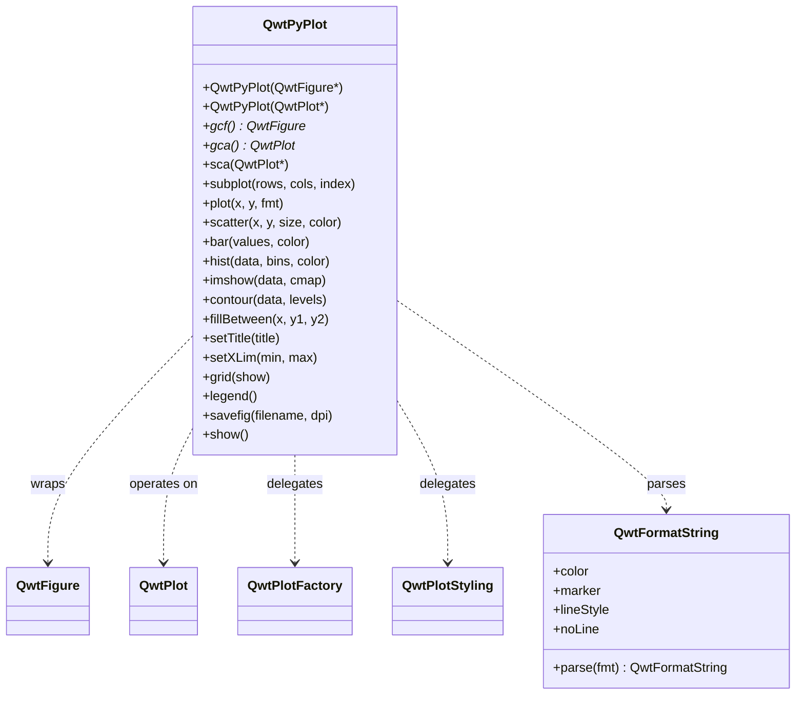

# QwtPyPlot — Matplotlib-Style Plotting Interface

`QwtPyPlot` is a high-level wrapper class in Qwt 7 that provides a `pyplot`-like plotting interface for C++ users familiar with matplotlib. It delegates internally to `QwtFigure`, `QwtPlot`, `QwtPlotFactory`, `QwtPlotStyling`, and other existing classes without modifying any underlying implementation.

## Overview



| Class | Responsibility | Header |
|-------|---------------|--------|
| `QwtPyPlot` | Matplotlib pyplot-style plotting interface | `<QwtPyPlot>` |
| `QwtFormatString` | Matplotlib format string parser | `<QwtPyPlot>` |

## Core Concepts

`QwtPyPlot` maintains a "current axes" pointer (similar to matplotlib's `gca()`), so all plotting methods operate on the current axes:

| matplotlib Concept | QwtPyPlot / Qwt Equivalent |
|-------------------|---------------------------|
| `matplotlib.figure.Figure` | `QwtFigure` |
| `matplotlib.axes.Axes` | `QwtPlot` |
| `pyplot` module | `QwtPyPlot` class |
| `plt.gcf()` / `plt.gca()` | `QwtPyPlot::gcf()` / `gca()` |
| `plt.subplot()` | `QwtPyPlot::subplot(rows, cols, index)` |
| `fig.savefig()` | `QwtPyPlot::savefig(filename, dpi)` |

## Two Usage Modes

### Mode 1: QwtFigure Multi-Subplot Mode

```cpp
#include <QwtFigure>
#include <QwtPyPlot>

QwtFigure* fig = new QwtFigure;
QwtPyPlot plt(fig);

// Create subplot 1 in a 2×1 grid
plt.subplot(2, 1, 1);
plt.plot(x, y, "r-o", "Temperature");
plt.setTitle("Sensor Data");
plt.grid(true);
plt.legend();

// Create subplot 2
plt.subplot(2, 1, 2);
plt.bar({10, 20, 30, 40}, "b", "Sales");
plt.setYLabel("Value");

plt.savefig("output.png", 300);
fig->show();
```

### Mode 2: QwtPlot Single-Plot Mode

```cpp
#include <QwtPlot>
#include <QwtPyPlot>

QwtPlot* plot = new QwtPlot;
QwtPyPlot plt(plot);

plt.plot(x, y, "b--");
plt.scatter(x2, y2, 50, "r");
plt.setTitle("Quick Plot");

plot->show();
```

## Format Strings

`QwtFormatString` parses matplotlib-style format strings, supporting combinations of color, marker, and line style:

```
Format: [color][line_style][marker]
Examples: "r-o"  → red solid line + circle marker
          "b--"  → blue dashed line
          "g^:"  → green dotted line + upward triangle
          "ko"   → black circles (no line)
```

### Color Characters

| Char | Color | Char | Color |
|------|-------|------|-------|
| `b` | Blue | `m` | Magenta |
| `g` | Green | `y` | Yellow |
| `r` | Red | `k` | Black |
| `c` | Cyan | `w` | White |

### Marker Characters

| Char | Marker | Char | Marker |
|------|--------|------|--------|
| `o` | Circle | `x` | Cross (×) |
| `s` | Square | `+` | Plus (+) |
| `^` | Triangle up | `*` | Star |
| `v` | Triangle down | `.` | Dot |
| `D` | Diamond | | |

### Line Styles

| Symbol | Style |
|--------|-------|
| `-` | Solid |
| `--` | Dashed |
| `-.` | Dash-dot |
| `:` | Dotted |

!!! tip "Matplotlib Behavior"
    When only a marker is specified without a line style (e.g. `"ro"`), the line is automatically hidden, showing only marker points. This matches matplotlib behavior.

## Plotting Methods

### Basic Plots

#### plot() — Line Plot

```cpp
// y-only (x auto-generated as 0, 1, 2, ...)
plt.plot({1, 4, 2, 5}, "r-o");

// x-y data
plt.plot(x, y, "b--", "Label");

// QPointF data
QVector<QPointF> data = {{0,1}, {1,3}, {2,2}};
plt.plot(data, "g^:");
```

#### scatter() — Scatter Plot

```cpp
// Parameters: x, y, marker size, color, label
plt.scatter(x1, y1, 30, "r", "Group A");
plt.scatter(x2, y2, 50, "b", "Group B");
```

#### bar() — Bar Chart

```cpp
// y-only values (x = index)
plt.bar({10, 20, 30, 40}, "c");

// x-y data with width
plt.bar(x, values, 0.8, "b", "Sales");
```

#### hist() — Histogram

```cpp
// Automatic binning (default 10 bins)
plt.hist(data, 20, "m", "Distribution");
```

#### imshow() — Heatmap

```cpp
// 2D matrix data with various colormaps
QVector<QVector<double>> matrix = ...;
plt.imshow(matrix, "viridis");
```

Supported colormaps: `"viridis"`, `"hot"`, `"cool"`, `"jet"`, `"gray"`

#### contour() — Contour Lines

```cpp
// Auto-generate 10 contour levels
plt.contour(data);

// Custom contour levels
plt.contour(data, {0.2, 0.4, 0.6, 0.8}, "hot");
```

#### fillBetween() — Filled Area

```cpp
// Parameters: x, y1, y2, color, alpha
plt.fillBetween(x, yLower, yUpper, "blue", 0.3);
```

#### errorbar() — Error Bars

```cpp
plt.errorbar(x, y, yerr, "r-", "Measurement");
```

#### quiver() — Vector Field

```cpp
plt.quiver(x, y, u, v, "k");
```

#### candlestick() — OHLC Chart

```cpp
QVector<QwtOHLCSample> ohlcData = ...;
plt.candlestick(ohlcData, "Stock");
```

### Decorative Elements

| Method | Description | Example |
|--------|-------------|---------|
| `grid(show, minor)` | Grid lines | `plt.grid(true, true)` |
| `axhline(y, fmt)` | Horizontal reference line | `plt.axhline(0, "k--")` |
| `axvline(x, fmt)` | Vertical reference line | `plt.axvline(5, "r:")` |
| `axhspan(y1, y2, color, alpha)` | Horizontal zone highlight | `plt.axhspan(2, 4, "yellow", 0.2)` |
| `axvspan(x1, x2, color, alpha)` | Vertical zone highlight | `plt.axvspan(3, 7, "blue", 0.1)` |
| `legend(loc)` | Legend | `plt.legend()` |
| `annotate(text, xy, xytext)` | Arrow annotation | `plt.annotate("Peak", peak, label)` |

## Axis Configuration

### Titles and Labels

```cpp
plt.setTitle("My Plot");
plt.setXLabel("Time (s)");
plt.setYLabel("Amplitude");
```

### Axis Limits and Scale

```cpp
// Set axis limits
plt.setXLim(0, 100);
plt.setYLim(-5, 5);

// Logarithmic scale
plt.setXScale("log");
plt.setYScale("log");

// Back to linear
plt.setXScale("linear");
```

### Ticks

```cpp
// Custom tick positions
plt.setXTicks({0, 2.5, 5, 7.5, 10});
plt.setYTicks({-1, 0, 1});

// Invert axis direction
plt.invertXAxis();
plt.invertYAxis();
```

## Figure Operations

### Subplot Layout

```cpp
QwtFigure* fig = new QwtFigure;
QwtPyPlot plt(fig);

// subplot(rows, cols, index) — 1-based index
plt.subplot(2, 2, 1);  // Row 1, Column 1
plt.subplot(2, 2, 2);  // Row 1, Column 2
plt.subplot(2, 1, 2);  // Row 2, spans 2 columns
```

### Twin Axes (Dual Y/X)

```cpp
plt.subplot(1, 1, 1);
plt.plot(x, temp, "r-", "Temperature");
plt.setYLabel("°C");

// Create twin Y-axis on right
QwtPlot* ax2 = plt.twinx();
plt.sca(ax2);  // Switch to new axes
plt.plot(x, humidity, "b--", "Humidity");
plt.setYLabel("%");
```

### Tight Layout

```cpp
plt.tightLayout();  // Align Y-axes across all subplots
```

## Appearance

```cpp
// Set figure background color
plt.setFaceColor("lightgray");

// Set canvas background color
plt.setAxesColor("white");
```

## Output and Interaction

### Save to File

```cpp
plt.savefig("output.png");        // Default DPI
plt.savefig("output.png", 300);   // 300 DPI
```

### Show Window

```cpp
plt.show();
```

### Interaction Controls

```cpp
plt.enablePan(true);   // Enable drag panning
plt.enableZoom(true);  // Enable rubber-band zoom
```

## Complete Example

The following example demonstrates a multi-subplot application with line plots, scatter plots, and histograms:

```cpp
#include <QApplication>
#include <QwtFigure>
#include <QwtPyPlot>
#include <cmath>

int main(int argc, char* argv[])
{
    QApplication app(argc, argv);

    QwtFigure* fig = new QwtFigure;
    QwtPyPlot plt(fig);

    // Generate data
    QVector<double> x, sinY, cosY;
    for (int i = 0; i <= 100; i++) {
        double t = i * 0.1;
        x.append(t);
        sinY.append(std::sin(t));
        cosY.append(std::cos(t));
    }

    // Subplot 1: Line plot
    plt.subplot(2, 1, 1);
    plt.plot(x, sinY, "r-", "sin(x)");
    plt.plot(x, cosY, "b--", "cos(x)");
    plt.setTitle("Trigonometric Functions");
    plt.grid(true);
    plt.legend();

    // Subplot 2: Histogram
    plt.subplot(2, 1, 2);
    QVector<double> randomData;
    for (int i = 0; i < 500; i++) {
        randomData.append(std::sin(i * 0.1) * 10 + (i % 7));
    }
    plt.hist(randomData, 20, "c");
    plt.setTitle("Distribution");

    plt.tightLayout();
    plt.savefig("demo.png", 300);
    fig->resize(800, 600);
    fig->show();

    return app.exec();
}
```

## API Reference

### Construction and State

| Method | Description |
|--------|-------------|
| `QwtPyPlot(QwtFigure*)` | Construct: multi-subplot mode |
| `QwtPyPlot(QwtPlot*)` | Construct: single-plot mode |
| `gcf()` | Get current Figure |
| `gca()` | Get current axes |
| `sca(QwtPlot*)` | Set current axes |

### Plotting Methods

| Method | Return Type | Description |
|--------|-------------|-------------|
| `plot(y, fmt, label)` | `QwtPlotCurve*` | Y-only line plot |
| `plot(x, y, fmt, label)` | `QwtPlotCurve*` | X-Y line plot |
| `plot(data, fmt, label)` | `QwtPlotCurve*` | QPointF line plot |
| `scatter(x, y, size, color, label)` | `QwtPlotCurve*` | Scatter plot |
| `bar(values, color, label)` | `QwtPlotBarChart*` | Bar chart |
| `bar(x, values, width, color, label)` | `QwtPlotBarChart*` | X-Y bar chart |
| `hist(data, bins, color, label)` | `QwtPlotHistogram*` | Histogram |
| `boxplot(data, label)` | `QwtPlotBoxChart*` | Box plot |
| `fillBetween(x, y1, y2, color, alpha)` | `QwtPlotIntervalCurve*` | Filled area |
| `errorbar(x, y, yerr, fmt, label)` | `QwtPlotIntervalCurve*` | Error bars |
| `imshow(data, cmap, vmin, vmax)` | `QwtPlotSpectrogram*` | Heatmap |
| `contour(data, levels, cmap)` | `QwtPlotSpectrogram*` | Contour lines |
| `quiver(x, y, u, v, color)` | `QwtPlotVectorField*` | Vector field |
| `candlestick(data, label)` | `QwtPlotTradingCurve*` | OHLC chart |

### Axis Configuration

| Method | Description |
|--------|-------------|
| `setTitle(title)` | Set plot title |
| `setXLabel(label)` | Set X-axis label |
| `setYLabel(label)` | Set Y-axis label |
| `setXLim(min, max)` | Set X-axis limits |
| `setYLim(min, max)` | Set Y-axis limits |
| `setXScale(scale)` | Set X-axis scale (`"linear"` / `"log"`) |
| `setYScale(scale)` | Set Y-axis scale |
| `setXTicks(ticks, labels)` | Set X-axis ticks |
| `setYTicks(ticks, labels)` | Set Y-axis ticks |
| `invertXAxis()` | Invert X-axis |
| `invertYAxis()` | Invert Y-axis |

### Figure Operations

| Method | Description |
|--------|-------------|
| `subplot(rows, cols, index)` | Create subplot (1-based index) |
| `addAxes(rect)` | Add axes at normalized position |
| `twinx(host)` | Create twin Y-axis |
| `twiny(host)` | Create twin X-axis |
| `tightLayout()` | Apply tight layout |

### Output and Interaction

| Method | Description |
|--------|-------------|
| `savefig(filename, dpi)` | Save figure to file |
| `show()` | Show widget window |
| `enablePan(enable)` | Enable/disable panning |
| `enableZoom(enable)` | Enable/disable zooming |

!!! example "Related Examples"
    A complete example is located in `examples/2D/pyplot/`, containing 8 tabs demonstrating various QwtPyPlot features.

Screenshot of the PyPlot example:


