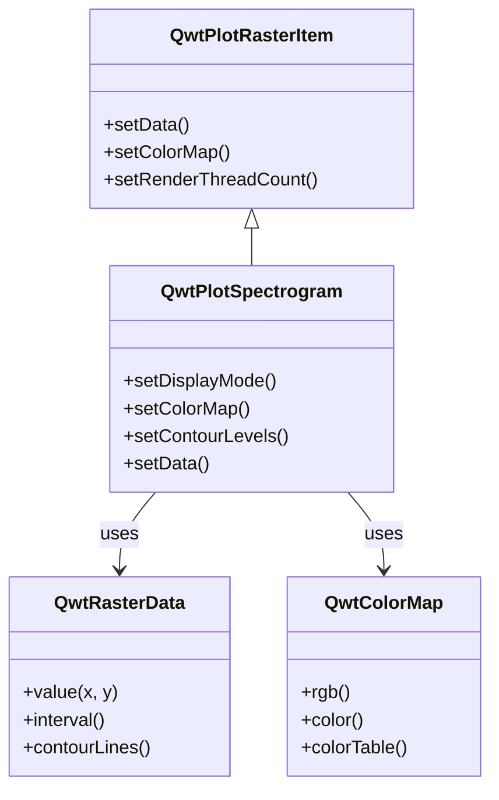

# Spectrogram / Heatmap - QwtPlotSpectrogram

`QwtPlotSpectrogram` is used to draw spectrograms or heatmaps, displaying three-dimensional data on a 2D plane where the third dimension (intensity value) is represented by color. Widely used in scientific data analysis, image processing, acoustic analysis, and other fields.

## Key Features

**Features**

- Image display mode: Maps numeric values to colors to display 2D data fields
- Contour display mode: Draws contour lines at specified values
- Multiple color maps: Supports linear, gradient, discrete, and other color mapping methods
- Multi-threaded rendering: Supports multi-core parallel rendering for improved large data processing efficiency
- Data interpolation: Supports multiple interpolation algorithms for smooth display

## Basic Concepts

### Spectrogram Principle

A spectrogram maps three-dimensional data `(x, y, value)` onto a 2D plane:

```text
        Y-axis
        │
        │   ┌─────────────────┐
        │   │ Color-coded     │
        │   │ intensity values│
        │   │ █░▒▓█░▒▓█░▒▓█ │  ← Each pixel color corresponds to a value
        │   │ ▒▓█░▒▓█░▒▓█░▒ │
        │   │ ▓█░▒▓█░▒▓█░▒▓ │
        │   └─────────────────┘
        └──────────────────────→ X-axis
```

### Display Modes

| Mode | Enum Value | Description |
|------|-----------|-------------|
| Image mode | `ImageMode` | Maps values to colors for display |
| Contour mode | `ContourMode` | Draws contour lines |

### Class Inheritance Structure



## Usage

The spectrogram example is located at: `examples/2D/spectrogram`. Screenshot below:


### 1. Basic Spectrogram

```cpp
#include <QwtPlot>
#include <QwtPlotSpectrogram>
#include <QwtRasterData>
#include <QwtColorMap>

QwtPlot* plot = new QwtPlot();
plot->setTitle("Spectrogram Example");
plot->setCanvasBackground(Qt::black);

// Create spectrogram
QwtPlotSpectrogram* spectrogram = new QwtPlotSpectrogram();

// Enable image display mode
spectrogram->setDisplayMode(QwtPlotSpectrogram::ImageMode, true);

// Set color map
QwtLinearColorMap* colorMap = new QwtLinearColorMap(Qt::darkBlue, Qt::yellow);
colorMap->addColorStop(0.2, Qt::blue);
colorMap->addColorStop(0.4, Qt::cyan);
colorMap->addColorStop(0.6, Qt::green);
colorMap->addColorStop(0.8, Qt::orange);
spectrogram->setColorMap(colorMap);

// Create data
// Using a custom QwtRasterData derived class here
spectrogram->setData(new MyRasterData());

spectrogram->attach(plot);
plot->replot();
```

### 2. Custom Raster Data

Create a `QwtRasterData` derived class to provide data:

```cpp
#include <QwtRasterData>
#include <QwtInterval>

// Custom raster data class
class MyRasterData : public QwtRasterData
{
public:
    MyRasterData()
    {
        // Set data range
        setInterval(Qt::XAxis, QwtInterval(0, 100));
        setInterval(Qt::YAxis, QwtInterval(0, 100));
        setInterval(Qt::ZAxis, QwtInterval(0, 1));  // Value range
    }

    // Return value at specified position (core method)
    virtual double value(double x, double y) const override
    {
        // Example: compute value at position
        double dx = x - 50;
        double dy = y - 50;
        double dist = std::sqrt(dx * dx + dy * dy);
        return std::exp(-dist / 20.0);  // Gaussian distribution
    }

    // Optional: return contour line data
    virtual QList<QwtContourLine> contourLines(
        const QList<double>& levels,
        const QRectF& rect) const override
    {
        // Implement contour line computation
        return QwtRasterData::contourLines(levels, rect);
    }
};
```

### 3. Color Map Configuration

#### Linear Color Map

```cpp
// Create a linear color map from blue to red
QwtLinearColorMap* colorMap = new QwtLinearColorMap(Qt::blue, Qt::red);

// Set format (RGB or Indexed)
colorMap->setFormat(QwtColorMap::RGB);  // RGB mode, smooth color transitions

// Add color stops
colorMap->addColorStop(0.0, Qt::black);   // Minimum: black
colorMap->addColorStop(0.3, Qt::blue);    // 30%: blue
colorMap->addColorStop(0.5, Qt::green);   // 50%: green
colorMap->addColorStop(0.7, Qt::yellow);  // 70%: yellow
colorMap->addColorStop(1.0, Qt::white);   // Maximum: white

spectrogram->setColorMap(colorMap);
```

#### Predefined Color Maps

```cpp
// Use Qwt's built-in Hue color map (rainbow)
QwtHueColorMap* hueMap = new QwtHueColorMap();
hueMap->setHueRange(0.0, 360.0);  // Full hue range
spectrogram->setColorMap(hueMap);

// Use Alpha color map (transparency variation)
QwtAlphaColorMap* alphaMap = new QwtAlphaColorMap();
alphaMap->setAlphaRange(0, 255);
spectrogram->setColorMap(alphaMap);
```

### 4. Contour Display

```cpp
// Enable contour mode
spectrogram->setDisplayMode(QwtPlotSpectrogram::ContourMode, true);

// Set contour levels
QList<double> contourLevels;
contourLevels << 0.1 << 0.2 << 0.3 << 0.4 << 0.5 << 0.6 << 0.7 << 0.8;
spectrogram->setContourLevels(contourLevels);

// Set contour line style
spectrogram->setDefaultContourPen(QPen(Qt::white, 1));

// Display both image and contour lines
spectrogram->setDisplayMode(QwtPlotSpectrogram::ImageMode, true);
spectrogram->setDisplayMode(QwtPlotSpectrogram::ContourMode, true);
```

### 5. Data Resolution Settings

```cpp
// Set pixel resolution (size of data unit per pixel)
spectrogram->setPixelSize(2.0);  // 2 data units per pixel

// Or use recommended resolution for automatic calculation
spectrogram->setRenderHint(QwtPlotRasterItem::RenderAntialiased);
```

### 6. Multi-Threaded Rendering

```cpp
// Set rendering thread count (improves large data rendering performance)
spectrogram->setRenderThreadCount(4);  // Use 4 threads for parallel rendering

// Default value is 0 (single-threaded)
```

!!! tip "Multi-Threaded Rendering Recommendations"
    - When data exceeds 1 million pixels, multi-threading is recommended
    - Set thread count to the number of CPU cores, not exceeding 8
    - Multi-threaded rendering is most effective in image mode

### 7. Using Matrix Data

```cpp
#include <QwtMatrixRasterData>

// Use matrix data class
QwtMatrixRasterData* matrixData = new QwtMatrixRasterData();

// Set data matrix
QVector<double> values;
for (int i = 0; i < 100 * 100; i++) {
    values << (rand() % 100);
}
matrixData->setValueMatrix(values, 100);  // 100x100 matrix

// Set data range
matrixData->setInterval(Qt::XAxis, QwtInterval(0, 100));
matrixData->setInterval(Qt::YAxis, QwtInterval(0, 100));
matrixData->setInterval(Qt::ZAxis, QwtInterval(0, 100));

// Set interpolation method
matrixData->setResampleMode(QwtMatrixRasterData::BilinearInterpolation);

spectrogram->setData(matrixData);
```

### 8. Color Bar

Add a color bar to show the correspondence between colors and values:

```cpp
#include <QwtScaleWidget>

// Add color bar on the right side
QwtScaleWidget* rightAxis = plot->axisWidget(QwtAxis::YRight);
rightAxis->setColorBarEnabled(true);
rightAxis->setColorBarWidth(20);

// Set color bar range and color map
rightAxis->setColorMap(QwtInterval(0, 100), colorMap);

// Show right axis
plot->setAxisVisible(QwtAxis::YRight, true);
```

## Core Methods Summary

| Method | Description |
|--------|-------------|
| `setData()` | Set raster data |
| `setColorMap()` | Set color map |
| `setDisplayMode()` | Set display mode |
| `setContourLevels()` | Set contour levels |
| `setDefaultContourPen()` | Set contour line pen |
| `setPixelSize()` | Set pixel resolution |
| `setRenderThreadCount()` | Set rendering thread count |
| `data()` | Get raster data |
| `colorMap()` | Get color map |

## Color Map Classes Summary

| Class | Description |
|-------|-------------|
| `QwtLinearColorMap` | Linear color map with smooth color transitions |
| `QwtHueColorMap` | Hue-based color map with rainbow effect |
| `QwtAlphaColorMap` | Alpha color map with transparency variation |
| `QwtLogColorMap` | Logarithmic color map, suitable for wide-range data |

!!! tip "Application Scenarios"
    - Scientific data analysis: Temperature fields, pressure fields, etc.
    - Image processing: Heatmaps, density maps
    - Acoustic analysis: Spectrograms, sonar images
    - Geographic data: Topographic maps, ocean depth maps

!!! example "Related Examples"
    - Spectrogram demo: `examples/2D/spectrogram`
