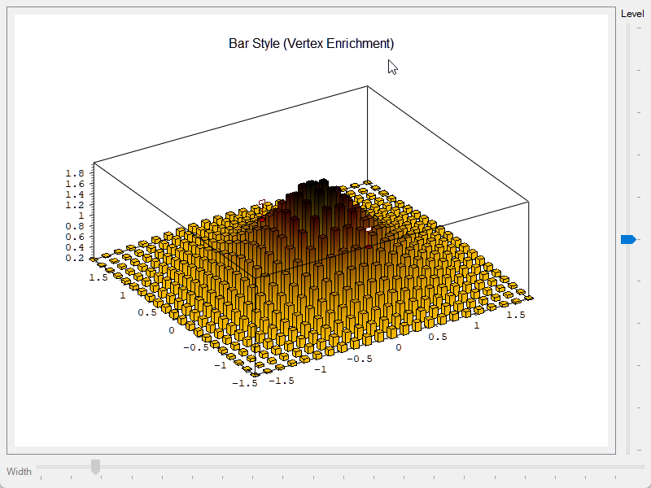

<div class="qwt-hero">
<div class="qwt-hero-bg"></div>
<div class="qwt-hero-inner">

<p class="qwt-hero-badge">Open Source &middot; LGPL Licensed</p>

<h1 class="qwt-hero-title">Qt Plotting Library</h1>

<p class="qwt-hero-desc">
A high-performance 2D/3D plotting library for Qt applications,
designed for scientific computing and engineering data visualization.
</p>

<div class="qwt-hero-pills">
<span>C++11/17</span>
<span>CMake</span>
<span>Qt 5.12+ / Qt 6</span>
</div>

<div class="qwt-hero-actions">
<a href="en/use-guide/qwt7-new-features/" class="qwt-btn qwt-btn-primary">Get Started</a>
<a href="https://github.com/czyt1988/QWT" class="qwt-btn qwt-btn-ghost">GitHub</a>
<a href="https://gitee.com/czyt1988/QWT" class="qwt-btn qwt-btn-ghost">Gitee</a>
</div>

</div>
</div>

<div class="qwt-stats-bar">
<div class="qwt-stat">
<strong>20+</strong>
<span>Chart Types</span>
</div>
<div class="qwt-stat-divider"></div>
<div class="qwt-stat">
<strong>2D &amp; 3D</strong>
<span>Visualization</span>
</div>
<div class="qwt-stat-divider"></div>
<div class="qwt-stat">
<strong>Qt 5 &amp; 6</strong>
<span>Fully Compatible</span>
</div>
<div class="qwt-stat-divider"></div>
<div class="qwt-stat">
<strong>LGPL</strong>
<span>Commercial Friendly</span>
</div>
</div>

<div class="qwt-container">

<div class="qwt-section-head">
<h2>Core Features</h2>
<p>Everything you need for professional data visualization in Qt applications.</p>
</div>

<div class="qwt-card-grid">

<div class="qwt-card">
<div class="qwt-card-icon">
<svg viewBox="0 0 24 24" fill="none" stroke="currentColor" stroke-width="2" stroke-linecap="round" stroke-linejoin="round"><polygon points="13 2 3 14 12 14 11 22 21 10 12 10 13 2"></polygon></svg>
</div>
<h3>High Performance</h3>
<p>Optimized QPainter rendering pipeline for large-scale datasets. Smooth real-time plotting with efficient redraw strategies.</p>
</div>

<div class="qwt-card">
<div class="qwt-card-icon">
<svg viewBox="0 0 24 24" fill="none" stroke="currentColor" stroke-width="2" stroke-linecap="round" stroke-linejoin="round"><polyline points="22 12 18 12 15 21 9 3 6 12 2 12"></polyline></svg>
</div>
<h3>Rich Chart Types</h3>
<p>20+ built-in chart types: curves, scatter, bar, box, histogram, spectrogram, K-line, vector field, polar plots, and 3D surfaces.</p>
</div>

<div class="qwt-card">
<div class="qwt-card-icon">
<svg viewBox="0 0 24 24" fill="none" stroke="currentColor" stroke-width="2" stroke-linecap="round" stroke-linejoin="round"><circle cx="12" cy="12" r="3"></circle><path d="M19.4 15a1.65 1.65 0 0 0 .33 1.82l.06.06a2 2 0 0 1-2.83 2.83l-.06-.06a1.65 1.65 0 0 0-1.82-.33 1.65 1.65 0 0 0-1 1.51V21a2 2 0 0 1-4 0v-.09A1.65 1.65 0 0 0 9 19.4a1.65 1.65 0 0 0-1.82.33l-.06.06a2 2 0 0 1-2.83-2.83l.06-.06A1.65 1.65 0 0 0 4.68 15a1.65 1.65 0 0 0-1.51-1H3a2 2 0 0 1 0-4h.09A1.65 1.65 0 0 0 4.6 9a1.65 1.65 0 0 0-.33-1.82l-.06-.06a2 2 0 0 1 2.83-2.83l.06.06A1.65 1.65 0 0 0 9 4.68a1.65 1.65 0 0 0 1-1.51V3a2 2 0 0 1 4 0v.09a1.65 1.65 0 0 0 1 1.51 1.65 1.65 0 0 0 1.82-.33l.06-.06a2 2 0 0 1 2.83 2.83l-.06.06A1.65 1.65 0 0 0 19.4 9a1.65 1.65 0 0 0 1.51 1H21a2 2 0 0 1 0 4h-.09a1.65 1.65 0 0 0-1.51 1z"></path></svg>
</div>
<h3>CMake &amp; Qt6</h3>
<p>Full CMake support with <code>find_package(qwt)</code>. Single-file amalgamation available. Compatible with Qt 5.12+ and Qt 6.</p>
</div>

<div class="qwt-card">
<div class="qwt-card-icon">
<svg viewBox="0 0 24 24" fill="none" stroke="currentColor" stroke-width="2" stroke-linecap="round" stroke-linejoin="round"><line x1="18" y1="20" x2="18" y2="10"></line><line x1="12" y1="20" x2="12" y2="4"></line><line x1="6" y1="20" x2="6" y2="14"></line></svg>
</div>
<h3>Multi-Axis System</h3>
<p>Create unlimited independent axes via parasite plot architecture &mdash; similar to matplotlib's twin axis system with full interaction support.</p>
</div>

<div class="qwt-card">
<div class="qwt-card-icon">
<svg viewBox="0 0 24 24" fill="none" stroke="currentColor" stroke-width="2" stroke-linecap="round" stroke-linejoin="round"><circle cx="13.5" cy="6.5" r="2.5"></circle><circle cx="19" cy="13" r="2"></circle><circle cx="6" cy="12" r="3"></circle><circle cx="10" cy="20" r="2"></circle></svg>
</div>
<h3>Modern Design</h3>
<p>Clean, flat visual style replacing the legacy embossed look. Professional aesthetics that fit contemporary application design.</p>
</div>

<div class="qwt-card">
<div class="qwt-card-icon">
<svg viewBox="0 0 24 24" fill="none" stroke="currentColor" stroke-width="2" stroke-linecap="round" stroke-linejoin="round"><rect x="2" y="3" width="20" height="14" rx="2" ry="2"></rect><line x1="8" y1="21" x2="16" y2="21"></line><line x1="12" y1="17" x2="12" y2="21"></line></svg>
</div>
<h3>Figure Layout</h3>
<p>matplotlib-inspired <code>QwtFigure</code> for multi-plot grid layouts. Interactive drag, resize, and manage subplots with overlay widgets.</p>
</div>

</div>
</div>

<div class="qwt-showcase">

<div class="qwt-section-head">
<h2>Visualization Showcase</h2>
<p>From basic charts to advanced scientific visualizations.</p>
</div>

<div class="qwt-gallery">

<a class="qwt-gallery-item" href="en/use-guide/figure-widget/">

<span>Figure Layout</span>
</a>

<a class="qwt-gallery-item" href="en/use-guide/curve/">

<span>Curve Plot</span>
</a>

<a class="qwt-gallery-item" href="en/use-guide/scatter/">

<span>Scatter Plot</span>
</a>

<a class="qwt-gallery-item" href="en/use-guide/barchart/">

<span>Bar Chart</span>
</a>

<a class="qwt-gallery-item" href="en/use-guide/spectrogram/">

<span>Spectrogram</span>
</a>

<a class="qwt-gallery-item" href="en/use-guide/vectorfield/">

<span>Vector Field</span>
</a>

<a class="qwt-gallery-item" href="en/use-guide/boxchart/">

<span>Box Chart</span>
</a>

<a class="qwt-gallery-item" href="en/use-guide/tradingcurve/">

<span>K-Line / Stock</span>
</a>

<a class="qwt-gallery-item" href="en/use-guide/polar-plot/">

<span>Polar Plot</span>
</a>

<a class="qwt-gallery-item" href="en/use-guide/3d-plot/">

<span>3D Surface</span>
</a>

<a class="qwt-gallery-item" href="en/use-guide/3d-plot/">

<span>3D Enrichments</span>
</a>

<a class="qwt-gallery-item" href="en/use-guide/parasite-axes/">

<span>Multi-Axis</span>
</a>

<a class="qwt-gallery-item" href="en/use-guide/curve/">

<span>Oscilloscope</span>
</a>

<a class="qwt-gallery-item" href="en/use-guide/curve/">

<span>Real-Time Plot</span>
</a>

<a class="qwt-gallery-item" href="en/use-guide/scale-builtin-action/">

<span>Axis Interaction</span>
</a>

<a class="qwt-gallery-item" href="en/use-guide/widgets-controls/">

<span>Dials &amp; Compass</span>
</a>

</div>

</div>

<div class="qwt-quickstart" markdown>

<div class="qwt-quickstart-inner" markdown>

<div class="qwt-section-head">
<h2>Quick Start</h2>
<p>Integrate QWT into your project in minutes.</p>
</div>

=== "CMake (Recommended)"

    ```cmake
    # Find and link QWT
    find_package(qwt REQUIRED)
    target_link_libraries(${PROJECT_NAME} PRIVATE qwt::plot)

    # For 3D plotting
    target_link_libraries(${PROJECT_NAME} PRIVATE qwt::plot3d)
    ```

=== "Single File"

    ```cpp
    // Add two files to your project:
    //   src-amalgamate/QwtPlot.h
    //   src-amalgamate/QwtPlot.cpp

    #include "QwtPlot.h"

    auto* plot = new QwtPlot();
    auto* curve = new QwtPlotCurve("My Data");
    ```

=== "First Plot"

    ```cpp
    #include <qwt_plot.h>
    #include <qwt_plot_curve.h>

    auto* plot = new QwtPlot("My First Plot");
    auto* curve = new QwtPlotCurve("Sine Wave");

    QVector<QPointF> data;
    for (double x = 0; x < 10.0; x += 0.1)
        data.append(QPointF(x, std::sin(x)));
    curve->setSamples(data);

    curve->attach(plot);
    plot->resize(600, 400);
    plot->show();
    ```

</div>
</div>

<div class="qwt-footer">
<div class="qwt-footer-inner">

<h2>Start Building Today</h2>
<p>Explore the documentation or browse the source code.</p>

<div class="qwt-footer-links">
<a href="en/use-guide/qwt7-new-features/" class="qwt-btn qwt-btn-primary">Read the Docs</a>
<a href="zh/use-guide/qwt7-new-features/" class="qwt-btn qwt-btn-ghost">中文文档</a>
<a href="https://github.com/czyt1988/QWT" class="qwt-btn qwt-btn-ghost">GitHub</a>
<a href="https://gitee.com/czyt1988/QWT" class="qwt-btn qwt-btn-ghost">Gitee</a>
</div>

</div>
</div>
