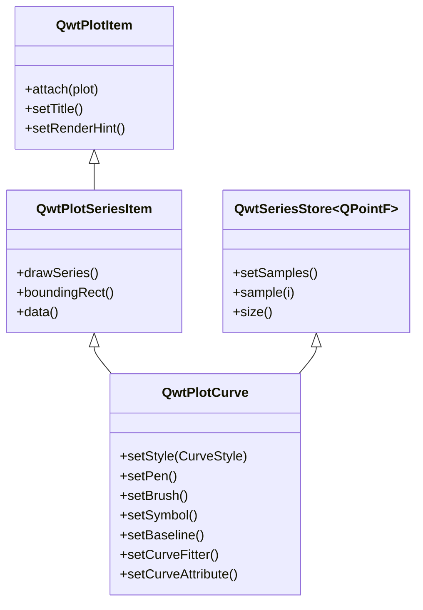
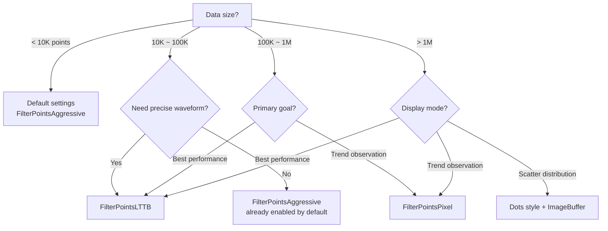

# Curve Plot - QwtPlotCurve

`QwtPlotCurve` is the most core plot item class in Qwt, used for drawing data curves in a 2D coordinate system. It supports multiple display styles (lines, steps, sticks, etc.), symbol markers, curve fitting, and rich style configuration.

## Key Features

**Features**

- Multiple curve styles: Lines, Steps, Sticks, Dots and other drawing modes
- Symbol marker system: Display various shapes at data points
- Curve fitting and interpolation: Built-in spline and other fitting algorithms
- High-performance rendering: Optimized rendering for large datasets
- Fill area: Configurable fill between the curve and baseline
- Legend customization: Configurable curve display style in the legend

## Basic Concepts

### Curve Style Types

QwtPlotCurve supports the following drawing styles:

| Style | Enum Value | Description |
|-------|-----------|-------------|
| No curve | `NoCurve` | Show symbols only, no connecting lines |
| Lines | `Lines` | Connect data points with straight lines (default) |
| Sticks | `Sticks` | Draw vertical/horizontal lines from baseline |
| Steps | `Steps` | Step function style connection |
| Dots | `Dots` | Draw points only (more efficient than NoCurve + Symbol) |

### Curve Attribute Flags

| Attribute | Enum Value | Description |
|-----------|-----------|-------------|
| Inverted | `Inverted` | Steps style draws from right to left |
| Fitted | `Fitted` | Enable curve fitting (requires a curve fitter) |

### Class Inheritance



## Usage

The curve plotting example is located at: `examples/2D/curvedemo`, showcasing multiple curve styles. Screenshot below:


### 1. Creating a Basic Curve

The most basic way to draw a curve:

```cpp
#include <QwtPlot>
#include <QwtPlotCurve>

// Create plot window
QwtPlot* plot = new QwtPlot();
plot->setTitle("Curve Example");
plot->setCanvasBackground(Qt::white);

// Create curve object
QwtPlotCurve* curve = new QwtPlotCurve("Data Curve");

// Set curve style (default is Lines)
curve->setStyle(QwtPlotCurve::Lines);

// Set line color and width
curve->setPen(QPen(Qt::blue, 2.0));

// Enable antialiased rendering
curve->setRenderHint(QwtPlotItem::RenderAntialiased, true);

// Prepare data
QVector<double> xData = {0, 1, 2, 3, 4, 5};
QVector<double> yData = {0, 1, 4, 9, 16, 25};

// Set data
curve->setSamples(xData, yData);

// Attach to plot
curve->attach(plot);

// Refresh display
plot->replot();
```

### 2. Setting Data

QwtPlotCurve provides multiple methods for setting data:

```cpp
// Method 1: Using two QVectors
QVector<double> xData, yData;
curve->setSamples(xData, yData);

// Method 2: Using QPolygonF (array of QPointF)
QPolygonF points;
points << QPointF(0, 0) << QPointF(1, 1) << QPointF(2, 4);
curve->setSamples(points);

// Method 3: Using raw double arrays
double x[100], y[100];
curve->setSamples(x, y, 100);

// Method 4: Using raw arrays (no data copy)
curve->setRawSamples(x, y, 100);  // Note: arrays must remain valid

// Method 5: Setting Y values only (X auto-indexed as 0,1,2...)
QVector<double> yValues;
curve->setSamples(yValues);
```

!!! warning "setRawSamples Considerations"
    When using `setRawSamples()`, the curve does not copy the data but directly references the provided arrays. You must ensure:
    1. The arrays remain valid for the lifetime of the curve
    2. The array contents should not be modified (unless you understand the consequences)
    3. Do not deallocate the arrays before the curve is destroyed

### 3. Curve Style Configuration

#### Lines Style

This is the most commonly used style, connecting data points with straight lines:

```cpp
curve->setStyle(QwtPlotCurve::Lines);
curve->setPen(QPen(Qt::darkBlue, 2.0, Qt::SolidLine));
```

Enabling the Fitted attribute allows drawing smooth curves:

```cpp
// Enable curve fitting
curve->setCurveAttribute(QwtPlotCurve::Fitted, true);

// Set spline fitter (optional)
QwtSplineCurveFitter* fitter = new QwtSplineCurveFitter();
fitter->setFitMode(QwtSplineCurveFitter::Auto);  // Auto-select fitting mode
curve->setCurveFitter(fitter);
```

#### Steps Style

Step function style for displaying discrete data changes:

```cpp
curve->setStyle(QwtPlotCurve::Steps);
curve->setPen(QPen(Qt::darkCyan, 2.0));

// Default draws from left to right; can be inverted
curve->setCurveAttribute(QwtPlotCurve::Inverted, true);
```

Steps style comparison:

```text
Normal mode:       Inverted mode:
    ┌──┐          ┌──┐
    │  │          │  │
┌───┘  └───┐  ┌───┘  └───┐
│          │  │          │
```

#### Sticks Style

Draws vertical lines from the baseline to each data point:

```cpp
curve->setStyle(QwtPlotCurve::Sticks);
curve->setPen(QPen(Qt::red, 1.5));

// Set baseline position (default is 0)
curve->setBaseline(5.0);

// Set stick direction (depends on curve orientation)
// Qt::Vertical: vertical sticks, drawn from Y baseline
// Qt::Horizontal: horizontal sticks, drawn from X baseline
```

#### Dots Style

Draws only data points without connecting lines. This is more efficient than `NoCurve + Symbol`:

```cpp
curve->setStyle(QwtPlotCurve::Dots);
// Dots style does not require setting a Pen; point size is fixed at 1 pixel
```

### 4. Symbol Configuration

Symbols are used to display markers at each data point position:

```cpp
#include <QwtSymbol>

// Create symbol object
QwtSymbol* symbol = new QwtSymbol();

// Set symbol shape
symbol->setStyle(QwtSymbol::Ellipse);  // Ellipse shape

// Set symbol size
symbol->setSize(QSize(10, 10));

// Set symbol fill brush
symbol->setBrush(QBrush(Qt::yellow));

// Set symbol border pen
symbol->setPen(QPen(Qt::red, 2));

// Apply to curve
curve->setSymbol(symbol);
```

Common symbol shapes:

| Shape | Enum Value | Description |
|-------|-----------|-------------|
| Ellipse | `Ellipse` | Circle or ellipse |
| Rectangle | `Rect` | Rectangle |
| Diamond | `Diamond` | Diamond |
| Triangle | `Triangle` | Upward triangle |
| Down Triangle | `DTriangle` | Downward triangle |
| Left Triangle | `LTriangle` | Left-pointing triangle |
| Right Triangle | `RTriangle` | Right-pointing triangle |
| Cross | `Cross` | Cross (+) shape |
| X-Cross | `XCross` | X-shaped cross |
| Star | `Star1` | Six-pointed star |
| Hexagon | `Hexagon` | Hexagon |
| None | `NoSymbol` | No symbol displayed |

Quick symbol creation:

```cpp
// Convenience constructor: shape, fill, border, size
QwtSymbol* symbol = new QwtSymbol(
    QwtSymbol::Diamond,
    QBrush(Qt::green),
    QPen(Qt::darkGreen, 1),
    QSize(8, 8)
);
curve->setSymbol(symbol);
```

### 5. Fill Area

Curves can fill the area between the baseline and data points:

```cpp
// Set fill brush
curve->setBrush(QBrush(QColor(100, 150, 200, 100)));  // Semi-transparent fill

// Set baseline position
curve->setBaseline(0.0);  // Fill starting from Y=0

// For Steps style, the fill effect is particularly noticeable
curve->setStyle(QwtPlotCurve::Steps);
curve->setBrush(QBrush(Qt::lightGray));
```

### 6. High-Performance Rendering

For large datasets, QwtPlotCurve provides rendering optimization attributes:

```cpp
// Set paint attributes
curve->setPaintAttribute(QwtPlotCurve::ClipPolygons, true);           // Clip polygons
curve->setPaintAttribute(QwtPlotCurve::FilterPoints, true);            // Filter duplicate points
curve->setPaintAttribute(QwtPlotCurve::FilterPointsAggressive, true);  // Aggressive filtering
curve->setPaintAttribute(QwtPlotCurve::FilterPointsPixel, true);       // Pixel-column downsampling
curve->setPaintAttribute(QwtPlotCurve::FilterPointsLTTB, true);        // LTTB MinMax downsampling
curve->setPaintAttribute(QwtPlotCurve::ImageBuffer, true);             // Image buffer (for Dots style)
```

#### Paint Attributes Overview

| Paint Attribute | Description |
|----------------|-------------|
| `ClipPolygons` | Clip polygons outside the canvas to avoid rendering invalid regions |
| `FilterPoints` | Filter duplicate points and points outside the canvas |
| `FilterPointsAggressive` | More aggressive filtering, removes intermediate points in the same pixel column |
| `FilterPointsPixel` | Pixel-column downsampling, keeps first/min/max/last (4 points per column) for extreme speed |
| `FilterPointsLTTB` | MinMax bucket downsampling (simplified LTTB), preserves waveform shape better |
| `MinimizeMemory` | Reduce temporary memory usage (may decrease performance) |
| `ImageBuffer` | Use image buffer for drawing scatter points (suitable for millions of data points) |

!!! note "Default Settings"
    Starting from Qwt 7.x, `ClipPolygons | FilterPointsAggressive` is enabled by default — no manual setup needed for basic optimization.

#### Downsampling Algorithms in Detail

##### FilterPointsAggressive — Aggressive Filtering (Default)

Based on QwtPointMapper's Quad Reduce algorithm. Merges consecutive points that map to the same pixel coordinates, removing redundant intermediate points.

- **Principle**: Scans along both X and Y directions, reducing consecutive points mapping to the same pixel row/column to key points
- **Output size**: Proportional to canvas pixel dimensions, approximately `4 × max(canvas_width, canvas_height)`
- **Best for**: General large-dataset scenarios with good waveform fidelity
- **Time complexity**: O(n)

##### FilterPointsPixel — Pixel-Column Downsampling

Bins data by screen pixel columns, keeping only first/min/max/last Y values per column. Automatically uses binary search to locate the visible range for monotonically increasing X data.

- **Principle**: Allocates a Bin array as wide as the canvas, iterates all data points into corresponding column buckets
- **Output size**: At most `4 × canvas_width`, completely independent of data size
- **Best for**: Trend observation in large datasets
- **Time complexity**: O(n)
- **Limitation**: Only applicable to `Lines` style

```cpp
// Pixel-column downsampling
curve->setPaintAttribute(QwtPlotCurve::FilterPointsPixel, true);
```

!!! warning "FilterPointsPixel Caveats"
    This algorithm overrides `FilterPointsAggressive` when both are set (Pixel takes priority). Since only 4 points per column are retained, high-frequency details may be lost — suitable for trend observation rather than precise analysis.

##### FilterPointsLTTB — MinMax Bucket Downsampling (Recommended)

Divides the visible data range into N equal-count buckets (N = 2 × canvas width), retaining the Y-minimum and Y-maximum point from each bucket. Similar to a simplified LTTB (Largest Triangle Three Buckets) algorithm. Benchmarks show this is the fastest rendering method for million-level data.

- **Principle**: Splits data into equal-sized buckets by index, finds extrema in each bucket, preserves original X coordinates
- **Output size**: Approximately `2 × N = 4 × canvas_width`
- **Best for**: Data with uneven X distribution, scenarios requiring visual waveform preservation, and best overall performance with large datasets
- **Time complexity**: O(n)
- **Limitation**: Only applicable to `Lines` style

```cpp
// Waveform preservation mode: ideal for signal analysis scenarios
curve->setPaintAttribute(QwtPlotCurve::FilterPointsLTTB, true);
```

!!! note "FilterPointsLTTB vs FilterPointsPixel"
    - LTTB preserves original X coordinates (not pixel-aligned), producing more accurate waveform contours
    - Pixel forces all points to pixel columns — simpler implementation but not necessarily faster
    - When data is too small to benefit from downsampling, LTTB automatically falls back to the Quad algorithm
    - Benchmarks show LTTB outperforms Pixel on million-level data (see benchmark results below)

#### How to Choose a Rendering Method

Select the appropriate rendering strategy based on data scale and use case:



**Quick Reference Table:**

| Data Size | Scenario | Recommended Config | Notes |
|-----------|----------|-------------------|-------|
| < 10K | General plotting | Default (`FilterPointsAggressive`) | No extra optimization needed |
| 10K–100K | Real-time curves | `FilterPointsAggressive` (default) | Default algorithm is efficient enough |
| 10K–100K | Signal analysis | `FilterPointsLTTB` | Preserves waveform detail |
| 100K–1M | Real-time scrolling | `FilterPointsLTTB` | Benchmarked as fastest |
| 100K–1M | Offline playback | `FilterPointsLTTB` | Balances speed and waveform fidelity |
| > 1M | Trend overview | `FilterPointsLTTB` | Benchmarked as fastest for million-level data |
| > 1M | Scatter distribution | `Dots` + `ImageBuffer` | Optimized for massive scatter plots |
| > 1M | Trend observation | `FilterPointsPixel` | Alternative, slightly slower than LTTB |

**Usage Examples:**

```cpp
// === Scenario 1: Real-time monitoring of million-level sensor data (LTTB recommended) ===
QwtPlotCurve* sensorCurve = new QwtPlotCurve("Sensor Data");
sensorCurve->setPaintAttribute(QwtPlotCurve::FilterPointsLTTB, true);
sensorCurve->setPaintAttribute(QwtPlotCurve::ClipPolygons, true);  // already on by default

// === Scenario 2: Oscilloscope waveform analysis (preserve waveform features) ===
QwtPlotCurve* scopeCurve = new QwtPlotCurve("Waveform");
scopeCurve->setPaintAttribute(QwtPlotCurve::FilterPointsLTTB, true);

// === Scenario 3: Massive scatter data ===
QwtPlotCurve* scatterCurve = new QwtPlotCurve("Scatter");
scatterCurve->setStyle(QwtPlotCurve::Dots);
scatterCurve->setPaintAttribute(QwtPlotCurve::ImageBuffer, true);

// === Scenario 4: Disable all optimizations (for small-data debugging only) ===
QwtPlotCurve* debugCurve = new QwtPlotCurve("Debug");
debugCurve->setPaintAttribute(QwtPlotCurve::FilterPointsAggressive, false);
debugCurve->setPaintAttribute(QwtPlotCurve::FilterPointsPixel, false);
debugCurve->setPaintAttribute(QwtPlotCurve::FilterPointsLTTB, false);
```

!!! tip "Comprehensive Tips for Large Datasets"
    - Real-time updates: Disable `setAutoReplot()`, call `replot()` manually after batch updates
    - Monotonically increasing X data: `FilterPointsPixel` and `FilterPointsLTTB` automatically use binary search for visible range — no manual data trimming needed
    - Frequent zoom/pan scenarios: `FilterPointsLTTB` is recommended, benchmarked as fastest
    - High-quality screenshots or exports: Temporarily disable downsampling, use `FilterPointsAggressive` for the most accurate output

#### Benchmark Results

Below is a real-world performance comparison with 1,000,000 data points (canvas size 680×490 px, 100 frames):

| Method | Total Time (ms) | Avg Frame Time (ms) | FPS |
|--------|-----------------|---------------------|-----|
| None (no optimization) | 26,212 | 262.12 | 3.8 |
| FilterPoints | 44,472 | 444.72 | 2.2 |
| FilterPointsAggressive (default) | 17,539 | 175.39 | 5.7 |
| FilterPointsPixel | 23,216 | 232.16 | 4.3 |
| **FilterPointsLTTB** | **13,349** | **133.49** | **7.5** |

**Conclusions:**
- `FilterPointsLTTB` delivers the best performance at 7.5 FPS, 32% faster than the default method
- `FilterPointsAggressive` is the second-best choice and is already efficient as the default
- `FilterPoints` basic filtering is actually the slowest — overhead exceeds benefit
- No optimization (None) is faster than `FilterPoints`, confirming basic filtering is counterproductive at this scale

!!! note "Run Your Own Tests"
    You can run the `examples/bench/renderbench` example to benchmark rendering methods on your own hardware. The tool supports configurable data size, frame count, and waveform type, with both single-method and batch comparison modes. It generates a detailed Markdown report upon completion.

### 7. Legend Style Configuration

Control how the curve is displayed in the legend:

```cpp
// Show line (draw a line segment in the legend)
curve->setLegendAttribute(QwtPlotCurve::LegendShowLine, true);

// Show symbol (draw a symbol in the legend)
curve->setLegendAttribute(QwtPlotCurve::LegendShowSymbol, true);

// Show fill (draw a filled rectangle in the legend)
curve->setLegendAttribute(QwtPlotCurve::LegendShowBrush, true);

// Set legend icon size
curve->setLegendIconSize(QSize(20, 10));
```

## Core Methods Summary

| Method | Description |
|--------|-------------|
| `setStyle()` | Set curve style |
| `setPen()` | Set line pen |
| `setBrush()` | Set fill brush |
| `setSymbol()` | Set data point symbol |
| `setBaseline()` | Set baseline position |
| `setCurveAttribute()` | Set curve attributes |
| `setCurveFitter()` | Set curve fitter |
| `setPaintAttribute()` | Set rendering attributes |
| `setSamples()` | Set data points |
| `setRawSamples()` | Reference external data directly |
| `closestPoint()` | Find the nearest data point |
| `minXValue()/maxXValue()` | Get data range |
| `minYValue()/maxYValue()` | Get data range |

## Real-Time Data Update Example

```cpp
// Real-time data scenario
class RealtimePlot : public QwtPlot
{
public:
    RealtimePlot()
    {
        setAutoReplot(false);  // Disable auto-refresh
        m_curve = new QwtPlotCurve("Realtime Data");
        m_curve->attach(this);
        m_curve->setPen(Qt::blue, 2);
    }

    void appendData(double x, double y)
    {
        m_xData.append(x);
        m_yData.append(y);

        // Keep the most recent 1000 points
        if (m_xData.size() > 1000) {
            m_xData.removeFirst();
            m_yData.removeFirst();
        }

        m_curve->setRawSamples(m_xData.constData(),
                               m_yData.constData(),
                               m_xData.size());

        replot();  // Manual refresh
    }

private:
    QwtPlotCurve* m_curve;
    QVector<double> m_xData, m_yData;
};
```

!!! example "Related Examples"
    - Curve style demo: `examples/2D/curvedemo`
    - Simple curve: `examples/2D/simpleplot`
    - Real-time data: `examples/2D/cpuplot`
    - Real-time plotting: `examples/2D/realtime`
    - Oscilloscope: `examples/2D/oscilloscope`

Screenshots of real-time data, real-time plotting, and oscilloscope:


