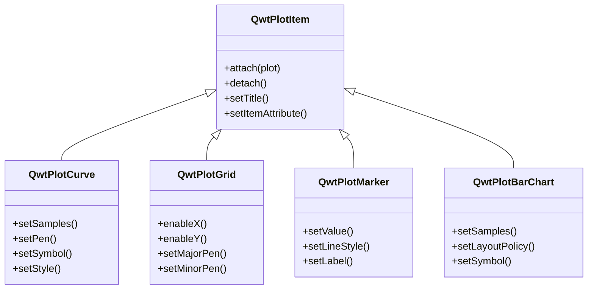
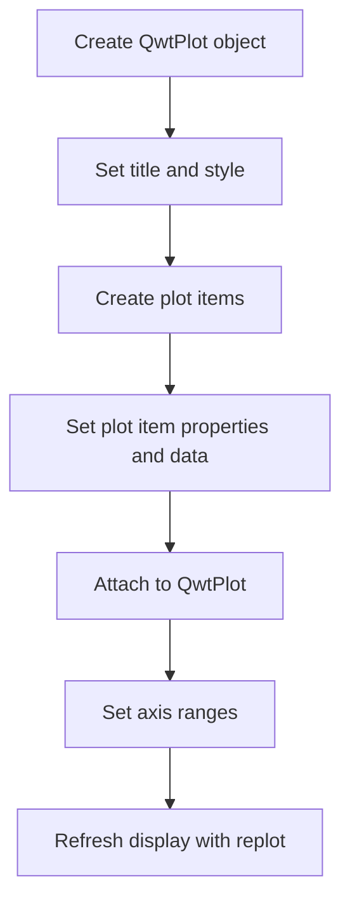

# First Plot - Getting Started with QwtPlot

This tutorial will help you quickly get started with the Qwt plotting library by walking through a simple example that demonstrates the basic usage of QwtPlot.

## QwtPlot Basic Concepts

`QwtPlot` is the core class of the Qwt plotting library. It is a Qt widget for rendering 2D graphics. A QwtPlot can contain multiple plot items such as curves, grids, markers, etc. All plot items must be attached to the QwtPlot via the `attach()` method to be displayed.

### Plot Item Types



### Axis System

QwtPlot provides four axis positions by default:

| Axis Position | Enum Value | Description |
|--------------|------------|-------------|
| Bottom X-axis | `QwtAxis::XBottom` | Visible by default |
| Top X-axis | `QwtAxis::XTop` | Hidden by default |
| Left Y-axis | `QwtAxis::YLeft` | Visible by default |
| Right Y-axis | `QwtAxis::YRight` | Hidden by default |

## Basic Usage Workflow

The basic steps for creating a plot with QwtPlot are as follows:



## Simplest Example

The following example demonstrates the most basic usage of QwtPlot:

The simple plot example is located at: `examples/2D/simpleplot`. A screenshot is shown below:


### Complete Code

```cpp
#include <QwtPlot>
#include <QwtPlotCurve>
#include <QwtPlotGrid>
#include <QwtSymbol>
#include <QwtLegend>

#include <QApplication>

int main(int argc, char* argv[])
{
    QApplication app(argc, argv);

    // 1. Create the plot window
    QwtPlot plot;
    plot.setWindowTitle("Plot Demo");        // Set window title
    plot.setCanvasBackground(Qt::white);      // Set canvas background color
    plot.setAxisScale(QwtAxis::YLeft, 0.0, 10.0);  // Set Y-axis range
    plot.insertLegend(new QwtLegend());      // Add legend

    // 2. Create and add grid
    QwtPlotGrid* grid = new QwtPlotGrid();
    grid->attach(&plot);  // Grid must be attached to the plot to be displayed

    // 3. Create curve
    QwtPlotCurve* curve = new QwtPlotCurve();
    curve->setTitle("Some Points");           // Curve title (shown in legend)
    curve->setPen(Qt::blue, 4);               // Set line color and width
    curve->setRenderHint(QwtPlotItem::RenderAntialiased, true);  // Anti-aliasing

    // 4. Set curve symbol
    QwtSymbol* symbol = new QwtSymbol(
        QwtSymbol::Ellipse,                   // Symbol shape: ellipse
        QBrush(Qt::yellow),                   // Symbol fill color
        QPen(Qt::red, 2),                     // Symbol border
        QSize(8, 8)                           // Symbol size
    );
    curve->setSymbol(symbol);

    // 5. Set curve data
    QPolygonF points;
    points << QPointF(0.0, 4.4) << QPointF(1.0, 3.0)
           << QPointF(2.0, 4.5) << QPointF(3.0, 6.8)
           << QPointF(4.0, 7.9) << QPointF(5.0, 7.1);
    curve->setSamples(points);

    // 6. Attach the curve to the plot
    curve->attach(&plot);

    // 7. Show the plot window
    plot.resize(600, 400);
    plot.show();

    return app.exec();
}
```

### Code Walkthrough

#### 1. Creating the Plot Window

```cpp
QwtPlot plot;
plot.setWindowTitle("Plot Demo");
plot.setCanvasBackground(Qt::white);
```

`QwtPlot` is the main container for the plot, inheriting from `QFrame`. The canvas background color determines the base color of the plot area. It is recommended to use white or a light color for clear data display.

#### 2. Adding a Grid

```cpp
QwtPlotGrid* grid = new QwtPlotGrid();
grid->attach(&plot);
```

The grid is a standalone plot item used to display coordinate reference lines. All plot items are attached to QwtPlot via the `attach()` method, and QwtPlot automatically manages the lifecycle of attached items.

!!! tip "Plot Item Lifecycle"
    Once a plot item is attached to QwtPlot, QwtPlot holds a reference to that item. When QwtPlot is destroyed, all attached plot items are automatically deleted as well. Therefore, you do not need to manually manage the memory of plot items.

#### 3. Creating a Curve and Setting Its Style

```cpp
QwtPlotCurve* curve = new QwtPlotCurve();
curve->setTitle("Some Points");
curve->setPen(Qt::blue, 4);
curve->setRenderHint(QwtPlotItem::RenderAntialiased, true);
```

Curves are the most commonly used plot item type:
- `setTitle()` sets the curve title, which is displayed in the legend
- `setPen()` sets the line color, width, and style
- `setRenderHint()` enables anti-aliased rendering for smoother lines

#### 4. Setting Data Point Symbols

```cpp
QwtSymbol* symbol = new QwtSymbol(
    QwtSymbol::Ellipse,
    QBrush(Qt::yellow),
    QPen(Qt::red, 2),
    QSize(8, 8)
);
curve->setSymbol(symbol);
```

Symbols are used to display markers at each data point position. `QwtSymbol` supports various shapes:
- `Ellipse` - Ellipse/Circle
- `Rect` - Rectangle
- `Diamond` - Diamond
- `Triangle` - Triangle
- `Cross` - Cross
- `XCross` - X-shaped cross

#### 5. Setting Curve Data

```cpp
QPolygonF points;
points << QPointF(0.0, 4.4) << QPointF(1.0, 3.0) ...;
curve->setSamples(points);
```

The `setSamples()` method is used to set the data points of the curve. Qwt provides multiple ways to set data:

| Method | Description |
|--------|-------------|
| `setSamples(const QPolygonF&)` | Set from a QPointF array |
| `setSamples(const QVector<double>& x, const QVector<double>& y)` | Set from two arrays |
| `setSamples(const double* x, const double* y, int size)` | Set from raw arrays |
| `setRawSamples(const double* x, const double* y, int size)` | Directly reference external arrays (no copy) |

!!! warning "setRawSamples Caveats"
    When using `setRawSamples()`, Qwt does not copy the data but directly references the arrays you provide. This means you must ensure the arrays remain valid for the lifetime of the curve and must not modify the array contents.

#### 6. Setting Axes

```cpp
plot.setAxisScale(QwtAxis::YLeft, 0.0, 10.0);
```

`setAxisScale()` is used to manually set the axis range. If this method is not called, Qwt automatically calculates an appropriate range based on the data of the attached plot items.

## Advanced Configuration

### Multiple Curves

```cpp
// Create a second curve
QwtPlotCurve* curve2 = new QwtPlotCurve("Curve 2");
curve2->setPen(Qt::red, 2);
curve2->setSamples(xData2, yData2, count);
curve2->attach(&plot);
```

A single QwtPlot can have any number of plot items attached, and they are drawn in the order they were attached.

### Setting Axis Titles

```cpp
plot.setAxisTitle(QwtAxis::XBottom, "Time (s)");
plot.setAxisTitle(QwtAxis::YLeft, "Voltage (V)");
```

### Auto-Replot Mode

```cpp
plot.setAutoReplot(true);  // Auto-refresh when data changes
```

When auto-replot is enabled, QwtPlot automatically calls `replot()` to update the display whenever a plot item's data or properties change. By default, you need to manually call `replot()` to refresh the plot.

!!! tip "Performance Tip"
    For real-time update scenarios, it is recommended to disable auto-replot and manually call `replot()` once after batch updates are complete. This avoids the performance overhead of frequent refreshes.

## QwtPlot Core Methods

| Method | Description |
|--------|-------------|
| `setTitle()` | Set the plot title |
| `setCanvasBackground()` | Set the canvas background color |
| `setAxisScale()` | Set the axis range |
| `setAxisTitle()` | Set the axis title |
| `insertLegend()` | Insert a legend |
| `replot()` | Refresh the plot display |
| `setAutoReplot()` | Set auto-replot mode |
| `exportPlot()` | Export the plot to a file |

!!! example "Related Examples"
    - Basic plot: `examples/2D/simpleplot`
    - Curve style demo: `examples/2D/curvedemo`
    - Real-time data: `examples/2D/cpuplot`
