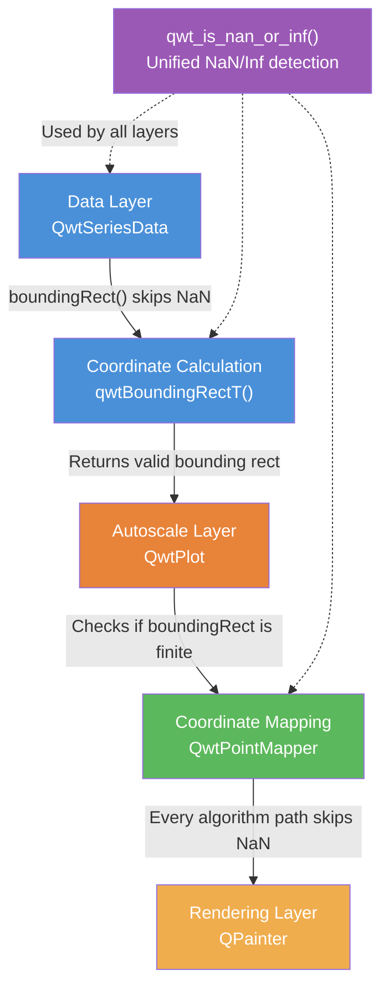
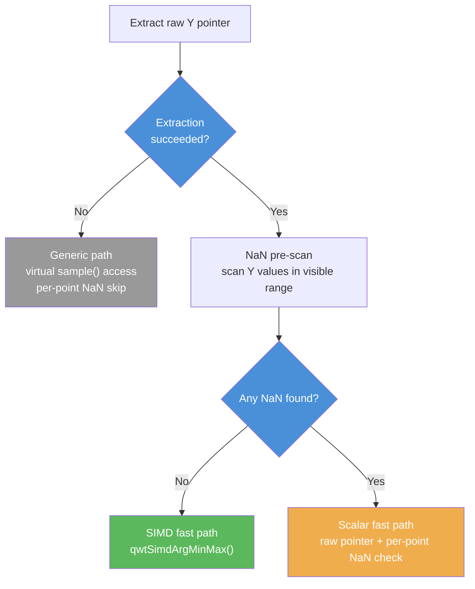
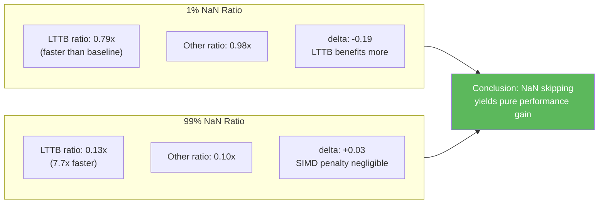

# NaN Data Handling

In scientific and engineering data visualization, missing data is a common scenario — sensor failures, uneven sampling intervals, and anomalies in data processing pipelines can all produce `NaN` (Not a Number) values. If a plotting library cannot handle NaN correctly, it can lead to incorrect axis ranges, abnormal curve rendering, or even application crashes.

**Qwt 7 provides comprehensive correctness handling and performance optimization for NaN data**, a capability absent from the original Qwt 6. In Qwt 6, NaN data causes boundingRect pollution (returning invalid rectangles), incorrect pixel coordinates during mapping, broken autoscaling, and a series of other bugs. Qwt 7 builds a complete NaN handling system from low-level utility functions up to the rendering pipeline.

!!! success "Qwt 7 New Feature"
    Correct NaN data handling and performance optimization is one of the major improvements of Qwt 7 over the original Qwt 6.2.0. All core improvements were added in December 2025 by the project maintainer.

## NaN Handling Architecture Overview

Qwt 7's NaN handling spans the entire 2D plotting pipeline, from the data layer to the rendering layer:



## Core Utility: qwt_is_nan_or_inf()

**Source file**: `src/core/qwt_math.h`

Qwt 7 introduces a unified NaN/Inf detection function family as the foundation for all NaN handling. The original Qwt 6 does not have such a unified detection utility.

### Function Overloads

Three overloads are provided via SFINAE to cover different data types:

```cpp
// 1. Floating-point types: uses std::isfinite() to detect both NaN and Inf
template< typename T >
inline typename std::enable_if< std::is_floating_point< T >::value, bool >::type
qwt_is_nan_or_inf(const T& value)
{
    return !std::isfinite(value);
}

// 2. QPointF type: checks both x and y coordinates
inline bool qwt_is_nan_or_inf(const QPointF& point)
{
    return !std::isfinite(point.x()) || !std::isfinite(point.y());
}

// 3. Non-floating-point types: always returns false
template< typename T >
typename std::enable_if< !std::is_floating_point< T >::value
    && !std::is_same< T, QPointF >::value, bool >::type
inline qwt_is_nan_or_inf(const T& /*value*/)
{
    return false;
}
```

### Helper Templates

In addition to the base detection functions, the following utilities are provided:

| Function | Description |
|----------|-------------|
| `qwtContainsNanOrInf(first, last)` | Check whether an iterator range contains NaN/Inf |
| `qwtRemoveNanOrInf(container)` | In-place removal of all NaN/Inf values from a container |
| `qwtRemoveNanOrInfCopy(container)` | Return a new container with NaN/Inf values removed |

## NaN Handling in boundingRect

**Source file**: `src/core/qwt_series_data.cpp`

### The Qwt 6 Problem

The original Qwt 6.2.0 `qwtBoundingRectT()` template **does not skip NaN samples** when computing the bounding rectangle of a data series. Due to IEEE 754 floating-point comparison semantics (`NaN < x` and `NaN > x` both evaluate to `false`), NaN values cause:

- Bounding rectangle boundaries to be polluted with invalid values
- Autoscaling to receive incorrect ranges, resulting in abnormal axis display
- Subsequent coordinate mapping to produce erroneous results

### Qwt 7 Improvement

Qwt 7 adds NaN-skipping logic to both loops in `qwtBoundingRectT<T>()`:

```cpp
template< class T >
QRectF qwtBoundingRectT(const QwtSeriesData< T >& series, size_t from, size_t to)
{
    QRectF boundingRect(1.0, 1.0, -2.0, -2.0);  // invalid

    // ... preconditions ...

    // First loop: find the first valid sample as initial boundingRect
    size_t i;
    for (i = from; i <= to; i++) {
        // chenzongyan modify at 202512: add nan checking
        if (isSampleNanOrInf(series.sample(i))) {
            continue;  // Skip NaN/Inf samples
        }
        const QRectF rect = qwtBoundingRect(series.sample(i));
        if (rect.width() >= 0.0 && rect.height() >= 0.0) {
            boundingRect = rect;
            i++;
            break;
        }
    }

    // Second loop: expand boundingRect
    for (; i <= to; i++) {
        // chenzongyan modify at 202512: add nan checking
        if (isSampleNanOrInf(series.sample(i))) {
            continue;  // Skip NaN/Inf samples
        }
        const QRectF rect = qwtBoundingRect(series.sample(i));
        // ... expand boundingRect ...
    }

    return boundingRect;
}
```

### isSampleNanOrInf() Type Overloads

`isSampleNanOrInf()` provides dedicated overloads for each sample type, ensuring correct NaN detection across all data types:

| Sample Type | Fields Checked |
|-------------|---------------|
| `QPointF` | x, y (delegates to `qwt_is_nan_or_inf()`) |
| `QwtPoint3D` | x, y, z |
| `QwtPointPolar` | azimuth, radius |
| `QwtIntervalSample` | value, interval.minValue, interval.maxValue |
| `QwtOHLCSample` | close, high, low, open, time |
| `QwtBoxSample` | position, whiskerLower, q1, median, q3, whiskerUpper |
| `QwtVectorFieldSample` | x, y, vx, vy |
| `QwtSetSample` | Handled separately within `qwtBoundingRect(QwtSetSample)` |

## NaN Handling in Coordinate Mapping

**Source file**: `src/plot/qwt_point_mapper.cpp`

`QwtPointMapper` is the core class for coordinate mapping, where all downsampling and coordinate transformation paths are implemented. Qwt 7 ensures that **every mapping path skips NaN points**.

### NaN Handling per Downsampling Algorithm

| Algorithm | Function | NaN Handling |
|-----------|----------|-------------|
| Consecutive Duplicate Filtering | `qwtToPolylineFiltered()` | Find first non-NaN point, `continue` on NaN in loop |
| Quad Reduce | `qwtMapPointsQuad()` | Find first non-NaN point, `continue` on NaN in loop |
| Pixel-Column Reduce | `qwtPixelColumnReduce()` | `continue` on NaN in loop |
| MinMax Bucket Reduce | `qwtMinMaxBucketReduce()` | NaN pre-scan → select SIMD/scalar path |
| Scatter Mapping | `qwtToPoints()` / `qwtToPointsFiltered()` | `continue` on NaN in loop |
| Image Rendering | `qwtRenderDots()` | `continue` on NaN in loop |

### Typical Processing Pattern

Most algorithms follow a unified pattern — find the first valid point as the starting point, then skip NaN in the main loop:

```cpp
// 1. Find the first non-NaN sample
int realFrom = from;
QPointF sample0 = series->sample(from);
while (realFrom < to && qwt_is_nan_or_inf(sample0)) {
    realFrom++;
    sample0 = series->sample(realFrom);
}
// If all NaN, return empty polygon
if (realFrom >= to && qwt_is_nan_or_inf(sample0))
    return polyline;

// 2. Skip NaN in main loop
for (int i = realFrom; i <= to; i++) {
    const QPointF sample = series->sample(i);
    if (qwt_is_nan_or_inf(sample))
        continue;
    // ... normal processing ...
}
```

### MinMax Bucket Reduce NaN Pre-scan (LTTB Path)

`qwtMinMaxBucketReduce()` is the LTTB downsampling algorithm new in Qwt 7. Its NaN handling is the most sophisticated — it uses a **pre-scan** to decide whether to use the SIMD acceleration path:



**Why pre-scan?** When any NaN is present, the SIMD path's argmin/argmax results could be affected by NaN. The pre-scan requires only a single O(n) pass — once NaN is detected, it switches to the scalar path, which can skip NaN per-element. When data is entirely NaN-free (the common case), the SIMD path provides 3-4x acceleration.

## NaN Semantics in the SIMD Module

**Source files**: `src/core/qwt_simd_argminmax.h`, `src/core/qwt_simd_argminmax.cpp`

`qwtSimdArgMinMax()` uses IEEE 754 comparison semantics to naturally ignore NaN values:

### IEEE 754 Ordered Comparison

The SIMD implementation uses ordered comparison predicates `_CMP_LT_OQ` and `_CMP_GT_OQ`, which return `false` when either operand is NaN. Therefore, NaN values never become the new min/max and are "naturally ignored":

```cpp
// SSE4.2 example
const __m128d cmpMin = _mm_cmp_pd(vals, minVec, _CMP_LT_OQ);
minIdxVec = _mm_blendv_pd(minIdxVec, curIdx, cmpMin);
minVec = _mm_min_pd(minVec, vals);
```

### All-NaN Input Fallback

When all elements are NaN, the initialized `DBL_MAX`/`-DBL_MAX` values are never updated. The public API adds a post-check:

```cpp
QwtArgMinMaxResult qwtSimdArgMinMax(const double* data, int count)
{
    // ... call SIMD/scalar implementation ...
    QwtArgMinMaxResult result = kFn(data, count);

    // Fallback for all-NaN input
    if (std::isnan(result.minVal) || std::isnan(result.maxVal))
        return { 0, 0, DBL_MAX, -DBL_MAX };

    return result;
}
```

## Curve Drawing NaN Handling Coverage

**Source file**: `src/plot/qwt_plot_curve.cpp`

Different drawing styles have varying degrees of NaN handling coverage:

| Drawing Style | NaN Handling | Implementation |
|-------------|-------------|----------------|
| Lines (all downsampling modes) | ✅ Handled | Delegates to QwtPointMapper |
| Dots (default path) | ✅ Handled | Delegates to QwtPointMapper |
| Symbols | ✅ Handled | Delegates to QwtPointMapper |
| Dots (MinimizeMemory path) | ⚠️ Not handled | Direct iteration |
| Sticks | ⚠️ Not handled | Direct iteration |
| Steps | ⚠️ Not handled | Direct iteration |

!!! warning "Note"
    The `Sticks`, `Steps`, and `Dots` `MinimizeMemory` paths currently **do not check for NaN**, passing NaN values directly to `xMap.transform()` / `yMap.transform()`. In most cases this will not cause a crash (NaN is transformed to some invalid pixel coordinate), but may produce incorrect rendering results. For scenarios requiring NaN handling, prefer the `Lines` style.

## NaN Protection in Autoscaling

**Source file**: `src/plot/qwt_plot.cpp`

Qwt 7 checks whether all edges of the boundingRect are finite when computing axis ranges during autoscaling:

```cpp
// Check if boundingRect is valid (including NaN and infinity checks)
if (boundingRect.isValid() && !boundingRect.isEmpty()
    && std::isfinite(boundingRect.left())
    && std::isfinite(boundingRect.right())
    && std::isfinite(boundingRect.top())
    && std::isfinite(boundingRect.bottom())) {
    // ... use boundingRect to set axis range ...
}
```

This ensures that even if boundingRect is accidentally polluted (e.g., by a future regression bug), autoscaling will not receive invalid range values.

## NaN Handling in Other Modules

### Contour Algorithm

The `QwtRasterData` CONREC contour algorithm detects NaN through accumulation sums — because NaN participating in addition makes the result NaN:

```cpp
if (qIsNaN(zSum)) {
    // one of the points is NaN
    continue;
}
```

### Spectrogram Rendering

Spectrogram treats NaN values as data gaps, rendering them as transparent pixels. Because `qIsNaN()` is not inlined and `qt_is_nan` is in a Qt private header, `QwtPlotSpectrogram` implements a local bit-level NaN detection:

```cpp
static inline bool qwtIsNaN(double d)
{
    const uchar* ch = (const uchar*)&d;
    if (QSysInfo::ByteOrder == QSysInfo::BigEndian) {
        return (ch[0] & 0x7f) == 0x7f && ch[1] > 0xf0;
    } else {
        return (ch[7] & 0x7f) == 0x7f && ch[6] > 0xf0;
    }
}
```

During rendering, NaN values are rendered as transparent pixels (`0u`):

```cpp
if (hasGaps && qwtIsNaN(value)) {
    *line++ = 0u;  // transparent pixel
}
```

### WithoutGaps Performance Flag

The `QwtRasterData::WithoutGaps` attribute flag tells the renderer that the data has no gaps, allowing NaN checks to be skipped for better performance:

```cpp
// If data has no gaps, enable WithoutGaps to skip NaN checks
rasterData->setAttribute(QwtRasterData::WithoutGaps, true);
```

## nanperf Performance Benchmark

!!! success "Qwt 7 New Example"
    `examples/2D/nanperf/` is a performance benchmark example newly added in Qwt 7, designed to comparatively test rendering performance under different NaN distributions and downsampling modes. The original Qwt 6 does not have this example.

### Overview

The nanperf example provides a complete GUI tool for interactively testing the impact of NaN data on rendering performance:

- **6 NaN distribution scenarios**: Leading NaN, Leading & Trailing NaN, Middle NaN, Trailing NaN, X+Y NaN, X/Y Interleaved NaN
- **5 downsampling modes**: ClipPolygons, FilterPoints, FilterPointsAggressive, FilterPointsPixel, FilterPointsLTTB
- **Configurable parameters**: Data point count (1,000 ~ 10,000,000), NaN ratio (0% ~ 99%), repeat count
- **Automated bottleneck analysis**: Automatically computes the difference between SIMD cliff effect and data reduction effect

### UI Layout

The main window contains:

1. **Control bar**: Mode selector, point count, NaN ratio, repeat count, action buttons
2. **6 plot panels**: Arranged in a 2×3 grid, each panel corresponding to one NaN distribution scenario
3. **Metrics table**: Shows boundingRect time, replot time, FPS, NaN count for each (scenario × mode) combination
4. **Bottleneck analysis**: Auto-generated analysis text isolating SIMD cliff effect from data reduction effect

### NaN Distribution Scenarios

| Scenario | Description | Test Purpose |
|----------|-------------|-------------|
| No NaN Baseline | No NaN reference | Performance comparison baseline |
| Leading NaN | NaN at beginning, signal follows | Tests impact of leading NaN on first-valid-point search |
| Leading & Trailing NaN | NaN at both ends, signal in middle | Tests impact of NaN at both boundaries |
| Middle NaN | Signal at both ends, NaN in middle | Tests impact of mid-sequence gaps on curve continuity |
| X+Y Middle NaN | Both X and Y are NaN (middle position) | Tests impact of non-monotonic X (breaks binary search optimization) |
| X/Y Interleaved NaN | Alternating X-only and Y-only NaN (middle position) | Tests impact of partial-coordinate NaN |

### Bottleneck Analysis Logic

The `BenchmarkRunner::analyze()` method decomposes the performance difference into two factors:

1. **SIMD cliff effect** (LTTB only): When any NaN exists in the data, `qwtMinMaxBucketReduce`'s pre-scan globally disables SIMD, falling back to the scalar path. Measured by comparing LTTB performance ratios with/without NaN.
2. **Data reduction effect** (all modes): After NaN points are skipped, fewer finite points need processing, resulting in faster rendering. Measured by comparing non-LTTB mode performance ratios with/without NaN.

The differential (delta) isolates the SIMD cliff effect:

- **delta < 0**: LTTB benefits more from data reduction (SIMD penalty negligible at low NaN ratios)
- **0 ≤ delta ≤ 0.1**: SIMD penalty marginal (scalar overhead negligible at high NaN ratios)
- **delta > 0.1**: SIMD cliff clearly visible (LTTB penalized by scalar fallback)

### Benchmark Results

Below are two sets of typical test results. Test conditions: 100,000 data points, 20 repetitions averaged.

#### Low NaN Ratio (1%)

| Case | Mode | boundingRect (ms) | replot (ms) | FPS | NaN Points |
|------|------|-------------------|-------------|-----|------------|
| No NaN Baseline | ClipPolygons | 8.615 | 116.850 | 8.6 | 0 |
| No NaN Baseline | FilterPointsLTTB | 8.777 | 12.440 | 80.4 | 0 |
| Leading NaN | FilterPointsLTTB | 8.089 | 9.726 | 102.8 | 1000 |
| Middle NaN | FilterPointsLTTB | 8.351 | 10.444 | 95.7 | 1000 |
| X+Y Middle NaN | FilterPointsLTTB | 8.257 | 9.601 | 104.2 | 1000 |

**Bottleneck Analysis**:

- boundingRect: baseline 8.634 ms vs NaN 8.396 ms — cold-cache O(n) scan (cached in practice, re-computed only on data change)
- FilterPointsLTTB: NaN 9.849 ms vs baseline 12.440 ms (0.79x) — LTTB benefits more from data reduction; SIMD penalty negligible at 1% NaN ratio
- Other modes: NaN 54.634 ms vs baseline 55.644 ms (0.98x) — no SIMD path; ratio reflects pure data reduction
- delta = -0.19 → LTTB benefits more from data reduction

#### High NaN Ratio (99%)

| Case | Mode | boundingRect (ms) | replot (ms) | FPS | NaN Points |
|------|------|-------------------|-------------|-----|------------|
| No NaN Baseline | ClipPolygons | 8.730 | 115.466 | 8.7 | 0 |
| No NaN Baseline | FilterPointsLTTB | 8.362 | 13.244 | 75.5 | 0 |
| Leading NaN | FilterPointsLTTB | 3.388 | 1.614 | 619.6 | 99000 |
| Middle NaN | FilterPointsLTTB | 3.468 | 1.762 | 567.6 | 99000 |
| X+Y Middle NaN | FilterPointsLTTB | 2.720 | 1.896 | 527.4 | 99000 |

**Bottleneck Analysis**:

- boundingRect: baseline 8.540 ms vs NaN 3.164 ms — scanning is faster when NaN points are skipped
- FilterPointsLTTB: NaN 1.700 ms vs baseline 13.244 ms (0.13x) — 99% of data skipped, rendering is extremely fast
- Other modes: NaN 5.524 ms vs baseline 54.860 ms (0.10x) — pure data reduction effect
- delta = +0.03 → SIMD penalty marginal, scalar overhead negligible at high NaN ratio

### Results Summary



**Key Findings**:

1. **NaN skipping never causes performance degradation**: In all test scenarios, rendering with NaN data is faster than or equal to the no-NaN baseline, because skipping NaN reduces the number of finite points to process.
2. **SIMD cliff effect is negligible**: Even at 1% NaN ratio, where LTTB falls back to the scalar path due to pre-scan disabling SIMD, performance still exceeds the no-NaN baseline (0.79x) — the data reduction benefit far outweighs the SIMD loss.
3. **High NaN ratio yields massive speedup**: At 99% NaN, LTTB's replot time drops from 13.2ms to 1.7ms (7.7x speedup), with FPS increasing from 75.5 to 619.6.
4. **NaN distribution position does not affect performance**: Different NaN distributions (leading, middle, trailing, interleaved) produce nearly identical performance, proving that Qwt 7's NaN handling is effective at all positions.

### Running the nanperf Example

!!! note "Build & Run"
    The nanperf example is included in the build by default. After building with `build.ps1`, find `nanperf.exe` in the `build/bin/` directory.

    ```powershell
    # Build (including examples)
    .\build.ps1 build

    # Run
    .\build\bin\nanperf.exe
    ```

    You can also ensure examples are built via `-DQWT_CONFIG_BUILD_EXAMPLE=ON` (default) during CMake configuration.

### UI Operation Guide

1. **Adjust parameters**: Set data point count, NaN ratio, and repeat count in the top control bar
2. **Apply & Redraw**: Immediately apply current parameters to all 6 panels and redraw
3. **Run Benchmark Sweep**: Run the full 5-mode × 7-scenario (including baseline) benchmark test
4. **Export Markdown**: Export test results as a Markdown table file

## Best Practices

### Data Preparation

```cpp
// Use qQNaN() to generate NaN values
const double nan = qQNaN();
QVector< double > x, y;
for (int i = 0; i < n; ++i) {
    x.append(i);
    if (should_be_missing(i))
        y.append(nan);       // NaN indicates missing data
    else
        y.append(signal(i));  // Normal data
}
curve->setSamples(x, y);
// boundingRect automatically skips NaN; axis range is correct
```

### Choosing a Drawing Style

```cpp
// Recommended: Lines style — complete NaN handling
curve->setStyle(QwtPlotCurve::Lines);
// FilterPointsLTTB is enabled by default, providing best performance and NaN compatibility

// Note: Sticks and Steps styles do not check for NaN
// If needed, clear NaN during data preprocessing
```

### Data Gaps in Spectrogram

```cpp
// If data contains gaps (NaN), keep default settings
// Spectrogram will automatically render NaN as transparent regions

// If data has no gaps, enable the WithoutGaps flag to skip NaN checks
rasterData->setAttribute(QwtRasterData::WithoutGaps, true);
```

## API Reference

- [Curve Downsampling Algorithms](curve-downsampling.md) — Detailed explanation of the four downsampling algorithms
- [Curve](curve.md) — QwtPlotCurve rendering attribute configuration
