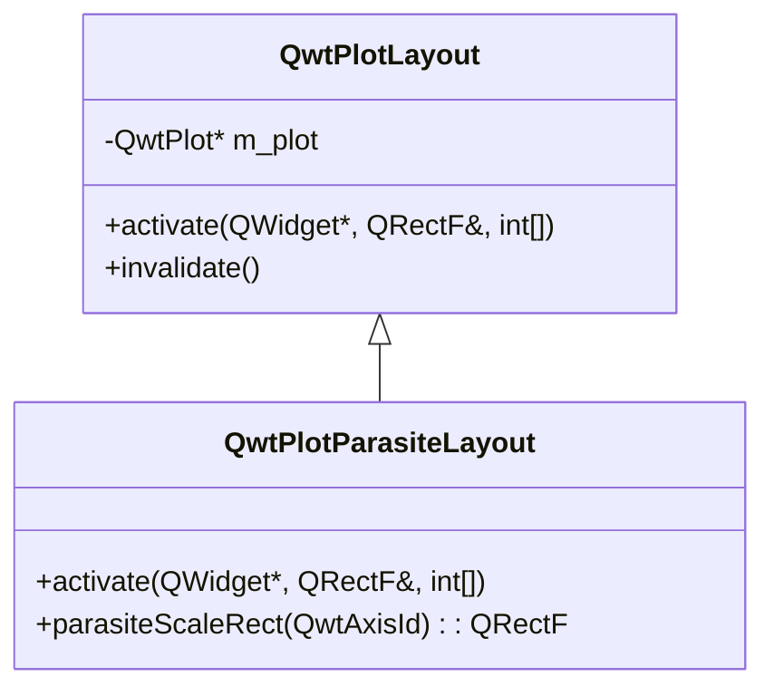

# Qwt Parasite Plot Usage Guide

Parasite plots (Parasite Axes) in `QwtPlot` allow creating multiple axes with different scales and labels within the same plot area. A parasite plot shares the same plot area with the host plot (the parasite plot's plot area has a transparent background), but can have an independent coordinate system. This is particularly useful when displaying data of different magnitudes or units.

## How Parasite Plots Work

Parasite plots are created via the `QwtPlot::createParasiteAxes` or `QwtFigure::createParasiteAxes` method (`QwtFigure::createParasiteAxes` internally calls `QwtPlot::createParasiteAxes`). The parasite plot is a child window of the host plot.

Parasite plots have the following characteristics:

1. **Consistent plot area size**: The parasite plot's plot area stays in sync with the host plot
2. **Independent coordinate system**: The parasite plot can have its own scale range and labels
3. **Transparent background**: The parasite plot has a transparent background, displaying only the axes themselves and the plotted curves
4. **Automatic synchronization**: Can optionally share X-axis or Y-axis scales with the host plot

## Creating Parasite Plots

Parasite plots are created via the `QwtPlot::createParasiteAxes` method, defined as follows:

```cpp
QwtPlot* createParasitePlot(QwtAxis::Position enableAxis);
```

`enableAxis` is the axis to be displayed on the parasite plot. The parasite plot will only display this axis; all other axes are hidden.

The parasite plot object created by this method shares the same plot area as the host plot, but can have an independent coordinate system. The host plot internally keeps track of the bound parasite plot objects. **When the host plot is destroyed, the parasite plots are also destroyed.**

When the host plot's size changes, the parasite plots' sizes are adjusted accordingly. The host plot ensures all parasite plots maintain the same size as itself.

Below is a code example for creating a parasite plot:

```cpp
// Create QwtFigure
QwtPlot* hostPlot = new QwtPlot();
//! Set host plot parameters (omitted here)

////////////////////////////////////////////////////////
//! Add parasite coordinate system
////////////////////////////////////////////////////////
QwtPlot* parasitePlot = hostPlot->createParasitePlot(QwtAxis::YLeft);
//! Set the display and shared axes for parasite axis 1
parasitePlot->enableAxis(QwtAxis::YRight, true);
parasitePlot->enableAxis(QwtAxis::XTop, true);
parasitePlot->setParasiteShareAxis(QwtAxis::XBottom);

//! Other settings for the parasite axes
parasitePlot->setAxisTitle(QwtAxis::YLeft, "Y2 Left Axis");
parasitePlot->setAxisTitle(QwtAxis::YRight, "Y2 Right Axis");
parasitePlot->setAxisTitle(QwtAxis::XTop, "X2 Top Axis");

//! Curve for the parasite axes
QColor curColor             = QColor(255, 127, 14);
QwtPlotCurve* parasiteCurve = new QwtPlotCurve("parasite sine Wave 1");
parasiteCurve->setSamples(generateSampleData(100, 2000, 2.3)); // generateSampleData generates a sine curve
parasiteCurve->attach(parasitePlot);
parasiteCurve->setPen(curColor, 1.5);
parasiteCurve->setRenderHint(QwtPlotItem::RenderAntialiased, true);
//! Add color to the parasite axes to distinguish them from the host axes
parasitePlot->axisWidget(QwtAxis::YLeft)->setScaleColor(curColor);
parasitePlot->axisWidget(QwtAxis::YRight)->setScaleColor(curColor);
parasitePlot->axisWidget(QwtAxis::XTop)->setScaleColor(curColor);
```

The result of the above code is shown below:


To create a parasite plot, you first need to create the host plot. The parasite plot is created on top of the host plot via the `QwtPlot::createParasitePlot` function, which returns a pointer to the parasite plot. The parasite plot object is also a `QwtPlot`. You can distinguish whether a plot is a parasite or host plot using the `QwtPlot::isHostPlot` and `QwtPlot::isParasitePlot` functions. If the current plot is a parasite plot, you can get the host plot pointer via `QwtPlot::hostPlot`. If the current plot is a host plot, you can get all parasite plot pointers via `QwtPlot::parasitePlots`.

!!! warning "Note"
    A plot cannot be both a parasite plot and a host plot at the same time. In other words, if a plot is a parasite plot, it is not allowed to create its own parasite plots. Calling `createParasitePlot` on a parasite plot will return `nullptr`.

After a parasite plot is created, its properties can be set just like a normal plot.

The `QwtPlot::setParasiteShareAxis` function can be used to set shared axes between the parasite plot and the host plot. For example, to share the X-axis with the host plot, call `setParasiteShareAxis(QwtAxis::XBottom)` on the parasite plot.

Qwt allows creating multiple parasite plots to achieve any number of overlapping axes. Simply call `createParasitePlot` on the host plot again to create another parasite plot.

```cpp
////////////////////////////////////////////////////////
//! Add second parasite coordinate system
////////////////////////////////////////////////////////
QwtPlot* parasitePlot2 = hostPlot->createParasitePlot(QwtAxis::YLeft);
//! Set the display and shared axes for parasite axis 2
parasitePlot2->enableAxis(QwtAxis::YRight, true);
parasitePlot2->enableAxis(QwtAxis::XBottom, true);
parasitePlot2->setParasiteShareAxis(QwtAxis::XTop);

//! Other settings for the parasite axes
parasitePlot2->setAxisTitle(QwtAxis::YLeft, "Y3 Left Axis");
parasitePlot2->setAxisTitle(QwtAxis::YRight, "Y3 Right Axis");
parasitePlot2->setAxisTitle(QwtAxis::XBottom, "X3 Bottom Axis");
//! Curve for the parasite axes
QColor curColor2             = QColor(192, 43, 149);
QwtPlotCurve* parasiteCurve2 = new QwtPlotCurve("parasite sine Wave 2");
parasiteCurve2->setSamples(generateSampleData(200, 1000, 4.3));
parasiteCurve2->attach(parasitePlot2);
parasiteCurve2->setPen(curColor2, 1);
parasiteCurve2->setRenderHint(QwtPlotItem::RenderAntialiased, true);
//! Add color to the parasite axes to distinguish them from the host axes
parasitePlot2->axisWidget(QwtAxis::YLeft)->setScaleColor(curColor2);
parasitePlot2->axisWidget(QwtAxis::YRight)->setScaleColor(curColor2);
parasitePlot2->axisWidget(QwtAxis::XBottom)->setScaleColor(curColor2);
```

The result of the above code is shown below:


## Parasite Plot Layer Hierarchy

Parasite plots have a layer hierarchy. The layer order primarily determines the layout order of the parasite axes. The first parasite plot added is at the lowest layer, and the last one added is at the highest layer.

During layout, after the host plot layout is complete, the parasite plots are laid out. Lower-layer parasite plots are laid out first, meaning that lower-layer parasite axes are closer to the host plot, while higher-layer parasite axes are farther from the host plot.

## Parasite Plot Layout

The layout of parasite plots is managed jointly by the parasite plot layout manager and the host plot. The parasite plot layout manager is implemented by the `QwtParasitePlotLayout` class, which inherits from `QwtPlotLayout`.



The `activate` function of the `QwtParasitePlotLayout` class calculates the widget sizes for each axis of the parasite plot. These sizes can be retrieved via `parasiteScaleRect`. These sizes are used by the host plot to layout the parasite plot's axis coordinates. Do not use `QwtParasitePlotLayout::scaleRect` to get the parasite plot's axis dimensions — that function returns the same dimensions as the host plot.

The host plot layouts the axis coordinates of each parasite plot via the `QwtPlot::updateAxisEdgeMargin` function.

Each axis controls its distance to the plot area and to the plot boundary through the `QwtScaleWidget::margin` and `QwtScaleWidget::edgeMargin` parameters.

For example, the effect of the following code is shown in the figure below:

```cpp
QwtPlot* plot = new QwtPlot;
...
plot->axisWidget(QwtAxis::YLeft)->setMargin(50);
plot->axisWidget(QwtAxis::YLeft)->setEdgeMargin(100);
```


- **margin**: Determines the distance from the axis (near the plot area boundary) to the plot area. Default is 0 (flush with the plot area).
- **edgeMargin**: Determines the distance from the axis (near the plot boundary) to the plot boundary. Default is 0 (flush with the plot border).

These two parameters are sufficient for proper display of a parasite plot's axes.

The `QwtPlot::updateAxisEdgeMargin`/`QwtPlot::updateAllAxisEdgeMargin` functions automatically calculate the `margin` and `edgeMargin` for parasite and host plots to prevent overlapping between axis layers.

The general calculation process is as follows:

1. Collect the "net" rectangles of the host and all visible parasite axes (with old edgeMargin and margin excluded)
2. For each layer i:
   - margin = sum of net rectangle sizes from layer 0 to i-1
   - edgeMargin = sum of net rectangle sizes from layer i+1 to the last layer
3. Set the new values to the corresponding axis QwtScaleWidget
4. The host's margin is preserved (to avoid overwriting values the user may have set manually).

!!! warning "Note"
    `QwtPlot::updateAxisEdgeMargin`/`QwtPlot::updateAllAxisEdgeMargin` do not modify the host plot's `margin` property.

After adding parasite axes and before displaying the plot, you should manually call `updateAllAxisEdgeMargin` to update the parasite plot axis layout.

## Parasite Plot Operations

### Getting All Plot Items

When iterating over `QwtPlotItem` objects, you must not only process the host plot but also consider all parasite plots.

Typically, event handling is bound to the host plot. You can get the host plot pointer and use the `QwtPlot::plotList` function to get all plot layers. This function returns all plots in ascending order by default, with the host plot itself as the first element in the list.

Then use `itemList` to get each layer's `QwtPlotItem` list for processing. Example code:

```cpp
const QList<QwtPlot*> plotList = plot->plotList();
for (QwtPlot* oneplot : plotList) {
    const QwtPlotItemList& items = oneplot->itemList();
    for (QwtPlotItem* item : items) {
        // Process plot item
    }
}
```

!!! tips "Note"
    Calling `QwtPlot::plotList` on any plot will return the complete list of all plots, whether called from a parasite plot or a host plot — the result is the same.

### Handling Coordinate Transforms

Qwt6 provides various coordinate transform functions to assist with coordinate conversion during plotting. Since Qwt6 was not designed with parasite plots fully in mind, some coordinate transform functions may have compatibility issues, for example:

```cpp
QRectF QwtPlotPicker::invTransform(const QRect&) const;
QRect QwtPlotPicker::transform(const QRectF&) const;
QPointF QwtPlotPicker::invTransform(const QPoint&) const;
QPoint QwtPlotPicker::transform(const QPointF&) const;
```

The above functions all perform coordinate transforms based on fixed X and Y axes and will not work correctly in the presence of parasite plots.

For coordinate transforms with parasite plots, avoid using fixed-axis transform methods. Instead, obtain the corresponding transform objects through `QwtPlotItem` for processing.

Example code:

```cpp
QPointF valuePoint;
// ...
const QList<QwtPlot*> plotList = plot->plotList();
for (QwtPlot* oneplot : plotList) {
    const auto items = oneplot->itemList();
    for (auto* item : items) {
        const QwtScaleMap xMap = oneplot->canvasMap(item->xAxis());
        const QwtScaleMap yMap = oneplot->canvasMap(item->yAxis());
        QPointF screenPos = QwtScaleMap::transform(xMap, yMap, valuePoint);
        // ...
    }
}
```

The above code transforms the coordinate point `valuePoint` to screen coordinates corresponding to each plot item's axes. This assumes you already know the current plot window. If the plot window is unknown and you only have a `QwtPlotItem`, you can handle it as follows:

```cpp
QPointF valuePoint;
QwtPlotItem* item = ...;

QwtPlot* itemPlot = item->plot();
if (!itemPlot) {
    // Cannot process without a bound plot
    return;
}
const QwtScaleMap xMap = itemPlot->canvasMap(item->xAxis());
const QwtScaleMap yMap = itemPlot->canvasMap(item->yAxis());
// Transform to screen coordinates
QPointF screenPos = QwtScaleMap::transform(xMap, yMap, valuePoint);
```

!!! example "Coordinate Transform Example"
    Refer to the `pickYValue` and `pickNearestPoint` implementations in the `QwtPlotSeriesDataPicker` class, which is used for picking curve points and already accounts for parasite plots.

## Notes

### 1. Lifecycle Management

- The lifecycle of parasite plots is bound to the host plot
- When the host plot is removed or destroyed, parasite plots are automatically cleaned up
- No manual deletion of parasite plot objects is needed

### 2. Layout Limitations

- Parasite plots cannot be the currently active axis in `QwtFigure`
- Parasite plots do not participate in `QwtFigureLayout` layout calculations
- Parasite plots have the `Qt::WA_TransparentForMouseEvents` attribute set, meaning they do not accept any mouse events — all mouse events are handled by the host plot
- Parasite plot positions are controlled by the host plot

!!! example "Parasite Plot Example"
    Complete example code can be found in `examples/parasitePlot`
