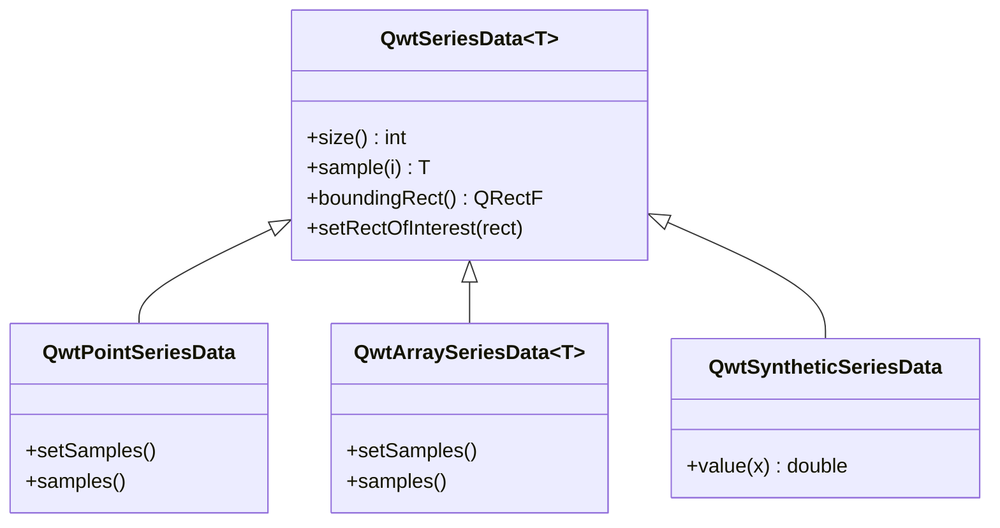

# Data Series - QwtSeriesData

`QwtSeriesData` is the abstract interface for plot item data, providing data access methods for plots. By creating custom `QwtSeriesData` derived classes, flexible data management can be achieved, supporting data retrieval from various sources such as memory, files, and databases.

## Main Features

**Features**

- ✅ **Data abstraction interface**: Defines a unified data access interface
- ✅ **Multiple built-in implementations**: Provides common implementations such as memory storage and external array references
- ✅ **Dynamic data support**: Supports real-time updates and large data scenarios
- ✅ **Bounding calculation**: Automatically calculates data bounding rectangle

## Basic Concepts

### Data Interface Structure



### Built-in Data Classes

| Class Name | Description |
|------|------|
| `QwtPointSeriesData` | Stores QPointF data points |
| `QwtArraySeriesData<T>` | Stores arbitrary type data arrays |
| `QwtSyntheticSeriesData` | Generates function data (not stored) |

## Usage

### 1. Using Built-in Data Classes

```cpp
#include <QwtPlotCurve>
#include <QwtPointSeriesData>

QwtPlotCurve* curve = new QwtPlotCurve();

// Method 1: Use QwtPlotCurve convenience methods directly
QVector<double> xData, yData;
curve->setSamples(xData, yData);

// Method 2: Use QwtPointSeriesData
QwtPointSeriesData* seriesData = new QwtPointSeriesData();
QVector<QPointF> points;
points << QPointF(0, 0) << QPointF(1, 1) << QPointF(2, 4);
seriesData->setSamples(points);
curve->setData(seriesData);
```

### 2. Referencing External Data

```cpp
#include <QwtPlotCurve>

QwtPlotCurve* curve = new QwtPlotCurve();

// Use setRawSamples to reference external arrays (no copy)
double x[1000], y[1000];
curve->setRawSamples(x, y, 1000);

// Note: Arrays must remain valid for the lifetime of the curve
// No need to re-set when data changes, just call replot
```

!!! warning "setRawSamples Notes"
    - External arrays must remain valid until the curve is destroyed
    - Do not modify array size, only modify contents
    - Call replot to refresh display after data updates

### 3. Custom Data Class

Implementing a custom data source:

```cpp
#include <QwtSeriesData>

// Custom database data source
class DatabaseSeriesData : public QwtSeriesData<QPointF>
{
public:
    DatabaseSeriesData(const QString& tableName)
        : m_tableName(tableName)
    {
        // Initialize database connection
        m_count = queryCount();
    }

    // Return number of data points
    virtual size_t size() const override
    {
        return m_count;
    }

    // Return data point at specified index
    virtual QPointF sample(size_t i) const override
    {
        // Query the i-th record from database
        return queryPoint(i);
    }

    // Calculate data bounds
    virtual QRectF boundingRect() const override
    {
        if (m_boundingRect.isNull()) {
            // Calculate bounding rectangle
            m_boundingRect = calculateBounds();
        }
        return m_boundingRect;
    }

private:
    QString m_tableName;
    size_t m_count;
    QRectF m_boundingRect;

    size_t queryCount() const;
    QPointF queryPoint(size_t i) const;
    QRectF calculateBounds() const;
};

// Use custom data class
curve->setData(new DatabaseSeriesData("measurements"));
```

### 4. Function-Generated Data

Using `QwtSyntheticSeriesData` to generate function curves:

```cpp
#include <QwtSyntheticSeriesData>

// Function data generator
class FunctionSeriesData : public QwtSyntheticSeriesData
{
public:
    FunctionSeriesData(double(*func)(double), double xMin, double xMax)
        : QwtSyntheticSeriesData(xMin, xMax)
        , m_function(func)
    {
    }

    // Return y value at specified x position
    virtual double value(double x) const override
    {
        return m_function(x);
    }

private:
    double(*m_function)(double);
};

// Use function to generate data
double myFunction(double x) {
    return std::sin(x) * std::cos(2 * x);
}

curve->setData(new FunctionSeriesData(myFunction, 0, 10));
```

### 5. Real-time Data Updates

```cpp
// Real-time data scenario
class RealtimeSeriesData : public QwtSeriesData<QPointF>
{
public:
    RealtimeSeriesData(int maxPoints = 1000)
        : m_maxPoints(maxPoints)
    {
    }

    void appendPoint(const QPointF& point)
    {
        m_points.append(point);
        if (m_points.size() > m_maxPoints) {
            m_points.removeFirst();
        }
        m_boundingRect = QRectF();  // Reset bounds, trigger recalculation
    }

    virtual size_t size() const override { return m_points.size(); }
    virtual QPointF sample(size_t i) const override { return m_points[i]; }
    virtual QRectF boundingRect() const override
    {
        if (m_boundingRect.isNull()) {
            m_boundingRect = calculateBounds();
        }
        return m_boundingRect;
    }

private:
    QVector<QPointF> m_points;
    int m_maxPoints;
    QRectF m_boundingRect;
};

// Usage
RealtimeSeriesData* data = new RealtimeSeriesData(1000);
curve->setData(data);

// Add data in real-time
data->appendPoint(QPointF(time, value));
plot->replot();
```

## Core Method Summary

### QwtSeriesData Interface

| Method | Description |
|------|------|
| `size()` | Return number of data points |
| `sample(i)` | Return the i-th data point |
| `boundingRect()` | Return data bounding rectangle |
| `setRectOfInterest()` | Set region of interest (optimize rendering) |

### QwtPlotCurve Data Methods

| Method | Description |
|------|------|
| `setData()` | Set data object |
| `setSamples()` | Set data arrays |
| `setRawSamples()` | Reference external arrays |
| `data()` | Get data object |

!!! tip "Data Management Recommendations"
    - Static data: Use `setSamples()` to copy data
    - Large data: Use `setRawSamples()` to avoid copying
    - Dynamic data: Implement custom `QwtSeriesData`
    - Function data: Use `QwtSyntheticSeriesData`

!!! example "Related Examples"
    - Real-time data: `examples/2D/realtime`
    - CPU monitor: `examples/2D/cpuplot`

Screenshots of real-time data and CPU monitor:


