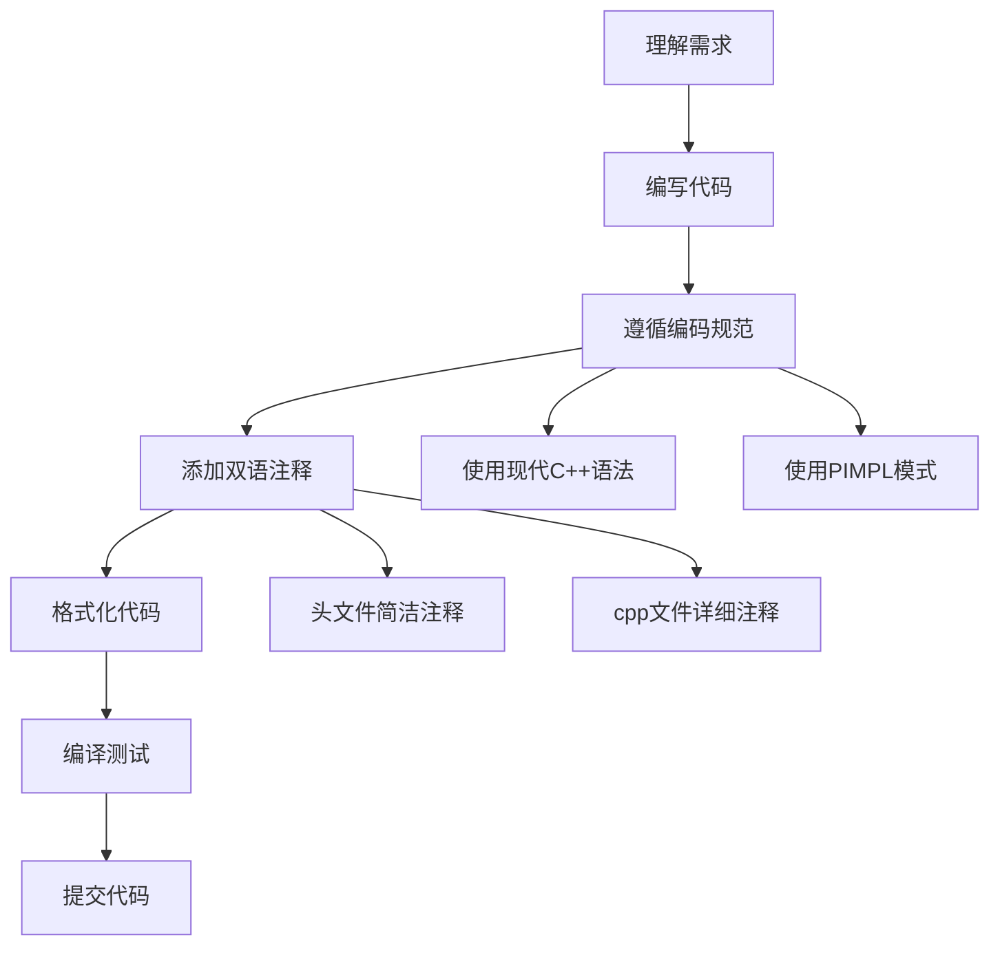

# 开发指引

本部分文档为 Qwt 项目开发者提供详细的开发规范和设计模式指南，确保代码质量和风格统一。

## 文档概览

| 文档 | 说明 |
|------|------|
| [编码规范](coding-standards.md) | 代码格式化、C++11兼容性宏、命名规范等 |
| [注释规范](comment-standards.md) | Doxygen双语注释格式、注释位置规范等 |
| [PIMPL模式](pimpl-pattern.md) | PIMPL设计模式的使用方法和宏定义 |

## 开发流程概览

## 快速开始

### 1. 环境准备

确保开发环境满足以下要求：

- **Qt版本**：Qt 5.12+ 或 Qt 6
- **C++标准**：C++11（Qt5）或 C++17（Qt6）
- **构建系统**：CMake 3.16+
- **编译器**：支持 C++11/17 的编译器

### 2. 编码规范要点

开发前请务必阅读 [编码规范](coding-standards.md)，核心要点：

- 使用 `override` 代替 `QWT_OVERRIDE`
- 使用 `nullptr` 代替 `NULL`
- 使用 `static_cast` 代替 C 风格强制转换
- 使用 `qwt_as_const` 进行 Qt 容器迭代

### 3. 注释规范要点

所有新增代码必须遵循 [注释规范](comment-standards.md)：

- 使用 Doxygen 双语格式（中英文）
- 详细注释写在 `.cpp` 文件
- 简洁注释写在 `.h` 文件

### 4. PIMPL 模式

新增类建议使用 PIMPL 模式，详见 [PIMPL模式使用指南](pimpl-pattern.md)：

- 使用 `QWT_DECLARE_PRIVATE` 宏声明私有指针
- 使用 `QWT_PIMPL_CONSTRUCT` 宏初始化
- 使用 `QWT_D`/`QWT_DC` 宏访问私有数据

## 开发规范检查清单

在提交代码前，请确认以下检查项：

- [ ] 代码已使用 clang-format 格式化
- [ ] 使用现代 C++ 语法（override、nullptr、using）
- [ ] 新增类使用了 PIMPL 模式
- [ ] 函数添加了双语 Doxygen 注释
- [ ] 头文件保持简洁，详细注释在 cpp 文件
- [ ] 代码可正常编译，无警告
- [ ] 示例程序运行正常

## 相关资源

- **文档撰写规范**：[文档撰写规范](../doc-writing-guide.md)
- **构建说明**：[构建指引](../build-guide/build-instructions.md)
- **项目概述**：[AGENTS.md](../../AGENTS.md)

!!! tip "AI Agent 开发者"
    如果你是 AI Agent，请优先阅读 `AGENTS.md` 文件，其中包含项目快速指引和关键信息。