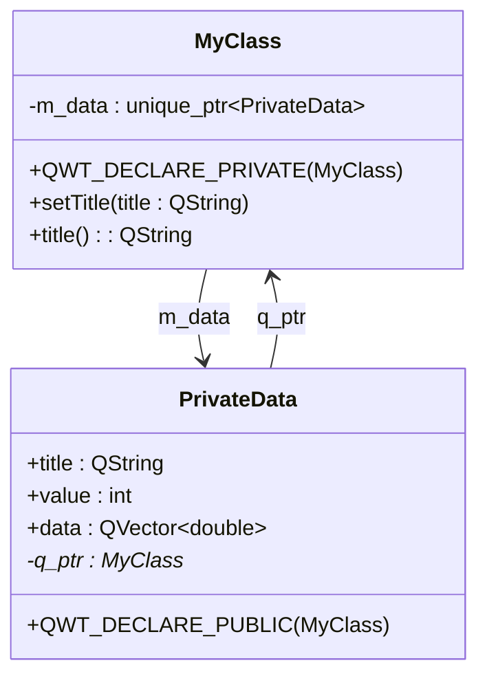

# PIMPL 模式使用指南

本文档介绍 Qwt 项目中 PIMPL（Pointer to Implementation）模式的使用方法，帮助开发者正确使用项目提供的宏定义。

## 主要功能特性

**特性**

- ✅ **隐藏实现细节**：将私有成员和数据隐藏在实现类中
- ✅ **减少头文件依赖**：降低编译依赖，加快编译速度
- ✅ **二进制兼容**：更改实现不影响二进制兼容性
- ✅ **统一宏定义**：项目提供标准宏简化实现

## 什么是 PIMPL 模式

PIMPL（Pointer to Implementation，指向实现的指针）是一种 C++ 设计模式，也称为"编译防火墙"模式。

### 传统方式的缺陷

```cpp
// Traditional approach - all private members exposed in header
class MyClass : public QObject
{
    Q_OBJECT
private:
    QString m_title;          // Exposed in header
    int m_value;              // Any change requires recompiling all dependencies
    QVector<double> m_data;   // Header depends on QVector
};
```

### PIMPL 模式的优势

```cpp
// PIMPL approach - only pointer exposed in header
class MyClass : public QObject
{
    Q_OBJECT
    QWT_DECLARE_PRIVATE(MyClass)  // Auto-generates private data pointer
public:
    MyClass();
private:
    // All private members hidden in MyClass::PrivateData
};
```

!!! tip "PIMPL 模式优势"
    - **编译速度**：修改私有成员只需重新编译单个 cpp 文件
    - **二进制兼容**：私有成员变化不影响 ABI 兼容性
    - **头文件整洁**：头文件只包含公共接口声明

## Qwt PIMPL 宏定义

项目在 `src/qwt_global.h` 中定义了以下宏：

| 宏名称 | 用途 | 使用位置 |
|--------|------|----------|
| `QWT_DECLARE_PRIVATE(Class)` | 声明私有数据指针 | 类声明中 |
| `QWT_DECLARE_PUBLIC(Class)` | 声明公有宿主指针 | PrivateData 类中 |
| `QWT_PIMPL_CONSTRUCT` | 初始化私有数据指针 | 构造函数初始化列表 |
| `QWT_D(name)` | 获取私有数据指针（非常量） | 成员函数中 |
| `QWT_DC(name)` | 获取私有数据指针（常量） | const 成员函数中 |

## 实现步骤详解

### 步骤 1：头文件中声明私有指针

在类声明中使用 `QWT_DECLARE_PRIVATE` 宏：

```cpp
// MyClass.h
#include <qwt_global.h>

class QWT_EXPORT MyClass : public QObject
{
    Q_OBJECT
    QWT_DECLARE_PRIVATE(MyClass)  // Add this macro

public:
    // Constructor (English only)
    explicit MyClass(QObject* parent = nullptr);
    
    // Destructor
    ~MyClass();
    
    // Set the title
    void setTitle(const QString& title);
    
    // Get the title
    QString title() const;

private:
    // Private members no longer declared here
};
```

### 步骤 2：cpp 文件中定义 PrivateData 类

在 cpp 文件中定义私有数据类，使用 `QWT_DECLARE_PUBLIC` 宏：

```cpp
// MyClass.cpp
#include "MyClass.h"

// Define private data class
class MyClass::PrivateData
{
    QWT_DECLARE_PUBLIC(MyClass)  // Auto-generates q_ptr pointer

public:
    PrivateData(MyClass* p);

    QString title;        // Private member variable
    int value;
    QVector<double> data;
};

MyClass::PrivateData::PrivateData(MyClass* p)
    : q_ptr(p)            // Initialize host pointer
    , title(QString())
    , value(0)
{
}
```

### 步骤 3：构造函数初始化

使用 `QWT_PIMPL_CONSTRUCT` 宏初始化私有指针：

```cpp
/**
 * @brief Constructor for MyClass
 * @param parent Parent object pointer
 */
MyClass::MyClass(QObject* parent)
    : QObject(parent)
    , QWT_PIMPL_CONSTRUCT  // Initializes m_data pointer
{
}
```

!!! info "宏展开说明"
    `QWT_PIMPL_CONSTRUCT` 会展开为：`m_data(qwt_make_unique<PrivateData>(this))`

### 步骤 4：析构函数处理

析构函数中自动删除私有数据：

```cpp
MyClass::~MyClass()
{
    // m_data is automatically destroyed, no manual delete required
}
```

### 步骤 5：成员函数访问私有数据

使用 `QWT_D` 和 `QWT_DC` 宏访问私有数据：

```cpp
/**
 * @brief Set the title text
 * @param title The new title text
 */
void MyClass::setTitle(const QString& title)
{
    QWT_D(d);           // Get private data pointer, parameter name can be customized
    d->title = title;   // Access private member

    // Alternatively, use m_data directly:
    // m_data->title = title;
}

/**
 * @brief Get the current title
 * @return The current title text
 */
QString MyClass::title() const
{
    QWT_DC(d);          // Use QWT_DC for const member functions
    return d->title;
}
```

## 完整示例



### 头文件 MyClass.h

```cpp
#ifndef MYCLASS_H
#define MYCLASS_H

#include <QObject>
#include <qwt_global.h>

class QWT_EXPORT MyClass : public QObject
{
    Q_OBJECT
    QWT_DECLARE_PRIVATE(MyClass)

public:
    explicit MyClass(QObject* parent = nullptr);
    ~MyClass();

    void setTitle(const QString& title);
    QString title() const;
    
    void setValue(int value);
    int value() const;

private:
    // Private implementation hidden
};

#endif // MYCLASS_H
```

### 源文件 MyClass.cpp

```cpp
#include "MyClass.h"

// Private data class definition
class MyClass::PrivateData
{
    QWT_DECLARE_PUBLIC(MyClass)

public:
    PrivateData(MyClass* p)
        : q_ptr(p)
        , title(QString())
        , value(0)
    {
    }

    QString title;
    int value;
    QVector<double> data;
};

// Constructor
MyClass::MyClass(QObject* parent)
    : QObject(parent)
    , QWT_PIMPL_CONSTRUCT
{
}

// Destructor
MyClass::~MyClass()
{
}

// Setter
void MyClass::setTitle(const QString& title)
{
    QWT_D(d);
    d->title = title;
}

// Getter
QString MyClass::title() const
{
    QWT_DC(d);
    return d->title;
}

void MyClass::setValue(int value)
{
    QWT_D(d);
    d->value = value;
}

int MyClass::value() const
{
    QWT_DC(d);
    return d->value;
}
```

## 最佳实践

### 何时使用 PIMPL 模式

!!! tip "建议使用场景"
    - 类有大量私有成员或私有方法
    - 类的头文件依赖较多，希望减少编译依赖
    - 需要保持二进制兼容性（如库的公共 API）
    - 私有成员可能频繁变化

### 何时不必使用 PIMPL

!!! info "可选场景"
    - 简单的小型类，私有成员很少
    - 内部使用的辅助类，不需要隐藏实现
    - 性能敏感的场景（PIMPL 有轻微的间接访问开销）

### 注意事项

!!! warning "重要提醒"
    1. **构造函数必须初始化**：使用 `QWT_PIMPL_CONSTRUCT` 或手动初始化 `m_data`
    2. **const 函数使用 QWT_DC**：确保 const 正确性
    3. **PrivateData 构造函数参数**：必须接受宿主指针用于初始化 `q_ptr`
    4. **不要在头文件暴露 PrivateData**：PrivateData 类定义只在 cpp 文件中

## 宏展开原理

以下是宏的展开结果，帮助理解其工作原理：

| 宏 | 展开结果 |
|-----|----------|
| `QWT_DECLARE_PRIVATE(Class)` | `std::unique_ptr<PrivateData> m_data;` + `d_func()` 方法 |
| `QWT_DECLARE_PUBLIC(Class)` | `Class* q_ptr;` + `q_func()` 方法 |
| `QWT_PIMPL_CONSTRUCT` | `m_data(qwt_make_unique<PrivateData>(this))` |
| `QWT_D(name)` | `Class::PrivateData* name = d_func();` |
| `QWT_DC(name)` | `const Class::PrivateData* name = d_func();` |

## 相关文档

- [编码规范](coding-standards.md)
- [注释规范](comment-standards.md)