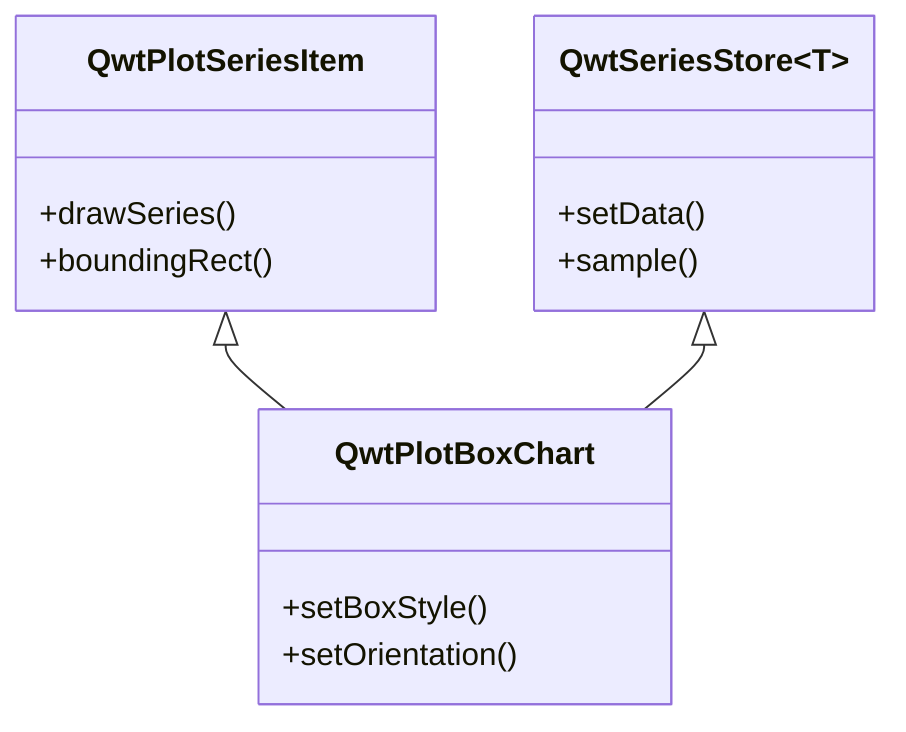
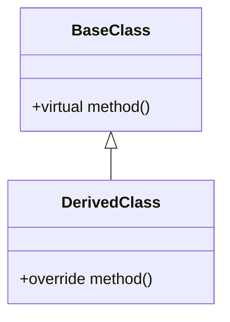
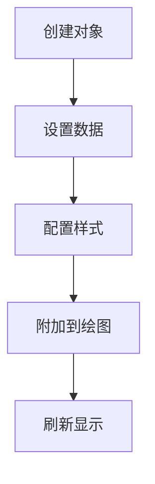

# Qwt 中文文档撰写规范

本规范用于指导 Qwt 中文文档的撰写，确保文档风格统一、内容完整、易于理解。

## 文档结构

### 1. 标题层级

```markdown
# 类名/功能名称
## 主要功能特性
## 使用方法
### 子功能模块
#### 具体功能点
## 注意事项
## 参考资料
```

### 2. 必备章节

每个功能文档必须包含以下章节：

| 章节 | 必备程度 | 说明 |
|------|----------|------|
| 功能概述 | 必备 | 开头一句话说明类的用途和特点 |
| 主要功能特性 | 必备 | 列举核心功能，使用 ✅ 标记 |
| 使用方法 | 必备 | 详细的使用步骤和代码示例 |
| 完整示例 | 推荐 | 可运行的完整代码示例 |
| 注意事项 | 推荐 | 使用 !!! 格式标注重要信息 |
| 参考资料 | 可选 | 相关文档、示例路径链接 |

## 内容撰写原则

### 1. 文字说明要求

- **每个代码块前后必须有文字说明**：解释代码的作用、关键步骤、输出效果
- **避免纯代码堆砌**：代码不应占据文档主体，文字说明应占 60% 以上
- **逐步引导**：按照"是什么 → 为什么 → 怎么用"的逻辑顺序组织

### 2. 功能介绍格式

使用功能列表形式，每项功能前加 ✅ 标记：

```markdown
**特性**

- ✅ **功能名称**：简要说明
- ✅ **另一功能**：简要说明
```

### 3. 代码示例规范

代码示例必须包含：

1. **注释说明**：关键行必须有注释
2. **完整可运行**：示例代码应可直接运行（必要头文件包含）
3. **效果说明**：代码后说明运行效果，配合截图或示意图

```cpp
// 创建箱线图对象
QwtPlotBoxChart* boxChart = new QwtPlotBoxChart("标题");
boxChart->attach(plot);  // 必须附加到绘图才能显示

// 设置数据
QVector<QwtBoxSample> samples;
samples << QwtBoxSample(1.0, 10, 20, 35, 50, 60);
boxChart->setSamples(samples);  // 数据设置后自动刷新

// 效果：显示一个包含箱体、须须、中位线的箱线图
```

### 4. 概念解释要求

对于复杂概念，使用以下方式辅助说明：

- **mermaid UML图**：展示类关系、继承结构
- **mermaid 流程图**：展示工作流程
- **ASCII艺术图**：展示结构示意图
- **配图**：实际效果截图

示例（类关系图）：



### 5. 注意事项格式

使用 markdown 扩展语法标注重要信息：

```markdown
!!! warning "重要警告"
    可能导致严重问题的注意事项

!!! info "说明"
    补充说明信息

!!! tip "技巧"
    使用技巧和建议

!!! example "示例"
    示例代码路径：`examples/xxx`

!!! bug "已知问题"
    已知缺陷和规避方法
```

### 6. 属性/方法说明格式

表格形式展示核心属性和方法：

```markdown
### 核心方法

| 方法 | 参数 | 说明 |
|------|------|------|
| `setBoxStyle(Style)` | BoxStyle枚举 | 设置箱体显示样式 |
| `setOrientation(Orient)` | Qt::Orientation | 设置显示方向 |
```

## 图表使用规范

### 1. mermaid 类图

用于展示类的继承关系、组合关系：



### 2. mermaid 流程图

用于展示使用流程、工作流程：



### 3. 结构示意图

使用文本或 ASCII 艺术绘制结构示意：

```text
    │         ┌──┬──┐
    │         │  │  │ ← Q3
    │         │  ┼  │ ← 中位数
    │         │  │  │ ← Q1
    │    ─────┴──┴──┴─────
```

### 4. 效果截图

实际运行效果图片放在 `docs/assets/` 目录：

```markdown

```

## 文档风格统一

### 1. 语言风格

- 使用**中文为主**，技术术语可保留英文
- 避免口语化表达，使用正式书面语言
- 减少被动语态，多用主动语态："你可以设置..."而不是"可以设置..."

### 2. 术语规范

| 英文术语 | 中文翻译 | 说明 |
|----------|----------|------|
| Box-and-Whisker Plot | 箱线图 | 统计图表 |
| Quartile | 四分位数 | Q1, Q2, Q3 |
| Outlier | 异常值 | 超出正常范围的数据点 |
| Whisker | 须须 | 箱线图的延伸线 |

### 3. 代码风格

- 类名使用完整路径：`QwtPlotBoxChart`
- 方法名使用代码格式：`setBoxStyle()`
- 属性名使用代码格式：`boxStyle`
- 枚举值使用完整路径：`QwtPlotBoxChart::Rect`

## 撰写流程建议

1. **收集信息**：阅读类头文件、示例代码、相关文档
2. **确定结构**：按照必备章节规划文档框架
3. **编写内容**：
   - 先写功能概述和特性列表
   - 再写使用方法，每个代码块配合文字说明
   - 补充注意事项和参考资料
4. **添加图表**：绘制类图、流程图、结构示意图
5. **审阅修订**：检查代码可运行性、文字通顺度、格式一致性

## 文档模板

```markdown
# 功能名称使用指南

一句话概述类的用途和特点。

## 主要功能特性

**特性**

- ✅ **功能1**：说明
- ✅ **功能2**：说明

## 基本概念

### 核心概念解释

[文字说明]

```mermaid
classDiagram
    [类关系图]
```

## 使用方法

### 1. 基本使用

[文字说明用途和场景]

```cpp
[代码示例]
```

[效果说明]

### 2. 进阶配置

[文字说明配置选项的作用]

| 方法 | 说明 |
|------|------|
| 方法1 | 说明 |
| 方法2 | 说明 |

```cpp
[配置代码]
```

!!! warning "注意事项"
    重要提示信息

## 完整示例

```cpp
[完整可运行代码]
```

!!! example "示例路径"
    完整示例可参阅：`examples/xxx`
```

---

本规范适用于 Qwt 所有中文使用指南文档的撰写。
