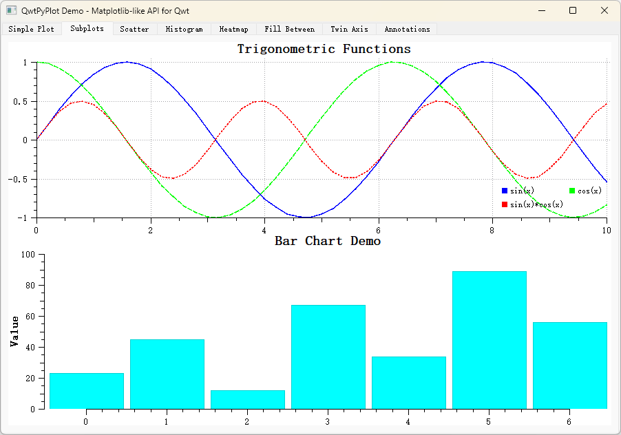
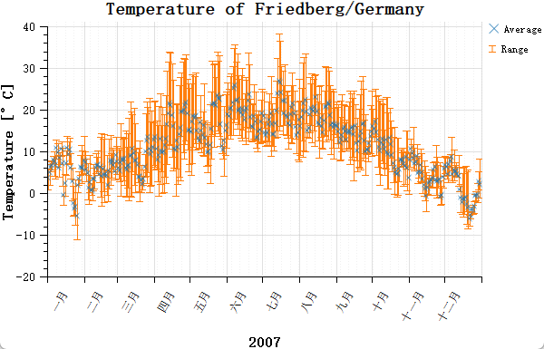
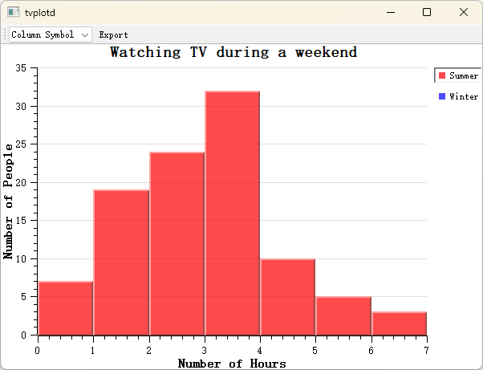

# QWT — Qt 绘图库

QWT（Qt Widgets for Technical Applications）是一个基于 Qt 的高性能 2D/3D 绘图库，适用于科学计算和工程应用中的数据可视化。

## 为什么选择 QWT？

Qt 生态里能画图的库不多，主流的有 `QCustomPlot`、`Qwt`、`Qt Charts` 和 `KDChart`。Qt 6.8 之后把原来的 `Qt Charts`（2D）与 `Qt DataVisualization`（3D）合并为统一的 Qt Graphs 模块，底层全部基于 Qt Quick Scene Graph + Qt Quick 3D，放弃了老旧的 Graphics-View/QPainter 管线。不过 Qt Graphs 必须通过 QQuickWidget 或 QQuickWindow 嵌入，必须带 QML runtime，C++ 支持不足，且不支持 Win7 等老系统，对嵌入式也不友好。

| 库 | 协议 | 优势 | 劣势 |
|---|---|---|---|
| **QCustomPlot** | GPL | 简单易用，开箱即用 | GPL 传染性，商业不友好 |
| **Qwt** | LGPL | 性能优越，架构合理 | 原作者停止更新，部署较难 |
| **Qt Charts** | GPL | Qt 官方 | 效率低，GPL 协议 |
| **KDChart** | MIT (3.0+) | 商业友好 | 渲染效果一般 |

**本项目**基于 Qwt 6.2.0 进行维护和改进，添加了现代化功能和修复，使其成为协议友好、性能优越、方便使用的 Qt 绘图库。

## Qwt 7.0 新特性

- [x] **CMake 支持** — `find_package(qwt)` 一键引入
- [x] **支持 Qt6** — 兼容 Qt 5.12+ 和 Qt 6.x
- [x] **单一文件引入** — 类似 QCustomPlot，只需 `QwtPlot.h` + `QwtPlot.cpp`
- [x] **美化控件风格** — 去除老旧浮雕风格，现代化 UI
- [x] **Figure 绘图容器** — 类似 matplotlib 的多绘图布局
- [x] **多坐标轴** — 寄生轴架构，支持任意多个坐标轴
- [x] **坐标轴交互** — 鼠标拖动、滚轮缩放
- [x] **2D/3D 一体化** — 内置 3D 绘图模块
- [x] **C++11 优化** — 全面使用 `override`、`nullptr`、智能指针、范围 for 循环等现代 C++ 特性
- [x] **超大规模数据渲染优化** — 4 种曲线降采样算法 + SIMD 加速，百万级数据流畅渲染
- [x] **颜色循环系统** — 可自定义的颜色循环，自动为系列数据分配颜色
- [x] **箱线图** — `QwtPlotBoxChart` 支持统计分布可视化
- [x] **Flat 风格控件** — 滑块、旋钮、刻度盘等控件支持扁平化样式

## 快速集成

=== "CMake（推荐）"

    ```cmake
    find_package(qwt REQUIRED)
    target_link_libraries(${PROJECT_NAME} PRIVATE qwt::plot)
    # 3D 绘图
    target_link_libraries(${PROJECT_NAME} PRIVATE qwt::plot3d)
    ```

=== "单文件引入"

    ```cpp
    // 将 src-amalgamate/QwtPlot.h 和 QwtPlot.cpp 加入项目
    #include "QwtPlot.h"

    auto* plot = new QwtPlot("My Plot");
    auto* curve = new QwtPlotCurve("Data");
    ```

## 项目地址

- **GitHub**: [https://github.com/czyt1988/QWT](https://github.com/czyt1988/QWT)
- **Gitee**: [https://gitee.com/czyt1988/QWT](https://gitee.com/czyt1988/QWT)
- **在线文档**: [https://czyt1988.github.io/QWT/zh/](https://czyt1988.github.io/QWT/zh/)

## 效果展示

### 基本图表

<div class="grid cards" markdown>

- 
  `examples/figure`

- 
  `examples/2D/simpleplot`

- 
  `examples/2D/barchart`

- 
  `examples/2D/scatterplot`

- 
  `examples/2D/curvedemo`

- 
  `examples/2D/boxchart`

</div>

### 实时可视化

<div class="grid cards" markdown>

- 
  `examples/2D/cpuplot`

- 
  `examples/2D/realtime`

- 
  `examples/2D/oscilloscope`

- 
  `examples/2D/radio`

- 
  `examples/2D/sysinfo`

- 
  `examples/2D/animation`

</div>

### 高级图表

<div class="grid cards" markdown>

- 
  `examples/2D/spectrogram`

- 
  `playground/vectorfield`

- 
  `examples/2D/stockchart`

- 
  `examples/2D/polardemo`

- 
  `examples/parasitePlot`

- 
  `examples/2D/bode`

- 
  `playground/shapes`

- 
  `playground/scaleengine`

- 
  `examples/2D/pyplot`

</div>

### 其他示例

<div class="grid cards" markdown>

- 
  `examples/2D/distrowatch`

- 
  `examples/2D/friedberg`

- 
  `examples/2D/friedberg`

- 
  `examples/2D/itemeditor`

- 
  `examples/2D/rasterview`

- 
  `examples/2D/rasterview`

- 
  `examples/2D/refreshtest`

- 
  `examples/2D/splineeditor`

- 
  `examples/2D/tvplot`

- 
  `playground/curvetracker`

- 
  `playground/graphicscale`

- 
  `playground/plotmatrix`

- 
  `playground/rescaler`

- 
  `playground/svgmap`

- 
  `playground/timescale`

</div>

### 交互演示

<div class="grid cards" markdown>

- 
  坐标轴拖动

- 
  坐标轴缩放

- 
  Figure 交互蒙版

- 
  数据拾取器

</div>

## 版权信息

```
Qwt Widget Library
Copyright (C) 1997   Josef Wilgen
Copyright (C) 2002   Uwe Rathmann

Qwt is published under the Qwt License, Version 1.0.
```
