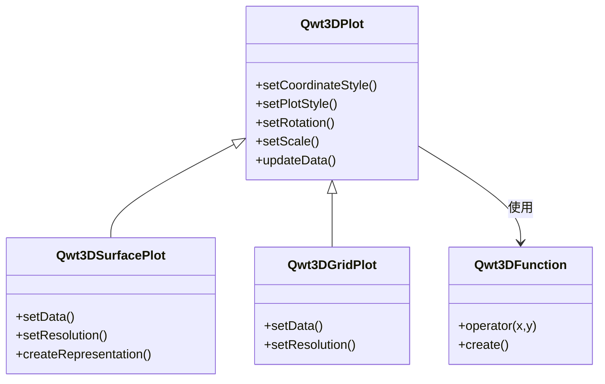

# 3D绘图简介

Qwt 7.1 将原 `QwtPlot3D` 库整合进来，提供了三维数据可视化能力。3D绘图模块支持表面图、网格图、函数绘图等类型，适合科学计算和工程分析中的三维数据展示。

## 主要功能特性

**特性**

- ✅ **多种绘图类型**：表面图、网格图、参数曲面等
- ✅ **OpenGL渲染**：利用OpenGL实现高性能三维渲染
- ✅ **交互操作**：支持鼠标旋转、缩放、平移
- ✅ **光照和材质**：支持光照效果和材质配置
- ✅ **主题系统**：一键切换视觉风格，支持10种预设主题和22种科学色彩映射

## 3D绘图模块结构



## 核心类介绍

| 类名 | 说明 |
|------|------|
| `Qwt3DPlot` | 3D绘图基类，提供基本框架和交互 |
| `Qwt3DSurfacePlot` | 3D表面图，显示连续曲面 |
| `Qwt3DGridPlot` | 3D网格图，显示离散网格数据 |
| `Qwt3DFunction` | 3D函数绘图，根据数学函数生成曲面 |
| `Qwt3DAxis` | 3D坐标轴配置 |
| `Qwt3DColorLegend` | 3D颜色条 |
| `Qwt3DTheme` | 3D主题系统，封装背景、网格、colormap、坐标轴、光照等全部视觉属性 |

## 使用方法

3D绘图的例子位于:`examples/3D/simpleplot3D`，例子截图如下：


### 基本使用示例

```cpp
#include <Qwt3DPlot>
#include <Qwt3DSurfacePlot>
#include <Qwt3DFunction>

// 创建表面图
Qwt3DSurfacePlot* plot = new Qwt3DSurfacePlot();

// 定义函数
class MyFunction : public Qwt3DFunction
{
public:
    virtual double operator()(double x, double y) override
    {
        return std::sin(x) * std::cos(y);  // 数学函数
    }
};

// 创建函数对象
MyFunction* func = new MyFunction();

// 设置数据范围和分辨率
func->setDomain(-5, 5, -5, 5);  // x和y范围
func->setResolution(50);         // 50x50网格

// 创建曲面
func->create(plot);

// 设置旋转角度
plot->setRotation(30, 0, 45);  // X、Y、Z轴旋转角度

// 显示
plot->show();
```

### 数据加载

```cpp
// 从数据数组加载
Qwt3DSurfacePlot* plot = new Qwt3DSurfacePlot();

// 设置数据范围
plot->setDomain(0, 100, 0, 100);  // X、Y范围

// 设置分辨率
plot->setResolution(100);  // 100x100网格

// 加载Z值数据（100x100数组）
double zData[100][100];
// ... 填充数据 ...
plot->loadFromData(zData, 100, 100);
```

### 交互操作

```cpp
// 启用鼠标交互
plot->setMouseInteraction(true);

// 鼠标操作：
// - 左键拖动：旋转视角
// - 中键拖动：平移
// - 滚轮：缩放

// 设置缩放比例
plot->setScale(1.0, 1.0, 1.0);  // X、Y、Z缩放比例

// 设置旋转角度
plot->setRotation(45, 30, 60);  // X、Y、Z轴旋转角度（度）
```

### 颜色映射

```cpp
#include <Qwt3DColorLegend>

// 启用颜色条
Qwt3DColorLegend* legend = new Qwt3DColorLegend();
legend->setLimits(0, 10);  // Z值范围
legend->show(plot);

// 设置颜色映射
plot->setColorFromData();  // 根据Z值自动映射颜色
```

### 主题系统（v7.3.1+）

`Qwt3DTheme` 类提供一键切换 3D 绘图视觉风格的能力，封装了背景色、网格色、数据色彩映射（colormap）、坐标轴颜色、标题样式、光照预设、着色模式等全部视觉属性。

#### 内置预设主题

| 预设名称 | 说明 |
|---------|------|
| `Default` | 白底 + jet 色彩映射 + 无光照 |
| `Dark` | 深灰底 + viridis + 柔和光照 |
| `Scientific` | 白底 + jet + 工作室光照 |
| `Warm` | 暖色底 + hot 色彩映射 |
| `Cool` | 冷色底 + cool 色彩映射 |
| `Matplotlib` | matplotlib 风格（viridis + 柔和光照） |
| `EarthTones` | 大地色调 + autumn 色彩映射 |
| `Ocean` | 海洋色调 + winter 色彩映射 |
| `HighContrast` | 黑底白线高对比度 |
| `Presentation` | 大字体 + 粗线条，适合演示 |

#### 使用示例

```cpp
#include <qwt3d_theme.h>

// 方式1：使用预设主题（推荐）
plot->applyTheme(Qwt3DTheme::Dark);

// 方式2：通过名称应用主题
plot->applyTheme("Scientific");

// 方式3：自定义主题
Qwt3DTheme theme(Qwt3DTheme::Scientific);
theme.setDataColorPreset("plasma");  // 使用 22 种科学 colormap 预设之一
theme.setShininess(20.0);
theme.setLightingPreset(Qwt3DTheme::Studio);
theme.apply(&plot);
```

#### 色彩映射预设

`Qwt3DTheme` 通过 `core` 模块的 `QwtColorMapPreset` 提供 22 种科学可视化色彩映射：

- 感知均匀：`viridis`、`plasma`、`inferno`、`magma`、`cividis`
- 经典：`jet`、`hot`、`cool`、`spring`、`summer`、`autumn`、`winter`
- 灰度：`gray`、`bone`、`copper`
- 彩虹：`rainbow`、`hsv`、`turbo`
- 发散：`coolwarm`、`rdylbu`、`rdylgn`、`spectral`

```cpp
// 切换色彩映射
theme.setDataColorPreset("viridis");

// 查看所有可用预设
QStringList presets = QwtColorMapPreset::availablePresets();
```

#### 光照预设

| 预设 | 说明 |
|------|------|
| `NoLighting` | 无光照，纯色渲染 |
| `FlatLight` | 均匀环境光 |
| `Studio` | 经典三点照明 |
| `Outdoor` | 强方向光 + 环境光 |
| `Soft` | 柔和漫射光 |

## 构建配置

使用3D功能需要启用 `QWT_CONFIG_QWTPLOT_3D` CMake选项：

```cmake
find_package(qwt REQUIRED)

# 链接2D绘图库
target_link_libraries(${PROJECT_NAME} PRIVATE qwt::plot)

# 链接3D绘图库
target_link_libraries(${PROJECT_NAME} PRIVATE qwt::plot3d)
```

!!! warning "OpenGL依赖"
    3D绘图模块依赖OpenGL和GLU库。确保系统已安装OpenGL驱动和GLU库。

## 核心方法总结

| 方法 | 说明 |
|------|------|
| `setDomain()` | 设置X/Y数据范围 |
| `setResolution()` | 设置网格分辨率 |
| `setRotation()` | 设置旋转角度 |
| `setScale()` | 设置缩放比例 |
| `createRepresentation()` | 创建曲面表示 |
| `updateData()` | 更新数据 |

!!! tip "3D绘图建议"
    - 数据量不宜过大（推荐100x100网格以下）
    - 复杂曲面可适当降低分辨率提升性能
    - 使用光照效果增强视觉效果

!!! example "相关示例"
    - 基础3D绘图：`examples/3D/simpleplot3D`
    - 3D轴配置：`examples/3D/axes`
    - 3D增强：`examples/3D/enrichments`