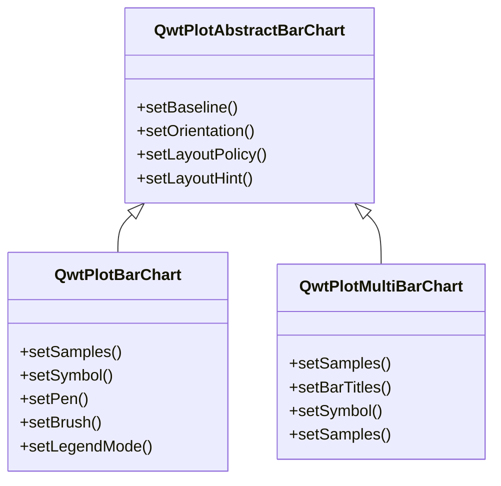

# 柱状图 - QwtPlotBarChart

`QwtPlotBarChart` 是用于绘制柱状图（条形图）的绘图项类。它支持分组柱状图和堆叠柱状图，可以水平或垂直显示，适合展示分类数据的对比分析。

## 主要功能特性

**特性**

- ✅ **分组/堆叠模式**：支持多组数据的分组对比和堆叠累计显示
- ✅ **方向切换**：支持垂直和水平两种显示方向
- ✅ **样式自定义**：可设置柱体的填充、边框、宽度等属性
- ✅ **基线配置**：支持自定义柱体起始基线位置
- ✅ **图例模式**：可选择显示图表标题或每个柱体的独立标题

## 基本概念

### 柱状图类型

Qwt 提供两种柱状图类：

| 类名 | 说明 |
|------|------|
| `QwtPlotBarChart` | 单组柱状图，每组一个柱体 |
| `QwtPlotMultiBarChart` | 多组柱状图，支持分组和堆叠模式 |

### 柱状图模式

| 模式 | 说明 |
|------|------|
| `Grouped` | 分组模式：多组数据并列显示，便于对比 |
| `Stacked` | 堆叠模式：多组数据叠加显示，便于看总量 |

### 类继承结构



## 使用方法

柱状图的例子位于:`examples/2D/barchart`，例子截图如下：


### 1. 基本柱状图

创建最简单的单组柱状图：

```cpp
#include <QwtPlot>
#include <QwtPlotBarChart>

QwtPlot* plot = new QwtPlot();
plot->setTitle("柱状图示例");
plot->setCanvasBackground(Qt::white);

// 创建柱状图
QwtPlotBarChart* barChart = new QwtPlotBarChart("销售数据");

// 设置数据（Y值列表，X自动为索引）
QVector<double> values;
values << 10 << 25 << 15 << 30 << 20;
barChart->setSamples(values);

// 设置柱体样式
barChart->setPen(QPen(Qt::darkBlue, 2));       // 边框
barChart->setBrush(QBrush(QColor(100, 150, 200)));  // 填充

// 设置基线（柱体起始位置）
barChart->setBaseline(0.0);  // 从0开始

barChart->attach(plot);
plot->replot();
```

### 2. 设置数据

QwtPlotBarChart 提供多种数据设置方式：

```cpp
// 方式1：仅Y值（X自动为0,1,2...）
QVector<double> yValues;
yValues << 10 << 20 << 30 << 40;
barChart->setSamples(yValues);

// 方式2：指定X和Y坐标
QVector<QPointF> points;
points << QPointF(1, 10) << QPointF(2, 25) << QPointF(3, 15);
barChart->setSamples(points);

// 方式3：使用QwtSeriesData
barChart->setSamples(seriesData);
```

### 3. 柱体样式配置

```cpp
#include <QwtColumnSymbol>

// 创建柱体符号
QwtColumnSymbol* symbol = new QwtColumnSymbol(QwtColumnSymbol::Box);
symbol->setFrameStyle(QwtColumnSymbol::Raised);  // 凸起边框样式

// 设置边框画笔
symbol->setPen(QPen(Qt::darkBlue, 1));

// 设置填充画笔
symbol->setBrush(QBrush(QColor(100, 150, 200, 180)));

// 应用到柱状图
barChart->setSymbol(symbol);

// 或直接设置pen和brush（使用默认样式）
barChart->setPen(QPen(Qt::darkGray, 1));
barChart->setBrush(QBrush(Qt::blue));
```

### 4. 显示方向

```cpp
// 垂直柱状图（默认）- X轴为分类，Y轴为数值
barChart->setOrientation(Qt::Vertical);

// 水平柱状图 - Y轴为分类，X轴为数值
barChart->setOrientation(Qt::Horizontal);
```

### 5. 柱体宽度配置

```cpp
// 设置布局策略
barChart->setLayoutPolicy(QwtPlotAbstractBarChart::AutoAdjustSamples);  // 自动调整
// 其他选项：
// - FixedBarWidth: 固定宽度
// - FixedSampleWidth: 固定样本宽度（包含间距）
// - AdjustSampleWidth: 根据可用空间调整

// 设置布局提示值
barChart->setLayoutHint(0.8);  // 柱体宽度占比（相对样本空间）
```

### 6. 基线设置

基线定义柱体的起始位置：

```cpp
// 默认基线为0
barChart->setBaseline(0.0);

// 设置正值基线（柱体从10开始绘制）
barChart->setBaseline(10.0);

// 设置负值基线（可用于突出显示正值）
barChart->setBaseline(-5.0);
```

### 7. 多组柱状图（QwtPlotMultiBarChart）

```cpp
#include <QwtPlotMultiBarChart>

// 创建多组柱状图
QwtPlotMultiBarChart* multiBar = new QwtPlotMultiBarChart();
multiBar->setTitle("多组数据对比");

// 设置每组的标题（用于图例）
QList<QwtText> titles;
titles << QwtText("组A") << QwtText("组B") << QwtText("组C");
multiBar->setBarTitles(titles);

// 设置数据（每个样本包含多组值）
QVector<QwtSetSample> samples;
samples << QwtSetSample(0, QVector<double>() << 10 << 20 << 15);  // 第1个分类
samples << QwtSetSample(1, QVector<double>() << 25 << 15 << 30);  // 第2个分类
samples << QwtSetSample(2, QVector<double>() << 20 << 25 << 10);  // 第3个分类
multiBar->setSamples(samples);

// 设置显示模式
multiBar->setChartMode(QwtPlotMultiBarChart::Grouped);   // 分组模式
// 或 multiBar->setChartMode(QwtPlotMultiBarChart::Stacked); // 堆叠模式

multiBar->attach(plot);
plot->replot();
```

### 8. 自定义每组柱体样式

```cpp
// 为每组创建不同的符号
QList<QwtColumnSymbol*> symbols;
for (int i = 0; i < 3; i++) {
    QwtColumnSymbol* symbol = new QwtColumnSymbol(QwtColumnSymbol::Box);
    symbol->setBrush(QBrush(colors[i]));  // 不同颜色
    symbol->setPen(QPen(Qt::black, 1));
    symbols.append(symbol);
}
multiBar->setSymbols(symbols);
```

## 核心方法总结

### QwtPlotBarChart

| 方法 | 说明 |
|------|------|
| `setSamples()` | 设置数据 |
| `setSymbol()` | 设置柱体符号 |
| `setPen()` | 设置边框画笔 |
| `setBrush()` | 设置填充画笔 |
| `setBaseline()` | 设置基线位置 |
| `setOrientation()` | 设置显示方向 |
| `setLayoutPolicy()` | 设置布局策略 |
| `setLayoutHint()` | 设置布局参数 |
| `setLegendMode()` | 设置图例模式 |

### QwtPlotMultiBarChart

| 方法 | 说明 |
|------|------|
| `setBarTitles()` | 设置每组标题 |
| `setSamples()` | 设置多组数据 |
| `setSymbols()` | 设置每组符号 |
| `setChartMode()` | 设置分组/堆叠模式 |

## 图例模式

```cpp
// 单一图例条目（显示图表标题）
barChart->setLegendMode(QwtPlotBarChart::LegendChartTitle);

// 每个柱体单独图例条目
barChart->setLegendMode(QwtPlotBarChart::LegendBarTitles);
```

!!! example "相关示例"
    - 柱状图演示：`examples/2D/barchart`