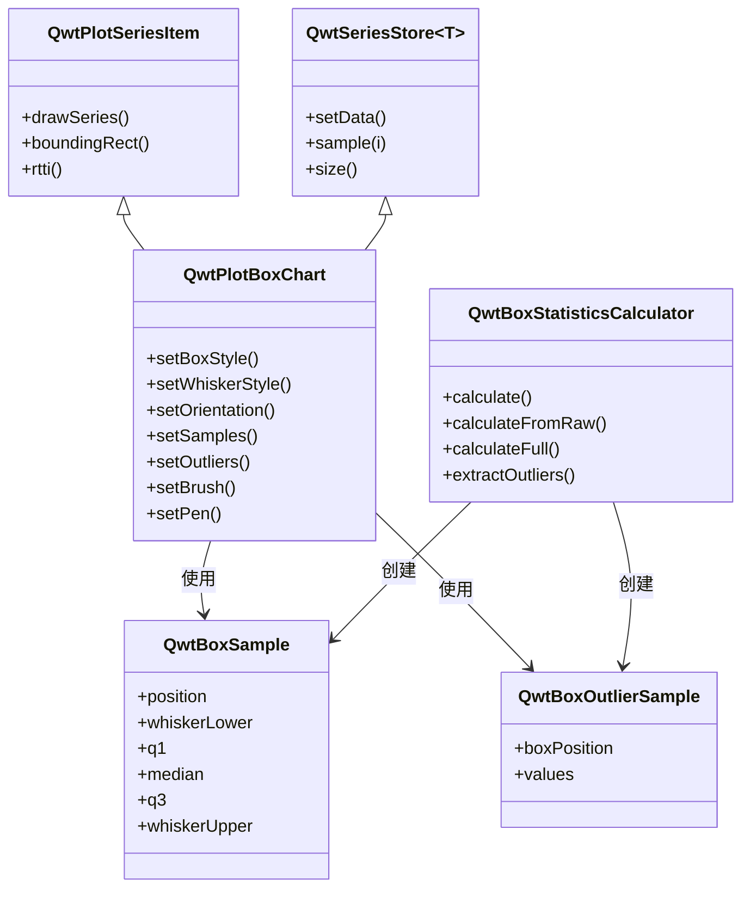
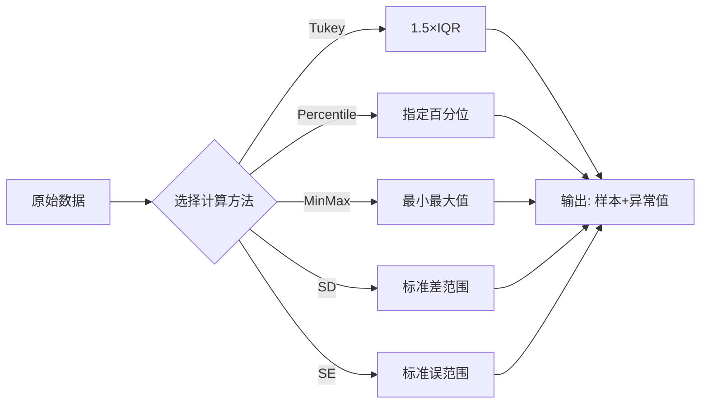

# 箱线图 (Box Chart) 使用指南

`QwtPlotBoxChart` 是 Qwt 提供的箱线图（Box-and-Whisker Plot）绘制类，用于直观展示数据的统计分布特征。箱线图能够清晰地呈现数据的中位数、四分位数、异常值等关键统计信息，是数据分析和科学可视化中不可或缺的工具。

## 主要功能特性

**特性**

- ✅ **灵活的数据输入**：支持预计算统计数据和原始数据自动计算两种方式
- ✅ **自动统计计算**：内置统计计算器，支持 Tukey、百分位数、标准差等多种计算方法
- ✅ **多样化箱体样式**：矩形、菱形、缺口形三种显示样式，适配不同分析场景
- ✅ **方向自由切换**：垂直和水平两种显示方向，满足不同布局需求
- ✅ **异常值智能处理**：自动检测异常值，支持自定义符号和抖动显示
- ✅ **丰富的样式定制**：箱体填充、边框、中位数线、须须样式均可自定义

## 基本概念

### 什么是箱线图

箱线图（Box-and-Whisker Plot）是一种用于展示数据分布特征的统计图表。它通过五个关键数值（五数概括）来描述数据的分布情况：

- **最小值（Minimum）**：数据集的最小值或下须须位置
- **Q1（第一四分位数）**：25%的数据小于此值
- **中位数（Median）**：数据的中间值，50%分位点
- **Q3（第三四分位数）**：75%的数据小于此值
- **最大值（Maximum）**：数据集的最大值或上须须位置

### 箱线图结构示意

下图展示了标准箱线图的各个组成部分：

```text
    │                    ◆ 异常值（超出须须范围）
    │                    
    │         ┌──────┐
    │         │      │
    │         │  Q3  │ ← 上四分位数（75%分位）
    │    ─────│      │───── 上须须（Q3 + 1.5×IQR）
    │         │      │
    │         │ 中位数│ ← 中位数线（50%分位）
    │         │  ──  │
    │         │      │
    │    ─────│  Q1  │───── 下须须（Q1 - 1.5×IQR）
    │         │      │
    │         └──────┘
    │                    ◆ 异常值
    └──────────────────────────────
                  箱体（IQR = Q3 - Q1）
```

### 类关系结构

箱线图相关类的继承和组合关系如下：



### 数据结构详解

#### QwtBoxSample

`QwtBoxSample` 是箱线图的核心数据结构，表示一个箱子的所有统计值：

```cpp
struct QwtBoxSample {
    double position;       // 箱子在位置轴上的坐标（x轴或y轴位置）
    double whiskerLower;   // 下须须位置
    double q1;             // 第一四分位数（25%分位）
    double median;         // 中位数（50%分位）
    double q3;             // 第三四分位数（75%分位）
    double whiskerUpper;   // 上须须位置
    int outlierCount;      // 异常值数量（仅计数，实际值单独存储）
};
```

!!! info "参数顺序说明"
    构造函数参数顺序为：`position, whiskerLower, q1, median, q3, whiskerUpper`
    请确保传入参数顺序正确，否则箱线图会显示异常

#### QwtBoxOutlierSample

异常值数据单独存储，与箱子数据分离：

```cpp
struct QwtBoxOutlierSample {
    double boxPosition;       // 对应箱子的位置
    QVector<double> values;   // 所有异常值列表
};
```

异常值与箱子数据分离的设计优势：

- **独立渲染控制**：异常值可使用不同的符号、颜色、大小
- **灵活的数据管理**：可以单独添加、删除异常值而不影响箱体数据
- **避免数据冗余**：箱体数据和异常值数据各自独立维护

## 使用方法

### 1. 创建基本箱线图

最简单的使用方式是直接提供预计算的统计数据。这种方式适合已经完成统计分析的场景。

**适用场景**：
- 数据已通过其他统计软件处理
- 需要精确控制各统计值
- 批量展示多组已计算好的统计数据

```cpp
#include <QwtPlotBoxChart>
#include <QwtLegend>

// 创建绘图窗口
QwtPlot* plot = new QwtPlot();
plot->setTitle("箱线图示例");
plot->insertLegend(new QwtLegend());

// 创建箱线图对象
QwtPlotBoxChart* boxChart = new QwtPlotBoxChart("数据组A");
boxChart->attach(plot);  // 必须附加到绘图才能显示

// 准备箱线图数据
// 参数顺序：位置, 下须, Q1, 中位数, Q3, 上须
QVector<QwtBoxSample> samples;
samples << QwtBoxSample(1.0, 10.0, 20.0, 35.0, 50.0, 60.0);  // 第一组数据
samples << QwtBoxSample(2.0, 15.0, 25.0, 40.0, 55.0, 70.0);   // 第二组数据
samples << QwtBoxSample(3.0, 8.0, 18.0, 32.0, 48.0, 58.0);    // 第三组数据

// 设置数据到箱线图
boxChart->setSamples(samples);

// 设置样式
boxChart->setBrush(QColor(100, 150, 200, 150));  // 半透明蓝色填充箱体
boxChart->setPen(QPen(Qt::darkBlue, 2.0));       // 深蓝色边框
boxChart->setBoxExtent(0.35);                    // 箱体宽度（相对坐标范围）
```

!!! warning "attach 顺序"
    先调用 `attach()` 再调用 `setSamples()`，因为 attach 时会触发 boundingRect 计算，
    如果数据为空可能导致断言错误。建议按照"创建 → attach → 设置数据 → 设置样式"的顺序。

### 2. 从原始数据自动计算

当只有原始数据时，可以使用 `QwtBoxStatisticsCalculator` 自动计算统计量和异常值。

**适用场景**：
- 实时数据分析展示
- 原始数据直接可视化
- 动态数据更新场景

```cpp
#include <qwt_box_statistics.h>
#include <QwtSymbol>

// 准备原始数据
QVector<double> rawData;
for (int i = 0; i < 100; i++) {
    rawData << 50.0 + (rand() % 50) - 25.0;  // 生成随机数据
}
// 添加一些极端值作为异常值
rawData << 5.0;    // 低异常值
rawData << 100.0;  // 高异常值

// 计算箱线图统计量
QwtBoxSample sample;             // 输出：箱体统计值
QwtBoxOutlierSample outlier;     // 输出：异常值列表

// calculateFull 函数一次性计算所有数据
QwtBoxStatisticsCalculator::calculateFull(
    1.5,              // 箱子位置
    rawData,          // 原始数据数组
    sample,           // 输出：统计结果
    outlier,          // 输出：异常值结果
    QwtBoxStatisticsCalculator::Tukey,  // 计算方法（Tukey = 1.5×IQR）
    1.5               // IQR系数
);

// 创建箱线图并设置计算后的数据
QwtPlotBoxChart* boxChart = new QwtPlotBoxChart("自动计算");
boxChart->attach(plot);

// 设置箱体数据
QVector<QwtBoxSample> samples;
samples << sample;
boxChart->setSamples(samples);

// 设置异常值数据（可选）
QVector<QwtBoxOutlierSample> outliers;
outliers << outlier;
boxChart->setOutliers(outliers);

// 配置异常值显示样式
QwtSymbol* outlierSymbol = new QwtSymbol(QwtSymbol::Diamond);
outlierSymbol->setSize(8, 8);
outlierSymbol->setBrush(Qt::red);            // 红色填充
outlierSymbol->setPen(QPen(Qt::darkRed, 1)); // 深红边框
boxChart->setOutlierSymbol(outlierSymbol);

// 启用抖动避免重叠
boxChart->setOutlierJitter(0.1);
```

### 3. 统计计算方法详解

`QwtBoxStatisticsCalculator` 提供多种须须计算方法，适应不同数据分析需求：



| 计算方法 | 适用场景 | 说明 |
|----------|----------|------|
| `Tukey` | 标准箱线图 | 使用 1.5×IQR 确定须须范围，是最经典的异常值检测方法 |
| `Percentile` | 自定义范围 | 使用指定百分位数（如第5和第95百分位）作为须须端点 |
| `MinMax` | 完整数据范围 | 须须延伸到数据的最小值和最大值，不显示异常值 |
| `StandardDeviation` | 正态分布数据 | 使用均值 ± n×标准差确定范围 |
| `StandardError` | 统计推断 | 使用均值 ± n×标准误，适合样本统计推断 |

!!! tip "方法选择建议"
    - **一般数据分析**：使用 Tukey 方法（默认）
    - **自定义异常标准**：使用 Percentile 或调整 Tukey 系数
    - **展示完整数据分布**：使用 MinMax
    - **正态分布检验**：使用 StandardDeviation

### 4. 箱体样式配置

`QwtPlotBoxChart` 提供三种箱体显示样式，各有不同的视觉效果和分析用途：

```cpp
// 矩形箱体（默认）- 最常用的标准样式
boxChart->setBoxStyle(QwtPlotBoxChart::Rect);

// 菱形箱体 - 强调数据分布的对称性
boxChart->setBoxStyle(QwtPlotBoxChart::Diamond);

// 缺口箱体 - 显示中位数的置信区间
boxChart->setBoxStyle(QwtPlotBoxChart::Notch);
```

!!! info "样式选择指南"
    - `Rect`：标准箱线图样式，适合大多数场景
    - `Diamond`：适合对比多个组的数据分布对称性
    - `Notch`：缺口表示中位数置信区间，若两组缺口不重叠则中位数显著不同

### 5. 显示方向切换

箱线图支持垂直和水平两种显示方向，可以根据绘图布局灵活调整：

```cpp
// 垂直方向（默认）- x轴为位置轴，y轴为数值轴
boxChart->setOrientation(Qt::Vertical);

// 水平方向 - y轴为位置轴，x轴为数值轴
boxChart->setOrientation(Qt::Horizontal);
```

切换方向时需要注意：

!!! warning "方向切换后刷新"
    切换方向后应调用 `plot->replot()` 或 `plot->setAxisAutoScale()` 刷新坐标轴，
    否则坐标轴范围可能不适配新的数据方向

```cpp
// 完整的方向切换示例
void switchOrientation(QwtPlot* plot, QwtPlotBoxChart* boxChart, bool horizontal)
{
    if (horizontal) {
        boxChart->setOrientation(Qt::Horizontal);
        plot->setAxisTitle(QwtAxis::YLeft, "样本位置");
        plot->setAxisTitle(QwtAxis::XBottom, "数值");
    } else {
        boxChart->setOrientation(Qt::Vertical);
        plot->setAxisTitle(QwtAxis::XBottom, "样本位置");
        plot->setAxisTitle(QwtAxis::YLeft, "数值");
    }
    
    // 重要：刷新坐标轴范围
    plot->setAxisAutoScale(QwtAxis::XBottom);
    plot->setAxisAutoScale(QwtAxis::YLeft);
    plot->replot();
}
```

### 6. 异常值样式定制

异常值是箱线图的重要组成部分，可以独立定制其显示样式：

```cpp
// 创建异常值符号
QwtSymbol* symbol = new QwtSymbol(QwtSymbol::Ellipse);
symbol->setSize(10, 10);              // 设置符号大小
symbol->setBrush(QBrush(Qt::red));    // 设置填充颜色
symbol->setPen(QPen(Qt::black, 1));   // 设置边框

// 应用到箱线图
boxChart->setOutlierSymbol(symbol);

// 设置抖动范围避免重叠
// 参数为相对坐标范围的抖动宽度，建议 0.05~0.2
boxChart->setOutlierJitter(0.15);
```

**抖动功能说明**：

当多个异常值数值相同或相近时，它们会在同一位置重叠显
