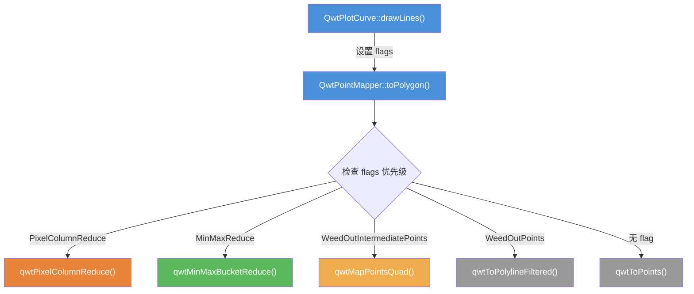
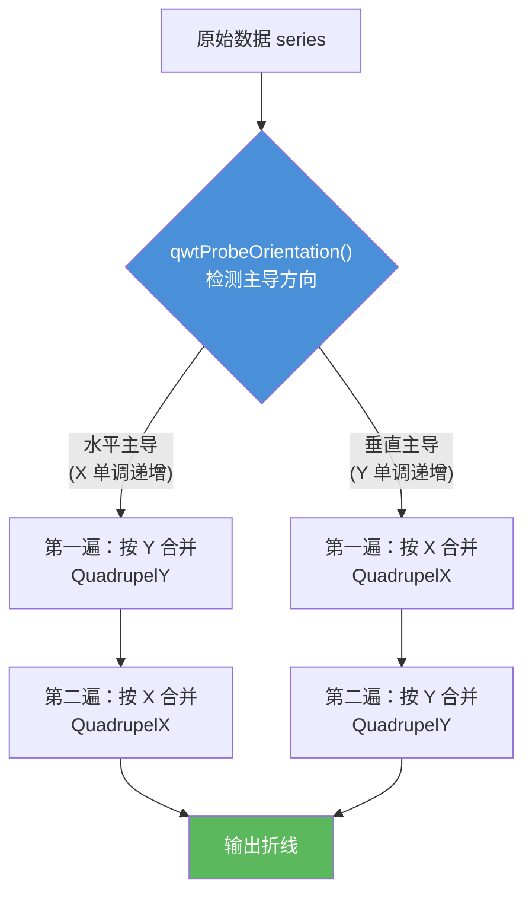
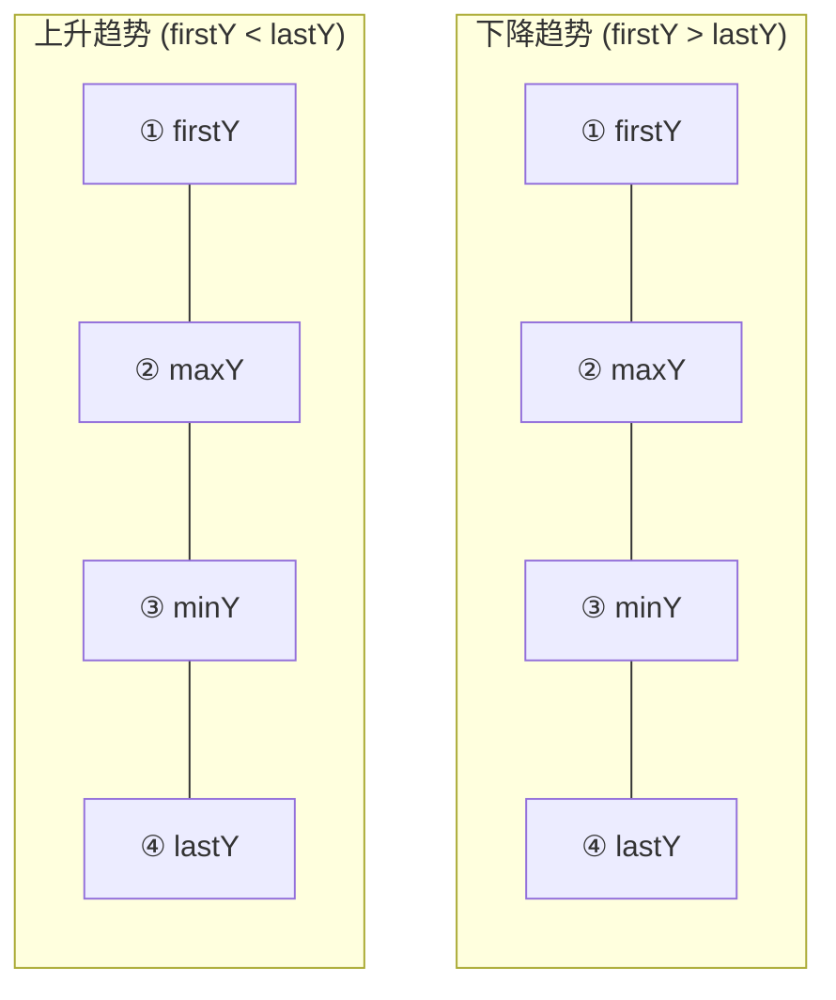
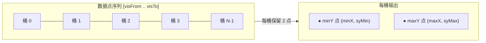
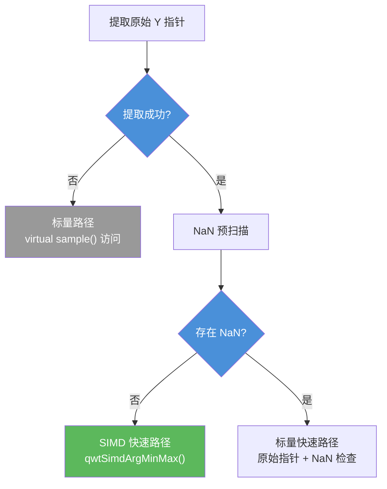
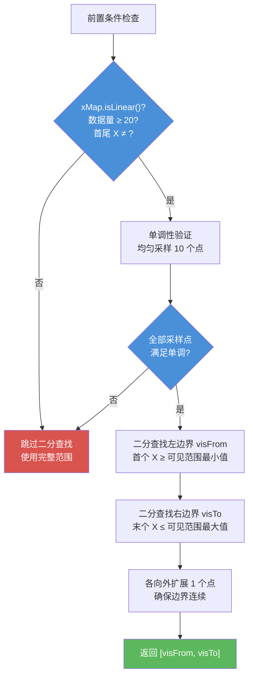
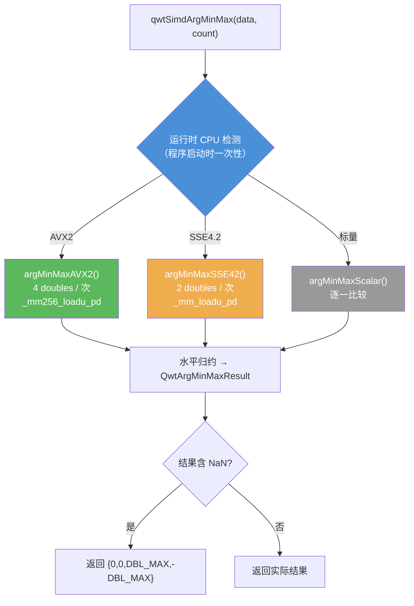

# 曲线降采样算法

当曲线数据量远超画布像素数时，将全部数据点逐一映射并绘制是不必要的——大量点会映射到相同的像素坐标上，产生重复绘制。Qwt 在 `QwtPointMapper` 中实现了一套分层降采样管线，在坐标变换阶段将冗余数据点压缩为视觉等价的精简多边形，从而大幅降低 `QPainter` 的绘制负担。

本文档详细介绍 Qwt 中四种降采样算法的原理、实现细节和性能特征。

## 架构概览

降采样发生在曲线绘制的坐标映射阶段。调用链如下：



!!! info "优先级"
    当多个 flag 同时设置时，按 `PixelColumnReduce > MinMaxReduce > WeedOutIntermediatePoints > WeedOutPoints` 的顺序选择算法。

**关键源码文件：**

| 文件 | 内容 |
|------|------|
| `src/plot/qwt_point_mapper.h` | `QwtPointMapper` 类声明，`TransformationFlag` 枚举定义 |
| `src/plot/qwt_point_mapper.cpp` | 全部降采样算法实现（`qwtMapPointsQuad`、`qwtPixelColumnReduce`、`qwtMinMaxBucketReduce` 等） |
| `src/plot/qwt_simd_argminmax.h/.cpp` | SIMD 加速 argmin/argmax（AVX2/SSE4.2/标量，运行时 CPU 检测） |
| `src/plot/qwt_plot_curve.h` | `QwtPlotCurve::PaintAttribute` 枚举，面向用户的渲染属性接口 |
| `src/plot/qwt_plot_curve.cpp` | `drawLines()` 中将 `PaintAttribute` 映射为 `TransformationFlag` |

**属性映射关系：**

| 用户层 `PaintAttribute` | 内部层 `TransformationFlag` | 算法 |
|-------------------------|---------------------------|------|
| `FilterPoints` | `WeedOutPoints` | 连续重复点过滤 |
| `FilterPointsAggressive` | `WeedOutIntermediatePoints` | Quad Reduce |
| `FilterPointsPixel` | `PixelColumnReduce` | Pixel-Column Reduce |
| `FilterPointsLTTB` | `MinMaxReduce` | MinMax Bucket Reduce |

**优先级**：当多个 flag 同时设置时，`QwtPointMapper::toPolygon()` 按以下优先级选择算法（已在上方流程图中体现）：

> `PixelColumnReduce` > `MinMaxReduce` > `WeedOutIntermediatePoints` > `WeedOutPoints`

## 算法一：连续重复点过滤（FilterPoints / WeedOutPoints）

### 原理

最基础的降采样策略：遍历所有数据点，依次进行坐标变换后，如果当前点的屏幕坐标与前一个输出点完全相同，则跳过该点。

### 算法流程

```
输入: series[from..to], xMap, yMap
输出: polyline（无重复点的折线）

1. 找到第一个非 NaN 点，变换后加入 polyline
2. 对于后续每个点 i:
   a. 变换 sample(i) 得到屏幕坐标 p
   b. 如果 p ≠ polyline 的最后一个点:
      将 p 追加到 polyline
```

### 特征分析

- **输出点数**：最多等于输入点数，最少为 1
- **时间复杂度**：O(n)
- **空间复杂度**：O(n)（预分配 n 个点的缓冲区）
- **优点**：实现简单，无信息丢失（仅删除完全重复的点）
- **缺点**：当数据密度极高时（如百万级），过滤效果有限——大量不重复但仍密集的像素仍会产生极长的多边形

### 源码位置

`src/plot/qwt_point_mapper.cpp` 中的 `qwtToPolylineFiltered()` 函数模板。

## 算法二：Quad Reduce（FilterPointsAggressive / WeedOutIntermediatePoints）

### 原理

Quad Reduce 是一种基于像素坐标合并的两遍扫描算法。其核心观察是：当大量数据点映射到同一个像素行（或像素列）时，这些点只需要保留四个关键点——**首点、最小值、最大值、末点**——即可在视觉上等价地表示该段的包络形态。

算法分两个阶段：

1. **第一遍**：沿主轴方向（X 或 Y，取决于数据的主导方向）扫描，将映射到同一像素坐标的连续点合并为 4 个关键点
2. **第二遍**：沿副轴方向对第一遍的输出再次执行相同合并

### 四边形化简单元（Quadrupel）

核心数据结构是 `QwtPolygonQuadrupelX`（按 X 坐标合并）和 `QwtPolygonQuadrupelY`（按 Y 坐标合并）。以 X 方向为例，对于映射到同一像素列 `x₀` 的连续点序列，保留四个关键点——首点、极大值、极小值、末点：

```text
原始数据点（同一像素列）:        化简后输出:

    y₄                               y₁ (首)
   ╱  ╲   y₆                         y₄ (max)
  ╱    ╲  ╱╲                         y₅ (min)
y₁     y₅╱  y₈ ──→                  y₈ (末)

4 个点 → 保留全部              8 个点 → 4 个关键点
```

!!! note "输出顺序"
    极大值和极小值的输出先后顺序取决于 `firstY` 与 `lastY` 的关系，以保证折线走向与实际趋势一致。

### 两遍扫描策略

算法首先通过 `qwtProbeOrientation()` 采样检测数据的主导方向（水平递增还是垂直递增），然后决定扫描顺序：



### 线性缩放快速路径

当 X 轴和 Y 轴均为线性缩放时（`xMap.isLinear() && yMap.isLinear()`），算法直接使用线性变换公式代替虚函数调用：

```cpp
// 避免每点调用 transform() 虚函数
const double xCnv = xMap.cnv(), xOff = xMap.p1() - xMap.ts1() * xCnv;
const int x = qRound(sample.x() * xCnv + xOff);
```

### 特征分析

- **输出点数**：约 `4 × max(画布宽, 画布高)`
- **时间复杂度**：O(n)
- **空间复杂度**：O(n)（预分配约 `4 × 像素维度` 的缓冲区）
- **优点**：通用性强，不要求数据单调，波形保真度好
- **缺点**：两遍扫描带来额外的常数开销；所有输出点的坐标均为像素对齐整数

### 源码位置

`src/plot/qwt_point_mapper.cpp` 中的 `qwtMapPointsQuad()` 函数模板（三个重载）以及匿名命名空间中的 `QwtPolygonQuadrupelX` 和 `QwtPolygonQuadrupelY` 类。

## 算法三：Pixel-Column Reduce（FilterPointsPixel / PixelColumnReduce）

### 原理

Pixel-Column Reduce 采用空间分桶（spatial binning）策略：以画布的像素列为索引，为每列分配一个 Bin 结构，遍历所有数据点，将每个点归入其屏幕 X 坐标对应的列桶中，在桶内维护 first/min/max/last 四个 Y 值。最后遍历所有列桶，将非空桶的关键点依次输出。

该算法的核心优势在于：输出点数仅与画布宽度相关，与数据量完全无关。

### 算法流程

```
输入: series[visFrom..visTo], xMap, yMap
输出: polyline（降采样后的折线）

1. 计算画布像素列数 W = |round(xMap.p2) - round(xMap.p1)| + 1
2. 分配 Bin[W]，初始化所有 count = 0
3. 遍历可见范围内的每个数据点:
   a. 变换得到屏幕坐标 (sx, sy)
   b. 计算列号 col = sx - xMin
   c. 如果 col ∈ [0, W):
      - 如果 bin[col].count == 0:
        bin[col] = { firstY=sy, minY=sy, maxY=sy, lastY=sy, count=1 }
      - 否则:
        更新 minY, maxY, lastY
        count++
4. 遍历所有列 col = 0..W-1:
   a. 如果 bin[col].count == 0: 跳过
   b. 输出 firstY
   c. 根据 count 和方向关系，输出 max/min/last（去重）
```

### 输出顺序策略

每列最多输出 4 个点。输出顺序考虑了折线的连续性：



极值的先后顺序通过比较 `firstY` 和 `lastY` 来决定：如果 `lastY > firstY`（上升趋势），则先输出 `maxY` 再输出 `minY`，使折线走向与实际趋势一致。两种情况下输出序列相同（first → max → min → last），但极值对应的实际 Y 坐标因交换而不同。

### 可见范围二分查找

对于单调递增 X 且线性缩放的数据，算法在遍历前调用 `qwtFindVisibleRange()` 进行二分查找，将 `[from, to]` 缩小到仅包含可见数据范围的 `[visFrom, visTo]`。

```mermaid
gantt
    title 数据范围与可见范围
    dateFormat X
    axisFormat %s

    section 数据索引
    完整数据 [from..to]           :done, 0, 100
    可见数据 [visFrom..visTo]     :active, 20, 80
    二分查找左边界                  :milestone, 20, 0
    二分查找右边界                  :milestone, 80, 0
```



单调性通过均匀采样 10 个检测点快速验证。如果数据不满足单调性或缩放不是线性的，则跳过二分查找，使用完整范围。

### 特征分析

- **输出点数**：最多 `4 × W`，其中 W 为画布宽度（像素）
- **时间复杂度**：O(n)，其中 n 为可见范围内的数据点数
- **空间复杂度**：O(W)，需要分配 W 个 Bin 结构
- **优点**：输出规模完全独立于数据量；实现简洁，常数因子小
- **缺点**：所有输出点的 X 坐标被强制对齐到像素列整数，丢失了 X 方向的亚像素精度；高频细节可能被平滑
- **限制**：仅适用于 `QwtPlotCurve::Lines` 样式

### 源码位置

`src/plot/qwt_point_mapper.cpp` 中的 `qwtPixelColumnReduce()` 函数模板。可见范围查找使用 `qwtFindVisibleRange()` 函数。

## 算法四：MinMax Bucket Reduce（FilterPointsLTTB / MinMaxReduce）

### 原理

MinMax Bucket Reduce 受 LTTB（Largest Triangle Three Buckets）算法启发，采用等量分桶策略：将可见数据按索引等分为 N 个桶，在每个桶内保留 Y 值最小和最大的两个点（保留原始 X 坐标），以此生成降采样后的折线。

与 Pixel-Column Reduce 的关键区别在于：分桶依据是**数据索引**而非屏幕像素列，因此输出点保留了原始的 X 坐标精度。

### 算法流程

```
输入: series[visFrom..visTo], xMap, yMap
输出: polyline（降采样后的折线）

1. 如果可见点数 ≤ 2 × numBuckets:
   回退到 Quad Reduce 算法

2. 计算桶参数:
   W = 画布宽度（像素）
   numBuckets = max(2, 2 × W)
   bucketSize = 可见点数 / numBuckets

3. 对于每个桶 b = 0..numBuckets-1:
   a. 确定桶范围: [visFrom + b×bucketSize, visFrom + (b+1)×bucketSize - 1]
   b. 遍历桶内所有点:
      在原始数据域（非像素域）比较 Y 值
      记录 minY 点的 (屏幕X, 原始Y) 和 maxY 点的 (屏幕X, 原始Y)
   c. 输出 minY 点: (minX, round(minY × yCnv + yOff))
   d. 如果 maxY 点与 minY 点不同:
      输出 maxY 点: (maxX, round(maxY × yCnv + yOff))
```

### 桶的划分示意



等量划分，每桶 `bucketSize` 个点。如果 `minY == maxY` 则只输出一个点。

### 自动回退机制

当可见数据点数不足以从桶化简中获益时（`numPoints ≤ numBuckets × 2`），算法自动回退到 Quad Reduce，避免在低数据密度场景下产生不合理的降采样。

### SIMD 加速快速路径

在线性缩放模式下，算法会尝试从数据源中提取原始 Y 值指针（`QwtPointArrayData`、`QwtCPointerData` 等连续存储类型）。成功提取后，执行以下优化：

1. **NaN 预扫描**：对可见范围的 Y 数组做一次快速扫描，检测是否存在 NaN 值
2. **无 NaN 时**：使用 SIMD 加速的 `qwtSimdArgMinMax()` 在每桶内同时查找 argmin/argmax，运行时自动选择 AVX2 / SSE4.2 / 标量实现
3. **有 NaN 时**：回退到标量路径，逐点检查 NaN 后比较



SIMD 模块（`qwt_simd_argminmax.h/.cpp`）使用运行时 CPU 特性检测，通过函数指针分发消除分支开销。NaN 值利用 IEEE 754 比较语义被自然忽略。

#### 原始指针提取

`qwtTryGetRawPointData()` 辅助函数通过 `dynamic_cast` 检测 `QwtSeriesData` 子类，获取直接内存访问：

| 数据类型 | X 指针 | Y 指针 |
|---------|--------|--------|
| `QwtPointArrayData<double>` | `xData().constData()` | `yData().constData()` |
| `QwtCPointerData<double>` | `xData()` | `yData()` |
| `QwtValuePointData<double>` | `nullptr`（索引作为 X） | `yData().constData()` |
| `QwtCPointerValueData<double>` | `nullptr`（索引作为 X） | `yData()` |
| 其他 `QwtSeriesData` 子类 | — | 提取失败，使用虚函数路径 |

当 X 指针为 `nullptr` 时（基于值的数据，X = 索引），屏幕 X 坐标直接从数据索引计算：`sx = qRound(index × xCnv + xOff)`。

#### SIMD 实现细节

argmin/argmax 搜索在连续 `double` 数组上按以下策略执行：

| CPU 特性 | 向量化宽度 | 每次迭代处理 | 关键指令 |
|---------|-----------|-------------|---------|
| AVX2 | 256-bit | 4 个 double | `_mm256_loadu_pd`、`_mm256_cmp_pd`、`_mm256_blendv_pd` |
| SSE4.2 | 128-bit | 2 个 double | `_mm_loadu_pd`、`_mm_cmp_pd`、`_mm_blendv_pd` |
| 标量 | — | 1 个 double | 标准 C++ 比较 |

每次 SIMD 迭代维护运行中的 min/max 值向量和对应的索引向量（以 `double` 存储以兼容 `_mm256_blendv_pd`）。向量化循环结束后，通过水平归约（horizontal reduction）得到最终结果。当数据量不是向量宽度的整数倍时，剩余尾部元素由标量尾循环处理。

运行时 CPU 检测在程序启动时仅执行一次，使用 `__cpuid`/`__cpuidex`（MSVC）或 `__builtin_cpu_supports`（GCC/Clang）。选中的实现缓存在函数指针中，避免重复检测开销。

### 特征分析

- **输出点数**：约 `2 × numBuckets = 4 × W`（每桶最多 2 个点）
- **时间复杂度**：O(n)，单次遍历
- **空间复杂度**：O(N)，输出缓冲区预分配 `2 × N + 4`
- **优点**：
  - 保留原始 X 坐标（非像素对齐），波形轮廓更精确
  - 在 Y 值比较阶段使用原始浮点数据而非像素化整数，避免了精度损失
  - 实测性能在百万级数据下优于其他算法（见基准测试结果）
- **缺点**：桶边界可能切断数据的自然结构（如一个完整周期被分到两个桶中）
- **限制**：仅适用于 `QwtPlotCurve::Lines` 样式

### 源码位置

`src/plot/qwt_point_mapper.cpp` 中的 `qwtMinMaxBucketReduce()` 函数模板。可见范围查找同样使用 `qwtFindVisibleRange()` 函数。

## 可见范围优化：二分查找

`qwtFindVisibleRange()` 是 Pixel-Column Reduce 和 MinMax Bucket Reduce 共用的前置优化。对于单调递增 X 且线性缩放的数据，通过两次二分查找快速定位可见数据范围，避免遍历画布外的数据点。

### 工作流程



### 源码位置

`src/plot/qwt_point_mapper.cpp` 中的 `qwtFindVisibleRange()` 静态函数。

## SIMD 模块参考：qwtSimdArgMinMax

`qwt_simd_argminmax.h/.cpp` 提供了通用的 SIMD 加速 argmin/argmax 搜索功能，当前被 MinMax Bucket Reduce 算法内部使用。

### 公共 API

```cpp
#include "qwt_simd_argminmax.h"

struct QwtArgMinMaxResult
{
    int minIdx;     // 最小值的局部索引（相对于输入指针）
    int maxIdx;     // 最大值的局部索引（相对于输入指针）
    double minVal;  // 最小值
    double maxVal;  // 最大值
};

QwtArgMinMaxResult qwtSimdArgMinMax(const double* data, int count);
```

**前置条件**：`data != nullptr` 且 `count >= 1`。

**NaN 行为**：NaN 值通过 IEEE 754 比较语义被自然忽略（`NaN < x` 和 `NaN > x` 均返回 false）。如果数组全部为 NaN，返回 `{0, 0, DBL_MAX, -DBL_MAX}`。

### 三路径架构



**分发机制**：使用函数指针实现零分支开销的分发。`detectSimdLevel()` 在程序首次加载时执行一次，结果缓存在 `static const` 变量中：

```cpp
QwtArgMinMaxResult qwtSimdArgMinMax(const double* data, int count)
{
    using Fn = QwtArgMinMaxResult (*)(const double*, int);
    static const Fn kFn = []() -> Fn {
        switch (kSimdLevel) {
        case AVX2:  return argMinMaxAVX2;
        case SSE42: return argMinMaxSSE42;
        default:    return argMinMaxScalar;
        }
    }();
    return kFn(data, count);
}
```

### CPU 检测

| 编译器 | 检测方法 |
|--------|---------|
| MSVC | `__cpuid` / `__cpuidex` 内建函数 |
| GCC / Clang | `__builtin_cpu_supports("avx2" / "sse4.2")` |

检测逻辑：先检查 AVX2 支持（CPUID leaf 7, EBX bit 5），再检查 SSE4.2（CPUID leaf 1, ECX bit 20），最终回退到标量。

### 性能特征

| 路径 | 向量化宽度 | 每次迭代处理 | 理论加速比 |
|------|-----------|-------------|-----------|
| AVX2 | 256-bit | 4 个 double | 3-4× vs 标量 |
| SSE4.2 | 128-bit | 2 个 double | 1.5-2× vs 标量 |
| 标量 | — | 1 个 double | 1× (基准) |

实测加速取决于数据规模、CPU 型号和编译器优化。当桶内数据量较小时（如每桶 < 16 个点），SIMD 的固定开销（向量加载、水平归约）可能抵消并行收益，此时标量路径同样高效。

### 扩展性

`qwtSimdArgMinMax` 模块设计为独立的 SIMD 工具单元。未来可在其他需要 argmin/argmax 操作的场景（如 `qwtPixelColumnReduce` 的桶内搜索）中复用。如需扩展至 `float` 类型，只需添加 `__m256`/`__m128` 版本的实现即可。

## 性能对比

以下是在 Qwt 7.2.1 + Qt 5.15.16 环境下的实测数据（画布 680×490 px，100 帧渲染，1,000,000 个 Wave 数据点）：

| 渲染方法 | 总耗时 (ms) | 平均帧时间 (ms) | FPS |
|----------|-------------|----------------|-----|
| None（无优化） | 26,212 | 262.12 | 3.8 |
| FilterPoints | 44,472 | 444.72 | 2.2 |
| FilterPointsAggressive | 17,539 | 175.39 | 5.7 |
| FilterPointsPixel | 23,216 | 232.16 | 4.3 |
| **FilterPointsLTTB** | **13,349** | **133.49** | **7.5** |

### 结果分析

**FilterPoints 为何最慢？** 该算法仅过滤完全重复的连续点，但百万级数据中大量点的屏幕坐标虽然接近却不完全相同，导致过滤后仍输出极长的多边形。额外的过滤判断开销加上几乎无缩减的输出规模，使其比无优化更慢。

**FilterPointsLTTB 为何最快？** 等量分桶策略使得每桶处理的数据量均匀，且极值比较在原始浮点域进行（仅需比较 `sample.y()` 而非坐标变换后的像素值），减少了计算量。同时输出点数最少（每桶仅 2 点），最终多边形最短。

**FilterPointsPixel 为何不如 LTTB？** 虽然同为 O(n)，但 Pixel-Column 需要分配 `W` 个 Bin 结构并在遍历中维护 4 个状态变量，且输出阶段需要额外的顺序调整逻辑。而 LTTB 的桶遍历更顺序化，缓存友好性更好。

!!! note "自行测试"
    可以运行 `examples/bench/renderbench` 示例来在你的硬件上验证上述结果。该工具支持配置数据量、帧数、波形类型，并提供批量对比模式。

## 使用建议

### 快速选择

```cpp
// 大多数场景：使用默认设置即可
// QwtPlotCurve 默认启用 ClipPolygons | FilterPointsLTTB
// 百万级数据和信号分析场景下，默认的 LTTB 即为最优选择，无需手动设置

// 仅当需要 Pixel-Column Reduce（可接受像素对齐）时才手动切换：
curve->setPaintAttribute(QwtPlotCurve::FilterPointsPixel, true);
```

### 属性互斥

`FilterPointsPixel` 和 `FilterPointsLTTB` 会覆盖 `FilterPointsAggressive` 的效果。三者不应同时启用，最后设置的一个生效（由 `QwtPointMapper` 内部的优先级决定）。

## API 参考

- [曲线渲染方法选择](curve.md#6-高性能渲染)
- 基准测试示例：`examples/bench/renderbench`
