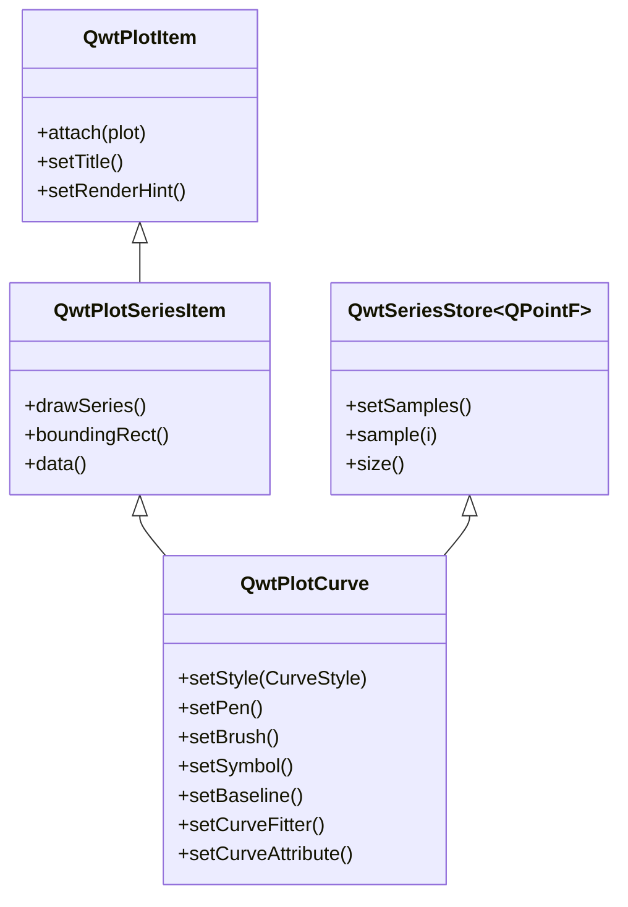

# 曲线图 - QwtPlotCurve

`QwtPlotCurve` 是 Qwt 中最核心的绘图项类，用于在二维坐标系中绘制数据曲线。它支持多种显示样式（折线、阶梯、柱状等）、符号标记、曲线拟合和丰富的样式配置。

## 主要功能特性

**特性**

- ✅ **多种曲线样式**：折线、阶梯、柱状、散点等多种绘制模式
- ✅ **符号标记系统**：支持在数据点显示各种形状的符号
- ✅ **曲线拟合插值**：内置样条曲线等拟合算法
- ✅ **高性能渲染**：支持大数据量的优化渲染
- ✅ **填充区域**：可设置曲线与基线之间的填充
- ✅ **图例自定义**：可配置图例中曲线的显示样式

## 基本概念

### 曲线样式类型

QwtPlotCurve 支持以下绘制样式：

| 样式 | 枚举值 | 说明 |
|------|--------|------|
| 不绘制 | `NoCurve` | 仅显示符号，不绘制连线 |
| 折线 | `Lines` | 用直线连接各数据点（默认） |
| 柱状 | `Sticks` | 从基线绘制垂直/水平线条 |
| 阶梯 | `Steps` | 阶梯函数样式连接 |
| 散点 | `Dots` | 仅绘制点（比NoCurve+符号更高效） |

### 曲线属性标志

| 属性 | 枚举值 | 说明 |
|------|--------|------|
| 反转 | `Inverted` | 阶梯样式从右向左绘制 |
| 拟合 | `Fitted` | 启用曲线拟合（需设置拟合器） |

### 类继承关系



## 使用方法

曲线绘图的例子位于:`examples/2D/curvedemo`，展示了多种曲线样式，截图如下：


### 1. 创建基本曲线

最基本的曲线绘制方式：

```cpp
#include <QwtPlot>
#include <QwtPlotCurve>

// 创建绘图窗口
QwtPlot* plot = new QwtPlot();
plot->setTitle("曲线示例");
plot->setCanvasBackground(Qt::white);

// 创建曲线对象
QwtPlotCurve* curve = new QwtPlotCurve("数据曲线");

// 设置曲线样式（默认为Lines）
curve->setStyle(QwtPlotCurve::Lines);

// 设置线条颜色和宽度
curve->setPen(QPen(Qt::blue, 2.0));

// 启用抗锯齿渲染
curve->setRenderHint(QwtPlotItem::RenderAntialiased, true);

// 准备数据
QVector<double> xData = {0, 1, 2, 3, 4, 5};
QVector<double> yData = {0, 1, 4, 9, 16, 25};

// 设置数据
curve->setSamples(xData, yData);

// 附加到绘图
curve->attach(plot);

// 刷新显示
plot->replot();
```

### 2. 设置数据

QwtPlotCurve 提供多种数据设置方法：

```cpp
// 方法1：使用两个QVector
QVector<double> xData, yData;
curve->setSamples(xData, yData);

// 方法2：使用QPolygonF（QPointF数组）
QPolygonF points;
points << QPointF(0, 0) << QPointF(1, 1) << QPointF(2, 4);
curve->setSamples(points);

// 方法3：使用原始double数组
double x[100], y[100];
curve->setSamples(x, y, 100);

// 方法4：使用原始数组（不复制数据）
curve->setRawSamples(x, y, 100);  // 注意：数组必须保持有效

// 方法5：仅设置Y值（X自动为索引0,1,2...）
QVector<double> yValues;
curve->setSamples(yValues);
```

!!! warning "setRawSamples 注意事项"
    使用 `setRawSamples()` 时，曲线不会复制数据，而是直接引用你提供的数组。你必须确保：
    1. 数组在曲线存在期间始终有效
    2. 数组内容不应被修改（除非你知道后果）
    3. 曲线销毁前不要释放数组

### 3. 曲线样式配置

#### 折线样式（Lines）

这是最常用的样式，用直线依次连接数据点：

```cpp
curve->setStyle(QwtPlotCurve::Lines);
curve->setPen(QPen(Qt::darkBlue, 2.0, Qt::SolidLine));
```

启用拟合属性可以绘制平滑曲线：

```cpp
// 启用曲线拟合
curve->setCurveAttribute(QwtPlotCurve::Fitted, true);

// 设置样条拟合器（可选）
QwtSplineCurveFitter* fitter = new QwtSplineCurveFitter();
fitter->setFitMode(QwtSplineCurveFitter::Auto);  // 自动选择拟合模式
curve->setCurveFitter(fitter);
```

#### 阶梯样式（Steps）

阶梯函数样式，用于显示离散数据变化：

```cpp
curve->setStyle(QwtPlotCurve::Steps);
curve->setPen(QPen(Qt::darkCyan, 2.0));

// 默认从左向右绘制，可以反转
curve->setCurveAttribute(QwtPlotCurve::Inverted, true);
```

阶梯样式对比：

```text
正常模式：      反转模式：
    ┌──┐          ┌──┐
    │  │          │  │
┌───┘  └───┐  ┌───┘  └───┐
│          │  │          │
```

#### 柱状样式（Sticks）

从基线向每个数据点绘制垂直线条：

```cpp
curve->setStyle(QwtPlotCurve::Sticks);
curve->setPen(QPen(Qt::red, 1.5));

// 设置基线位置（默认为0）
curve->setBaseline(5.0);

// 设置柱状方向（取决于曲线的orientation）
// Qt::Vertical: 垂直柱状，从Y基线绘制
// Qt::Horizontal: 水平柱状，从X基线绘制
```

#### 散点样式（Dots）

仅绘制数据点，不绘制连线。这比 `NoCurve + Symbol` 更高效：

```cpp
curve->setStyle(QwtPlotCurve::Dots);
// Dots样式不需要设置Pen，点的大小固定为1像素
```

### 4. 符号配置

符号用于在每个数据点位置显示标记：

```cpp
#include <QwtSymbol>

// 创建符号对象
QwtSymbol* symbol = new QwtSymbol();

// 设置符号形状
symbol->setStyle(QwtSymbol::Ellipse);  // 椭圆形

// 设置符号大小
symbol->setSize(QSize(10, 10));

// 设置符号填充画笔
symbol->setBrush(QBrush(Qt::yellow));

// 设置符号边框画笔
symbol->setPen(QPen(Qt::red, 2));

// 应用到曲线
curve->setSymbol(symbol);
```

常用符号形状：

| 形状 | 枚举值 | 说明 |
|------|--------|------|
| 椭圆 | `Ellipse` | 圆形或椭圆 |
| 矩形 | `Rect` | 矩形 |
| 菱形 | `Diamond` | 菱形 |
| 三角形 | `Triangle` | 向上三角形 |
| 倒三角 | `DTriangle` | 向下三角形 |
| 左三角 | `LTriangle` | 向左三角形 |
| 右三角 | `RTriangle` | 向右三角形 |
| 十字 | `Cross` | 十字形 |
| X形 | `XCross` | X形十字 |
| 星形 | `Star1` | 六角星 |
| 六边形 | `Hexagon` | 六边形 |
| 无 | `NoSymbol` | 不显示符号 |

符号快速创建：

```cpp
// 便捷构造函数：形状、填充、边框、大小
QwtSymbol* symbol = new QwtSymbol(
    QwtSymbol::Diamond,
    QBrush(Qt::green),
    QPen(Qt::darkGreen, 1),
    QSize(8, 8)
);
curve->setSymbol(symbol);
```

### 5. 填充区域

曲线可以填充从基线到数据点之间的区域：

```cpp
// 设置填充画笔
curve->setBrush(QBrush(QColor(100, 150, 200, 100)));  // 半透明填充

// 设置基线位置
curve->setBaseline(0.0);  // 从Y=0开始填充

// 对于阶梯样式，填充效果特别明显
curve->setStyle(QwtPlotCurve::Steps);
curve->setBrush(QBrush(Qt::lightGray));
```

### 6. 高性能渲染

对于大数据量场景，QwtPlotCurve 提供渲染优化属性：

```cpp
// 设置渲染属性
curve->setPaintAttribute(QwtPlotCurve::ClipPolygons, true);      // 裁剪多边形
curve->setPaintAttribute(QwtPlotCurve::FilterPoints, true);       // 过滤重复点
curve->setPaintAttribute(QwtPlotCurve::FilterPointsAggressive, true);  // 激进过滤
curve->setPaintAttribute(QwtPlotCurve::ImageBuffer, true);        // 图像缓冲（用于Dots样式）
```

| 渲染属性 | 说明 |
|----------|------|
| `ClipPolygons` | 裁剪画布外的多边形，避免绘制无效区域 |
| `FilterPoints` | 过滤重复点和画布外的点 |
| `FilterPointsAggressive` | 更激进的过滤，接受轻微视觉差异 |
| `MinimizeMemory` | 减少临时内存使用（可能降低性能） |
| `ImageBuffer` | 用图像缓冲绘制散点（适用于百万级数据） |

!!! tip "大数据量建议"
    - 超过10万点：启用 `FilterPointsAggressive`
    - 超过百万点：使用 `Dots` 样式 + `ImageBuffer`
    - 实时更新：关闭 `setAutoReplot()`，批量更新后手动刷新

### 7. 图例样式配置

控制曲线在图例中的显示样式：

```cpp
// 显示线条（图例中绘制一段线）
curve->setLegendAttribute(QwtPlotCurve::LegendShowLine, true);

// 显示符号（图例中绘制一个符号）
curve->setLegendAttribute(QwtPlotCurve::LegendShowSymbol, true);

// 显示填充（图例中绘制填充矩形）
curve->setLegendAttribute(QwtPlotCurve::LegendShowBrush, true);

// 设置图例图标大小
curve->setLegendIconSize(QSize(20, 10));
```

## 核心方法总结

| 方法 | 说明 |
|------|------|
| `setStyle()` | 设置曲线样式 |
| `setPen()` | 设置线条画笔 |
| `setBrush()` | 设置填充画笔 |
| `setSymbol()` | 设置数据点符号 |
| `setBaseline()` | 设置基线位置 |
| `setCurveAttribute()` | 设置曲线属性 |
| `setCurveFitter()` | 设置曲线拟合器 |
| `setPaintAttribute()` | 设置渲染属性 |
| `setSamples()` | 设置数据点 |
| `setRawSamples()` | 直接引用外部数据 |
| `closestPoint()` | 查找最近的数据点 |
| `minXValue()/maxXValue()` | 获取数据范围 |
| `minYValue()/maxYValue()` | 获取数据范围 |

## 实时数据更新示例

```cpp
// 实时数据场景
class RealtimePlot : public QwtPlot
{
public:
    RealtimePlot()
    {
        setAutoReplot(false);  // 关闭自动刷新
        m_curve = new QwtPlotCurve("实时数据");
        m_curve->attach(this);
        m_curve->setPen(Qt::blue, 2);
    }

    void appendData(double x, double y)
    {
        m_xData.append(x);
        m_yData.append(y);

        // 保持最近1000个点
        if (m_xData.size() > 1000) {
            m_xData.removeFirst();
            m_yData.removeFirst();
        }

        m_curve->setRawSamples(m_xData.constData(), 
                               m_yData.constData(), 
                               m_xData.size());

        replot();  // 手动刷新
    }

private:
    QwtPlotCurve* m_curve;
    QVector<double> m_xData, m_yData;
};
```

!!! example "相关示例"
    - 曲线样式演示：`examples/2D/curvedemo`
    - 简单曲线：`examples/2D/simpleplot`
    - 实时数据：`examples/2D/cpuplot`
    - 实时绘图：`examples/2D/realtime`
    - 示波器：`examples/2D/oscilloscope`