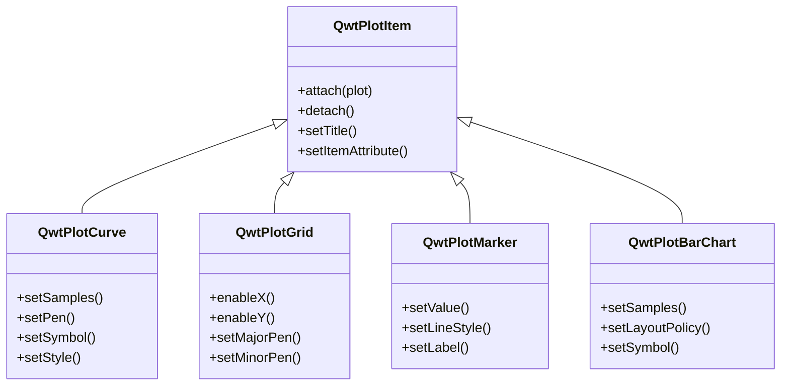
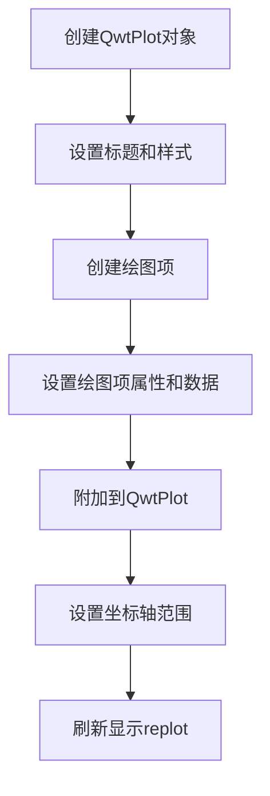

# 第一个绘图 - QwtPlot 入门

本教程将帮助你快速上手 Qwt 绘图库，通过一个简单的示例了解 QwtPlot 的基本使用方法。

## QwtPlot 基础概念

`QwtPlot` 是 Qwt 绘图库的核心类，它是一个用于绘制二维图形的 Qt 控件。一个 QwtPlot 可以包含多个绘图项（Plot Item），如曲线、网格、标记等，所有绘图项都需要通过 `attach()` 方法附加到 QwtPlot 才能显示。

### 绘图项类型



### 坐标轴系统

QwtPlot 默认提供四个坐标轴位置：

| 坐标轴位置 | 枚举值 | 说明 |
|-----------|--------|------|
| 底部X轴 | `QwtAxis::XBottom` | 默认显示 |
| 顶部X轴 | `QwtAxis::XTop` | 默认隐藏 |
| 左侧Y轴 | `QwtAxis::YLeft` | 默认显示 |
| 右侧Y轴 | `QwtAxis::YRight` | 默认隐藏 |

## 基本使用流程

使用 QwtPlot 创建绘图的基本步骤如下：



## 最简单的示例

下面的示例展示了 QwtPlot 的最基本用法：

简单绘图的例子位于:`examples/2D/simpleplot`，例子截图如下：


### 完整代码

```cpp
#include <QwtPlot>
#include <QwtPlotCurve>
#include <QwtPlotGrid>
#include <QwtSymbol>
#include <QwtLegend>

#include <QApplication>

int main(int argc, char* argv[])
{
    QApplication app(argc, argv);

    // 1. 创建绘图窗口
    QwtPlot plot;
    plot.setWindowTitle("Plot Demo");        // 设置窗口标题
    plot.setCanvasBackground(Qt::white);      // 设置画布背景色
    plot.setAxisScale(QwtAxis::YLeft, 0.0, 10.0);  // 设置Y轴范围
    plot.insertLegend(new QwtLegend());      // 添加图例

    // 2. 创建并添加网格
    QwtPlotGrid* grid = new QwtPlotGrid();
    grid->attach(&plot);  // 网格必须附加到绘图才能显示

    // 3. 创建曲线
    QwtPlotCurve* curve = new QwtPlotCurve();
    curve->setTitle("Some Points");           // 曲线标题（显示在图例中）
    curve->setPen(Qt::blue, 4);               // 设置线条颜色和宽度
    curve->setRenderHint(QwtPlotItem::RenderAntialiased, true);  // 抗锯齿

    // 4. 设置曲线符号
    QwtSymbol* symbol = new QwtSymbol(
        QwtSymbol::Ellipse,                   // 符号形状：椭圆
        QBrush(Qt::yellow),                   // 符号填充色
        QPen(Qt::red, 2),                     // 符号边框
        QSize(8, 8)                           // 符号大小
    );
    curve->setSymbol(symbol);

    // 5. 设置曲线数据
    QPolygonF points;
    points << QPointF(0.0, 4.4) << QPointF(1.0, 3.0)
           << QPointF(2.0, 4.5) << QPointF(3.0, 6.8)
           << QPointF(4.0, 7.9) << QPointF(5.0, 7.1);
    curve->setSamples(points);

    // 6. 将曲线附加到绘图
    curve->attach(&plot);

    // 7. 显示绘图窗口
    plot.resize(600, 400);
    plot.show();

    return app.exec();
}
```

### 代码详解

#### 1. 创建绘图窗口

```cpp
QwtPlot plot;
plot.setWindowTitle("Plot Demo");
plot.setCanvasBackground(Qt::white);
```

`QwtPlot` 是绘图的主容器，继承自 `QFrame`。画布背景色决定了绘图区域的底色，建议使用白色或浅色以便清晰显示数据。

#### 2. 添加网格

```cpp
QwtPlotGrid* grid = new QwtPlotGrid();
grid->attach(&plot);
```

网格是独立的绘图项，用于显示坐标参考线。所有绘图项都通过 `attach()` 方法附加到 QwtPlot，QwtPlot 会自动管理附加项的生命周期。

!!! tip "绘图项生命周期"
    当绘图项附加到 QwtPlot 后，QwtPlot 会持有该绘图项的引用。在 QwtPlot 销毁时，所有附加的绘图项也会被自动删除。因此，你不需要手动管理绘图项的内存。

#### 3. 创建曲线并设置样式

```cpp
QwtPlotCurve* curve = new QwtPlotCurve();
curve->setTitle("Some Points");
curve->setPen(Qt::blue, 4);
curve->setRenderHint(QwtPlotItem::RenderAntialiased, true);
```

曲线是最常用的绘图项类型：
- `setTitle()` 设置曲线标题，会显示在图例中
- `setPen()` 设置线条的颜色、宽度和样式
- `setRenderHint()` 启用抗锯齿渲染，使线条更加平滑

#### 4. 设置数据点符号

```cpp
QwtSymbol* symbol = new QwtSymbol(
    QwtSymbol::Ellipse,
    QBrush(Qt::yellow),
    QPen(Qt::red, 2),
    QSize(8, 8)
);
curve->setSymbol(symbol);
```

符号用于在每个数据点位置显示标记。`QwtSymbol` 支持多种形状：
- `Ellipse` - 椭圆/圆形
- `Rect` - 矩形
- `Diamond` - 菱形
- `Triangle` - 三角形
- `Cross` - 十字
- `XCross` - X形十字

#### 5. 设置曲线数据

```cpp
QPolygonF points;
points << QPointF(0.0, 4.4) << QPointF(1.0, 3.0) ...;
curve->setSamples(points);
```

`setSamples()` 方法用于设置曲线的数据点。Qwt 提供多种数据设置方式：

| 方法 | 说明 |
|------|------|
| `setSamples(const QPolygonF&)` | 从 QPointF 数组设置 |
| `setSamples(const QVector<double>& x, const QVector<double>& y)` | 从两个数组设置 |
| `setSamples(const double* x, const double* y, int size)` | 从原始数组设置 |
| `setRawSamples(const double* x, const double* y, int size)` | 直接引用外部数组（不复制） |

!!! warning "setRawSamples 注意事项"
    使用 `setRawSamples()` 时，Qwt 不会复制数据，而是直接引用你提供的数组。这意味着你必须确保数组在曲线存在期间一直有效，且不要修改数组内容。

#### 6. 设置坐标轴

```cpp
plot.setAxisScale(QwtAxis::YLeft, 0.0, 10.0);
```

`setAxisScale()` 用于手动设置坐标轴的范围。如果不调用此方法，Qwt 会根据附加的绘图项数据自动计算合适的范围。

## 进阶配置

### 多条曲线

```cpp
// 创建第二条曲线
QwtPlotCurve* curve2 = new QwtPlotCurve("Curve 2");
curve2->setPen(Qt::red, 2);
curve2->setSamples(xData2, yData2, count);
curve2->attach(&plot);
```

一个 QwtPlot 可以附加任意数量的绘图项，它们会按照附加顺序依次绘制。

### 设置坐标轴标题

```cpp
plot.setAxisTitle(QwtAxis::XBottom, "时间 (s)");
plot.setAxisTitle(QwtAxis::YLeft, "电压 (V)");
```

### 自动刷新模式

```cpp
plot.setAutoReplot(true);  // 数据变化时自动刷新
```

启用自动刷新后，每当绘图项的数据或属性发生变化时，QwtPlot 会自动调用 `replot()` 更新显示。默认情况下，你需要手动调用 `replot()` 来刷新绘图。

!!! tip "性能提示"
    对于实时更新的场景，建议关闭自动刷新，在批量更新完成后手动调用一次 `replot()`，这样可以避免频繁刷新带来的性能开销。

## QwtPlot 核心方法

| 方法 | 说明 |
|------|------|
| `setTitle()` | 设置绘图标题 |
| `setCanvasBackground()` | 设置画布背景色 |
| `setAxisScale()` | 设置坐标轴范围 |
| `setAxisTitle()` | 设置坐标轴标题 |
| `insertLegend()` | 插入图例 |
| `replot()` | 刷新绘图显示 |
| `setAutoReplot()` | 设置自动刷新模式 |
| `exportPlot()` | 导出绘图到文件 |

!!! example "相关示例"
    - 基础绘图：`examples/2D/simpleplot`
    - 曲线样式演示：`examples/2D/curvedemo`
    - 实时数据：`examples/2D/cpuplot`