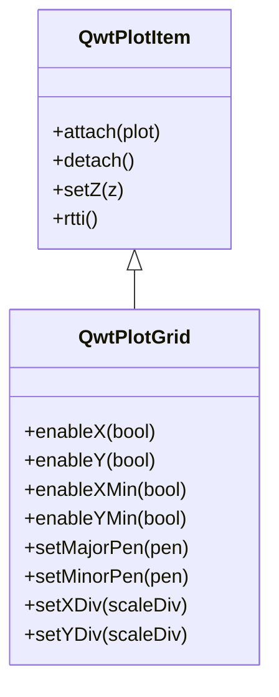

# 网格线 - QwtPlotGrid

`QwtPlotGrid` 是用于在绘图画布上绘制坐标网格的绘图项。网格线帮助用户更准确地读取数据点的坐标值，是科学图表中常见的辅助元素。

## 主要功能特性

**特性**

- ✅ **主/次网格线**：支持主要刻度和次要刻度两种网格线
- ✅ **独立控制X/Y轴**：可分别启用或禁用水平和垂直网格
- ✅ **样式自定义**：主网格和次网格可设置不同的颜色、线宽和线型
- ✅ **自动跟随刻度**：网格线位置自动跟随坐标轴刻度划分

## 基本概念

### 网格线类型

QwtPlotGrid 支持四种网格线类型：

| 类型 | 说明 |
|------|------|
| X轴主网格 | 垂直线条，位于X轴主要刻度位置 |
| X轴次网格 | 垂直线条，位于X轴次要刻度位置 |
| Y轴主网格 | 水平线条，位于Y轴主要刻度位置 |
| Y轴次网格 | 水平线条，位于Y轴次要刻度位置 |

### 网格结构示意

```text
    │    │    │    │    │    │  ← Y轴主网格（实线）
    │ ·  │ ·  │ ·  │ ·  │ ·  │  ← Y轴次网格（虚线）
────┼────┼────┼────┼────┼────┼── ← X轴主网格（实线）
    │ ·  │ ·  │ ·  │ ·  │ ·  │  ← X轴次网格（虚线）
    │    │    │    │    │    │
   0   2   4   6   8   10  12   ← X轴刻度
```

### 类关系



## 使用方法

### 1. 基本使用

创建并添加网格到绘图：

```cpp
#include <QwtPlot>
#include <QwtPlotGrid>

QwtPlot* plot = new QwtPlot();
plot->setCanvasBackground(Qt::white);

// 创建网格
QwtPlotGrid* grid = new QwtPlotGrid();

// 启用所有网格线（默认已启用）
grid->enableX(true);      // X轴主网格
grid->enableY(true);      // Y轴主网格
grid->enableXMin(false);  // X轴次网格（默认关闭）
grid->enableYMin(false);  // Y轴次网格（默认关闭）

// 附加到绘图
grid->attach(plot);

// 网格会自动跟随坐标轴刻度
plot->replot();
```

!!! tip "网格层级"
    网格通常应绘制在其他绘图项下方。默认情况下，QwtPlotGrid 的 Z 值较低，会先绘制。如需调整，使用 `grid->setZ(-10)` 等方法。

### 2. 网格线样式配置

#### 设置主网格样式

```cpp
// 使用颜色和宽度快速设置
grid->setMajorPen(Qt::gray, 0.0, Qt::DotLine);

// 使用QPen详细设置
QPen majorPen(Qt::darkGray, 1.0, Qt::SolidLine);
grid->setMajorPen(majorPen);

// 获取当前主网格画笔
const QPen& pen = grid->majorPen();
```

#### 设置次网格样式

次网格线通常比主网格线更细或使用虚线：

```cpp
// 设置次网格样式
grid->setMinorPen(Qt::lightGray, 0.5, Qt::DotLine);

// 或者使用QPen
QPen minorPen(QColor(200, 200, 200), 0.5, Qt::DashLine);
grid->setMinorPen(minorPen);
```

#### 统一设置所有网格线

```cpp
// 同时设置主网格和次网格样式
grid->setPen(Qt::gray, 0.5, Qt::DotLine);
```

### 3. 启用/禁用特定网格线

```cpp
// 仅启用水平网格线
grid->enableX(false);   // 禁用垂直网格
grid->enableY(true);    // 启用水平网格

// 启用次级刻度网格
grid->enableXMin(true);
grid->enableYMin(true);

// 检查网格线启用状态
bool xEnabled = grid->xEnabled();      // X轴主网格
bool yEnabled = grid->yEnabled();      // Y轴主网格
bool xMinEnabled = grid->xMinEnabled(); // X轴次网格
bool yMinEnabled = grid->yMinEnabled(); // Y轴次网格
```

### 4. 自定义刻度划分

网格线默认跟随坐标轴的刻度划分。你也可以手动指定刻度：

```cpp
#include <QwtScaleDiv>

// 创建自定义刻度划分
QwtScaleDiv scaleDiv;
scaleDiv.setInterval(0.0, 100.0);  // 设置范围

// 设置主刻度位置
QList<double> majorTicks;
majorTicks << 0 << 25 << 50 << 75 << 100;
scaleDiv.setTicks(QwtScaleDiv::MajorTick, majorTicks);

// 设置次刻度位置
QList<double> minorTicks;
for (double v = 0; v <= 100; v += 5) {
    if (!majorTicks.contains(v))
        minorTicks << v;
}
scaleDiv.setTicks(QwtScaleDiv::MinorTick, minorTicks);

// 应用到网格
grid->setXDiv(scaleDiv);  // X轴使用自定义刻度
grid->setYDiv(scaleDiv);  // Y轴使用自定义刻度

// 获取当前刻度划分
const QwtScaleDiv& xDiv = grid->xScaleDiv();
const QwtScaleDiv& yDiv = grid->yScaleDiv();
```

!!! info "刻度划分类型"
    QwtScaleDiv 支持三种刻度级别：
    - `MajorTick` - 主刻度（数值标签显示）
    - `MinorTick` - 次刻度（小刻度线）
    - `MediumTick` - 中等刻度（介于主次之间）

## 完整示例

以下示例展示网格的完整配置：

```cpp
#include <QwtPlot>
#include <QwtPlotGrid>
#include <QwtPlotCurve>
#include <QwtLegend>

// 创建绘图
QwtPlot* plot = new QwtPlot();
plot->setTitle("网格配置示例");
plot->setCanvasBackground(Qt::white);
plot->insertLegend(new QwtLegend());

// 创建并配置网格
QwtPlotGrid* grid = new QwtPlotGrid();
grid->enableX(true);       // 启用X轴主网格
grid->enableY(true);       // 启用Y轴主网格
grid->enableXMin(true);    // 启用X轴次网格
grid->enableYMin(true);    // 启用Y轴次网格

// 主网格使用灰色实线
grid->setMajorPen(QPen(QColor(150, 150, 150), 1.0, Qt::SolidLine));

// 次网格使用浅灰色虚线
grid->setMinorPen(QPen(QColor(200, 200, 200), 0.5, Qt::DotLine));

grid->attach(plot);

// 添加一条曲线以便观察网格效果
QwtPlotCurve* curve = new QwtPlotCurve("数据");
QPolygonF points;
for (int i = 0; i <= 100; i++) {
    double x = i;
    double y = 50 + 30 * std::sin(i * 0.1);
    points << QPointF(x, y);
}
curve->setSamples(points);
curve->setPen(QPen(Qt::blue, 2.0));
curve->attach(plot);

plot->setAxisScale(QwtAxis::XBottom, 0, 100);
plot->setAxisScale(QwtAxis::YLeft, 0, 100);
plot->replot();
```

## 核心方法总结

| 方法 | 说明 |
|------|------|
| `enableX(bool)` | 启用/禁用X轴主网格 |
| `enableY(bool)` | 启用/禁用Y轴主网格 |
| `enableXMin(bool)` | 启用/禁用X轴次网格 |
| `enableYMin(bool)` | 启用/禁用Y轴次网格 |
| `xEnabled()` | 检查X轴主网格状态 |
| `yEnabled()` | 检查Y轴主网格状态 |
| `xMinEnabled()` | 检查X轴次网格状态 |
| `yMinEnabled()` | 检查Y轴次网格状态 |
| `setMajorPen()` | 设置主网格画笔 |
| `setMinorPen()` | 设置次网格画笔 |
| `majorPen()` | 获取主网格画笔 |
| `minorPen()` | 获取次网格画笔 |
| `setPen()` | 统一设置所有网格画笔 |
| `setXDiv()` | 设置X轴刻度划分 |
| `setYDiv()` | 设置Y轴刻度划分 |
| `xScaleDiv()` | 获取X轴刻度划分 |
| `yScaleDiv()` | 获取Y轴刻度划分 |

!!! tip "线宽为0的特殊含义"
    在 Qt 中，线宽为 0 表示使用 " косметическая线宽 "（1像素宽度的快速绘制线）。对于网格线，使用 `0.0` 作为线宽可以获得最细的线条。

!!! example "相关示例"
    - 所有绘图示例都包含网格：`examples/2D/` 目录