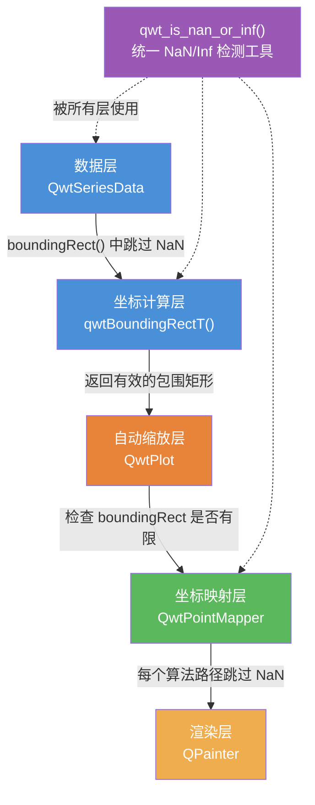
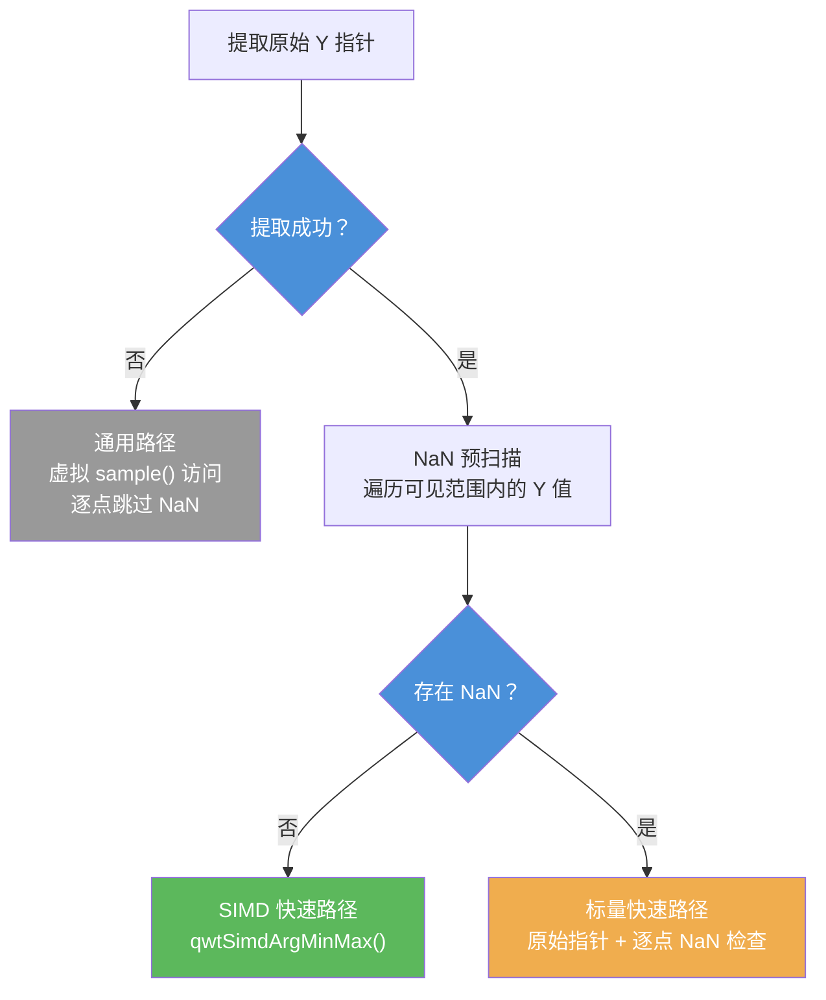
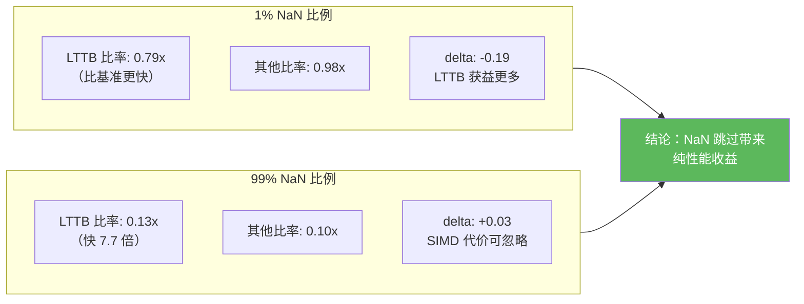

# NaN 数据处理

在科学和工程数据可视化中，数据缺失是常见场景——传感器故障、采样间隔不均、数据处理管道中的异常值等都可能产生 `NaN`（Not a Number）值。如果绘图库不能正确处理 NaN，轻则导致坐标轴范围错误、曲线渲染异常，重则引发程序崩溃。

**Qwt 7 对 NaN 数据进行了全面的正确性处理和性能优化**，这是原版 Qwt 6 所不具备的能力。在 Qwt 6 中，NaN 数据会导致 boundingRect 被污染（返回无效矩形）、坐标映射产生错误像素坐标、自动缩放失效等一系列 bug。Qwt 7 从底层工具函数到上层绘制管线，构建了完整的 NaN 处理体系。

!!! success "Qwt 7 新增功能"
    NaN 数据的正确处理和性能优化是 Qwt 7 相对于原版 Qwt 6.2.0 的重要改进之一。所有核心改进均在 2025 年 12 月由项目维护者添加。

## NaN 处理架构概览

Qwt 7 的 NaN 处理贯穿整个 2D 绘图管线，从数据层到渲染层：



## 核心工具函数：qwt_is_nan_or_inf()

**源文件**：`src/core/qwt_math.h`

Qwt 7 新增了统一的 NaN/Inf 检测函数族，作为所有 NaN 处理的基础设施。原版 Qwt 6 没有这种统一的检测工具。

### 函数重载

通过 SFINAE 提供三个重载，覆盖不同数据类型：

```cpp
// 1. 浮点类型：使用 std::isfinite() 同时检测 NaN 和 Inf
template< typename T >
inline typename std::enable_if< std::is_floating_point< T >::value, bool >::type
qwt_is_nan_or_inf(const T& value)
{
    return !std::isfinite(value);
}

// 2. QPointF 类型：检测 x 和 y 两个坐标
inline bool qwt_is_nan_or_inf(const QPointF& point)
{
    return !std::isfinite(point.x()) || !std::isfinite(point.y());
}

// 3. 非浮点类型：永远返回 false
template< typename T >
typename std::enable_if< !std::is_floating_point< T >::value
    && !std::is_same< T, QPointF >::value, bool >::type
inline qwt_is_nan_or_inf(const T& /*value*/)
{
    return false;
}
```

### 辅助模板函数

除了基础检测函数外，还提供了以下工具：

| 函数 | 功能 |
|------|------|
| `qwtContainsNanOrInf(first, last)` | 检测迭代器范围内是否包含 NaN/Inf |
| `qwtRemoveNanOrInf(container)` | 原地删除容器中所有 NaN/Inf 值 |
| `qwtRemoveNanOrInfCopy(container)` | 返回去除 NaN/Inf 的新容器 |

## boundingRect 中的 NaN 处理

**源文件**：`src/core/qwt_series_data.cpp`

### Qwt 6 的问题

原版 Qwt 6.2.0 的 `qwtBoundingRectT()` 模板在计算数据系列的包围矩形时，**不跳过 NaN 样本**。由于 IEEE 754 浮点比较语义（`NaN < x` 和 `NaN > x` 均为 `false`），NaN 值会导致：

- 包围矩形的边界被污染为无效值
- 自动缩放收到错误的范围，坐标轴显示异常
- 后续坐标映射产生错误结果

### Qwt 7 的改进

Qwt 7 在 `qwtBoundingRectT<T>()` 的两个循环中均添加了 NaN 跳过逻辑：

```cpp
template< class T >
QRectF qwtBoundingRectT(const QwtSeriesData< T >& series, size_t from, size_t to)
{
    QRectF boundingRect(1.0, 1.0, -2.0, -2.0);  // invalid

    // ... 前置检查 ...

    // 第一个循环：找到首个有效样本作为初始 boundingRect
    size_t i;
    for (i = from; i <= to; i++) {
        // chenzongyan modify at 202512: add nan checking
        if (isSampleNanOrInf(series.sample(i))) {
            continue;  // 跳过 NaN/Inf 样本
        }
        const QRectF rect = qwtBoundingRect(series.sample(i));
        if (rect.width() >= 0.0 && rect.height() >= 0.0) {
            boundingRect = rect;
            i++;
            break;
        }
    }

    // 第二个循环：扩展 boundingRect
    for (; i <= to; i++) {
        // chenzongyan modify at 202512: add nan checking
        if (isSampleNanOrInf(series.sample(i))) {
            continue;  // 跳过 NaN/Inf 样本
        }
        const QRectF rect = qwtBoundingRect(series.sample(i));
        // ... 扩展 boundingRect ...
    }

    return boundingRect;
}
```

### isSampleNanOrInf() 类型重载

`isSampleNanOrInf()` 为每种样本类型提供了独立重载，确保所有数据类型都能正确检测 NaN：

| 样本类型 | 检测的字段 |
|---------|-----------|
| `QPointF` | x, y（委托 `qwt_is_nan_or_inf()`） |
| `QwtPoint3D` | x, y, z |
| `QwtPointPolar` | azimuth, radius |
| `QwtIntervalSample` | value, interval.minValue, interval.maxValue |
| `QwtOHLCSample` | close, high, low, open, time |
| `QwtBoxSample` | position, whiskerLower, q1, median, q3, whiskerUpper |
| `QwtVectorFieldSample` | x, y, vx, vy |
| `QwtSetSample` | 在 `qwtBoundingRect(QwtSetSample)` 内部单独处理 |

## 坐标映射中的 NaN 处理

**源文件**：`src/plot/qwt_point_mapper.cpp`

`QwtPointMapper` 是坐标映射的核心类，所有降采样和坐标变换路径都在此实现。Qwt 7 确保**每一条映射路径都跳过 NaN 点**。

### 各降采样算法的 NaN 处理

| 算法 | 函数 | NaN 处理方式 |
|------|------|-------------|
| 连续重复点过滤 | `qwtToPolylineFiltered()` | 先找首个非 NaN 点，循环中 `continue` 跳过 NaN |
| Quad Reduce | `qwtMapPointsQuad()` | 先找首个非 NaN 点，循环中 `continue` 跳过 NaN |
| Pixel-Column Reduce | `qwtPixelColumnReduce()` | 循环中 `continue` 跳过 NaN |
| MinMax Bucket Reduce | `qwtMinMaxBucketReduce()` | NaN 预扫描 → 选择 SIMD/标量路径 |
| 散点映射 | `qwtToPoints()` / `qwtToPointsFiltered()` | 循环中 `continue` 跳过 NaN |
| 图像渲染 | `qwtRenderDots()` | 循环中 `continue` 跳过 NaN |

### 典型处理模式

大部分算法采用统一模式——先找到首个有效点作为起始，再在主循环中跳过 NaN：

```cpp
// 1. 找到第一个非 NaN 样本
int realFrom = from;
QPointF sample0 = series->sample(from);
while (realFrom < to && qwt_is_nan_or_inf(sample0)) {
    realFrom++;
    sample0 = series->sample(realFrom);
}
// 如果全部是 NaN，返回空多边形
if (realFrom >= to && qwt_is_nan_or_inf(sample0))
    return polyline;

// 2. 主循环中跳过 NaN
for (int i = realFrom; i <= to; i++) {
    const QPointF sample = series->sample(i);
    if (qwt_is_nan_or_inf(sample))
        continue;
    // ... 正常处理 ...
}
```

### MinMax Bucket Reduce 的 NaN 预扫描（LTTB 路径）

`qwtMinMaxBucketReduce()` 是 Qwt 7 新增的 LTTB 降采样算法，其 NaN 处理最为复杂——通过**预扫描**来决定是否使用 SIMD 加速路径：



**为什么要预扫描？** 当存在任何 NaN 时，SIMD 路径中的 argmin/argmax 结果可能受到 NaN 污染。预扫描只需 O(n) 一次遍历，一旦发现 NaN 就切换到标量路径，标量路径可以逐点跳过 NaN。当数据完全无 NaN 时（常见场景），SIMD 路径提供 3-4 倍加速。

## SIMD 模块中的 NaN 语义

**源文件**：`src/core/qwt_simd_argminmax.h`、`src/core/qwt_simd_argminmax.cpp`

`qwtSimdArgMinMax()` 使用 IEEE 754 比较语义自然忽略 NaN 值：

### IEEE 754 有序比较

SIMD 实现使用有序比较谓词 `_CMP_LT_OQ` 和 `_CMP_GT_OQ`，当任一操作数为 NaN 时返回 `false`。因此 NaN 值永远不会成为新的 min/max，被"自然忽略"：

```cpp
// SSE4.2 示例
const __m128d cmpMin = _mm_cmp_pd(vals, minVec, _CMP_LT_OQ);
minIdxVec = _mm_blendv_pd(minIdxVec, curIdx, cmpMin);
minVec = _mm_min_pd(minVec, vals);
```

### 全 NaN 输入的兜底处理

当所有元素都是 NaN 时，初始化的 `DBL_MAX`/`-DBL_MAX` 不会被更新。公共 API 层添加了后检查：

```cpp
QwtArgMinMaxResult qwtSimdArgMinMax(const double* data, int count)
{
    // ... 调用 SIMD/标量实现 ...
    QwtArgMinMaxResult result = kFn(data, count);

    // 全 NaN 输入的兜底
    if (std::isnan(result.minVal) || std::isnan(result.maxVal))
        return { 0, 0, DBL_MAX, -DBL_MAX };

    return result;
}
```

## 曲线绘制中的 NaN 处理覆盖

**源文件**：`src/plot/qwt_plot_curve.cpp`

不同绘制风格对 NaN 的处理覆盖程度不同：

| 绘制风格 | NaN 处理 | 实现方式 |
|---------|---------|---------|
| Lines（含所有降采样模式） | ✅ 已处理 | 委托 QwtPointMapper |
| Dots（默认路径） | ✅ 已处理 | 委托 QwtPointMapper |
| Symbols | ✅ 已处理 | 委托 QwtPointMapper |
| Dots（MinimizeMemory 路径） | ⚠️ 未处理 | 直接迭代 |
| Sticks | ⚠️ 未处理 | 直接迭代 |
| Steps | ⚠️ 未处理 | 直接迭代 |

!!! warning "注意"
    `Sticks`、`Steps` 和 `Dots` 的 `MinimizeMemory` 路径目前**不检查 NaN**，直接将 NaN 值传递给 `xMap.transform()` / `yMap.transform()`。在大多数情况下这不会导致崩溃（NaN 会被变换为某个无效像素坐标），但可能产生错误的渲染结果。建议需要处理 NaN 的场景优先使用 `Lines` 风格。

## 自动缩放中的 NaN 防护

**源文件**：`src/plot/qwt_plot.cpp`

Qwt 7 在自动缩放计算轴范围时，检查 boundingRect 各边是否为有限值：

```cpp
// 检查 boundingRect 是否有效（含 NaN 和无穷大检查）
if (boundingRect.isValid() && !boundingRect.isEmpty()
    && std::isfinite(boundingRect.left())
    && std::isfinite(boundingRect.right())
    && std::isfinite(boundingRect.top())
    && std::isfinite(boundingRect.bottom())) {
    // ... 使用 boundingRect 设置轴范围 ...
}
```

这确保了即使 boundingRect 被意外污染（例如未来回归 bug），自动缩放也不会收到无效的范围值。

## 其他模块的 NaN 处理

### 等高线算法

`QwtRasterData` 的 CONREC 等高线算法通过累加和检测 NaN——因为 NaN 参与加法运算会使结果变为 NaN：

```cpp
if (qIsNaN(zSum)) {
    // 其中一个点是 NaN
    continue;
}
```

### Spectrogram 渲染

Spectrogram（光谱图/热力图）将 NaN 值视为数据缺口（gap），渲染为透明像素。由于 `qIsNaN()` 未内联且 `qt_is_nan` 位于 Qt 私有头文件，`QwtPlotSpectrogram` 实现了本地的位级 NaN 检测：

```cpp
static inline bool qwtIsNaN(double d)
{
    const uchar* ch = (const uchar*)&d;
    if (QSysInfo::ByteOrder == QSysInfo::BigEndian) {
        return (ch[0] & 0x7f) == 0x7f && ch[1] > 0xf0;
    } else {
        return (ch[7] & 0x7f) == 0x7f && ch[6] > 0xf0;
    }
}
```

渲染时，NaN 值被渲染为透明像素（`0u`）：

```cpp
if (hasGaps && qwtIsNaN(value)) {
    *line++ = 0u;  // 透明像素
}
```

### WithoutGaps 性能标志

`QwtRasterData::WithoutGaps` 属性标志告知渲染器数据无缺口，可跳过 NaN 检查以提升性能：

```cpp
// 如果数据没有缺口，启用 WithoutGaps 可跳过 NaN 检查
rasterData->setAttribute(QwtRasterData::WithoutGaps, true);
```

## nanperf 性能基准测试

!!! success "Qwt 7 新增示例"
    `examples/2D/nanperf/` 是 Qwt 7 专门新增的性能基准测试示例，用于对比测试不同 NaN 分布和不同降采样模式下的渲染性能。原版 Qwt 6 没有此示例。

### 示例概述

nanperf 示例提供了一个完整的 GUI 工具，可交互式地测试 NaN 数据对渲染性能的影响：

- **6 种 NaN 分布场景**：前导 NaN、首尾 NaN、中间 NaN、尾部 NaN、X+Y 同时 NaN、X/Y 交替 NaN
- **5 种降采样模式**：ClipPolygons、FilterPoints、FilterPointsAggressive、FilterPointsPixel、FilterPointsLTTB
- **可配置参数**：数据点数（1,000 ~ 10,000,000）、NaN 比例（0% ~ 99%）、重复次数
- **自动化瓶颈分析**：自动计算 SIMD 悬崖效应和数据缩减效应的差异

### 界面布局

示例主窗口包含：

1. **控制栏**：模式选择、数据点数、NaN 比例、重复次数、操作按钮
2. **6 个绘图面板**：以 2×3 网格排列，每个面板对应一种 NaN 分布场景
3. **指标表格**：显示每个（场景 × 模式）组合的 boundingRect 时间、replot 时间、FPS、NaN 点数
4. **瓶颈分析**：自动生成的分析文本，隔离 SIMD 悬崖效应和数据缩减效应

### NaN 分布场景

| 场景 | 说明 | 测试目的 |
|------|------|---------|
| No NaN Baseline | 无 NaN 基准 | 作为性能对比的参照 |
| Leading NaN | 数据开头为 NaN，后续为信号 | 测试前导 NaN 对首个有效点查找的影响 |
| Leading & Trailing NaN | 数据首尾为 NaN，中间为信号 | 测试两端 NaN 的影响 |
| Middle NaN | 数据中间为 NaN，两端为信号 | 测试中间断隙对曲线连续性的影响 |
| X+Y Middle NaN | X 和 Y 同时为 NaN（中间位置） | 测试非单调 X 的影响（破坏二分搜索优化） |
| X/Y Interleaved NaN | X-only 和 Y-only NaN 交替（中间位置） | 测试部分坐标 NaN 的影响 |

### 瓶颈分析逻辑

nanperf 的 `BenchmarkRunner::analyze()` 方法将性能差异分解为两个因素：

1. **SIMD 悬崖效应**（仅影响 LTTB）：当数据中存在任何 NaN 时，`qwtMinMaxBucketReduce` 的预扫描会全局禁用 SIMD，回退到标量路径。通过对比 LTTB 在有/无 NaN 时的性能比率来衡量。
2. **数据缩减效应**（影响所有模式）：NaN 点被跳过后，需要处理的有限点更少，渲染更快。通过对比非 LTTB 模式在有/无 NaN 时的性能比率来衡量。

两者的差值（delta）隔离了 SIMD 悬崖效应：

- **delta < 0**：LTTB 从数据缩减中获益更多（SIMD 代价在低 NaN 比例下可忽略）
- **0 ≤ delta ≤ 0.1**：SIMD 代价边际效应（在高 NaN 比例下标量开销可忽略）
- **delta > 0.1**：SIMD 悬崖显著可见（LTTB 被标量回退拖慢）

### 基准测试结果

以下为两组典型测试结果，测试环境：100,000 数据点，20 次重复取平均。

#### 低 NaN 比例（1%）

| 场景 | 模式 | boundingRect (ms) | replot (ms) | FPS | NaN 点数 |
|------|------|-------------------|-------------|-----|---------|
| No NaN Baseline | ClipPolygons | 8.615 | 116.850 | 8.6 | 0 |
| No NaN Baseline | FilterPointsLTTB | 8.777 | 12.440 | 80.4 | 0 |
| Leading NaN | FilterPointsLTTB | 8.089 | 9.726 | 102.8 | 1000 |
| Middle NaN | FilterPointsLTTB | 8.351 | 10.444 | 95.7 | 1000 |
| X+Y Middle NaN | FilterPointsLTTB | 8.257 | 9.601 | 104.2 | 1000 |

**瓶颈分析**：

- boundingRect：基准 8.634 ms vs NaN 8.396 ms — 冷缓存 O(n) 扫描（实际使用中会缓存，仅在数据变化时重新计算）
- FilterPointsLTTB：NaN 9.849 ms vs 基准 12.440 ms（0.79x）— LTTB 从数据缩减中获益更多，SIMD 代价在 1% NaN 比例下可忽略
- 其他模式：NaN 54.634 ms vs 基准 55.644 ms（0.98x）— 无 SIMD 路径，比率反映纯数据缩减效果
- delta = -0.19 → LTTB 从数据缩减中获益更多

#### 高 NaN 比例（99%）

| 场景 | 模式 | boundingRect (ms) | replot (ms) | FPS | NaN 点数 |
|------|------|-------------------|-------------|-----|---------|
| No NaN Baseline | ClipPolygons | 8.730 | 115.466 | 8.7 | 0 |
| No NaN Baseline | FilterPointsLTTB | 8.362 | 13.244 | 75.5 | 0 |
| Leading NaN | FilterPointsLTTB | 3.388 | 1.614 | 619.6 | 99000 |
| Middle NaN | FilterPointsLTTB | 3.468 | 1.762 | 567.6 | 99000 |
| X+Y Middle NaN | FilterPointsLTTB | 2.720 | 1.896 | 527.4 | 99000 |

**瓶颈分析**：

- boundingRect：基准 8.540 ms vs NaN 3.164 ms — NaN 点被跳过后扫描更快
- FilterPointsLTTB：NaN 1.700 ms vs 基准 13.244 ms（0.13x）— 99% 数据被跳过，渲染极快
- 其他模式：NaN 5.524 ms vs 基准 54.860 ms（0.10x）— 纯数据缩减效果
- delta = +0.03 → SIMD 代价边际效应，在高 NaN 比例下标量开销可忽略

### 结果总结



**关键发现**：

1. **NaN 跳过不会导致性能下降**：在所有测试场景中，有 NaN 的数据渲染速度均快于或等于无 NaN 基准，因为跳过 NaN 减少了需要处理的有限点数。
2. **SIMD 悬崖效应可忽略**：即使在 1% NaN 比例下，LTTB 因预扫描禁用 SIMD 而回退标量路径，其性能仍然优于无 NaN 基准（0.79x），因为数据缩减的收益远大于 SIMD 损失。
3. **高 NaN 比例下性能大幅提升**：99% NaN 时，LTTB 的 replot 时间从 13.2ms 降至 1.7ms（7.7 倍加速），FPS 从 75.5 提升至 619.6。
4. **NaN 分布位置不影响性能**：前导、中间、尾部、交替等不同 NaN 分布方式对性能的影响几乎一致，证明 Qwt 7 的 NaN 处理在各位置都有效。

### 运行 nanperf 示例

!!! note "构建与运行"
    nanperf 示例默认包含在构建中。使用 `build.ps1` 构建后，可在 `build/bin/` 目录下找到 `nanperf.exe`。

    ```powershell
    # 构建（包含示例）
    .\build.ps1 build

    # 运行
    .\build\bin\nanperf.exe
    ```

    也可在 CMake 构建时通过 `-DQWT_CONFIG_BUILD_EXAMPLE=ON`（默认）确保示例被构建。

### 界面操作指南

1. **调整参数**：在顶部控制栏设置数据点数、NaN 比例、重复次数
2. **Apply & Redraw**：立即将当前参数应用到所有 6 个面板并重绘
3. **Run Benchmark Sweep**：运行完整的 5 模式 × 7 场景（含基准）基准测试
4. **Export Markdown**：将测试结果导出为 Markdown 表格文件

## 最佳实践

### 数据准备

```cpp
// 使用 qQNaN() 生成 NaN 值
const double nan = qQNaN();
QVector< double > x, y;
for (int i = 0; i < n; ++i) {
    x.append(i);
    if (should_be_missing(i))
        y.append(nan);       // NaN 表示数据缺失
    else
        y.append(signal(i));  // 正常数据
}
curve->setSamples(x, y);
// boundingRect 会自动跳过 NaN，坐标轴范围正确
```

### 选择绘制风格

```cpp
// 推荐：Lines 风格 — 完整的 NaN 处理
curve->setStyle(QwtPlotCurve::Lines);
// 默认启用 FilterPointsLTTB，提供最佳性能和 NaN 兼容性

// 注意：Sticks 和 Steps 风格不检查 NaN
// 如需使用，建议在数据预处理阶段清除 NaN
```

### Spectrogram 中的数据缺口

```cpp
// 如果数据确实包含缺口（NaN），保持默认设置即可
// Spectrogram 会自动将 NaN 渲染为透明区域

// 如果数据没有缺口，启用 WithoutGaps 标志以跳过 NaN 检查
rasterData->setAttribute(QwtRasterData::WithoutGaps, true);
```

## API 参考

- [曲线降采样算法](curve-downsampling.md) — 四种降采样算法的详细说明
- [曲线图](curve.md) — QwtPlotCurve 的渲染属性配置
