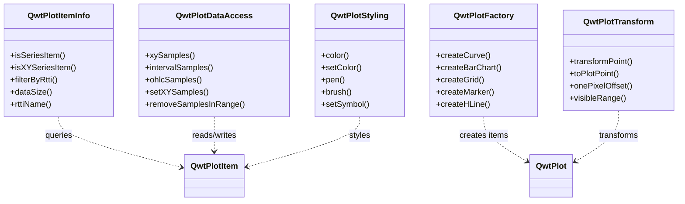

# 工具类 - 便捷操作 QwtPlot

Qwt 7 提供了一组位于 `Qwt` 命名空间下的工具类，用于简化常见的绘图操作。这些工具类按职责拆分为独立的类，用户可按需引入，不引入多余依赖。

## 工具类概览



| 类名 | 职责 | 头文件 |
|------|------|--------|
| `QwtPlotItemInfo` | 类型查询与过滤 | `<QwtPlotItemInfo>` |
| `QwtPlotDataAccess` | 数据提取与设置 | `<QwtPlotDataAccess>` |
| `QwtPlotFactory` | 工厂方法创建绘图项 | `<QwtPlotFactory>` |
| `QwtPlotTransform` | 坐标变换 | `<QwtPlotTransform>` |
| `QwtPlotStyling` | 样式读写 | `<QwtPlotStyling>` |

## QwtPlotFactory — 工厂方法

`QwtPlotFactory` 提供一行代码创建并附加绘图项到 `QwtPlot` 的便捷方法，覆盖了所有常见的绘图项类型。

### 创建曲线

```cpp
#include <QwtPlotFactory>
#include <QwtPlot>

QwtPlot* plot = new QwtPlot();

// 从 QPointF 数据创建曲线
QVector<QPointF> data = {{0, 1}, {1, 3}, {2, 2}, {3, 5}};
QwtPlotCurve* curve = QwtPlotFactory::createCurve(plot, "温度", data);

// 从分离的 x, y 向量创建曲线
QVector<double> x = {0, 1, 2, 3};
QVector<double> y = {1, 3, 2, 5};
QwtPlotCurve* curve2 = QwtPlotFactory::createCurve(plot, "压力", x, y);

// 仅 y 值（x 自动为 0, 1, 2, ...）
QVector<double> yOnly = {10, 20, 15, 25, 30};
QwtPlotCurve* curve3 = QwtPlotFactory::createCurve(plot, "索引曲线", yOnly);
```

工厂方法会自动完成创建 → 设置数据 → 绑定坐标轴 → attach 的全部流程，返回的指针可进一步自定义样式。

### 创建柱状图与直方图

```cpp
// 柱状图
QVector<double> values = {10, 25, 30, 15, 40};
QwtPlotBarChart* bar = QwtPlotFactory::createBarChart(plot, "销售额", values);

// 直方图
QVector<QwtIntervalSample> histData;
histData << QwtIntervalSample(5, 0, 10)
         << QwtIntervalSample(15, 10, 20)
         << QwtIntervalSample(25, 20, 30);
QwtPlotHistogram* hist = QwtPlotFactory::createHistogram(plot, "分布", histData);
```

### 创建 K 线图（交易曲线）

```cpp
QVector<QwtOHLCSample> ohlc;
ohlc << QwtOHLCSample(1, 100, 110, 95, 105);  // time, open, high, low, close
ohlc << QwtOHLCSample(2, 105, 115, 100, 108);
ohlc << QwtOHLCSample(3, 108, 120, 102, 118);

QwtPlotTradingCurve* kline = QwtPlotFactory::createTradingCurve(plot, "股票", ohlc);
```

### 创建箱线图与向量场

```cpp
// 箱线图
QVector<QwtBoxSample> boxData;
boxData << QwtBoxSample(1, 10, 25, 50, 75, 90);  // pos, min, q1, median, q3, max
QwtPlotBoxChart* box = QwtPlotFactory::createBoxChart(plot, "统计", boxData);

// 向量场
QVector<QwtVectorFieldSample> vf;
vf << QwtVectorFieldSample(0, 0, 1, 0)
   << QwtVectorFieldSample(1, 0, 0, 1);
QwtPlotVectorField* field = QwtPlotFactory::createVectorField(plot, "流场", vf);
```

### 创建装饰项

```cpp
// 添加网格
QwtPlotGrid* grid = QwtPlotFactory::createGrid(plot, true);  // true = 启用次网格线

// 添加水平参考线
QwtPlotMarker* hline = QwtPlotFactory::createHLine(plot, 50.0);

// 添加垂直参考线
QwtPlotMarker* vline = QwtPlotFactory::createVLine(plot, 2.5);

// 添加标记点
QwtPlotMarker* marker = QwtPlotFactory::createMarker(plot, QPointF(1, 3), "峰值");

// 添加高亮区域
QwtPlotZoneItem* zone = QwtPlotFactory::createZone(
    plot, QwtInterval(2, 4), Qt::Vertical, QBrush(QColor(255, 0, 0, 30)));

// 添加画布内图例
QwtPlotLegendItem* legend = QwtPlotFactory::createLegend(plot);

// 添加箭头标记
QwtPlotArrowMarker* arrow = QwtPlotFactory::createArrowMarker(
    plot, QPointF(0, 0), QPointF(3, 5));
```

!!! tip "完整的工厂方法列表"
    `QwtPlotFactory` 覆盖全部 **9 种数据绘图项**和 **7 种装饰项**的创建。详见 API 文档。

## QwtPlotItemInfo — 类型查询

`QwtPlotItemInfo` 用于查询绘图项的类型信息和过滤，**不会修改**任何绘图项状态。

### 类型判断

```cpp
#include <QwtPlotItemInfo>

QwtPlotItem* item = ...;

// 是否是数据系列项
bool isSeries = QwtPlotItemInfo::isSeriesItem(item);

// 是否是 XY 数据项（曲线、柱状图）
bool isXY = QwtPlotItemInfo::isXYSeriesItem(item);

// 是否是区间数据项（区间曲线、直方图）
bool isInterval = QwtPlotItemInfo::isIntervalSeriesItem(item);

// 是否是装饰项（网格、标记等）
bool isDeco = QwtPlotItemInfo::isDecoratorItem(item);
```

### 按类型过滤

```cpp
// 获取 plot 中所有曲线
QwtPlotItemList curves = QwtPlotItemInfo::filterByRtti(
    plot, QwtPlotItem::Rtti_PlotCurve);

// 按多个类型过滤
QSet<int> types = {
    QwtPlotItem::Rtti_PlotCurve,
    QwtPlotItem::Rtti_PlotBarChart
};
QwtPlotItemList dataItems = QwtPlotItemInfo::filterByRtti(plot, types);

// 获取所有数据系列项
QwtPlotItemList allSeries = QwtPlotItemInfo::seriesItems(plot);

// 获取所有 XY 数据项
QwtPlotItemList xyItems = QwtPlotItemInfo::xySeriesItems(plot);

// 获取所有可见项
QwtPlotItemList visible = QwtPlotItemInfo::visibleItems(plot);
```

### 获取基本信息

```cpp
// 获取数据点数
int count = QwtPlotItemInfo::dataSize(item);  // -1 表示非数据项

// 获取数据范围
QRectF rect = QwtPlotItemInfo::dataRect(item);

// 获取 rtti 的名称
QString name = QwtPlotItemInfo::rttiName(item->rtti());  // "PlotCurve"
```

## QwtPlotDataAccess — 数据读写

`QwtPlotDataAccess` 通过 rtti 自动分发，从任意 `QwtPlotItem` 中提取或设置样本数据，覆盖全部 7 种数据类型。

### 提取 XY 数据

```cpp
#include <QwtPlotDataAccess>

QwtPlotItem* item = ...;  // 可能是 QwtPlotCurve 或 QwtPlotBarChart

// 提取为 QPointF 向量
QVector<QPointF> pts = QwtPlotDataAccess::xySamples(item);

// 提取为分离的 x, y 向量
QVector<double> x, y;
QwtPlotDataAccess::xySamples(item, x, y);

if (!pts.isEmpty()) {
    qDebug() << "第一个点:" << pts.first();
    qDebug() << "总数据量:" << pts.size();
}
```

### 提取其他类型数据

```cpp
// 区间数据（QwtPlotIntervalCurve, QwtPlotHistogram）
QVector<QwtIntervalSample> intervals = QwtPlotDataAccess::intervalSamples(item);

// OHLC 数据（QwtPlotTradingCurve）
QVector<QwtOHLCSample> ohlc = QwtPlotDataAccess::ohlcSamples(item);

// 3D 数据（QwtPlotSpectroCurve）
QVector<QwtPoint3D> xyz = QwtPlotDataAccess::xyzSamples(item);

// 多系列数据（QwtPlotMultiBarChart）
QVector<QwtSetSample> sets = QwtPlotDataAccess::setSamples(item);

// 向量场数据（QwtPlotVectorField）
QVector<QwtVectorFieldSample> vf = QwtPlotDataAccess::vectorFieldSamples(item);

// 箱线图数据（QwtPlotBoxChart）
QVector<QwtBoxSample> boxes = QwtPlotDataAccess::boxSamples(item);
```

### 设置数据

```cpp
// 设置 XY 数据
QVector<QPointF> newData = {{0, 5}, {1, 8}, {2, 3}};
bool ok = QwtPlotDataAccess::setXYSamples(item, newData);

// 设置分离的 x, y 数据
QVector<double> x = {0, 1, 2};
QVector<double> y = {5, 8, 3};
bool ok2 = QwtPlotDataAccess::setXYSamples(item, x, y);

// 设置 OHLC 数据
QVector<QwtOHLCSample> ohlcData;
ohlcData << QwtOHLCSample(1, 100, 110, 95, 105);
QwtPlotDataAccess::setOhlcSamples(item, ohlcData);
```

### 模板提取

对于已知具体类型的场景，可以直接使用模板方法：

```cpp
#include <QwtSeriesStore>

const auto* store = static_cast<const QwtSeriesStore<QPointF>*>(curve);

// 提取全部数据
QVector<QPointF> all = QwtPlotDataAccess::samples(store);

// 提取子范围
QVector<QPointF> subset = QwtPlotDataAccess::samples(store, 10, 50);
```

### 范围筛选与删除

```cpp
// 提取矩形范围内的数据点
QRectF range(1.0, 0.0, 3.0, 5.0);
QVector<QPointF> inRange = QwtPlotDataAccess::xySamplesInRange(item, range);

// 提取路径范围内的数据点
QPainterPath path;
path.addEllipse(QPointF(2, 3), 1, 1);
QVector<QPointF> inPath = QwtPlotDataAccess::xySamplesInRange(item, path);

// 删除矩形范围内的数据点
int removed = QwtPlotDataAccess::removeSamplesInRange(item, range);
qDebug() << "删除了" << removed << "个数据点";
```

## QwtPlotTransform — 坐标变换

`QwtPlotTransform` 提供坐标系统之间的转换，所有方法均为只读操作，**不会修改** plot 状态。

### 坐标系互转

当 plot 使用寄生坐标轴（多轴）时，同一屏幕位置在不同轴系下有不同的数据坐标值：

```cpp
#include <QwtPlotTransform>

QwtPlot* plot = ...;
QPointF point(100, 50);  // 在 XBottom/YLeft 轴系下的数据坐标

// 转换到 XTop/YRight 轴系（同一屏幕位置）
QPointF converted = QwtPlotTransform::transformPoint(
    plot, point,
    QwtAxis::XBottom, QwtAxis::YLeft,   // 源轴系
    QwtAxis::XTop, QwtAxis::YRight      // 目标轴系
);
```

### 屏幕/数据坐标互转

```cpp
// 鼠标点击位置转数据坐标（常用于 pick 操作）
QPointF mousePos(150, 200);
QPointF dataPoint = QwtPlotTransform::toPlotPoint(plot, mousePos);

// 数据坐标转屏幕坐标
QPointF screenPos = QwtPlotTransform::toScreenPoint(plot, dataPoint);
```

### 像素偏移

```cpp
// 计算 1 像素对应的数据偏移量
QPointF offset = QwtPlotTransform::onePixelOffset(plot);
qDebug() << "1px =" << offset.x() << "(x)," << offset.y() << "(y)";
```

此方法常用于实现拖拽、微调等需要像素级精度控制的交互功能。

### 可视范围

```cpp
// 获取当前可视区域的数据范围
QRectF visible = QwtPlotTransform::visibleRange(plot);
qDebug() << "可见 X:" << visible.left() << "~" << visible.right();
qDebug() << "可见 Y:" << visible.top() << "~" << visible.bottom();

// 获取所有数据项的数据范围并集
QRectF totalRange = QwtPlotTransform::totalDataRange(plot);

// 仅统计可见项
QRectF visibleRange = QwtPlotTransform::totalDataRange(plot, true);
```

## QwtPlotStyling — 样式操作

`QwtPlotStyling` 通过 rtti 分发，统一读写各种绘图项的颜色、画笔、画刷和符号。

### 统一颜色读写

```cpp
#include <QwtPlotStyling>

QwtPlotItem* item = ...;

// 获取颜色（自动识别类型）
QColor c = QwtPlotStyling::color(item);
if (c.isValid()) {
    qDebug() << "当前颜色:" << c.name();
}

// 设置颜色（自动分发到 pen 或 brush）
QwtPlotStyling::setColor(item, Qt::red);
```

不同类型绘图项的颜色来源：

| 绘图项类型 | 颜色来源 |
|-----------|---------|
| QwtPlotCurve | `pen().color()` |
| QwtPlotBarChart | `brush().color()` |
| QwtPlotHistogram | `brush().color()` |
| QwtPlotGrid | `majorPen().color()` |
| QwtPlotMarker | `linePen().color()` |
| QwtPlotTradingCurve | `symbolPen().color()` |

### 画笔与画刷

```cpp
// 获取画笔
QPen p = QwtPlotStyling::pen(item);
QBrush b = QwtPlotStyling::brush(item);

// 设置画笔
QwtPlotStyling::setPen(item, QPen(Qt::blue, 2, Qt::DashLine));

// 设置画刷
QwtPlotStyling::setBrush(item, QBrush(QColor(255, 0, 0, 50)));
```

### 曲线符号

```cpp
QwtPlotCurve* curve = ...;

// 设置符号（颜色跟随曲线颜色）
QwtPlotStyling::setSymbol(curve, QwtSymbol::Ellipse, QSize(8, 8));

// 设置符号（指定颜色）
QwtPlotStyling::setSymbol(curve, QwtSymbol::Diamond, Qt::green, QSize(10, 10));

// 设置线型
QwtPlotStyling::setLineStyle(curve, Qt::DashLine, 1.5);
```

### 推荐值与强制重绘

```cpp
// 根据数据量推荐线宽
qreal width = QwtPlotStyling::recommendPenWidth(curve->dataSize());

// 强制重绘（即使 autoReplot 关闭也会立即刷新）
QwtPlotStyling::forceReplot(plot);
```

## 综合示例

以下示例展示如何组合使用多个工具类完成一个常见的绘图流程：

```cpp
#include <QwtPlot>
#include <QwtPlotFactory>
#include <QwtPlotDataAccess>
#include <QwtPlotStyling>
#include <QwtPlotTransform>

void setupPlot(QwtPlot* plot)
{
    // 1. 使用工厂方法快速创建绘图项
    QVector<double> x = {1, 2, 3, 4, 5};
    QVector<double> y = {10, 25, 15, 30, 20};
    auto* curve = QwtPlotFactory::createCurve(plot, "温度", x, y);

    QwtPlotFactory::createBarChart(plot, "产量", {100, 200, 150, 300, 250});
    QwtPlotFactory::createGrid(plot);
    QwtPlotFactory::createHLine(plot, 20.0, QPen(Qt::red, 1, Qt::DashLine));

    // 2. 使用 Styling 统一设置样式
    QwtPlotStyling::setColor(curve, Qt::blue);
    QwtPlotStyling::setSymbol(curve, QwtSymbol::Ellipse, Qt::cyan, QSize(6, 6));

    // 3. 使用 DataAccess 提取数据做分析
    QVector<QPointF> data = QwtPlotDataAccess::xySamples(curve);
    double maxVal = 0;
    for (const auto& p : data)
        maxVal = qMax(maxVal, p.y());

    // 4. 在最大值处添加标记
    auto maxIt = std::max_element(data.begin(), data.end(),
        [](const QPointF& a, const QPointF& b) { return a.y() < b.y(); });
    if (maxIt != data.end()) {
        QwtPlotFactory::createMarker(plot, *maxIt,
            QString("最大值: %1").arg(maxIt->y()));
    }

    // 5. 使用 Transform 获取可视范围
    QRectF visible = QwtPlotTransform::visibleRange(plot);
    qDebug() << "当前可视范围:" << visible;

    plot->replot();
}
```

## 支持的绘图项类型

工具类覆盖 Qwt 7 中全部绘图项类型：

### 数据绘图项

| 绘图项 | 数据类型 | 工厂方法 | 数据读写 |
|--------|---------|----------|---------|
| `QwtPlotCurve` | `QPointF` | `createCurve()` | `xySamples()` / `setXYSamples()` |
| `QwtPlotBarChart` | `QPointF` | `createBarChart()` | `xySamples()` / `setXYSamples()` |
| `QwtPlotMultiBarChart` | `QwtSetSample` | `createMultiBarChart()` | `setSamples()` / `setSetSamples()` |
| `QwtPlotHistogram` | `QwtIntervalSample` | `createHistogram()` | `intervalSamples()` / `setIntervalSamples()` |
| `QwtPlotIntervalCurve` | `QwtIntervalSample` | `createIntervalCurve()` | `intervalSamples()` / `setIntervalSamples()` |
| `QwtPlotTradingCurve` | `QwtOHLCSample` | `createTradingCurve()` | `ohlcSamples()` / `setOhlcSamples()` |
| `QwtPlotSpectroCurve` | `QwtPoint3D` | `createSpectroCurve()` | `xyzSamples()` / `setXyzSamples()` |
| `QwtPlotVectorField` | `QwtVectorFieldSample` | `createVectorField()` | `vectorFieldSamples()` / `setVectorFieldSamples()` |
| `QwtPlotBoxChart` | `QwtBoxSample` | `createBoxChart()` | `boxSamples()` / `setBoxSamples()` |

### 装饰项

| 绘图项 | 工厂方法 |
|--------|---------|
| `QwtPlotGrid` | `createGrid()` |
| `QwtPlotMarker` | `createMarker()` / `createHLine()` / `createVLine()` |
| `QwtPlotZoneItem` | `createZone()` |
| `QwtPlotArrowMarker` | `createArrowMarker()` |
| `QwtPlotGraphicItem` | `createGraphic()` |
| `QwtPlotTextLabel` | `createTextLabel()` |
| `QwtPlotLegendItem` | `createLegend()` |
| `QwtPlotScaleItem` | `createScaleItem()` |

!!! example "相关示例"
    工具类的使用方式可以结合现有的 `examples/2D/` 下的示例进行理解。
