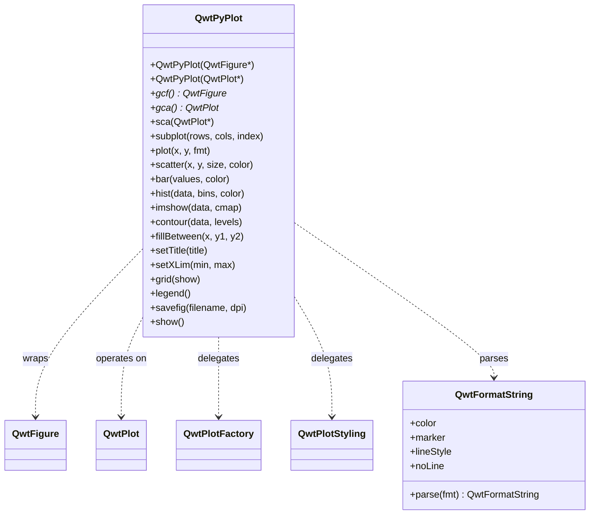

# QwtPyPlot — matplotlib 风格绘图接口

`QwtPyPlot` 是 Qwt 7 提供的一个高层封装类，为熟悉 matplotlib 的 C++ 用户提供了类似 `pyplot` 的绘图接口。它内部委托给 `QwtFigure`、`QwtPlot`、`QwtPlotFactory`、`QwtPlotStyling` 等现有类，不修改任何底层实现。

## 概述



| 类名 | 职责 | 头文件 |
|------|------|--------|
| `QwtPyPlot` | matplotlib.pyplot 风格的绘图接口 | `<QwtPyPlot>` |
| `QwtFormatString` | matplotlib 格式字符串解析 | `<QwtPyPlot>` |

## 基本概念

`QwtPyPlot` 维护一个"当前坐标轴"指针（类似 matplotlib 的 `gca()`），所有绘图方法都作用于当前坐标轴：

| matplotlib 概念 | QwtPyPlot / Qwt 对应 |
|----------------|---------------------|
| `matplotlib.figure.Figure` | `QwtFigure` |
| `matplotlib.axes.Axes` | `QwtPlot` |
| `pyplot` 模块 | `QwtPyPlot` 类 |
| `plt.gcf()` / `plt.gca()` | `QwtPyPlot::gcf()` / `gca()` |
| `plt.subplot()` | `QwtPyPlot::subplot(rows, cols, index)` |
| `fig.savefig()` | `QwtPyPlot::savefig(filename, dpi)` |

## 两种使用模式

### 模式一：QwtFigure 多子图模式

```cpp
#include <QwtFigure>
#include <QwtPyPlot>

QwtFigure* fig = new QwtFigure;
QwtPyPlot plt(fig);

// 创建 2×1 网格第 1 个子图
plt.subplot(2, 1, 1);
plt.plot(x, y, "r-o", "Temperature");
plt.setTitle("Sensor Data");
plt.grid(true);
plt.legend();

// 创建第 2 个子图
plt.subplot(2, 1, 2);
plt.bar({10, 20, 30, 40}, "b", "Sales");
plt.setYLabel("Value");

plt.savefig("output.png", 300);
fig->show();
```

### 模式二：QwtPlot 单图模式

```cpp
#include <QwtPlot>
#include <QwtPyPlot>

QwtPlot* plot = new QwtPlot;
QwtPyPlot plt(plot);

plt.plot(x, y, "b--");
plt.scatter(x2, y2, 50, "r");
plt.setTitle("Quick Plot");

plot->show();
```

## 格式字符串

`QwtFormatString` 解析 matplotlib 风格的格式字符串，支持颜色、标记和线型的组合：

```
格式：[颜色][线型][标记]
示例："r-o"  → 红色实线 + 圆圈标记
      "b--"  → 蓝色虚线
      "g^:"  → 绿色点线 + 上三角标记
      "ko"   → 黑色圆圈（无线）
```

### 颜色字符

| 字符 | 颜色 | 字符 | 颜色 |
|------|------|------|------|
| `b` | 蓝色 | `m` | 洋红 |
| `g` | 绿色 | `y` | 黄色 |
| `r` | 红色 | `k` | 黑色 |
| `c` | 青色 | `w` | 白色 |

### 标记字符

| 字符 | 标记 | 字符 | 标记 |
|------|------|------|------|
| `o` | 圆圈 | `x` | 叉号 |
| `s` | 方块 | `+` | 加号 |
| `^` | 上三角 | `*` | 星号 |
| `v` | 下三角 | `.` | 点 |
| `D` | 菱形 | | |

### 线型

| 符号 | 线型 |
|------|------|
| `-` | 实线 |
| `--` | 虚线 |
| `-.` | 点划线 |
| `:` | 点线 |

!!! tip "matplotlib 行为兼容"
    当只指定标记而没有线型时（如 `"ro"`），线条会自动隐藏，仅显示标记点。这与 matplotlib 的行为一致。

## 绘图方法

### 基础绘图

#### plot() — 线图

```cpp
// y-only（x 自动为 0, 1, 2, ...）
plt.plot({1, 4, 2, 5}, "r-o");

// x-y 数据
plt.plot(x, y, "b--", "Label");

// QPointF 数据
QVector<QPointF> data = {{0,1}, {1,3}, {2,2}};
plt.plot(data, "g^:");
```

#### scatter() — 散点图

```cpp
// 参数：x, y, 标记大小, 颜色, 标签
plt.scatter(x1, y1, 30, "r", "Group A");
plt.scatter(x2, y2, 50, "b", "Group B");
```

#### bar() — 柱状图

```cpp
// y-only 值（x 自动为索引）
plt.bar({10, 20, 30, 40}, "c");

// x-y 数据 + 宽度
plt.bar(x, values, 0.8, "b", "Sales");
```

#### hist() — 直方图

```cpp
// 自动分箱（默认 10 个 bins）
plt.hist(data, 20, "m", "Distribution");
```

#### imshow() — 热图

```cpp
// 2D 矩阵数据，支持多种 colormap
QVector<QVector<double>> matrix = ...;
plt.imshow(matrix, "viridis");
```

支持的 colormap：`"viridis"`, `"hot"`, `"cool"`, `"jet"`, `"gray"`

#### contour() — 等高线

```cpp
// 自动 10 条等高线
plt.contour(data);

// 自定义等高线级别
plt.contour(data, {0.2, 0.4, 0.6, 0.8}, "hot");
```

#### fillBetween() — 填充区域

```cpp
// 参数：x, y1, y2, 颜色, 透明度
plt.fillBetween(x, yLower, yUpper, "blue", 0.3);
```

#### errorbar() — 误差棒

```cpp
plt.errorbar(x, y, yerr, "r-", "Measurement");
```

#### quiver() — 向量场

```cpp
plt.quiver(x, y, u, v, "k");
```

#### candlestick() — K 线图

```cpp
QVector<QwtOHLCSample> ohlcData = ...;
plt.candlestick(ohlcData, "Stock");
```

### 装饰元素

| 方法 | 说明 | 示例 |
|------|------|------|
| `grid(show, minor)` | 网格线 | `plt.grid(true, true)` |
| `axhline(y, fmt)` | 水平参考线 | `plt.axhline(0, "k--")` |
| `axvline(x, fmt)` | 垂直参考线 | `plt.axvline(5, "r:")` |
| `axhspan(y1, y2, color, alpha)` | 水平区域高亮 | `plt.axhspan(2, 4, "yellow", 0.2)` |
| `axvspan(x1, x2, color, alpha)` | 垂直区域高亮 | `plt.axvspan(3, 7, "blue", 0.1)` |
| `legend(loc)` | 图例 | `plt.legend()` |
| `annotate(text, xy, xytext)` | 箭头标注 | `plt.annotate("Peak", peak, label)` |

## 坐标轴配置

### 标题与标签

```cpp
plt.setTitle("My Plot");
plt.setXLabel("Time (s)");
plt.setYLabel("Amplitude");
```

### 轴范围与缩放

```cpp
// 设置轴范围
plt.setXLim(0, 100);
plt.setYLim(-5, 5);

// 对数坐标
plt.setXScale("log");
plt.setYScale("log");

// 恢复线性
plt.setXScale("linear");
```

### 刻度

```cpp
// 自定义刻度位置
plt.setXTicks({0, 2.5, 5, 7.5, 10});
plt.setYTicks({-1, 0, 1});

// 反转坐标轴
plt.invertXAxis();
plt.invertYAxis();
```

## Figure 操作

### 子图布局

```cpp
QwtFigure* fig = new QwtFigure;
QwtPyPlot plt(fig);

// subplot(rows, cols, index) — 1-based 索引
plt.subplot(2, 2, 1);  // 第 1 行第 1 列
plt.subplot(2, 2, 2);  // 第 1 行第 2 列
plt.subplot(2, 1, 2);  // 第 2 行跨 2 列（需要重新 addGridAxes）
```

### 寄生轴（双 Y/X 轴）

```cpp
plt.subplot(1, 1, 1);
plt.plot(x, temp, "r-", "Temperature");
plt.setYLabel("°C");

// 创建右侧 Y 轴
QwtPlot* ax2 = plt.twinx();
plt.sca(ax2);  // 切换到新轴
plt.plot(x, humidity, "b--", "Humidity");
plt.setYLabel("%");
```

### 紧凑布局

```cpp
plt.tightLayout();  // 对齐所有子图的 Y 轴
```

## 外观设置

```cpp
// 设置 Figure 背景色
plt.setFaceColor("lightgray");

// 设置画布背景色
plt.setAxesColor("white");
```

## 输出与交互

### 保存图片

```cpp
plt.savefig("output.png");        // 默认 DPI
plt.savefig("output.png", 300);   // 300 DPI
```

### 显示窗口

```cpp
plt.show();
```

### 交互控制

```cpp
plt.enablePan(true);   // 启用拖拽平移
plt.enableZoom(true);  // 启用框选缩放
```

## 完整示例

以下示例展示了一个多子图应用，包含线图、散点图和直方图：

```cpp
#include <QApplication>
#include <QwtFigure>
#include <QwtPyPlot>
#include <cmath>

int main(int argc, char* argv[])
{
    QApplication app(argc, argv);

    QwtFigure* fig = new QwtFigure;
    QwtPyPlot plt(fig);

    // 生成数据
    QVector<double> x, sinY, cosY;
    for (int i = 0; i <= 100; i++) {
        double t = i * 0.1;
        x.append(t);
        sinY.append(std::sin(t));
        cosY.append(std::cos(t));
    }

    // 子图 1：线图
    plt.subplot(2, 1, 1);
    plt.plot(x, sinY, "r-", "sin(x)");
    plt.plot(x, cosY, "b--", "cos(x)");
    plt.setTitle("Trigonometric Functions");
    plt.grid(true);
    plt.legend();

    // 子图 2：直方图
    plt.subplot(2, 1, 2);
    QVector<double> randomData;
    for (int i = 0; i < 500; i++) {
        randomData.append(std::sin(i * 0.1) * 10 + (i % 7));
    }
    plt.hist(randomData, 20, "c");
    plt.setTitle("Distribution");

    plt.tightLayout();
    plt.savefig("demo.png", 300);
    fig->resize(800, 600);
    fig->show();

    return app.exec();
}
```

## API 参考

### 构造与状态

| 方法 | 说明 |
|------|------|
| `QwtPyPlot(QwtFigure*)` | 构造：多图模式 |
| `QwtPyPlot(QwtPlot*)` | 构造：单图模式 |
| `gcf()` | 获取当前 Figure |
| `gca()` | 获取当前坐标轴 |
| `sca(QwtPlot*)` | 设置当前坐标轴 |

### 绘图方法

| 方法 | 返回类型 | 说明 |
|------|---------|------|
| `plot(y, fmt, label)` | `QwtPlotCurve*` | y-only 线图 |
| `plot(x, y, fmt, label)` | `QwtPlotCurve*` | x-y 线图 |
| `plot(data, fmt, label)` | `QwtPlotCurve*` | QPointF 线图 |
| `scatter(x, y, size, color, label)` | `QwtPlotCurve*` | 散点图 |
| `bar(values, color, label)` | `QwtPlotBarChart*` | 柱状图 |
| `bar(x, values, width, color, label)` | `QwtPlotBarChart*` | x-y 柱状图 |
| `hist(data, bins, color, label)` | `QwtPlotHistogram*` | 直方图 |
| `boxplot(data, label)` | `QwtPlotBoxChart*` | 箱线图 |
| `fillBetween(x, y1, y2, color, alpha)` | `QwtPlotIntervalCurve*` | 填充区域 |
| `errorbar(x, y, yerr, fmt, label)` | `QwtPlotIntervalCurve*` | 误差棒 |
| `imshow(data, cmap, vmin, vmax)` | `QwtPlotSpectrogram*` | 热图 |
| `contour(data, levels, cmap)` | `QwtPlotSpectrogram*` | 等高线 |
| `quiver(x, y, u, v, color)` | `QwtPlotVectorField*` | 向量场 |
| `candlestick(data, label)` | `QwtPlotTradingCurve*` | K 线图 |

### 坐标轴配置

| 方法 | 说明 |
|------|------|
| `setTitle(title)` | 设置图表标题 |
| `setXLabel(label)` | 设置 X 轴标签 |
| `setYLabel(label)` | 设置 Y 轴标签 |
| `setXLim(min, max)` | 设置 X 轴范围 |
| `setYLim(min, max)` | 设置 Y 轴范围 |
| `setXScale(scale)` | 设置 X 轴缩放（`"linear"` / `"log"`） |
| `setYScale(scale)` | 设置 Y 轴缩放 |
| `setXTicks(ticks, labels)` | 设置 X 轴刻度 |
| `setYTicks(ticks, labels)` | 设置 Y 轴刻度 |
| `invertXAxis()` | 反转 X 轴 |
| `invertYAxis()` | 反转 Y 轴 |

### Figure 操作

| 方法 | 说明 |
|------|------|
| `subplot(rows, cols, index)` | 创建子图（1-based 索引） |
| `addAxes(rect)` | 在归一化坐标位置添加坐标轴 |
| `twinx(host)` | 创建双 Y 轴 |
| `twiny(host)` | 创建双 X 轴 |
| `tightLayout()` | 紧凑布局 |

### 输出与交互

| 方法 | 说明 |
|------|------|
| `savefig(filename, dpi)` | 保存图片 |
| `show()` | 显示窗口 |
| `enablePan(enable)` | 启用/禁用平移 |
| `enableZoom(enable)` | 启用/禁用缩放 |

!!! example "相关示例"
    完整示例位于 `examples/2D/pyplot/` 目录，包含 8 个 Tab 页展示各种 QwtPyPlot 功能。

PyPlot 的例子截图如下：


