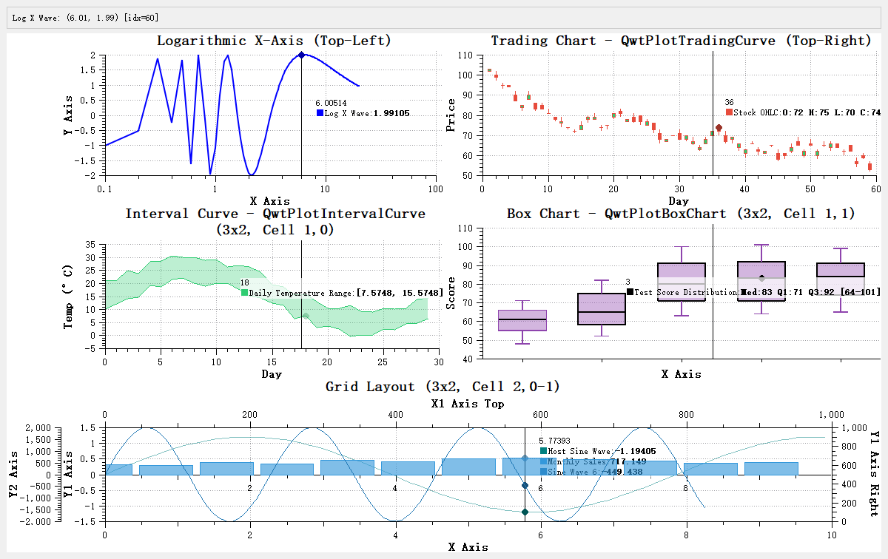
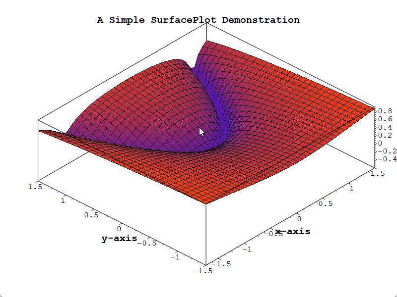
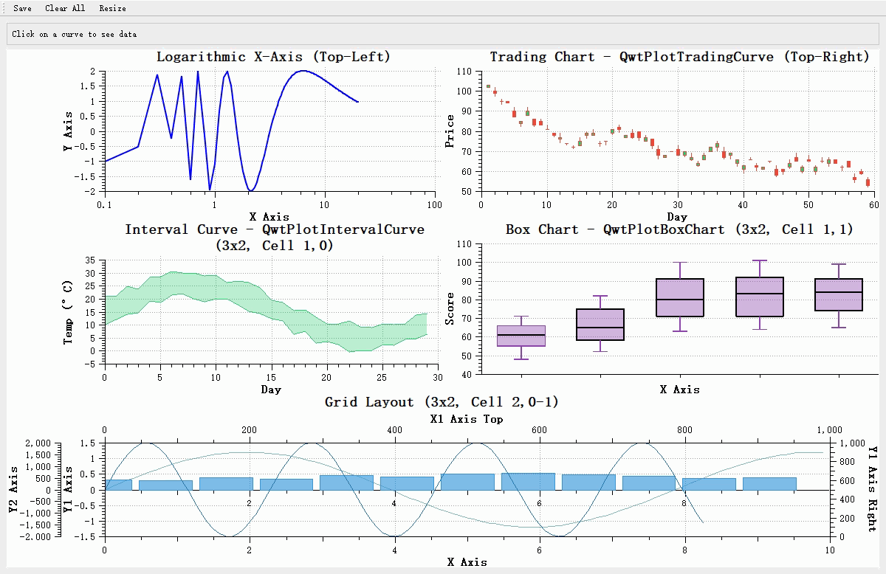
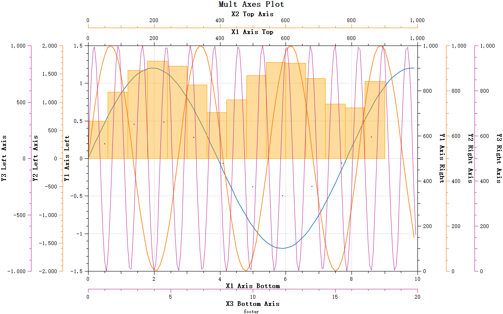
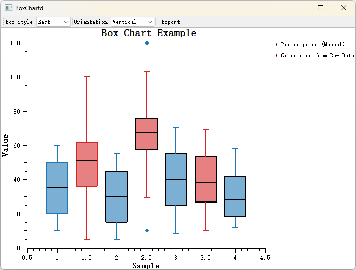
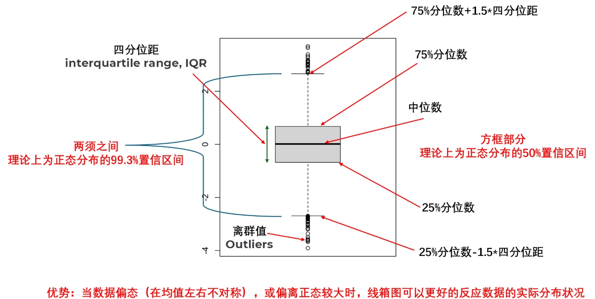
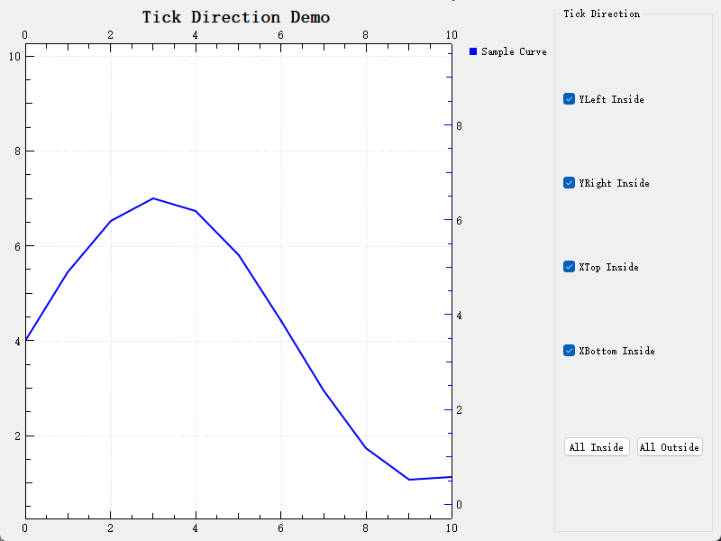

# Qwt 7.0 新特性介绍 — 更现代、更强大的Qt数据可视化库



Qwt 7.0 是基于原版 Qwt 6.2.0 的现代化改进版本，遵循 Qwt 的开源协议（LGPL），由社区维护并持续更新。这个版本不仅带来了**C++11/17标准支持**和**CMake构建系统**，还引入了大量实用的新功能，让数据可视化开发更加便捷高效。

本文将全面介绍 Qwt 7.0+ 的核心新特性，帮助您快速了解和上手这个更强大的数据可视化库。

## 2D/3D绘图一体化

!!! success "qwt同时支持2D/3D"
    Qwt 7.0 将原 `QwtPlot3D` 库整合进来，实现了 **2D和3D绘图的一体化支持**。现在一个库就能同时满足二维和三维数据可视化需求。

### 3D绘图模块概述

Qwt 7.0 内置完整的3D绘图能力，支持：

- ✅ **多种绘图类型**：表面图、网格图、参数曲面、函数绘图等
- ✅ **OpenGL渲染**：高性能三维渲染，流畅的交互体验
- ✅ **交互操作**：鼠标旋转、缩放、平移视角
- ✅ **光照和材质**：真实感光照效果和材质配置
- ✅ **颜色映射**：根据Z值自动映射颜色，支持颜色条

### 3D绘图效果



### 核心类介绍

| 类名 | 说明 |
|------|------|
| `Qwt3DPlot` | 3D绘图基类，提供基本框架和交互 |
| `Qwt3DSurfacePlot` | 3D表面图，显示连续曲面 |
| `Qwt3DGridPlot` | 3D网格图，显示离散网格数据 |
| `Qwt3DFunction` | 3D函数绘图，根据数学函数生成曲面 |

### 使用示例

```cpp
#include <Qwt3DSurfacePlot>
#include <Qwt3DFunction>

// 创建表面图
Qwt3DSurfacePlot* plot = new Qwt3DSurfacePlot();

// 定义数学函数
class MyFunction : public Qwt3DFunction
{
public:
    virtual double operator()(double x, double y) override
    {
        return std::sin(x) * std::cos(y);
    }
};

MyFunction* func = new MyFunction();
func->setDomain(-5, 5, -5, 5);  // x和y范围
func->setResolution(50);         // 50x50网格
func->create(plot);

plot->setRotation(30, 0, 45);   // 设置视角
plot->show();
```

### CMake配置

```cmake
find_package(qwt REQUIRED)

# 链接2D绘图库
target_link_libraries(${PROJECT_NAME} PRIVATE qwt::plot)

# 链接3D绘图库（可选）
target_link_libraries(${PROJECT_NAME} PRIVATE qwt::plot3d)
```

!!! tip "2D/3D一体化优势"
    - **统一引入**：无需单独引入两个库，简化项目依赖
    - **一致风格**：2D和3D绘图API风格统一，降低学习成本
    - **灵活选择**：根据需求独立链接2D或3D模块

!!! example "完整示例"
    详细使用方法请参考 [3D绘图简介](3d-plot.md)，示例代码位于 `examples/3D/simpleplot3D`

## 架构与构建升级

### C++11/17 标准支持

Qwt 7.0 全面拥抱现代 C++ 标准：

- **Qt5.12+**：使用 C++11 标准
- **Qt6**：使用 C++17 标准

这意味着您可以使用现代 C++ 特性，如 `auto`、`nullptr`、`override`、`final`、lambda 表达式、智能指针等，代码更加简洁和安全。

### CMake 构建系统

告别传统的 qmake，Qwt 7.0 采用现代化的 CMake 构建系统：

```cmake
find_package(qwt REQUIRED)
# 2D绘图
target_link_libraries(${PROJECT_NAME} PRIVATE qwt::plot)
# 3D绘图
target_link_libraries(${PROJECT_NAME} PRIVATE qwt::plot3d)
```

### 单文件引入方式

Qwt 7.0 提供了一种极简的引入方式 —— 将整个库合并为单文件：

- `src-amalgamate/QwtPlot.h` — 合并后的单一头文件
- `src-amalgamate/QwtPlot.cpp` — 合并后的单一源文件

只需将这两个文件加入您的项目，无需复杂的构建配置，特别适合小型项目或快速原型开发。

!!! warning "注意"
    单文件是由工具自动合成的，请勿直接编辑 `QwtPlot.h` 和 `QwtPlot.cpp` 文件。

## QwtFigure — 多绘图布局容器

!!! success "核心新特性"
    `QwtFigure` 是 Qwt 7.0 最重要的新增功能之一，提供类似 matplotlib Figure 的多绘图布局能力。

### 功能概述

`QwtFigure` 是一个用于组织和管理多个 `QwtPlot` 绘图组件的容器窗口，提供：

- **归一化坐标布局**：使用 `[0,1]` 范围内的坐标系统进行相对位置控制
- **网格布局**：行列式的网格排列，参考 matplotlib 的 subplot 方式
- **寄生绘图支持**：在同一个绘图区域内创建多个独立坐标轴
- **图形导出功能**：支持高分辨率图片输出

### 使用示例

```cpp
// 创建 QwtFigure
QwtFigure* figure = new QwtFigure();
figure->setSizeInches(8, 6);      // 设置图形尺寸为8x6英寸

// 使用归一化坐标添加绘图
QwtPlot* plot1 = new QwtPlot();
figure->addAxes(plot1, 0.0, 0.0, 0.5, 0.5);  // 左上角四分之一区域

// 使用网格布局添加绘图（类似matplotlib subplot）
QwtPlot* plot2 = new QwtPlot();
figure->addGridAxes(plot2, 2, 2, 0, 1);  // 2x2网格，第0行第1列
```

### 坐标轴对齐功能

当多个子绘图的刻度范围不同时，刻度线可能不对齐，影响视觉效果。QwtFigure 提供了坐标轴对齐功能：


通过 `addAxisAlignment` 函数可以指定子绘图的坐标轴进行对齐：

```cpp
figure->addAxisAlignment({ plot1, plot3, hostPlot }, QwtAxis::YLeft);
```

对齐后的效果：


### 交互式操作蒙版

`QwtFigureWidgetOverlay` 提供了在 `QwtFigure` 上进行交互式操作的功能：



- 支持鼠标拖拽调整子绘图的位置和大小
- 支持选择当前激活的绘图组件
- 提供清晰的可视化反馈（边框、控制点、尺寸信息）

!!! example "完整示例"
    详细使用方法请参考 [QwtFigure绘图容器窗口](figure-widget.md)，示例代码位于 `examples/figure`

## 寄生绘图 — 多坐标轴系统

!!! success "核心新特性"
    寄生绘图（Parasite Axes）允许在同一绘图区域内创建任意多个独立坐标轴，完美解决多Y轴、多X轴的复杂绘图需求。

### 工作原理

寄生绘图与宿主绘图共享绘图区域（透明背景），但拥有独立的坐标系统。当宿主绘图被销毁时，寄生绘图也会自动销毁，生命周期自动管理。


### 创建寄生绘图

```cpp
// 创建宿主绘图
QwtPlot* hostPlot = new QwtPlot();

// 创建寄生绘图，显示在YLeft轴
QwtPlot* parasitePlot = hostPlot->createParasitePlot(QwtAxis::YLeft);

// 设置寄生绘图的坐标轴
parasitePlot->enableAxis(QwtAxis::YRight, true);
parasitePlot->setParasiteShareAxis(QwtAxis::XBottom);  // 与宿主共享X轴

// 添加曲线到寄生绘图
QwtPlotCurve* curve = new QwtPlotCurve("Parasite Curve");
curve->setSamples(...);
curve->attach(parasitePlot);
```

### 多寄生绘图叠加

可以创建多个寄生绘图，实现任意数量的坐标轴叠加：



!!! example "完整示例"
    详细使用方法请参考 [寄生绘图使用指南](parasite-axes.md)，示例代码位于 `examples/parasitePlot`

## 交互功能重构

!!! success "重要改进"
    Qwt 7.0 对交互控件进行了全面重构，提供更流畅的用户体验。

### 实时平移 — QwtPlotPanner

原版 Qwt 的 `QwtPanner` 使用位图缓存进行平移，平移过程中无法看到数据的实时变化。Qwt 7.0 重构了 `QwtPlotPanner`，基于 `QwtPicker` 状态机实现**实时平移**：


特性：

- ✅ 线性坐标轴、对数坐标轴、日期时间坐标轴全支持
- ✅ 多坐标轴实时同步移动
- ✅ 平移过程中绘图实时刷新

### 整体画布缩放 — QwtPlotCanvasZoomer

原版 `QwtPlotZoomer` 只能绑定两个坐标轴，无法处理四轴同时缩放的场景。Qwt 7.0 新增 `QwtPlotCanvasZoomer`，无需指定坐标轴，自动处理整个画布的缩放：

```cpp
// 创建整体画布缩放器
QwtPlotCanvasZoomer* canvasZoomer = new QwtPlotCanvasZoomer(plot->canvas());
```

### 类名变更说明

为保持命名清晰，部分类名进行了调整：

| 原名称 | 新名称 | 说明 |
|--------|--------|------|
| `QwtPlotZoomer` | `QwtPlotAxisZoomer` | 只能绑定2个坐标轴，更名为轴缩放器 |
| - | `QwtPlotCanvasZoomer` | 新增：整体画布缩放器 |
| `QwtPanner` | `QwtCachePanner` | 带缓存的平移器 |
| `QwtPlotPanner` | `QwtPlotCachePanner` | 带缓存的绘图平移器 |
| - | `QwtPlotPanner` | 新增：实时平移器 |

!!! tip "迁移提示"
    原有代码基本无需修改，新接口保持向后兼容。如需使用原来的缓存式平移，可使用 `CachePanner` 相关类。

!!! example "完整示例"
    详细使用方法请参考 [平移工具](panner.md) 和 [缩放工具](zoomer.md)

## 坐标轴内置交互动作

!!! success "新特性 v7.0.5+"
    坐标轴交互动作允许用户通过鼠标直接操作坐标轴，体验类似 QCustomPlot 的交互方式。

### 功能演示

**坐标轴拖动操作：**


- 左键单击选中坐标轴
- 拖动移动坐标轴范围
- 右键取消选中

**坐标轴滚轮缩放：**


- 左键选中坐标轴
- 滚轮缩放，缩放中心为鼠标位置
- 右键取消选中

### 使用方法

Qwt 7 默认启用坐标轴交互功能：

```cpp
// 全局启用/禁用
plot->setEnableScaleBuildinActions(true);

// 单独配置某个坐标轴的行为
plot->axisWidget(QwtAxis::XBottom)->setBuildinActions(QwtScaleWidget::ActionClickPan);
```

### 选中效果自定义

选中坐标轴时，可以自定义视觉效果：


```cpp
// 设置选中颜色
plot->axisWidget(QwtAxis::YLeft)->setSelectionColor(Qt::blue);

// 设置选中后画笔宽度增加
plot->axisWidget(QwtAxis::YLeft)->setSelectedPenWidthOffset(1.5);
```

!!! example "完整示例"
    详细使用方法请参考 [坐标轴交互动作](scale-builtin-action.md)

## 数据拾取功能

!!! success "新特性 v7.0.6+"
    `QwtPlotSeriesDataPicker` 提供了强大的数据拾取功能，鼠标移动时实时显示数据点信息。

### 功能演示


### 两种拾取模式

**Y值拾取模式：**


显示当前 X 位置对应所有曲线的 Y 值，支持线性插值计算。

**最近点拾取模式：**


计算距离鼠标最接近的点进行拾取，适合峰值数据拾取场景。

### 使用示例

```cpp
// 创建数据拾取器
QwtPlotSeriesDataPicker* picker = new QwtPlotSeriesDataPicker(plot->canvas());

// 设置拾取模式
picker->setPickMode(QwtPlotSeriesDataPicker::PickYValue);

// 启用线性插值
picker->setInterpolationMode(QwtPlotSeriesDataPicker::LinearInterpolation);

// 自定义显示文本
picker->setTextBackgroundBrush(QBrush(QColor(255, 255, 255, 180)));
```

### 性能优化

针对大数据集，Qwt 7 提供了窗口搜索算法：

- 默认启用阈值：1000 个数据点
- 搜索窗口默认为曲线点数的 5%
- 避免全曲线遍历，大幅提升性能

!!! example "完整示例"
    详细使用方法请参考 [数据拾取](pick-value.md)

## 新增图表类型

### 箱线图 — QwtPlotBoxChart

!!! success "新特性 v7.2.0+"
    `QwtPlotBoxChart` 提供完整的箱线图（Box-and-Whisker Plot）支持，直观展示数据统计分布特征。



### 功能特性

- ✅ 支持预计算数据和原始数据自动计算两种方式
- ✅ 多种须须计算方法：Tukey(1.5×IQR)、百分位数、最小最大值、标准差、标准误
- ✅ 三种箱体样式：矩形、菱形、缺口形
- ✅ 垂直和水平方向切换
- ✅ 异常值自动检测、自定义符号和抖动显示

### 箱线图结构



### 使用示例

```cpp
// 创建箱线图
QwtPlotBoxChart* boxChart = new QwtPlotBoxChart("数据组A");
boxChart->attach(plot);

// 设置预计算的统计数据
QVector<QwtBoxSample> samples;
samples << QwtBoxSample(1.0, 10.0, 20.0, 35.0, 50.0, 60.0);
boxChart->setSamples(samples);

// 设置样式
boxChart->setBrush(QColor(100, 150, 200, 150));
boxChart->setBoxStyle(QwtPlotBoxChart::Notch);
```

!!! example "完整示例"
    详细使用方法请参考 [箱线图使用指南](boxchart.md)，示例代码位于 `examples/2D/boxchart`

## 其他实用功能

### 刻度朝内显示

!!! success "新特性 v7.2.1+"
    支持将坐标轴刻度线显示在绘图区域内部，适合紧凑布局场景。



```cpp
// 设置刻度朝内
plot->setAxisTickDirection(QwtAxis::YLeft, QwtPlot::TickInside);
plot->setAxisTickDirection(QwtAxis::XBottom, QwtPlot::TickInside);
```

!!! example "完整示例"
    详细使用方法请参考 [刻度朝内显示使用指南](ticks-inside.md)，示例代码位于 `examples/2D/ticks_inside`

### NaN/Inf 异常值处理

Qwt 7.0 对数据中的异常值（NaN、Inf）进行了完善处理：

- `QwtPointMapper` 添加异常值处理，数据异常不会导致坐标映射错误
- 数据范围判断增加异常值过滤
- 绘图更加稳定，不会因异常数据崩溃

### QwtGridRasterData 网格插值

新增 `QwtGridRasterData` 类，相比 `QwtMatrixRasterData`：

- 支持二维数据表输入
- 支持 X/Y 轴网格插值
- 更灵活的光谱图数据处理

### 柱状图接口增强

`QwtPlotBarChart` 接口增强，支持：

- Pen（画笔）样式设置
- Brush（填充）样式设置
- 更丰富的柱状图外观定制

## 迁移指南

### 类名变更对照

| 原名称 | 新名称 | 迁移建议 |
|--------|--------|----------|
| `QwtPlotZoomer` | `QwtPlotAxisZoomer` | 代码中替换类名即可 |
| `QwtPanner` | `QwtCachePanner` | 如需缓存式平移则替换 |
| `QwtPlotPanner` | `QwtPlotCachePanner` | 如需缓存式平移则替换 |
| - | `QwtPlotPanner` | 新功能：实时平移 |
| - | `QwtPlotCanvasZoomer` | 新功能：整体缩放 |

### API 变更说明

- `QwtLinearColorMap::colorStop()` → `stopPos()`
- `QwtLinearColorMap` 新增 `stopColors()` 方法

### 兼容性

- Qt5.12+ 完全兼容
- Qt6 完全支持
- 大部分 Qwt 6.x 代码可直接使用，仅需少量类名替换

## 总结

Qwt 7.0 是一次全面的现代化升级：

| 类别 | 新特性 |
|------|--------|
| **架构升级** | C++11/17、CMake构建、单文件引入 |
| **2D/3D一体化** | QwtPlot3D融合、统一库支持2D和3D绘图 |
| **布局功能** | QwtFigure多绘图容器、寄生绘图多坐标轴 |
| **交互改进** | 实时平移、整体画布缩放、坐标轴内置交互 |
| **数据拾取** | Y值拾取、最近点拾取、智能插值 |
| **图表类型** | 箱线图、刻度朝内显示、3D表面图/网格图 |
| **稳定性** | NaN/Inf处理、异常值过滤 |

这些新特性让 Qwt 成为一个更现代、更强大、更易用的 Qt 数据可视化库，**一个库同时支持2D和3D绘图**，适合科学计算、工程应用、数据分析等多种场景。

---

!!! info "获取更多信息"
    - **项目地址**: [GitHub](https://github.com/czyt1988/QWT) / [Gitee](https://gitee.com/czyt1988/QWT)
    - **构建说明**: [构建指引](../build-guide/build-instructions.md)
    - **引入方式**: [引入Qwt](import-qwt.md)
    - **变更日志**: [CHANGES-CN.md](../../CHANGES-CN.md)
