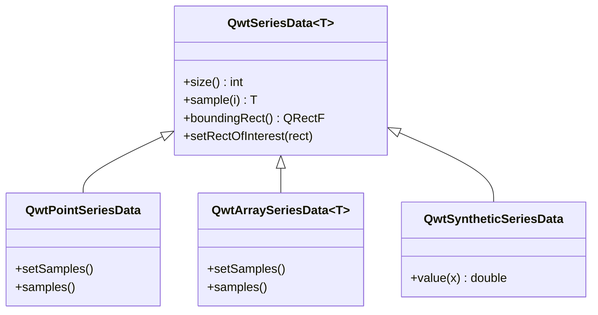

# 数据系列 - QwtSeriesData

`QwtSeriesData` 是绘图项数据的抽象接口，为绘图提供数据访问方法。通过自定义 `QwtSeriesData` 派生类，可以实现灵活的数据管理方式，支持从内存、文件、数据库等各种数据源获取绘图数据。

## 主要功能特性

**特性**

- ✅ **数据抽象接口**：定义统一的数据访问接口
- ✅ **多种内置实现**：提供内存存储、外部数组引用等常用实现
- ✅ **动态数据支持**：支持实时更新和大数据场景
- ✅ **边界计算**：自动计算数据边界矩形

## 庺本概念

### 数据接口结构



### 内置数据类

| 类名 | 说明 |
|------|------|
| `QwtPointSeriesData` | 存储QPointF数据点 |
| `QwtArraySeriesData<T>` | 存储任意类型数据数组 |
| `QwtSyntheticSeriesData` | 生成函数数据（不存储） |

## 使用方法

### 1. 使用内置数据类

```cpp
#include <QwtPlotCurve>
#include <QwtPointSeriesData>

QwtPlotCurve* curve = new QwtPlotCurve();

// 方法1：直接使用QwtPlotCurve的便捷方法
QVector<double> xData, yData;
curve->setSamples(xData, yData);

// 方法2：使用QwtPointSeriesData
QwtPointSeriesData* seriesData = new QwtPointSeriesData();
QVector<QPointF> points;
points << QPointF(0, 0) << QPointF(1, 1) << QPointF(2, 4);
seriesData->setSamples(points);
curve->setData(seriesData);
```

### 2. 引用外部数据

```cpp
#include <QwtPlotCurve>

QwtPlotCurve* curve = new QwtPlotCurve();

// 使用setRawSamples引用外部数组（不复制）
double x[1000], y[1000];
curve->setRawSamples(x, y, 1000);

// 注意：数组必须在curve存在期间保持有效
// 数据变化时无需重新设置，直接replot即可
```

!!! warning "setRawSamples注意事项"
    - 外部数组必须保持有效直到曲线销毁
    - 不要修改数组大小，只修改内容
    - 数据更新后需调用replot刷新显示

### 3. 自定义数据类

实现自定义数据源：

```cpp
#include <QwtSeriesData>

// 自定义数据库数据源
class DatabaseSeriesData : public QwtSeriesData<QPointF>
{
public:
    DatabaseSeriesData(const QString& tableName) 
        : m_tableName(tableName)
    {
        // 初始化数据库连接
        m_count = queryCount();
    }

    // 返回数据点数量
    virtual size_t size() const override
    {
        return m_count;
    }

    // 返回指定索引的数据点
    virtual QPointF sample(size_t i) const override
    {
        // 从数据库查询第i条记录
        return queryPoint(i);
    }

    // 计算数据边界
    virtual QRectF boundingRect() const override
    {
        if (m_boundingRect.isNull()) {
            // 计算边界矩形
            m_boundingRect = calculateBounds();
        }
        return m_boundingRect;
    }

private:
    QString m_tableName;
    size_t m_count;
    QRectF m_boundingRect;
    
    size_t queryCount() const;
    QPointF queryPoint(size_t i) const;
    QRectF calculateBounds() const;
};

// 使用自定义数据类
curve->setData(new DatabaseSeriesData("measurements"));
```

### 4. 函数生成数据

使用 `QwtSyntheticSeriesData` 生成函数曲线：

```cpp
#include <QwtSyntheticSeriesData>

// 函数数据生成器
class FunctionSeriesData : public QwtSyntheticSeriesData
{
public:
    FunctionSeriesData(double(*func)(double), double xMin, double xMax)
        : QwtSyntheticSeriesData(xMin, xMax)
        , m_function(func)
    {
    }

    // 返回指定x位置的y值
    virtual double value(double x) const override
    {
        return m_function(x);
    }

private:
    double(*m_function)(double);
};

// 使用函数生成数据
double myFunction(double x) {
    return std::sin(x) * std::cos(2 * x);
}

curve->setData(new FunctionSeriesData(myFunction, 0, 10));
```

### 5. 实时数据更新

```cpp
// 实时数据场景
class RealtimeSeriesData : public QwtSeriesData<QPointF>
{
public:
    RealtimeSeriesData(int maxPoints = 1000)
        : m_maxPoints(maxPoints)
    {
    }

    void appendPoint(const QPointF& point)
    {
        m_points.append(point);
        if (m_points.size() > m_maxPoints) {
            m_points.removeFirst();
        }
        m_boundingRect = QRectF();  // 重置边界，触发重新计算
    }

    virtual size_t size() const override { return m_points.size(); }
    virtual QPointF sample(size_t i) const override { return m_points[i]; }
    virtual QRectF boundingRect() const override
    {
        if (m_boundingRect.isNull()) {
            m_boundingRect = calculateBounds();
        }
        return m_boundingRect;
    }

private:
    QVector<QPointF> m_points;
    int m_maxPoints;
    QRectF m_boundingRect;
};

// 使用
RealtimeSeriesData* data = new RealtimeSeriesData(1000);
curve->setData(data);

// 实时添加数据
data->appendPoint(QPointF(time, value));
plot->replot();
```

## 核心方法总结

### QwtSeriesData接口

| 方法 | 说明 |
|------|------|
| `size()` | 返回数据点数量 |
| `sample(i)` | 返回第i个数据点 |
| `boundingRect()` | 返回数据边界矩形 |
| `setRectOfInterest()` | 设置感兴趣区域（优化渲染） |

### QwtPlotCurve数据方法

| 方法 | 说明 |
|------|------|
| `setData()` | 设置数据对象 |
| `setSamples()` | 设置数据数组 |
| `setRawSamples()` | 引用外部数组 |
| `data()` | 获取数据对象 |

!!! tip "数据管理建议"
    - 静态数据：使用 `setSamples()` 复制数据
    - 大数据：使用 `setRawSamples()` 避免复制
    - 动态数据：实现自定义 `QwtSeriesData`
    - 函数数据：使用 `QwtSyntheticSeriesData`

!!! example "相关示例"
    - 实时数据：`examples/2D/realtime`
    - CPU监控：`examples/2D/cpuplot`