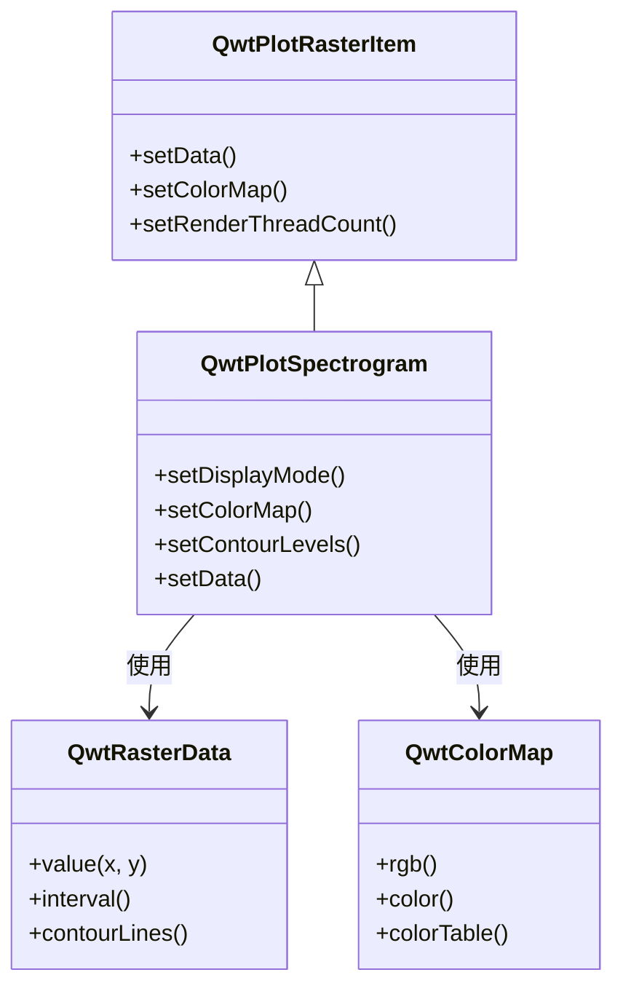

# 光谱图/热力图 - QwtPlotSpectrogram

`QwtPlotSpectrogram` 用于绘制光谱图（Spectrogram）或热力图，将三维数据显示在二维平面上，其中第三维（强度值）通过颜色来表示。广泛应用于科学数据分析、图像处理、声学分析等领域。

## 主要功能特性

**特性**

- ✅ **图像显示模式**：将数值映射为颜色显示二维数据场
- ✅ **等高线显示模式**：绘制指定数值的等高线
- ✅ **多种颜色映射**：支持线性、渐变、离散等颜色映射方式
- ✅ **多线程渲染**：支持多核并行渲染，提升大数据处理效率
- ✅ **数据插值**：支持多种插值算法平滑显示

## 基本概念

### 光谱图原理

光谱图将三维数据 `(x, y, value)` 映射到二维平面：

```text
        Y轴
        │
        │   ┌─────────────────┐
        │   │ 颜色编码强度值  │
        │   │ █░▒▓█░▒▓█░▒▓█ │  ← 每个像素颜色对应一个值
        │   │ ▒▓█░▒▓█░▒▓█░▒ │
        │   │ ▓█░▒▓█░▒▓█░▒▓ │
        │   └─────────────────┘
        └──────────────────────→ X轴
```

### 显示模式

| 模式 | 枚举值 | 说明 |
|------|--------|------|
| 图像模式 | `ImageMode` | 将数值映射为颜色显示 |
| 等高线模式 | `ContourMode` | 绘制等高线 |

### 类继承结构



## 使用方法

光谱图的例子位于:`examples/2D/spectrogram`，例子截图如下：


### 1. 基本光谱图

```cpp
#include <QwtPlot>
#include <QwtPlotSpectrogram>
#include <QwtRasterData>
#include <QwtColorMap>

QwtPlot* plot = new QwtPlot();
plot->setTitle("光谱图示例");
plot->setCanvasBackground(Qt::black);

// 创建光谱图
QwtPlotSpectrogram* spectrogram = new QwtPlotSpectrogram();

// 启用图像显示模式
spectrogram->setDisplayMode(QwtPlotSpectrogram::ImageMode, true);

// 设置颜色映射
QwtLinearColorMap* colorMap = new QwtLinearColorMap(Qt::darkBlue, Qt::yellow);
colorMap->addColorStop(0.2, Qt::blue);
colorMap->addColorStop(0.4, Qt::cyan);
colorMap->addColorStop(0.6, Qt::green);
colorMap->addColorStop(0.8, Qt::orange);
spectrogram->setColorMap(colorMap);

// 创建数据
// 这里使用自定义的QwtRasterData派生类
spectrogram->setData(new MyRasterData());

spectrogram->attach(plot);
plot->replot();
```

### 2. 自定义栅格数据

创建 `QwtRasterData` 派生类提供数据：

```cpp
#include <QwtRasterData>
#include <QwtInterval>

// 自定义栅格数据类
class MyRasterData : public QwtRasterData
{
public:
    MyRasterData()
    {
        // 设置数据范围
        setInterval(Qt::XAxis, QwtInterval(0, 100));
        setInterval(Qt::YAxis, QwtInterval(0, 100));
        setInterval(Qt::ZAxis, QwtInterval(0, 1));  // 值范围
    }

    // 返回指定位置的值（核心方法）
    virtual double value(double x, double y) const override
    {
        // 示例：计算位置对应的值
        double dx = x - 50;
        double dy = y - 50;
        double dist = std::sqrt(dx * dx + dy * dy);
        return std::exp(-dist / 20.0);  // 高斯分布
    }

    // 可选：返回等高线数据
    virtual QList<QwtContourLine> contourLines(
        const QList<double>& levels,
        const QRectF& rect) const override
    {
        // 实现等高线计算
        return QwtRasterData::contourLines(levels, rect);
    }
};
```

### 3. 颜色映射配置

#### 线性颜色映射

```cpp
// 创建从蓝到红的线性颜色映射
QwtLinearColorMap* colorMap = new QwtLinearColorMap(Qt::blue, Qt::red);

// 设置格式（RGB或Indexed）
colorMap->setFormat(QwtColorMap::RGB);  // RGB模式，颜色平滑过渡

// 添加颜色停靠点
colorMap->addColorStop(0.0, Qt::black);   // 最小值：黑色
colorMap->addColorStop(0.3, Qt::blue);    // 30%：蓝色
colorMap->addColorStop(0.5, Qt::green);   // 50%：绿色
colorMap->addColorStop(0.7, Qt::yellow);  // 70%：黄色
colorMap->addColorStop(1.0, Qt::white);   // 最大值：白色

spectrogram->setColorMap(colorMap);
```

#### 预定义颜色映射

```cpp
// 使用Qwt内置的Hue色图（彩虹色）
QwtHueColorMap* hueMap = new QwtHueColorMap();
hueMap->setHueRange(0.0, 360.0);  // 全色相范围
spectrogram->setColorMap(hueMap);

// 使用Alpha色图（透明度变化）
QwtAlphaColorMap* alphaMap = new QwtAlphaColorMap();
alphaMap->setAlphaRange(0, 255);
spectrogram->setColorMap(alphaMap);
```

### 4. 等高线显示

```cpp
// 启用等高线模式
spectrogram->setDisplayMode(QwtPlotSpectrogram::ContourMode, true);

// 设置等高线级别
QList<double> contourLevels;
contourLevels << 0.1 << 0.2 << 0.3 << 0.4 << 0.5 << 0.6 << 0.7 << 0.8;
spectrogram->setContourLevels(contourLevels);

// 设置等高线样式
spectrogram->setDefaultContourPen(QPen(Qt::white, 1));

// 同时显示图像和等高线
spectrogram->setDisplayMode(QwtPlotSpectrogram::ImageMode, true);
spectrogram->setDisplayMode(QwtPlotSpectrogram::ContourMode, true);
```

### 5. 数据分辨率设置

```cpp
// 设置像素分辨率（每个像素代表的数据单元大小）
spectrogram->setPixelSize(2.0);  // 每个像素2个数据单位

// 或者使用推荐分辨率自动计算
spectrogram->setRenderHint(QwtPlotRasterItem::RenderAntialiased);
```

### 6. 多线程渲染

```cpp
// 设置渲染线程数（提升大数据渲染性能）
spectrogram->setRenderThreadCount(4);  // 使用4个线程并行渲染

// 默认值为0（单线程）
```

!!! tip "多线程渲染建议"
    - 数据量超过100万像素时，建议启用多线程
    - 线程数建议设置为CPU核心数，不要超过8
    - 多线程渲染在图像模式效果最明显

### 7. 使用矩阵数据

```cpp
#include <QwtMatrixRasterData>

// 使用矩阵数据类
QwtMatrixRasterData* matrixData = new QwtMatrixRasterData();

// 设置数据矩阵
QVector<double> values;
for (int i = 0; i < 100 * 100; i++) {
    values << (rand() % 100);
}
matrixData->setValueMatrix(values, 100);  // 100x100矩阵

// 设置数据范围
matrixData->setInterval(Qt::XAxis, QwtInterval(0, 100));
matrixData->setInterval(Qt::YAxis, QwtInterval(0, 100));
matrixData->setInterval(Qt::ZAxis, QwtInterval(0, 100));

// 设置插值方式
matrixData->setResampleMode(QwtMatrixRasterData::BilinearInterpolation);

spectrogram->setData(matrixData);
```

### 8. 颜色条（Color Bar）

添加颜色条显示颜色与数值的对应关系：

```cpp
#include <QwtScaleWidget>

// 在右侧添加颜色条
QwtScaleWidget* rightAxis = plot->axisWidget(QwtAxis::YRight);
rightAxis->setColorBarEnabled(true);
rightAxis->setColorBarWidth(20);

// 设置颜色条范围和颜色映射
rightAxis->setColorMap(QwtInterval(0, 100), colorMap);

// 显示右侧坐标轴
plot->setAxisVisible(QwtAxis::YRight, true);
```

## 核心方法总结

| 方法 | 说明 |
|------|------|
| `setData()` | 设置栅格数据 |
| `setColorMap()` | 设置颜色映射 |
| `setDisplayMode()` | 设置显示模式 |
| `setContourLevels()` | 设置等高线级别 |
| `setDefaultContourPen()` | 设置等高线画笔 |
| `setPixelSize()` | 设置像素分辨率 |
| `setRenderThreadCount()` | 设置渲染线程数 |
| `data()` | 获取栅格数据 |
| `colorMap()` | 获取颜色映射 |

## 颜色映射类总结

| 类名 | 说明 |
|------|------|
| `QwtLinearColorMap` | 线性颜色映射，颜色平滑过渡 |
| `QwtHueColorMap` | 色相颜色映射，彩虹色效果 |
| `QwtAlphaColorMap` | Alpha颜色映射，透明度变化 |
| `QwtLogColorMap` | 对数颜色映射，适合大范围数据 |

!!! tip "应用场景"
    - 科学数据分析：温度场、压力场等
    - 图像处理：热力图、密度图
    - 声学分析：频谱图、声纳图
    - 地理数据：地形图、海深图

!!! example "相关示例"
    - 光谱图演示：`examples/2D/spectrogram`