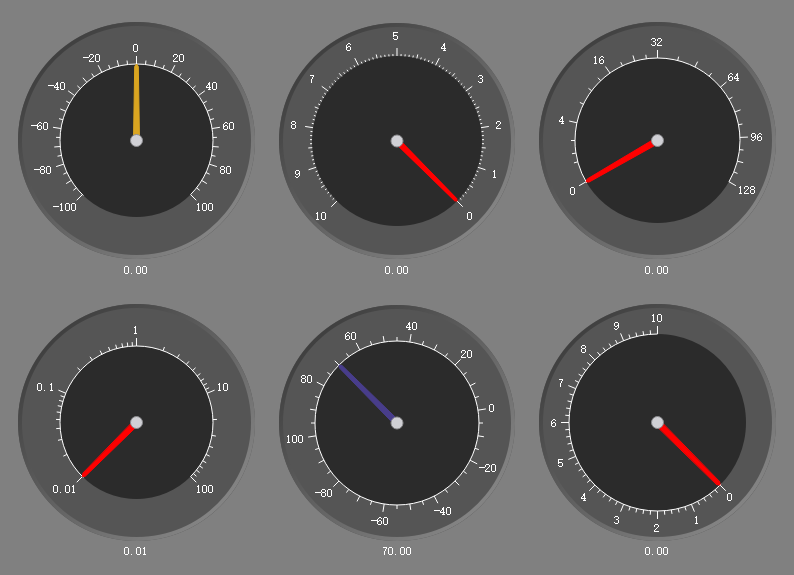
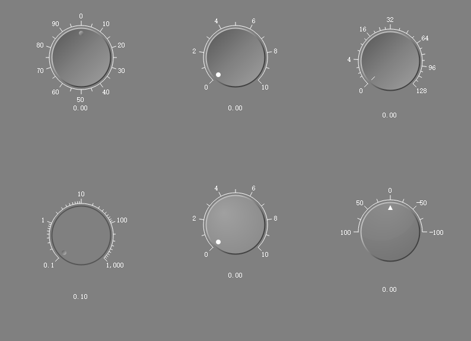
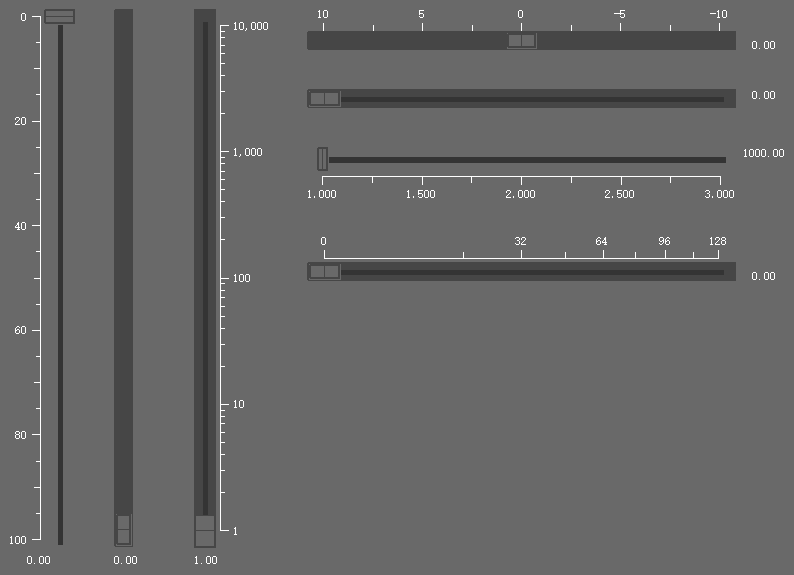
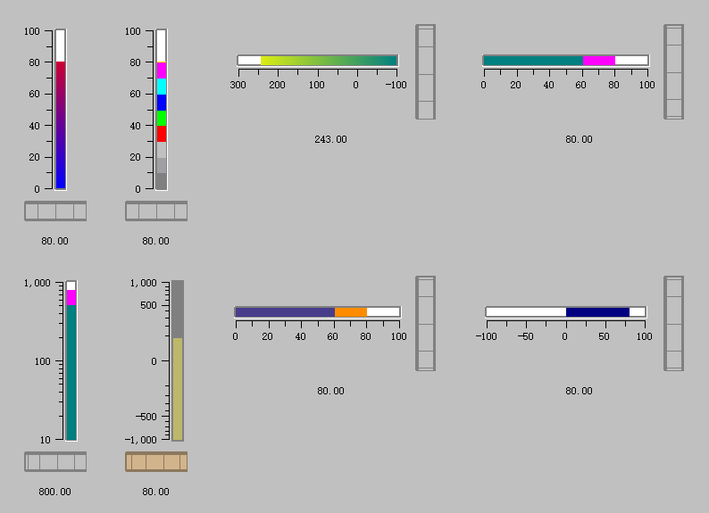
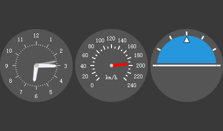
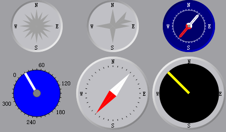

# 控件组件 - 仪表盘与滑块

Qwt 提供了一系列仪表控件组件，用于数值显示和交互控制。这些控件适用于仪器面板、控制系统、数据监控等场景。

## 控件类型概览

| 控件类 | 说明 |
|--------|------|
| `QwtDial` | 仪表盘/刻度盘 |
| `QwtKnob` | 旋钮控件 |
| `QwtSlider` | 滑块控件 |
| `QwtThermo` | 温度计/进度条 |
| `QwtWheel` | 滚轮控件 |
| `QwtCounter` | 数值计数器 |
| `QwtCompass` | 指南针/罗盘 |

## 使用方法

控件演示的例子位于:`examples/2D/controls`，例子截图如下：







### 1. QwtDial - 仪表盘

```cpp
#include <QwtDial>

QwtDial* dial = new QwtDial();

// 设置范围
dial->setRange(0.0, 360.0);  // 0-360度

// 设置当前值
dial->setValue(90.0);

// 设置刻度步进
dial->setScaleStep(30.0);  // 每30度一个刻度

// 设置刻度位置
dial->setScalePosition(QwtDial::Inside);  // 刻度在内部
// 其他选项：Outside（外部）、NoScale（无刻度）

// 设置指针样式
dial->setNeedle(new QwtDialSimpleNeedle(QwtDialSimpleNeedle::Arrow));

// 连接值变化信号
connect(dial, SIGNAL(valueChanged(double)), this, SLOT(onValueChanged(double)));
```

### 2. QwtKnob - 旋钮控件

```cpp
#include <QwtKnob>

QwtKnob* knob = new QwtKnob();

// 设置范围
knob->setRange(0, 100);

// 设置当前值
knob->setValue(50);

// 设置刻度样式
knob->setScalePosition(QwtKnob::OutsideScale);

// 设置旋钮外观
knob->setKnobStyle(QwtKnob::RaisedStyle);  // 凸起样式
// 其他选项：FlatStyle（平面）、SunkenStyle（凹陷）

// 设置旋钮宽度
knob->setKnobWidth(50);

// 设置鼠标跟踪模式
knob->setTracking(true);  // 拖动时实时更新值
```

### 3. QwtSlider - 滑块控件

```cpp
#include <QwtSlider>

QwtSlider* slider = new QwtSlider();

// 设置范围
slider->setRange(0.0, 100.0);

// 设置当前值
slider->setValue(30.0);

// 设置方向
slider->setOrientation(Qt::Horizontal);  // 水平滑块
// 或 Qt::Vertical（垂直滑块）

// 设置刻度位置
slider->setScalePosition(QwtSlider::TrailingScale);  // 刻度在后
// 其他选项：LeadingScale、NoScale

// 设置滑块样式
slider->setHandleSize(QSize(10, 20));  // 滑块手柄大小

// 设置步进值
slider->setSingleStep(1.0);
slider->setPageStep(10.0);
```

### 4. QwtThermo - 温度计

```cpp
#include <QwtThermo>

QwtThermo* thermo = new QwtThermo();

// 设置范围
thermo->setRange(0.0, 100.0);

// 设置当前值
thermo->setValue(75.0);

// 设置方向
thermo->setOrientation(Qt::Vertical);

// 设置填充颜色
thermo->setFillBrush(QBrush(Qt::red));

// 设置管道宽度
thermo->setPipeWidth(10);

// 设置刻度位置
thermo->setScalePosition(QwtThermo::TrailingScale);

// 设置警报级别
thermo->setAlarmLevel(80.0);  // 80度警报
thermo->setAlarmBrush(QBrush(Qt::darkRed));
```

### 5. QwtWheel - 滚轮控件

```cpp
#include <QwtWheel>

QwtWheel* wheel = new QwtWheel();

// 设置范围
wheel->setRange(0, 360);

// 设置当前值
wheel->setValue(180);

// 设置方向
wheel->setOrientation(Qt::Horizontal);

// 设置滚轮宽度
wheel->setWheelWidth(30);

// 设置边框宽度
wheel->setBorderWidth(2);

// 设置步进值
wheel->setSingleStep(1);
wheel->setPageStep(15);

// 设置鼠标跟踪
wheel->setTracking(true);
```

### 6. QwtCounter - 数值计数器

```cpp
#include <QwtCounter>

QwtCounter* counter = new QwtCounter();

// 设置范围
counter->setRange(0, 9999);

// 设置当前值
counter->setValue(100);

// 设置步进按钮
counter->setNumButtons(3);  // 3个步进按钮

// 设置步进值
counter->setSingleStep(1);
counter->setPageStep(100);

// 设置循环模式
counter->setWrap(true);  // 到达边界时循环
```

### 7. QwtCompass - 指南针

```cpp
#include <QwtCompass>

QwtCompass* compass = new QwtCompass();

// 设置范围（角度）
compass->setRange(0.0, 360.0);

// 设置当前方向
compass->setValue(45.0);  // 北偏东45度

// 设置玫瑰图样式
compass->setRose(new QwtSimpleCompassRose());

// 设置刻度标注
compass->setLabelMap({
    {0, "N"}, {90, "E"}, {180, "S"}, {270, "W"}
});

// 设置指针
compass->setNeedle(new QwtCompassWindArrow());
```

## 核心共性方法

所有控件都继承自 `QwtAbstractSlider`，共享以下方法：

| 方法 | 说明 |
|------|------|
| `setRange()` | 设置数值范围 |
| `setValue()` | 设置当前值 |
| `value()` | 获取当前值 |
| `setSingleStep()` | 设置单步步进 |
| `setPageStep()` | 设置页步步进 |
| `setTracking()` | 设置鼠标跟踪 |
| `setWrapping()` | 设置循环模式 |

!!! tip "控件使用建议"
    - 仪表盘适合角度或方向显示
    - 旋钮适合参数调节
    - 滑块适合线性范围调整
    - 温度计适合进度或温度显示
    - 滚轮适合连续平滑调节

!!! example "相关示例"
    - 控件演示：`examples/2D/controls`
    - 指南针：`examples/2D/dials`

控件演示的更多截图如下：





